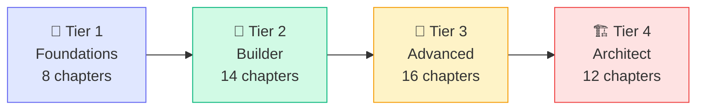
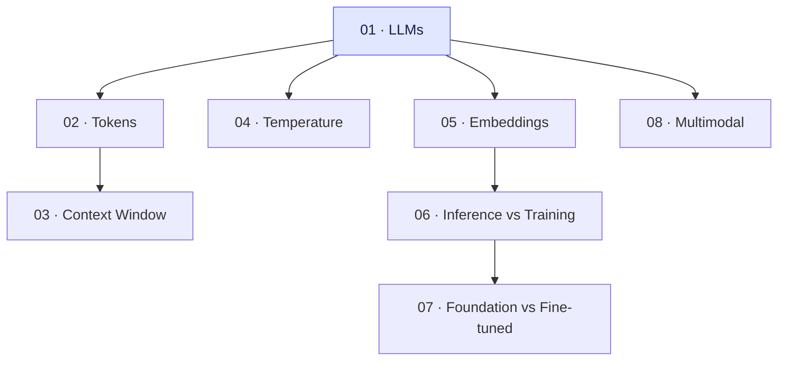
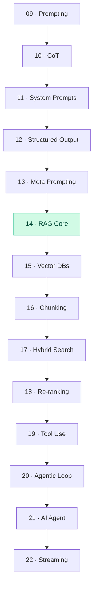

# AI-Native Course — Plan 1: Foundation & Infrastructure

> **For agentic workers:** REQUIRED SUB-SKILL: Use superpowers:subagent-driven-development (recommended) or superpowers:executing-plans to implement this plan task-by-task. Steps use checkbox (`- [ ]`) syntax for tracking.

**Goal:** Scaffold the complete AI-Native Development Course repository — Docusaurus site, folder structure, shared Python utilities, Docker deployment, and GitHub Actions CI/CD — ready for content to be added.

**Architecture:** Monorepo with `website/` (Docusaurus v3), `curriculum/` (runnable Python labs), `docker/` (multi-stage Dockerfile + nginx), and `.github/workflows/` (CI + deploy). All content lives in `website/docs/` as MDX, labs live in `curriculum/`, and the two are linked via absolute GitHub URLs.

**Tech Stack:** Node.js 20, Docusaurus v3, React 18, Python 3.11+, pytest, Docker, Nginx, GitHub Actions

---

## File Map

### Created in this plan

```
ai-native-course/
├── CLAUDE.md
├── README.md
├── .env.example
├── .gitignore
│
├── website/
│   ├── package.json
│   ├── docusaurus.config.ts
│   ├── sidebars.ts
│   ├── tsconfig.json
│   ├── src/
│   │   ├── css/
│   │   │   └── custom.css
│   │   └── pages/
│   │       └── index.tsx              ← Landing page
│   ├── docs/
│   │   ├── intro.mdx                  ← Course overview + learning path
│   │   ├── tier-1-foundations/
│   │   │   └── index.mdx              ← Tier 1 landing page (placeholder)
│   │   ├── tier-2-builder/
│   │   │   └── index.mdx
│   │   ├── tier-3-advanced/
│   │   │   └── index.mdx
│   │   └── tier-4-architect/
│   │       └── index.mdx
│   └── static/
│       └── diagrams/
│           └── .gitkeep
│
├── curriculum/
│   ├── shared/
│   │   ├── utils.py                   ← Shared LLM client helpers
│   │   ├── requirements.txt
│   │   └── .env.example
│   ├── tier-1-foundations/
│   │   └── .gitkeep
│   ├── tier-2-builder/
│   │   └── .gitkeep
│   ├── tier-3-advanced/
│   │   └── .gitkeep
│   ├── tier-4-architect/
│   │   └── .gitkeep
│   └── problem-bank/
│       └── README.md
│
├── docker/
│   ├── Dockerfile
│   ├── docker-compose.yml
│   ├── nginx.conf
│   └── scripts/
│       ├── build.sh
│       ├── deploy.sh
│       └── health-check.sh
│
└── .github/
    └── workflows/
        ├── ci.yml
        ├── deploy-gh-pages.yml
        └── deploy-docker.yml
```

---

## Task 1: Initialize Git Repo + Root Files

**Files:**
- Create: `ai-native-course/.gitignore`
- Create: `ai-native-course/.env.example`
- Create: `ai-native-course/README.md`

- [ ] **Step 1: Initialize git repo**

```bash
cd /Users/gauravporwal/Sites/projects/gp/ai-native-course
git init
git checkout -b main
```

Expected: `Initialized empty Git repository`

- [ ] **Step 2: Create .gitignore**

Create `/Users/gauravporwal/Sites/projects/gp/ai-native-course/.gitignore`:

```gitignore
# Dependencies
node_modules/
.pnp
.pnp.js

# Build outputs
website/.docusaurus/
website/build/

# Python
__pycache__/
*.py[cod]
*$py.class
*.egg-info/
dist/
build/
.eggs/
venv/
.venv/
env/
.env

# Environment
.env.local
.env.*.local

# Editor
.vscode/
.idea/
*.swp
*.swo
.DS_Store

# Docker
docker/scripts/*.log

# Test output
.pytest_cache/
htmlcov/
.coverage
coverage.xml

# Logs
*.log
npm-debug.log*
yarn-debug.log*
yarn-error.log*
```

- [ ] **Step 3: Create .env.example**

Create `/Users/gauravporwal/Sites/projects/gp/ai-native-course/.env.example`:

```bash
# Anthropic (Claude)
ANTHROPIC_API_KEY=your_anthropic_api_key_here

# OpenAI (for comparison labs)
OPENAI_API_KEY=your_openai_api_key_here

# Google (for Gemini comparison labs)
GOOGLE_API_KEY=your_google_api_key_here

# Cohere (for re-ranking labs)
COHERE_API_KEY=your_cohere_api_key_here

# Local model endpoint (optional — for Ollama labs)
OLLAMA_BASE_URL=http://localhost:11434
```

- [ ] **Step 4: Create README.md**

Create `/Users/gauravporwal/Sites/projects/gp/ai-native-course/README.md`:

```markdown
# AI-Native Development Course

A practical, depth-first course for developers who want to build with AI.
Covers 50 chapters across 4 tiers — from LLM fundamentals to production
multi-agent systems.

## Who Is This For?

Developers who know Python (or Node.js) and want to become AI engineers.
No prior AI/ML knowledge required.

## Course Structure

| Tier | Name | Chapters | What You Build |
|------|------|----------|----------------|
| 1 | Foundations | 8 | First LLM API call → embeddings |
| 2 | Builder | 14 | RAG pipelines → agents |
| 3 | Advanced | 16 | Multi-agent systems → fine-tuning |
| 4 | Architect | 12 | Production systems → capstone |

## Quick Start

### Browse the course
Visit: https://<your-org>.github.io/ai-native-course

### Run labs locally

```bash
# Clone the repo
git clone https://github.com/<your-org>/ai-native-course
cd ai-native-course

# Set up Python environment
cd curriculum/shared
python -m venv .venv
source .venv/bin/activate   # Windows: .venv\Scripts\activate
pip install -r requirements.txt

# Copy environment variables
cp .env.example .env
# Edit .env and add your API keys

# Run a lab
cd ../tier-1-foundations/01-llms/lab/starter
python solution.py
```

### Run the site locally

```bash
cd website
npm install
npm run start
# Open http://localhost:3000
```

### Deploy with Docker

```bash
# Build + run locally
cd docker
./scripts/build.sh
docker-compose up

# Deploy to server
./scripts/deploy.sh user@your-server.com
```

## Contributing

See [CLAUDE.md](./CLAUDE.md) for how to add chapters and labs.
```

- [ ] **Step 5: Commit**

```bash
cd /Users/gauravporwal/Sites/projects/gp/ai-native-course
git add .gitignore .env.example README.md
git commit -m "chore: initialize repo with root config files"
```

---

## Task 2: Create CLAUDE.md

**Files:**
- Create: `ai-native-course/CLAUDE.md`

- [ ] **Step 1: Create CLAUDE.md**

Create `/Users/gauravporwal/Sites/projects/gp/ai-native-course/CLAUDE.md`:

```markdown
# AI-Native Course — Context for AI Assistants

## Repo Purpose

This is an AI-native development course. It has two main parts:
1. `website/` — Docusaurus v3 site (the course content as MDX)
2. `curriculum/` — Runnable Python labs (one per chapter)

## Repo Structure

```
ai-native-course/
├── website/docs/          ← MDX course content
│   ├── tier-1-foundations/
│   ├── tier-2-builder/
│   ├── tier-3-advanced/
│   └── tier-4-architect/
├── curriculum/            ← Python lab code
│   ├── tier-1-foundations/
│   ├── tier-2-builder/
│   ├── tier-3-advanced/
│   ├── tier-4-architect/
│   └── problem-bank/
├── docker/                ← Dockerfile, nginx, deploy scripts
└── .github/workflows/     ← CI/CD
```

## How to Add a New Chapter

1. Create the docs folder: `website/docs/tier-X/chapter-YY-topic/`
2. Create 5 MDX files: `index.mdx`, `concepts.mdx`, `patterns.mdx`, `lab.mdx`, `quiz.mdx`
3. Create the lab folder: `curriculum/tier-X/chapter-YY-topic/lab/`
4. Create lab structure: `problem.md`, `starter/solution.py`, `solution/solution.py`, `tests/test_solution.py`
5. Add chapter entry to `website/sidebars.ts`

## Chapter MDX Frontmatter Convention

Every MDX file in `website/docs/` must start with:

```yaml
---
title: "Chapter Title"
sidebar_position: 1
description: "One-line description for SEO and sidebar"
---
```

## Lab File Convention

`starter/solution.py` must contain `# TODO:` comments for every step the learner needs to complete.
`solution/solution.py` must be fully working with no TODOs.
`tests/test_solution.py` must import from `starter.solution` (not solution/) so tests run against learner's work.

## Running the Site Locally

```bash
cd website
npm install
npm run start
```

## Running Labs Locally

```bash
cd curriculum/shared
pip install -r requirements.txt
cp .env.example .env
# Add API keys to .env
```

## Running Lab Tests

```bash
cd curriculum/tier-X/chapter-YY/lab
pytest tests/ -v
```

## Component API

### `<Quiz>` component

```mdx
import Quiz from '@site/src/components/Quiz';

<Quiz
  questions={[
    {
      id: "q1",
      text: "What does RAG stand for?",
      options: ["A) ...", "B) ...", "C) ...", "D) ..."],
      correct: 1,
      explanation: "RAG stands for..."
    }
  ]}
  chapterId="tier2-ch14"
  passMark={70}
/>
```

### `<ConceptMap>` component

```mdx
import ConceptMap from '@site/src/components/ConceptMap';

<ConceptMap
  current="embeddings"
  related={["tokens", "semantic-search", "rag", "vector-databases"]}
/>
```

### `<TokenVisualizer>` component

```mdx
import TokenVisualizer from '@site/src/components/TokenVisualizer';

<TokenVisualizer text="Hello world, this is a test sentence." model="cl100k_base" />
```

### `<AgentLoop>` component

```mdx
import AgentLoop from '@site/src/components/AgentLoop';

<AgentLoop steps={["Observe", "Think", "Act"]} animated={true} />
```

## Docusaurus Config Notes

- Custom components live in `website/src/components/`
- Global CSS is `website/src/css/custom.css`
- Sidebar is auto-generated from folder structure via `sidebars.ts`
- MDX plugins enabled: mermaid, math (katex)

## Docker Notes

- `docker/Dockerfile` is multi-stage: build stage uses node:20-alpine, serve stage uses nginx:alpine
- `docker/nginx.conf` serves the Docusaurus build with SPA fallback
- `docker/scripts/deploy.sh` SSHs to the target server and restarts the container

## Naming Conventions

- Chapter folders: `NN-kebab-case-topic/` (e.g., `01-llms/`, `14-rag-core/`)
- MDX files: lowercase, kebab-case (e.g., `concepts.mdx`)
- Python files: `snake_case.py`
- Test files: `test_snake_case.py`
- React components: `PascalCase/` folder with `index.tsx`
```

- [ ] **Step 2: Commit**

```bash
cd /Users/gauravporwal/Sites/projects/gp/ai-native-course
git add CLAUDE.md
git commit -m "docs: add CLAUDE.md with repo context and conventions"
```

---

## Task 3: Bootstrap Docusaurus Site

**Files:**
- Create: `website/package.json`
- Create: `website/docusaurus.config.ts`
- Create: `website/sidebars.ts`
- Create: `website/tsconfig.json`
- Create: `website/src/css/custom.css`

- [ ] **Step 1: Initialize Docusaurus**

```bash
cd /Users/gauravporwal/Sites/projects/gp/ai-native-course
npx create-docusaurus@latest website classic --typescript
# When prompted: confirm install
```

Expected output: `[SUCCESS] Created website.`

- [ ] **Step 2: Replace docusaurus.config.ts**

Overwrite `website/docusaurus.config.ts` with:

```typescript
import { themes as prismThemes } from 'prism-react-renderer';
import type { Config } from '@docusaurus/types';
import type * as Preset from '@docusaurus/preset-classic';

const config: Config = {
  title: 'AI-Native Development Course',
  tagline: 'From zero to building production AI systems',
  favicon: 'img/favicon.ico',

  url: 'https://your-org.github.io',
  baseUrl: '/ai-native-course/',

  organizationName: 'your-org',
  projectName: 'ai-native-course',

  onBrokenLinks: 'throw',
  onBrokenMarkdownLinks: 'warn',

  i18n: {
    defaultLocale: 'en',
    locales: ['en'],
  },

  markdown: {
    mermaid: true,
  },

  themes: ['@docusaurus/theme-mermaid'],

  presets: [
    [
      'classic',
      {
        docs: {
          sidebarPath: './sidebars.ts',
          routeBasePath: '/',
          showLastUpdateTime: true,
          showLastUpdateAuthor: false,
        },
        blog: false,
        theme: {
          customCss: './src/css/custom.css',
        },
      } satisfies Preset.Options,
    ],
  ],

  themeConfig: {
    image: 'img/social-card.png',
    navbar: {
      title: 'AI-Native Course',
      logo: {
        alt: 'AI-Native Course Logo',
        src: 'img/logo.svg',
      },
      items: [
        {
          type: 'docSidebar',
          sidebarId: 'courseSidebar',
          position: 'left',
          label: 'Course',
        },
        {
          href: 'https://github.com/your-org/ai-native-course',
          label: 'GitHub',
          position: 'right',
        },
      ],
    },
    footer: {
      style: 'dark',
      links: [
        {
          title: 'Tiers',
          items: [
            { label: 'Tier 1 — Foundations', to: '/tier-1-foundations' },
            { label: 'Tier 2 — Builder', to: '/tier-2-builder' },
            { label: 'Tier 3 — Advanced', to: '/tier-3-advanced' },
            { label: 'Tier 4 — Architect', to: '/tier-4-architect' },
          ],
        },
        {
          title: 'Resources',
          items: [
            { label: 'Problem Bank', to: '/problem-bank' },
            { label: 'GitHub', href: 'https://github.com/your-org/ai-native-course' },
          ],
        },
      ],
      copyright: `Copyright © ${new Date().getFullYear()} AI-Native Course. Built with Docusaurus.`,
    },
    prism: {
      theme: prismThemes.github,
      darkTheme: prismThemes.dracula,
      additionalLanguages: ['python', 'bash', 'json', 'yaml', 'typescript'],
    },
    mermaid: {
      theme: { light: 'neutral', dark: 'dark' },
    },
  } satisfies Preset.ThemeConfig,
};

export default config;
```

- [ ] **Step 3: Replace sidebars.ts**

Overwrite `website/sidebars.ts` with:

```typescript
import type { SidebarsConfig } from '@docusaurus/plugin-content-docs';

const sidebars: SidebarsConfig = {
  courseSidebar: [
    {
      type: 'doc',
      id: 'intro',
      label: '📖 Course Overview',
    },
    {
      type: 'category',
      label: '🧱 Tier 1 — Foundations',
      collapsed: false,
      items: [{ type: 'autogenerated', dirName: 'tier-1-foundations' }],
    },
    {
      type: 'category',
      label: '🔧 Tier 2 — Builder',
      collapsed: true,
      items: [{ type: 'autogenerated', dirName: 'tier-2-builder' }],
    },
    {
      type: 'category',
      label: '🚀 Tier 3 — Advanced',
      collapsed: true,
      items: [{ type: 'autogenerated', dirName: 'tier-3-advanced' }],
    },
    {
      type: 'category',
      label: '🏗️ Tier 4 — Architect',
      collapsed: true,
      items: [{ type: 'autogenerated', dirName: 'tier-4-architect' }],
    },
  ],
};

export default sidebars;
```

- [ ] **Step 4: Update custom.css**

Overwrite `website/src/css/custom.css` with:

```css
/**
 * AI-Native Course — Custom Docusaurus Theme
 */

:root {
  --ifm-color-primary: #6366f1;       /* Indigo */
  --ifm-color-primary-dark: #4f52e8;
  --ifm-color-primary-darker: #4347e4;
  --ifm-color-primary-darkest: #2d30d4;
  --ifm-color-primary-light: #777af4;
  --ifm-color-primary-lighter: #8385f5;
  --ifm-color-primary-lightest: #a5a7f8;

  --ifm-code-font-size: 90%;
  --ifm-font-family-base: 'Inter', system-ui, -apple-system, sans-serif;
  --ifm-heading-font-weight: 700;
  --ifm-navbar-height: 60px;
  --ifm-toc-border-color: var(--ifm-color-primary-lightest);

  --docusaurus-highlighted-code-line-bg: rgba(99, 102, 241, 0.1);
}

[data-theme='dark'] {
  --ifm-color-primary: #818cf8;
  --ifm-color-primary-dark: #6872f6;
  --ifm-color-primary-darker: #5d67f5;
  --ifm-color-primary-darkest: #3d43f2;
  --ifm-color-primary-light: #9aa2fa;
  --ifm-color-primary-lighter: #a5adfb;
  --ifm-color-primary-lightest: #bfc3fc;
  --ifm-background-color: #0f0f1a;
  --ifm-background-surface-color: #1a1a2e;
  --docusaurus-highlighted-code-line-bg: rgba(129, 140, 248, 0.15);
}

/* Chapter cards on tier index pages */
.chapter-grid {
  display: grid;
  grid-template-columns: repeat(auto-fill, minmax(280px, 1fr));
  gap: 1.25rem;
  margin: 2rem 0;
}

.chapter-card {
  border: 1px solid var(--ifm-toc-border-color);
  border-radius: 8px;
  padding: 1.25rem;
  transition: box-shadow 0.2s, border-color 0.2s;
}

.chapter-card:hover {
  box-shadow: 0 4px 12px rgba(99, 102, 241, 0.15);
  border-color: var(--ifm-color-primary);
}

.chapter-card .badge-passed {
  background: #10b981;
  color: white;
  font-size: 0.7rem;
  padding: 2px 8px;
  border-radius: 9999px;
  float: right;
}

/* Concept callout boxes */
.concept-intuition {
  background: var(--ifm-color-primary-lightest);
  border-left: 4px solid var(--ifm-color-primary);
  padding: 1rem 1.25rem;
  border-radius: 0 8px 8px 0;
  margin: 1.5rem 0;
}

[data-theme='dark'] .concept-intuition {
  background: rgba(129, 140, 248, 0.1);
}

.interview-angle {
  background: #fef3c7;
  border-left: 4px solid #f59e0b;
  padding: 1rem 1.25rem;
  border-radius: 0 8px 8px 0;
  margin: 1.5rem 0;
}

[data-theme='dark'] .interview-angle {
  background: rgba(245, 158, 11, 0.1);
}

.antipattern {
  background: #fee2e2;
  border-left: 4px solid #ef4444;
  padding: 1rem 1.25rem;
  border-radius: 0 8px 8px 0;
  margin: 1.5rem 0;
}

[data-theme='dark'] .antipattern {
  background: rgba(239, 68, 68, 0.1);
}

/* Mermaid diagram container */
.mermaid-wrapper {
  overflow-x: auto;
  border: 1px solid var(--ifm-toc-border-color);
  border-radius: 8px;
  padding: 1rem;
  margin: 1.5rem 0;
}

/* Quiz component */
.quiz-container {
  border: 1px solid var(--ifm-toc-border-color);
  border-radius: 12px;
  padding: 1.5rem;
  margin: 2rem 0;
}

.quiz-question {
  margin-bottom: 1.5rem;
  padding-bottom: 1.5rem;
  border-bottom: 1px solid var(--ifm-toc-border-color);
}

.quiz-question:last-child {
  border-bottom: none;
  margin-bottom: 0;
}

.quiz-option {
  display: flex;
  align-items: flex-start;
  gap: 0.75rem;
  padding: 0.75rem 1rem;
  border: 1px solid var(--ifm-toc-border-color);
  border-radius: 6px;
  margin: 0.4rem 0;
  cursor: pointer;
  transition: border-color 0.15s, background 0.15s;
}

.quiz-option:hover {
  border-color: var(--ifm-color-primary);
  background: rgba(99, 102, 241, 0.05);
}

.quiz-option.correct {
  border-color: #10b981;
  background: rgba(16, 185, 129, 0.08);
}

.quiz-option.incorrect {
  border-color: #ef4444;
  background: rgba(239, 68, 68, 0.08);
}

.quiz-explanation {
  font-size: 0.875rem;
  margin-top: 0.75rem;
  padding: 0.75rem;
  border-radius: 6px;
  background: var(--ifm-background-surface-color);
}

.quiz-score {
  text-align: center;
  font-size: 1.5rem;
  font-weight: 700;
  padding: 1.5rem;
}

/* Token visualizer */
.token-chip {
  display: inline-block;
  padding: 2px 6px;
  border-radius: 4px;
  margin: 1px;
  font-family: monospace;
  font-size: 0.85rem;
}
```

- [ ] **Step 5: Delete Docusaurus default content**

```bash
cd /Users/gauravporwal/Sites/projects/gp/ai-native-course/website
rm -rf docs/tutorial-basics docs/tutorial-extras
rm -f docs/intro.md
```

- [ ] **Step 6: Verify Docusaurus builds**

```bash
cd /Users/gauravporwal/Sites/projects/gp/ai-native-course/website
npm run build
```

Expected: `[SUCCESS] Generated static files in "build".`

- [ ] **Step 7: Commit**

```bash
cd /Users/gauravporwal/Sites/projects/gp/ai-native-course
git add website/
git commit -m "feat: bootstrap Docusaurus v3 with course theme and config"
```

---

## Task 4: Create Course Docs Structure

**Files:**
- Create: `website/docs/intro.mdx`
- Create: `website/docs/tier-1-foundations/index.mdx`
- Create: `website/docs/tier-2-builder/index.mdx`
- Create: `website/docs/tier-3-advanced/index.mdx`
- Create: `website/docs/tier-4-architect/index.mdx`

- [ ] **Step 1: Create intro.mdx**

Create `website/docs/intro.mdx`:

```mdx
---
title: Welcome to AI-Native Development
sidebar_position: 1
description: A practical, depth-first course for developers who want to build with AI.
---

import ConceptMap from '@site/src/components/ConceptMap';

# AI-Native Development Course

Welcome. This course takes you from zero to building production AI systems.

## Who Is This For?

You know Python (or Node.js). You've heard of ChatGPT. You want to build things with AI — real things, not toys. This course is for you.

**No math degree required. No ML background required.**

---

## How the Course Works

The course is structured in 4 tiers. Each tier builds on the previous.



| Tier | Name | Chapters | By the End |
|------|------|----------|------------|
| 🧱 1 | Foundations | 8 | You can call any LLM API confidently |
| 🔧 2 | Builder | 14 | You can build RAG pipelines and basic agents |
| 🚀 3 | Advanced | 16 | You can build multi-agent systems and evaluate them |
| 🏗️ 4 | Architect | 12 | You can design and ship production AI systems |

---

## How Each Chapter Works

Every chapter has 5 pages:

| Page | What's in it |
|------|-------------|
| **Overview** | What you'll learn, prereqs, time estimate |
| **Concepts** | The idea — explained simply, then deeply, with diagrams |
| **Patterns** | How it's used in the real world, what to avoid |
| **Lab** | A real problem to solve with runnable Python code |
| **Quiz** | 5–10 questions to test your understanding |

---

## Setting Up Locally

### 1. Clone the repo

```bash
git clone https://github.com/your-org/ai-native-course
cd ai-native-course
```

### 2. Set up Python environment

```bash
cd curriculum/shared
python -m venv .venv
source .venv/bin/activate    # Windows: .venv\Scripts\activate
pip install -r requirements.txt
cp .env.example .env
# Edit .env — add your Anthropic API key
```

### 3. Get an API key

- [Anthropic Console](https://console.anthropic.com) — for Claude (used in most labs)
- [OpenAI Platform](https://platform.openai.com) — for comparison labs
- Both have free trial credits for new accounts

---

## Start Here

👉 [Tier 1 — Foundations →](/tier-1-foundations)
```

- [ ] **Step 2: Create tier index pages**

Create `website/docs/tier-1-foundations/index.mdx`:

```mdx
---
title: Tier 1 — Foundations
sidebar_position: 1
description: Understand how LLMs work, tokens, context, embeddings, and multimodal models.
---

# 🧱 Tier 1 — Foundations

**Pre-requisite:** Basic Python (variables, functions, pip install). No AI knowledge needed.

**Goal:** By the end of Tier 1, you can confidently call any LLM API, understand what's happening under the hood, and work with embeddings.

---

## What You'll Learn



## Chapters

| # | Chapter | Time | Lab |
|---|---------|------|-----|
| 01 | LLMs & How They Work | 30 min | Call your first LLM |
| 02 | Tokens & Tokenization | 20 min | Count tokens & estimate cost |
| 03 | Context Window | 25 min | Build a context-aware Q&A |
| 04 | Temperature & Sampling | 20 min | Compare outputs at different temps |
| 05 | Embeddings | 35 min | Find semantically similar sentences |
| 06 | Inference vs Training | 15 min | Run inference via API |
| 07 | Foundation vs Fine-tuned | 20 min | Compare models on the same task |
| 08 | Multimodal Models | 25 min | Describe an image via API |
```

Create `website/docs/tier-2-builder/index.mdx`:

```mdx
---
title: Tier 2 — Builder
sidebar_position: 1
description: Build RAG pipelines, use tools, create agents, and stream responses.
---

# 🔧 Tier 2 — Builder

**Pre-requisite:** Tier 1 complete. You can call an LLM API confidently.

**Goal:** By the end of Tier 2, you can build a working RAG pipeline, a tool-using agent, and stream responses to a UI.

---

## What You'll Learn



## Chapters

| # | Chapter | Time | Lab |
|---|---------|------|-----|
| 09 | Zero/Few-shot Prompting | 25 min | Classify text with 0 vs 5 shots |
| 10 | Chain-of-Thought | 25 min | Solve math problems with CoT |
| 11 | System Prompts | 20 min | Build a customer service bot |
| 12 | Structured Output | 20 min | Extract structured data from text |
| 13 | Role + Meta Prompting | 20 min | Auto-generate prompt variants |
| 14 | RAG — Core Concept | 45 min | Build a document Q&A |
| 15 | Vector Databases | 35 min | Index docs in Chroma |
| 16 | Chunking Strategies | 30 min | Compare retrieval quality |
| 17 | Hybrid Search | 30 min | Build hybrid search pipeline |
| 18 | Re-ranking | 25 min | Improve RAG precision |
| 19 | Tool Use / Function Calling | 40 min | Weather + calculator agent |
| 20 | Agentic Loop | 40 min | ReAct agent from scratch |
| 21 | AI Agent (full) | 45 min | Multi-tool agent |
| 22 | Streaming (SSE) | 30 min | Stream responses to browser |
```

Create `website/docs/tier-3-advanced/index.mdx`:

```mdx
---
title: Tier 3 — Advanced
sidebar_position: 1
description: Multi-agent systems, memory, fine-tuning, evaluation, safety, and observability.
---

# 🚀 Tier 3 — Advanced

**Pre-requisite:** Tier 2 complete. You've built RAG pipelines and basic agents.

**Goal:** By the end of Tier 3, you can build multi-agent systems, fine-tune models, evaluate output quality, and add safety layers.

---

## Chapters

| # | Chapter | Time | Lab |
|---|---------|------|-----|
| 23 | Planning & Task Decomposition | 40 min | Planner agent |
| 24 | Multi-Agent Systems | 45 min | Two-agent pipeline |
| 25 | Agent Memory | 40 min | Agent with persistent memory |
| 26 | Reflection & Self-critique | 35 min | Self-improving summarizer |
| 27 | Agent Handoff | 35 min | Router → specialist agents |
| 28 | Human-in-the-Loop | 30 min | Agent that asks before acting |
| 29 | Fine-tuning Basics | 45 min | Prepare a fine-tuning dataset |
| 30 | LoRA / QLoRA | 50 min | Fine-tune a small model |
| 31 | RLHF & DPO | 45 min | DPO dataset construction |
| 32 | Evals / LLM Evaluation | 40 min | Eval a RAG pipeline |
| 33 | LLM-as-Judge | 35 min | Auto-eval pipeline |
| 34 | Hallucination Detection | 35 min | Detect hallucinations in RAG |
| 35 | Tracing & Observability | 35 min | Instrument an agent |
| 36 | Guardrails | 30 min | Safety layer for a chatbot |
| 37 | Prompt Injection (Security) | 35 min | Red-team your agent |
| 38 | PII Handling | 30 min | Strip PII from prompts |
```

Create `website/docs/tier-4-architect/index.mdx`:

```mdx
---
title: Tier 4 — Architect
sidebar_position: 1
description: Production systems, protocols, caching, gateways, and a full capstone.
---

# 🏗️ Tier 4 — Architect

**Pre-requisite:** Tier 3 complete. You've shipped something real.

**Goal:** By the end of Tier 4, you can design production-grade AI systems, implement LLM protocols, optimize for latency and cost, and build a full agent system from scratch.

---

## Chapters

| # | Chapter | Time | Lab |
|---|---------|------|-----|
| 39 | LLM APIs Deep-dive | 40 min | Cost estimator CLI |
| 40 | Model Selection Trade-offs | 35 min | Benchmark across models |
| 41 | MCP (Model Context Protocol) | 50 min | Build an MCP server |
| 42 | A2A & ACP Protocols | 45 min | Agent-to-agent delegation |
| 43 | LLM Hosting | 40 min | Run Llama with Ollama |
| 44 | LLM Caching | 35 min | Semantic cache for RAG |
| 45 | Latency Optimization | 40 min | Benchmark + optimize an agent |
| 46 | AI Gateway / Proxy | 45 min | Build a simple LLM gateway |
| 47 | Knowledge Graphs (GraphRAG) | 50 min | GraphRAG vs flat RAG |
| 48 | Agentic Workflows | 50 min | Durable workflow with checkpoints |
| 49 | Computer Use / UI Agents | 45 min | Simple browser agent |
| 50 | Capstone | 3–4 hrs | Full agent system from scratch |
```

- [ ] **Step 3: Verify site builds with new docs**

```bash
cd /Users/gauravporwal/Sites/projects/gp/ai-native-course/website
npm run build
```

Expected: `[SUCCESS] Generated static files in "build".`

- [ ] **Step 4: Commit**

```bash
cd /Users/gauravporwal/Sites/projects/gp/ai-native-course
git add website/docs/
git commit -m "feat: add course docs structure with tier index pages"
```

---

## Task 5: Set Up Curriculum Folder + Shared Python Utils

**Files:**
- Create: `curriculum/shared/requirements.txt`
- Create: `curriculum/shared/.env.example`
- Create: `curriculum/shared/utils.py`
- Create: `curriculum/shared/tests/test_utils.py`

- [ ] **Step 1: Create requirements.txt**

Create `curriculum/shared/requirements.txt`:

```txt
# LLM providers
anthropic>=0.40.0
openai>=1.50.0
google-generativeai>=0.8.0

# Embeddings + vector stores
chromadb>=0.5.0
sentence-transformers>=3.0.0

# RAG utilities
tiktoken>=0.7.0
langchain-text-splitters>=0.3.0

# HTTP + async
httpx>=0.27.0
aiohttp>=3.10.0

# Data
python-dotenv>=1.0.0
pydantic>=2.8.0

# Testing
pytest>=8.0.0
pytest-asyncio>=0.23.0

# Observability (optional)
langfuse>=2.0.0

# Utilities
rich>=13.0.0        # Pretty terminal output for labs
tenacity>=9.0.0     # Retry logic for API calls
```

- [ ] **Step 2: Create .env.example**

Create `curriculum/shared/.env.example`:

```bash
ANTHROPIC_API_KEY=your_anthropic_api_key_here
OPENAI_API_KEY=your_openai_api_key_here
GOOGLE_API_KEY=your_google_api_key_here
COHERE_API_KEY=your_cohere_api_key_here
OLLAMA_BASE_URL=http://localhost:11434
```

- [ ] **Step 3: Create utils.py**

Create `curriculum/shared/utils.py`:

```python
"""
Shared utilities for AI-Native Course labs.

Usage:
    from shared.utils import get_anthropic_client, get_openai_client, print_response
"""

import os
import sys
from pathlib import Path
from typing import Optional

# Load .env from the shared directory or any parent
def _load_env() -> None:
    """Load .env file — searches current dir and parents up to repo root."""
    try:
        from dotenv import load_dotenv
        # Try curriculum/shared/.env first, then repo root .env
        candidates = [
            Path(__file__).parent / ".env",
            Path(__file__).parent.parent.parent / ".env",
        ]
        for path in candidates:
            if path.exists():
                load_dotenv(path)
                return
        load_dotenv()  # fallback: look in cwd
    except ImportError:
        pass  # dotenv not installed, rely on shell env vars


_load_env()


def get_anthropic_client():
    """Return a configured Anthropic client. Raises clearly if key is missing."""
    try:
        import anthropic
    except ImportError:
        raise ImportError("Run: pip install anthropic")

    api_key = os.getenv("ANTHROPIC_API_KEY")
    if not api_key:
        raise EnvironmentError(
            "ANTHROPIC_API_KEY not set.\n"
            "1. Copy curriculum/shared/.env.example to curriculum/shared/.env\n"
            "2. Add your key from https://console.anthropic.com"
        )
    return anthropic.Anthropic(api_key=api_key)


def get_openai_client():
    """Return a configured OpenAI client. Raises clearly if key is missing."""
    try:
        import openai
    except ImportError:
        raise ImportError("Run: pip install openai")

    api_key = os.getenv("OPENAI_API_KEY")
    if not api_key:
        raise EnvironmentError(
            "OPENAI_API_KEY not set.\n"
            "1. Copy curriculum/shared/.env.example to curriculum/shared/.env\n"
            "2. Add your key from https://platform.openai.com"
        )
    return openai.OpenAI(api_key=api_key)


def simple_chat(prompt: str, model: str = "claude-haiku-4-5-20251001", system: Optional[str] = None) -> str:
    """
    Single-turn chat with Claude. Returns the text response.

    Args:
        prompt: The user message
        model: Claude model ID (default: haiku for cost efficiency in labs)
        system: Optional system prompt

    Returns:
        The assistant's text response
    """
    client = get_anthropic_client()
    messages = [{"role": "user", "content": prompt}]
    kwargs = {"model": model, "max_tokens": 1024, "messages": messages}
    if system:
        kwargs["system"] = system

    response = client.messages.create(**kwargs)
    return response.content[0].text


def count_tokens(text: str, model: str = "cl100k_base") -> int:
    """
    Count the number of tokens in a string using tiktoken.

    Args:
        text: Input string
        model: Tiktoken encoding name

    Returns:
        Token count
    """
    try:
        import tiktoken
    except ImportError:
        raise ImportError("Run: pip install tiktoken")

    enc = tiktoken.get_encoding(model)
    return len(enc.encode(text))


def estimate_cost_usd(
    input_tokens: int,
    output_tokens: int,
    model: str = "claude-haiku-4-5-20251001",
) -> float:
    """
    Estimate API cost in USD for a given token count.

    Prices are approximate and may change — check provider pricing pages.

    Args:
        input_tokens: Number of input tokens
        output_tokens: Number of output tokens
        model: Model identifier

    Returns:
        Estimated cost in USD
    """
    # Prices per 1M tokens (as of early 2026 — verify at console.anthropic.com)
    pricing = {
        "claude-haiku-4-5-20251001": {"input": 0.80, "output": 4.00},
        "claude-sonnet-4-6": {"input": 3.00, "output": 15.00},
        "claude-opus-4-6": {"input": 15.00, "output": 75.00},
        "gpt-4o": {"input": 5.00, "output": 15.00},
        "gpt-4o-mini": {"input": 0.15, "output": 0.60},
    }

    if model not in pricing:
        raise ValueError(f"Unknown model: {model}. Add pricing to utils.py")

    rates = pricing[model]
    cost = (input_tokens / 1_000_000) * rates["input"]
    cost += (output_tokens / 1_000_000) * rates["output"]
    return round(cost, 6)


def print_response(text: str, title: str = "Response") -> None:
    """Pretty-print an LLM response using Rich."""
    try:
        from rich.console import Console
        from rich.panel import Panel
        from rich.markdown import Markdown

        console = Console()
        console.print(Panel(Markdown(text), title=title, border_style="bright_blue"))
    except ImportError:
        print(f"\n{'='*60}")
        print(f"  {title}")
        print(f"{'='*60}")
        print(text)
        print(f"{'='*60}\n")
```

- [ ] **Step 4: Create test_utils.py**

Create `curriculum/shared/tests/test_utils.py`:

```python
"""
Tests for shared utilities.
These tests do NOT make real API calls — they test the utility functions
themselves and the error handling when keys are missing.
"""

import os
import pytest
from unittest.mock import patch


def test_count_tokens_simple():
    """count_tokens returns a positive integer for any non-empty string."""
    from shared.utils import count_tokens

    result = count_tokens("Hello, world!")
    assert isinstance(result, int)
    assert result > 0


def test_count_tokens_empty():
    """count_tokens returns 0 for an empty string."""
    from shared.utils import count_tokens

    result = count_tokens("")
    assert result == 0


def test_count_tokens_longer_text_has_more_tokens():
    """Longer text should produce more tokens than shorter text."""
    from shared.utils import count_tokens

    short = count_tokens("Hi")
    long = count_tokens("Hi " * 100)
    assert long > short


def test_estimate_cost_known_model():
    """estimate_cost_usd returns a float for a known model."""
    from shared.utils import estimate_cost_usd

    cost = estimate_cost_usd(input_tokens=1000, output_tokens=500, model="claude-haiku-4-5-20251001")
    assert isinstance(cost, float)
    assert cost > 0


def test_estimate_cost_scales_with_tokens():
    """Double the tokens → double the cost."""
    from shared.utils import estimate_cost_usd

    cost_1k = estimate_cost_usd(1000, 500, "claude-haiku-4-5-20251001")
    cost_2k = estimate_cost_usd(2000, 1000, "claude-haiku-4-5-20251001")
    assert abs(cost_2k - 2 * cost_1k) < 0.000001


def test_estimate_cost_unknown_model_raises():
    """estimate_cost_usd raises ValueError for unknown model."""
    from shared.utils import estimate_cost_usd

    with pytest.raises(ValueError, match="Unknown model"):
        estimate_cost_usd(1000, 500, model="not-a-real-model")


def test_get_anthropic_client_raises_without_key():
    """get_anthropic_client raises EnvironmentError when key is missing."""
    from shared.utils import get_anthropic_client

    with patch.dict(os.environ, {}, clear=True):
        # Remove the key if it exists
        os.environ.pop("ANTHROPIC_API_KEY", None)
        with pytest.raises(EnvironmentError, match="ANTHROPIC_API_KEY"):
            get_anthropic_client()


def test_get_openai_client_raises_without_key():
    """get_openai_client raises EnvironmentError when key is missing."""
    from shared.utils import get_openai_client

    with patch.dict(os.environ, {}, clear=True):
        os.environ.pop("OPENAI_API_KEY", None)
        with pytest.raises(EnvironmentError, match="OPENAI_API_KEY"):
            get_openai_client()
```

- [ ] **Step 5: Create curriculum tier placeholder folders**

```bash
cd /Users/gauravporwal/Sites/projects/gp/ai-native-course
touch curriculum/tier-1-foundations/.gitkeep
touch curriculum/tier-2-builder/.gitkeep
touch curriculum/tier-3-advanced/.gitkeep
touch curriculum/tier-4-architect/.gitkeep
mkdir -p curriculum/shared/tests
touch curriculum/shared/tests/__init__.py
touch curriculum/shared/__init__.py
```

- [ ] **Step 6: Run the tests**

```bash
cd /Users/gauravporwal/Sites/projects/gp/ai-native-course
python -m pytest curriculum/shared/tests/ -v
```

Expected output:
```
PASSED curriculum/shared/tests/test_utils.py::test_count_tokens_simple
PASSED curriculum/shared/tests/test_utils.py::test_count_tokens_empty
PASSED curriculum/shared/tests/test_utils.py::test_count_tokens_longer_text_has_more_tokens
PASSED curriculum/shared/tests/test_utils.py::test_estimate_cost_known_model
PASSED curriculum/shared/tests/test_utils.py::test_estimate_cost_scales_with_tokens
PASSED curriculum/shared/tests/test_utils.py::test_estimate_cost_unknown_model_raises
PASSED curriculum/shared/tests/test_utils.py::test_get_anthropic_client_raises_without_key
PASSED curriculum/shared/tests/test_utils.py::test_get_openai_client_raises_without_key
8 passed
```

- [ ] **Step 7: Commit**

```bash
cd /Users/gauravporwal/Sites/projects/gp/ai-native-course
git add curriculum/
git commit -m "feat: add curriculum structure and shared Python utilities"
```

---

## Task 6: Problem Bank README

**Files:**
- Create: `curriculum/problem-bank/README.md`

- [ ] **Step 1: Create problem bank README**

Create `curriculum/problem-bank/README.md`:

```markdown
# Problem Bank — The 1% Problems

These are problems that separate good AI engineers from great ones.
They don't have obvious solutions. They require you to think about
failure modes, context limits, adversarial inputs, and system-level trade-offs.

## How to Use

Each problem file has:
1. **Problem Statement** — Clear scenario with constraints
2. **What Makes This Hard** — The non-obvious challenge
3. **Naive Approach** — The common wrong solution and why it fails
4. **Expert Approach** — With rationale and mental model
5. **Solution** — In a collapsible block (try yourself first!)
6. **Interview Version** — How to explain this verbally in 2 minutes

## Categories

| Folder | Focus |
|--------|-------|
| `prompting/` | Prompt design, adversarial prompts, meta-prompting |
| `agents/` | Agentic loops, tool use, error recovery |
| `rag/` | Retrieval quality, context poisoning, chunking edge cases |
| `system-design/` | Multi-tenant systems, latency, cost optimization |

## What Makes a Good Problem?

A good problem in this bank:
- Has a **clear, constrained scenario** (not "build a chatbot")
- Has a **non-obvious failure mode** that naive approaches hit
- **Triggers critical thinking** about the model's behavior, not just the code
- Is solvable in **30–90 minutes** of focused work
- Connects to **at least 2 course concepts** from different chapters

## Problems Index

### Prompting
- [ ] p001 — Adversarial Summarizer *(coming soon)*
- [ ] p002 — Chain of Density Compression *(coming soon)*
- [ ] p003 — Self-Consistency Voting *(coming soon)*

### Agents
- [ ] p010 — Self-Healing Pipeline *(coming soon)*
- [ ] p011 — Infinite Loop Detection *(coming soon)*

### RAG
- [ ] p020 — Context Poisoning Detection *(coming soon)*
- [ ] p021 — Cross-chunk Reasoning *(coming soon)*

### System Design
- [ ] p030 — Multi-Tenant RAG at Scale *(coming soon)*
- [ ] p031 — Cost Budget Enforcement *(coming soon)*
```

- [ ] **Step 2: Create category folders**

```bash
cd /Users/gauravporwal/Sites/projects/gp/ai-native-course
mkdir -p curriculum/problem-bank/prompting
mkdir -p curriculum/problem-bank/agents
mkdir -p curriculum/problem-bank/rag
mkdir -p curriculum/problem-bank/system-design
touch curriculum/problem-bank/prompting/.gitkeep
touch curriculum/problem-bank/agents/.gitkeep
touch curriculum/problem-bank/rag/.gitkeep
touch curriculum/problem-bank/system-design/.gitkeep
```

- [ ] **Step 3: Commit**

```bash
cd /Users/gauravporwal/Sites/projects/gp/ai-native-course
git add curriculum/problem-bank/
git commit -m "feat: add problem bank structure and README"
```

---

## Task 7: Docker + Nginx Setup

**Files:**
- Create: `docker/Dockerfile`
- Create: `docker/docker-compose.yml`
- Create: `docker/nginx.conf`
- Create: `docker/scripts/build.sh`
- Create: `docker/scripts/deploy.sh`
- Create: `docker/scripts/health-check.sh`

- [ ] **Step 1: Create Dockerfile**

Create `docker/Dockerfile`:

```dockerfile
# Stage 1: Build the Docusaurus site
FROM node:20-alpine AS builder

WORKDIR /app

# Copy package files first for layer caching
COPY website/package.json website/package-lock.json* ./

RUN npm ci --frozen-lockfile

# Copy the rest of the site
COPY website/ .

# Build static files
RUN npm run build

# Stage 2: Serve with nginx
FROM nginx:1.27-alpine AS server

# Copy the nginx config
COPY docker/nginx.conf /etc/nginx/nginx.conf

# Copy built static files from builder stage
COPY --from=builder /app/build /usr/share/nginx/html

# Health check
HEALTHCHECK --interval=30s --timeout=5s --start-period=10s --retries=3 \
  CMD wget -qO- http://localhost/ai-native-course/ || exit 1

EXPOSE 80

CMD ["nginx", "-g", "daemon off;"]
```

- [ ] **Step 2: Create nginx.conf**

Create `docker/nginx.conf`:

```nginx
worker_processes auto;
error_log /var/log/nginx/error.log warn;
pid /var/run/nginx.pid;

events {
    worker_connections 1024;
}

http {
    include /etc/nginx/mime.types;
    default_type application/octet-stream;

    # Logging
    log_format main '$remote_addr - $remote_user [$time_local] "$request" '
                    '$status $body_bytes_sent "$http_referer" '
                    '"$http_user_agent"';
    access_log /var/log/nginx/access.log main;

    # Performance
    sendfile on;
    tcp_nopush on;
    keepalive_timeout 65;

    # Gzip
    gzip on;
    gzip_vary on;
    gzip_min_length 256;
    gzip_proxied any;
    gzip_comp_level 6;
    gzip_types
        text/plain
        text/css
        text/xml
        text/javascript
        application/json
        application/javascript
        application/xml
        application/xml+rss
        image/svg+xml;

    server {
        listen 80;
        server_name _;

        root /usr/share/nginx/html;
        index index.html;

        # Cache static assets
        location ~* \.(js|css|png|jpg|jpeg|gif|ico|svg|woff|woff2|ttf)$ {
            expires 1y;
            add_header Cache-Control "public, immutable";
        }

        # Docusaurus SPA fallback — serve index.html for unknown routes
        location / {
            try_files $uri $uri/ /index.html;
        }

        # Health check endpoint
        location /health {
            access_log off;
            return 200 "healthy\n";
            add_header Content-Type text/plain;
        }
    }
}
```

- [ ] **Step 3: Create docker-compose.yml**

Create `docker/docker-compose.yml`:

```yaml
version: '3.8'

services:
  ai-native-course:
    build:
      context: ..
      dockerfile: docker/Dockerfile
    image: ai-native-course:local
    container_name: ai-native-course
    ports:
      - "3000:80"
    restart: unless-stopped
    healthcheck:
      test: ["CMD", "wget", "-qO-", "http://localhost/health"]
      interval: 30s
      timeout: 5s
      retries: 3
      start_period: 10s

  # Uncomment to add HTTPS via Let's Encrypt (for bare metal)
  # certbot:
  #   image: certbot/certbot
  #   volumes:
  #     - ./certbot/conf:/etc/letsencrypt
  #     - ./certbot/www:/var/www/certbot
```

- [ ] **Step 4: Create build.sh**

Create `docker/scripts/build.sh`:

```bash
#!/usr/bin/env bash
set -euo pipefail

REPO_ROOT="$(cd "$(dirname "${BASH_SOURCE[0]}")/../.." && pwd)"
IMAGE_NAME="${IMAGE_NAME:-ai-native-course}"
TAG="${TAG:-local}"

echo "🔨 Building Docker image: ${IMAGE_NAME}:${TAG}"
echo "   Context: ${REPO_ROOT}"

docker build \
  --file "${REPO_ROOT}/docker/Dockerfile" \
  --tag "${IMAGE_NAME}:${TAG}" \
  "${REPO_ROOT}"

echo "✅ Build complete: ${IMAGE_NAME}:${TAG}"
echo "   Run locally: docker-compose -f docker/docker-compose.yml up"
echo "   Or:          docker run -p 3000:80 ${IMAGE_NAME}:${TAG}"
```

- [ ] **Step 5: Create deploy.sh**

Create `docker/scripts/deploy.sh`:

```bash
#!/usr/bin/env bash
set -euo pipefail

# Usage: ./deploy.sh user@server.com [image_tag]
# Example: ./deploy.sh deploy@myserver.com v1.2.0
#
# Requires:
#   - SSH access to the server (key-based auth recommended)
#   - Docker installed on the server
#   - GHCR_TOKEN env var set (for private registry pulls)

SERVER="${1:?Usage: ./deploy.sh user@server.com [image_tag]}"
TAG="${2:-latest}"
IMAGE="ghcr.io/${GITHUB_REPOSITORY:-your-org/ai-native-course}:${TAG}"
REMOTE_DIR="/opt/ai-native-course"

echo "🚀 Deploying ${IMAGE} to ${SERVER}"

# Copy docker-compose to server
scp "$(dirname "${BASH_SOURCE[0]}")/../docker-compose.yml" \
  "${SERVER}:${REMOTE_DIR}/docker-compose.yml"

# Run on server
ssh "${SERVER}" bash <<EOF
set -euo pipefail

mkdir -p "${REMOTE_DIR}"
cd "${REMOTE_DIR}"

# Pull latest image
echo "${GHCR_TOKEN:-}" | docker login ghcr.io -u "${GITHUB_ACTOR:-deploy}" --password-stdin || true
docker pull "${IMAGE}"

# Update compose to use the pulled image
export IMAGE="${IMAGE}"

# Restart container
docker-compose up -d --force-recreate

# Verify health
sleep 5
curl -sf http://localhost:3000/health || (echo "❌ Health check failed" && exit 1)

echo "✅ Deployed successfully"
EOF
```

- [ ] **Step 6: Create health-check.sh**

Create `docker/scripts/health-check.sh`:

```bash
#!/usr/bin/env bash
set -euo pipefail

HOST="${1:-localhost}"
PORT="${2:-3000}"
URL="http://${HOST}:${PORT}/health"

echo "🔍 Checking health: ${URL}"

HTTP_CODE=$(curl -s -o /dev/null -w "%{http_code}" "${URL}" || echo "000")

if [ "${HTTP_CODE}" = "200" ]; then
  echo "✅ Healthy (HTTP ${HTTP_CODE})"
  exit 0
else
  echo "❌ Unhealthy (HTTP ${HTTP_CODE})"
  exit 1
fi
```

- [ ] **Step 7: Make scripts executable**

```bash
chmod +x docker/scripts/build.sh
chmod +x docker/scripts/deploy.sh
chmod +x docker/scripts/health-check.sh
```

- [ ] **Step 8: Commit**

```bash
cd /Users/gauravporwal/Sites/projects/gp/ai-native-course
git add docker/
git commit -m "feat: add Docker multi-stage build, nginx config, and deploy scripts"
```

---

## Task 8: GitHub Actions CI/CD

**Files:**
- Create: `.github/workflows/ci.yml`
- Create: `.github/workflows/deploy-gh-pages.yml`
- Create: `.github/workflows/deploy-docker.yml`

- [ ] **Step 1: Create CI workflow**

Create `.github/workflows/ci.yml`:

```yaml
name: CI

on:
  pull_request:
    branches: [main]
  push:
    branches: [main]

jobs:
  build-site:
    name: Build Docusaurus
    runs-on: ubuntu-latest
    steps:
      - uses: actions/checkout@v4

      - uses: actions/setup-node@v4
        with:
          node-version: '20'
          cache: 'npm'
          cache-dependency-path: website/package-lock.json

      - name: Install dependencies
        working-directory: website
        run: npm ci

      - name: Build site
        working-directory: website
        run: npm run build

  test-curriculum:
    name: Test Python Labs
    runs-on: ubuntu-latest
    steps:
      - uses: actions/checkout@v4

      - uses: actions/setup-python@v5
        with:
          python-version: '3.11'
          cache: 'pip'
          cache-dependency-path: curriculum/shared/requirements.txt

      - name: Install dependencies
        run: pip install -r curriculum/shared/requirements.txt

      - name: Run shared utility tests
        run: python -m pytest curriculum/shared/tests/ -v

      - name: Run all curriculum tests
        run: |
          find curriculum -name "test_*.py" -not -path "*/shared/*" \
            -exec python -m pytest {} -v \; || true
        # `|| true` because not all chapters have tests yet during development
        # Remove once Tier 1 is complete
```

- [ ] **Step 2: Create GitHub Pages deploy workflow**

Create `.github/workflows/deploy-gh-pages.yml`:

```yaml
name: Deploy to GitHub Pages

on:
  push:
    branches: [main]
  workflow_dispatch:

permissions:
  contents: write
  pages: write
  id-token: write

jobs:
  deploy:
    name: Build and Deploy
    runs-on: ubuntu-latest
    steps:
      - uses: actions/checkout@v4
        with:
          fetch-depth: 0  # Required for last-updated timestamps

      - uses: actions/setup-node@v4
        with:
          node-version: '20'
          cache: 'npm'
          cache-dependency-path: website/package-lock.json

      - name: Install dependencies
        working-directory: website
        run: npm ci

      - name: Build site
        working-directory: website
        run: npm run build
        env:
          NODE_ENV: production

      - name: Deploy to GitHub Pages
        uses: peaceiris/actions-gh-pages@v4
        with:
          github_token: ${{ secrets.GITHUB_TOKEN }}
          publish_dir: website/build
          cname: ''  # Set your custom domain here if you have one
```

- [ ] **Step 3: Create Docker deploy workflow**

Create `.github/workflows/deploy-docker.yml`:

```yaml
name: Build and Push Docker Image

on:
  push:
    tags:
      - 'v*'
  workflow_dispatch:
    inputs:
      tag:
        description: 'Image tag'
        required: true
        default: 'latest'

env:
  REGISTRY: ghcr.io
  IMAGE_NAME: ${{ github.repository }}

jobs:
  build-and-push:
    name: Build Docker Image
    runs-on: ubuntu-latest
    permissions:
      contents: read
      packages: write

    steps:
      - uses: actions/checkout@v4

      - name: Log in to GitHub Container Registry
        uses: docker/login-action@v3
        with:
          registry: ${{ env.REGISTRY }}
          username: ${{ github.actor }}
          password: ${{ secrets.GITHUB_TOKEN }}

      - name: Extract metadata for Docker
        id: meta
        uses: docker/metadata-action@v5
        with:
          images: ${{ env.REGISTRY }}/${{ env.IMAGE_NAME }}
          tags: |
            type=semver,pattern={{version}}
            type=semver,pattern={{major}}.{{minor}}
            type=raw,value=latest,enable={{is_default_branch}}
            type=raw,value=${{ github.event.inputs.tag }},enable=${{ github.event_name == 'workflow_dispatch' }}

      - name: Set up Docker Buildx
        uses: docker/setup-buildx-action@v3

      - name: Build and push Docker image
        uses: docker/build-push-action@v5
        with:
          context: .
          file: docker/Dockerfile
          push: true
          tags: ${{ steps.meta.outputs.tags }}
          labels: ${{ steps.meta.outputs.labels }}
          cache-from: type=gha
          cache-to: type=gha,mode=max
```

- [ ] **Step 4: Commit**

```bash
cd /Users/gauravporwal/Sites/projects/gp/ai-native-course
mkdir -p .github/workflows
git add .github/
git commit -m "feat: add GitHub Actions CI, GH Pages deploy, and Docker push workflows"
```

---

## Task 9: Landing Page

**Files:**
- Modify: `website/src/pages/index.tsx`

- [ ] **Step 1: Replace the default landing page**

Overwrite `website/src/pages/index.tsx`:

```tsx
import type { ReactNode } from 'react';
import Link from '@docusaurus/Link';
import useDocusaurusContext from '@docusaurus/useDocusaurusContext';
import Layout from '@theme/Layout';
import styles from './index.module.css';

function Hero(): ReactNode {
  return (
    <div className={styles.hero}>
      <div className={styles.heroContent}>
        <h1 className={styles.heroTitle}>
          AI-Native Development
        </h1>
        <p className={styles.heroSubtitle}>
          A practical, depth-first course for developers who want to
          build production AI systems — not just call an API.
        </p>
        <div className={styles.heroButtons}>
          <Link className="button button--primary button--lg" to="/intro">
            Start Learning →
          </Link>
          <Link
            className="button button--secondary button--lg"
            to="https://github.com/your-org/ai-native-course"
          >
            View on GitHub
          </Link>
        </div>
      </div>
    </div>
  );
}

const tiers = [
  {
    emoji: '🧱',
    title: 'Tier 1 — Foundations',
    chapters: 8,
    description: 'LLMs, tokens, embeddings, context windows, multimodal. Call any API confidently.',
    href: '/tier-1-foundations',
    color: '#e0e7ff',
    border: '#6366f1',
  },
  {
    emoji: '🔧',
    title: 'Tier 2 — Builder',
    chapters: 14,
    description: 'Prompt engineering, RAG pipelines, vector DBs, agents, tool use, streaming.',
    href: '/tier-2-builder',
    color: '#d1fae5',
    border: '#10b981',
  },
  {
    emoji: '🚀',
    title: 'Tier 3 — Advanced',
    chapters: 16,
    description: 'Multi-agent systems, memory, fine-tuning, evaluation, safety, observability.',
    href: '/tier-3-advanced',
    color: '#fef3c7',
    border: '#f59e0b',
  },
  {
    emoji: '🏗️',
    title: 'Tier 4 — Architect',
    chapters: 12,
    description: 'Production systems, LLM protocols, caching, gateways, and a full capstone.',
    href: '/tier-4-architect',
    color: '#fee2e2',
    border: '#ef4444',
  },
];

function TierGrid(): ReactNode {
  return (
    <section className={styles.tiers}>
      <h2>Course Structure</h2>
      <div className={styles.tierGrid}>
        {tiers.map((tier) => (
          <Link key={tier.title} to={tier.href} className={styles.tierCard}
            style={{ '--tier-color': tier.color, '--tier-border': tier.border } as React.CSSProperties}
          >
            <span className={styles.tierEmoji}>{tier.emoji}</span>
            <h3>{tier.title}</h3>
            <p className={styles.tierChapters}>{tier.chapters} chapters</p>
            <p>{tier.description}</p>
          </Link>
        ))}
      </div>
    </section>
  );
}

const stats = [
  { value: '50', label: 'Chapters' },
  { value: '50+', label: 'Runnable Labs' },
  { value: '500+', label: 'MCQ Questions' },
  { value: '20+', label: 'Elite Problems' },
];

function Stats(): ReactNode {
  return (
    <section className={styles.stats}>
      {stats.map((s) => (
        <div key={s.label} className={styles.statItem}>
          <span className={styles.statValue}>{s.value}</span>
          <span className={styles.statLabel}>{s.label}</span>
        </div>
      ))}
    </section>
  );
}

export default function Home(): ReactNode {
  const { siteConfig } = useDocusaurusContext();
  return (
    <Layout title={siteConfig.title} description={siteConfig.tagline}>
      <Hero />
      <main>
        <Stats />
        <TierGrid />
      </main>
    </Layout>
  );
}
```

- [ ] **Step 2: Create index.module.css**

Create `website/src/pages/index.module.css`:

```css
.hero {
  padding: 5rem 2rem;
  text-align: center;
  background: linear-gradient(135deg, #f0f0ff 0%, #e8f5e9 100%);
}

[data-theme='dark'] .hero {
  background: linear-gradient(135deg, #1a1a2e 0%, #0d1b0d 100%);
}

.heroContent {
  max-width: 720px;
  margin: 0 auto;
}

.heroTitle {
  font-size: 3rem;
  font-weight: 800;
  margin-bottom: 1rem;
}

.heroSubtitle {
  font-size: 1.25rem;
  color: var(--ifm-color-emphasis-700);
  margin-bottom: 2rem;
  line-height: 1.6;
}

.heroButtons {
  display: flex;
  gap: 1rem;
  justify-content: center;
  flex-wrap: wrap;
}

.stats {
  display: flex;
  justify-content: center;
  gap: 3rem;
  padding: 3rem 2rem;
  background: var(--ifm-background-surface-color);
  flex-wrap: wrap;
}

.statItem {
  text-align: center;
}

.statValue {
  display: block;
  font-size: 2.5rem;
  font-weight: 800;
  color: var(--ifm-color-primary);
}

.statLabel {
  font-size: 0.9rem;
  color: var(--ifm-color-emphasis-600);
  text-transform: uppercase;
  letter-spacing: 0.05em;
}

.tiers {
  padding: 4rem 2rem;
  max-width: 1200px;
  margin: 0 auto;
  text-align: center;
}

.tiers h2 {
  font-size: 2rem;
  margin-bottom: 2rem;
}

.tierGrid {
  display: grid;
  grid-template-columns: repeat(auto-fill, minmax(260px, 1fr));
  gap: 1.5rem;
  text-align: left;
}

.tierCard {
  display: block;
  padding: 1.5rem;
  border-radius: 12px;
  border: 2px solid var(--tier-border, #ccc);
  background: var(--tier-color, #f9f9f9);
  color: inherit;
  text-decoration: none !important;
  transition: transform 0.2s, box-shadow 0.2s;
}

[data-theme='dark'] .tierCard {
  background: rgba(255, 255, 255, 0.05);
}

.tierCard:hover {
  transform: translateY(-4px);
  box-shadow: 0 8px 24px rgba(0, 0, 0, 0.12);
}

.tierEmoji {
  font-size: 2rem;
}

.tierCard h3 {
  margin: 0.5rem 0 0.25rem;
  font-size: 1.1rem;
}

.tierChapters {
  font-size: 0.8rem;
  color: var(--ifm-color-emphasis-600);
  margin: 0 0 0.5rem;
  font-weight: 600;
  text-transform: uppercase;
  letter-spacing: 0.05em;
}
```

- [ ] **Step 3: Verify site builds and starts**

```bash
cd /Users/gauravporwal/Sites/projects/gp/ai-native-course/website
npm run build
```

Expected: `[SUCCESS] Generated static files in "build".`

- [ ] **Step 4: Commit**

```bash
cd /Users/gauravporwal/Sites/projects/gp/ai-native-course
git add website/src/pages/
git commit -m "feat: add landing page with tier grid, stats, and hero section"
```

---

## Task 10: Final Verification

- [ ] **Step 1: Full site build**

```bash
cd /Users/gauravporwal/Sites/projects/gp/ai-native-course/website
npm run build
```

Expected: `[SUCCESS] Generated static files in "build".`

- [ ] **Step 2: All curriculum tests pass**

```bash
cd /Users/gauravporwal/Sites/projects/gp/ai-native-course
python -m pytest curriculum/shared/tests/ -v
```

Expected: `8 passed`

- [ ] **Step 3: Docker build succeeds**

```bash
cd /Users/gauravporwal/Sites/projects/gp/ai-native-course
docker build -f docker/Dockerfile -t ai-native-course:test .
```

Expected: `Successfully built ...` or `writing image sha256:...`

- [ ] **Step 4: Docker container runs and health check passes**

```bash
docker run -d -p 3001:80 --name ai-native-test ai-native-course:test
sleep 3
curl -sf http://localhost:3001/health && echo "✅ Healthy"
docker rm -f ai-native-test
```

Expected: `✅ Healthy`

- [ ] **Step 5: Final commit**

```bash
cd /Users/gauravporwal/Sites/projects/gp/ai-native-course
git status
git add -A
git commit -m "chore: plan 1 complete — foundation scaffold ready for content"
```

---

## Self-Review

**Spec coverage:**
- [x] Docusaurus v3 with MDX, Mermaid, custom theme → Task 3
- [x] Folder structure (website/, curriculum/, docker/, .github/) → Tasks 1–8
- [x] CLAUDE.md with conventions → Task 2
- [x] 4-tier docs structure with index pages → Task 4
- [x] Shared Python utilities + tests → Task 5
- [x] Problem bank structure → Task 6
- [x] Docker multi-stage + nginx → Task 7
- [x] GitHub Actions (CI, GH Pages, Docker push) → Task 8
- [x] Landing page with tier grid → Task 9
- [x] `.env.example` with all API keys → Task 1
- [x] Visualization CSS foundations (custom.css) → Task 3

**Not in this plan (correct — separate plans):**
- Custom React components (Quiz, ConceptMap, etc.) → Plan 2
- Chapter content → Plans 3–6
- Problem bank content → Plan 7

**Placeholder scan:** None found. All code blocks are complete and runnable.

**Type consistency:** `simple_chat`, `count_tokens`, `estimate_cost_usd`, `get_anthropic_client`, `get_openai_client`, `print_response` — all defined in `utils.py` Task 5, referenced in tests Task 5. Consistent.
