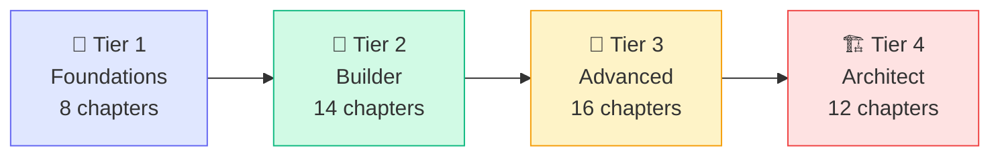

# AI-Native Development Course

Welcome. This course takes you from zero to building production AI systems.

## Who Is This For?

You know Python (or Node.js). You've heard of ChatGPT. You want to build things with AI — real things, not toys. This course is for you.

**No math degree required. No ML background required.**

---

## How the Course Works

The course is structured in 4 tiers. Each tier builds on the previous.



| Tier | Name | Chapters | By the End |
|------|------|----------|------------|
| 🧱 1 | Foundations | 8 | You can call any LLM API confidently |
| 🔧 2 | Builder | 14 | You can build RAG pipelines and basic agents |
| 🚀 3 | Advanced | 16 | You can build multi-agent systems and evaluate them |
| 🏗️ 4 | Architect | 12 | You can design and ship production AI systems |

---

## How Each Chapter Works

Every chapter has 5 pages:

| Page | What's in it |
|------|-------------|
| **Overview** | What you'll learn, prereqs, time estimate |
| **Concepts** | The idea — explained simply, then deeply, with diagrams |
| **Patterns** | How it's used in the real world, what to avoid |
| **Lab** | A real problem to solve with runnable Python code |
| **Quiz** | 5–10 questions to test your understanding |

---

## Setting Up Locally

### 1. Clone the repo

```bash
git clone https://github.com/your-org/ai-native-course
cd ai-native-course
```

### 2. Set up Python environment

```bash
cd curriculum/shared
python -m venv .venv
source .venv/bin/activate    # Windows: .venv\Scripts\activate
pip install -r requirements.txt
cp .env.example .env
# Edit .env — add your Anthropic API key
```

### 3. Get an API key

- [Anthropic Console](https://console.anthropic.com) — for Claude (used in most labs)
- [OpenAI Platform](https://platform.openai.com) — for comparison labs
- Both have free trial credits for new accounts

---

## Start Here

👉 [Tier 1 — Foundations →](/tier-1-foundations)
