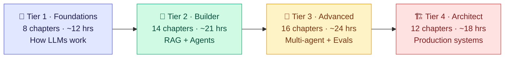
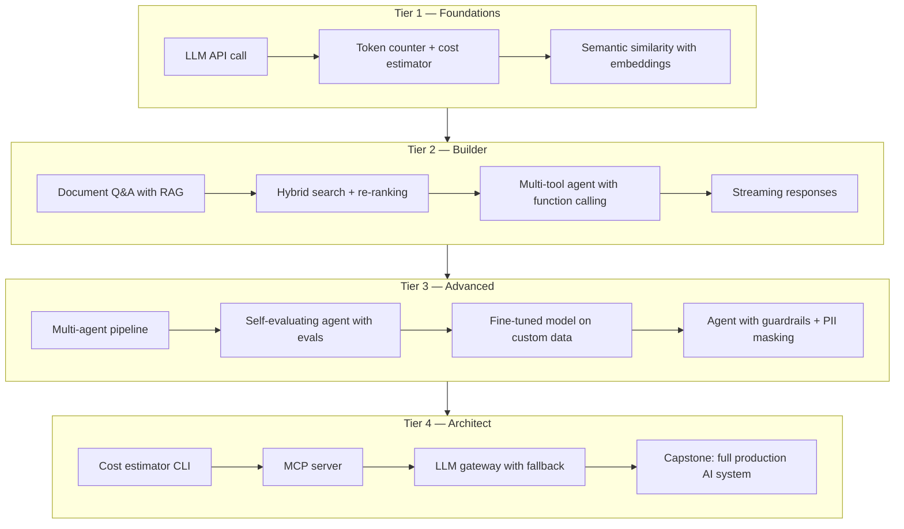

import ProgressTracker from '@site/src/components/ProgressTracker';

# AI-Native Development Course

**50 chapters. 4 tiers. Zero to production AI engineer.**

You know Python. You've used ChatGPT. Now you want to build real AI systems — RAG pipelines, agents, multi-model architectures. This course is the depth-first path to get there.

**No math degree required. No ML background required.**

---

## Your Learning Path



| Tier | Name | Chapters | Time | Milestone Project |
|------|------|----------|------|-------------------|
| 🧱 1 | Foundations | 8 | ~12 hrs | Call any LLM API, tokenize text, build embeddings |
| 🔧 2 | Builder | 14 | ~21 hrs | Build a full RAG pipeline + a multi-tool agent |
| 🚀 3 | Advanced | 16 | ~24 hrs | Multi-agent system with evals, guardrails, tracing |
| 🏗️ 4 | Architect | 12 | ~18 hrs | Production AI gateway + capstone system from scratch |

---

## What You'll Build



---

## How Each Chapter Works

Every chapter has 5 pages and a runnable Python lab:

| Page | What's in it |
|------|-------------|
| **Overview** | What you'll learn, prerequisites, time estimate, concept map |
| **Concepts** | The idea — intuition first, then technical depth, with Mermaid diagrams |
| **Patterns** | Real-world patterns, anti-patterns, and production code examples |
| **Lab** | A concrete problem with a starter file (TODOs) + complete solution + tests |
| **Quiz** | 5–10 scored questions — 70% pass rate required for completion |

**Concept maps** on each Overview page show how the chapter connects to others in the course — click any node to jump to that chapter.

---

## Your Progress

<ProgressTracker
  chapters={[
    { id: 'tier1-ch01', label: 'Ch01 — LLMs', tier: 1 },
    { id: 'tier1-ch02', label: 'Ch02 — Tokens', tier: 1 },
    { id: 'tier1-ch03', label: 'Ch03 — Context Window', tier: 1 },
    { id: 'tier1-ch04', label: 'Ch04 — Temperature', tier: 1 },
    { id: 'tier1-ch05', label: 'Ch05 — Embeddings', tier: 1 },
    { id: 'tier1-ch06', label: 'Ch06 — Inference vs Training', tier: 1 },
    { id: 'tier1-ch07', label: 'Ch07 — Foundation Models', tier: 1 },
    { id: 'tier1-ch08', label: 'Ch08 — Multimodal', tier: 1 },
    { id: 'tier2-ch09', label: 'Ch09 — Zero/Few-shot', tier: 2 },
    { id: 'tier2-ch10', label: 'Ch10 — Chain-of-Thought', tier: 2 },
    { id: 'tier2-ch11', label: 'Ch11 — System Prompts', tier: 2 },
    { id: 'tier2-ch12', label: 'Ch12 — Structured Output', tier: 2 },
    { id: 'tier2-ch13', label: 'Ch13 — Role + Meta Prompting', tier: 2 },
    { id: 'tier2-ch14', label: 'Ch14 — RAG Core', tier: 2 },
    { id: 'tier2-ch15', label: 'Ch15 — Vector Databases', tier: 2 },
    { id: 'tier2-ch16', label: 'Ch16 — Chunking', tier: 2 },
    { id: 'tier2-ch17', label: 'Ch17 — Hybrid Search', tier: 2 },
    { id: 'tier2-ch18', label: 'Ch18 — Re-ranking', tier: 2 },
    { id: 'tier2-ch19', label: 'Ch19 — Tool Use', tier: 2 },
    { id: 'tier2-ch20', label: 'Ch20 — Agentic Loop', tier: 2 },
    { id: 'tier2-ch21', label: 'Ch21 — Full Agent', tier: 2 },
    { id: 'tier2-ch22', label: 'Ch22 — Streaming', tier: 2 },
    { id: 'tier3-ch23', label: 'Ch23 — Planning', tier: 3 },
    { id: 'tier3-ch24', label: 'Ch24 — Multi-Agent', tier: 3 },
    { id: 'tier3-ch25', label: 'Ch25 — Agent Memory', tier: 3 },
    { id: 'tier3-ch26', label: 'Ch26 — Reflection', tier: 3 },
    { id: 'tier3-ch27', label: 'Ch27 — Agent Handoff', tier: 3 },
    { id: 'tier3-ch28', label: 'Ch28 — HITL', tier: 3 },
    { id: 'tier3-ch29', label: 'Ch29 — Fine-tuning', tier: 3 },
    { id: 'tier3-ch30', label: 'Ch30 — LoRA / QLoRA', tier: 3 },
    { id: 'tier3-ch31', label: 'Ch31 — RLHF / DPO', tier: 3 },
    { id: 'tier3-ch32', label: 'Ch32 — Evals', tier: 3 },
    { id: 'tier3-ch33', label: 'Ch33 — LLM-as-Judge', tier: 3 },
    { id: 'tier3-ch34', label: 'Ch34 — Hallucination Detection', tier: 3 },
    { id: 'tier3-ch35', label: 'Ch35 — Tracing', tier: 3 },
    { id: 'tier3-ch36', label: 'Ch36 — Guardrails', tier: 3 },
    { id: 'tier3-ch37', label: 'Ch37 — Prompt Injection', tier: 3 },
    { id: 'tier3-ch38', label: 'Ch38 — PII Handling', tier: 3 },
    { id: 'tier4-ch39', label: 'Ch39 — LLM APIs', tier: 4 },
    { id: 'tier4-ch40', label: 'Ch40 — Model Selection', tier: 4 },
    { id: 'tier4-ch41', label: 'Ch41 — MCP', tier: 4 },
    { id: 'tier4-ch42', label: 'Ch42 — A2A / ACP', tier: 4 },
    { id: 'tier4-ch43', label: 'Ch43 — LLM Hosting', tier: 4 },
    { id: 'tier4-ch44', label: 'Ch44 — LLM Caching', tier: 4 },
    { id: 'tier4-ch45', label: 'Ch45 — Latency Optimization', tier: 4 },
    { id: 'tier4-ch46', label: 'Ch46 — AI Gateway', tier: 4 },
    { id: 'tier4-ch47', label: 'Ch47 — GraphRAG', tier: 4 },
    { id: 'tier4-ch48', label: 'Ch48 — Durable Workflows', tier: 4 },
    { id: 'tier4-ch49', label: 'Ch49 — Computer Use', tier: 4 },
    { id: 'tier4-ch50', label: 'Ch50 — Capstone', tier: 4 },
  ]}
/>

---

## Setting Up Locally

### 1. Clone and install

```bash
git clone https://github.com/gauravprwl14/ai-native-course
cd ai-native-course/curriculum/shared
python -m venv .venv
source .venv/bin/activate    # Windows: .venv\Scripts\activate
pip install -r requirements.txt
cp .env.example .env
# Add ANTHROPIC_API_KEY to .env — required for Tier 1–3 labs
```

### 2. Get an API key

- [Anthropic Console](https://console.anthropic.com) — Claude (used in most labs)
- [OpenAI Platform](https://platform.openai.com) — GPT-4o / embeddings (Tier 2+ comparison labs)
- Both offer free credits for new accounts

### 3. Run your first lab

```bash
cd curriculum/tier-1-foundations/01-llms/lab/starter
# Fill in the # TODO: comments in solution.py, then:
python solution.py
# Run the tests:
cd .. && pytest tests/ -v
```

---

## Start Here

👉 **[Tier 1 — Foundations →](/tier-1-foundations)**
