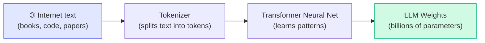
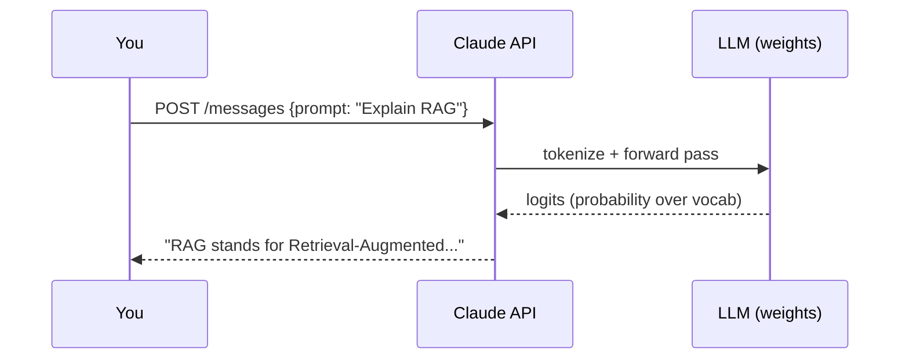
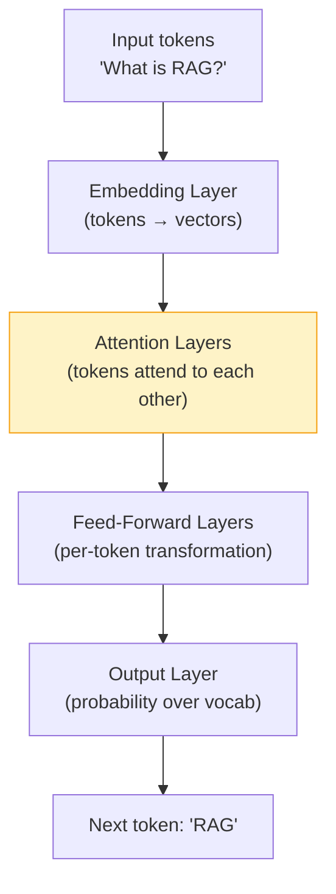

# Concepts: LLMs & How They Work

## The Problem This Solves

Before LLMs, building a system that could answer questions, summarize documents, or write code required massive hand-crafted rule systems or highly specialised ML models — one for each task.

LLMs changed everything. One model, trained on vast text, can do all of those tasks and more — just by reading instructions in plain English.

---

## The Intuition

**Think of an LLM as an extremely well-read autocomplete.**

You've seen phone autocomplete — type "I want to" and it suggests "eat pizza". An LLM is the same idea, but trained on hundreds of billions of words. When you ask it a question, it's predicting the most likely helpful response — token by token.

The magic is that "predicting the next token" at scale, with enough data, produces something that *looks like* understanding.

---

## How It Works — Step by Step

### Step 1: Training (happens once, by the AI company)

The model learns by reading text and repeatedly asking: *"given these tokens, what comes next?"* It adjusts billions of numbers (weights) until it gets very good at this prediction.

**You never do this step** — it costs millions of dollars and months of GPU time.

### Step 2: Inference (what you do — every API call)

Each token is generated one at a time. The model looks at all previous tokens and predicts the next one. This is why LLMs stream — they're generating one word at a time.

---

## The Transformer Architecture (Simplified)

You don't need to understand this deeply to use LLMs. But knowing the basics helps you debug issues.

**The key insight**: The **attention mechanism** lets every token look at every other token. This is how "The bank by the river" knows "bank" means riverbank, not finance — the word attends to "river".

---

## Major LLM Families

| Model | Company | Strengths | Access |
|-------|---------|-----------|--------|
| Claude (Haiku/Sonnet/Opus) | Anthropic | Safety, long context, coding | API |
| GPT-4o / GPT-4o-mini | OpenAI | General purpose, vision | API |
| Gemini 1.5 Pro | Google | Very long context (1M tokens), multimodal | API |
| Llama 3 | Meta | Open weights, runs locally | Download |
| Mistral / Mixtral | Mistral AI | Efficient, open weights | API + Download |

**For this course:** We use Claude (Anthropic) as the primary model. It has excellent API ergonomics and generous context windows.

---

## Key Terms

| Term | What It Means |
|------|---------------|
| **Token** | The unit LLMs work with — roughly ¾ of a word |
| **Context window** | Max tokens in one request (input + output) |
| **Temperature** | Randomness in outputs (0 = deterministic, 1 = creative) |
| **Inference** | Running the model to get outputs |
| **Weights** | The billions of numbers that make up the model |
| **System prompt** | Instructions you give the model before the conversation |

---

## The Interview Angle

**Common interview questions about LLMs:**

1. *"How does an LLM generate text?"* → Token-by-token prediction using a transformer. Each token is sampled from a probability distribution over the vocabulary.

2. *"What's the difference between training and inference?"* → Training updates weights (expensive, done once). Inference runs fixed weights to produce outputs (cheap, done per request).

3. *"Why do LLMs hallucinate?"* → They predict likely text, not factual text. If the training data had wrong information, or if the model is uncertain, it generates plausible-sounding but incorrect content.

---

## Common Mistakes

**❌ Treating LLMs as a database**
LLMs don't store facts reliably. Don't ask "What is our company's refund policy?" without providing the policy in the prompt. This is what RAG (Chapter 14) solves.

**❌ Using temperature=0 for everything**
Temperature 0 is deterministic but can be repetitive and boring. For creative tasks, try 0.7–1.0. For factual/code tasks, 0–0.3 works well.

**❌ Assuming one model fits all tasks**
GPT-4o-mini is 30x cheaper than GPT-4o. Use small models for classification, routing, and simple extraction. Use large models for complex reasoning.

---

## Further Reading

- 📄 [Attention Is All You Need (Vaswani et al., 2017)](https://arxiv.org/abs/1706.03762) — the original transformer paper
- 🎥 [3Blue1Brown: But what is a GPT?](https://www.youtube.com/watch?v=wjZofJX0v4M) — best visual explanation
- 📄 [Anthropic's Claude API Docs](https://docs.anthropic.com/en/api/getting-started) — what you'll use in the lab
