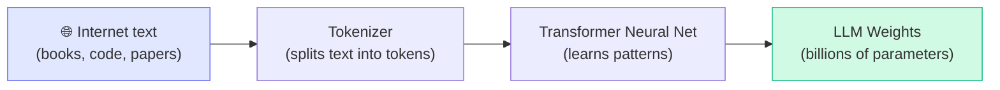
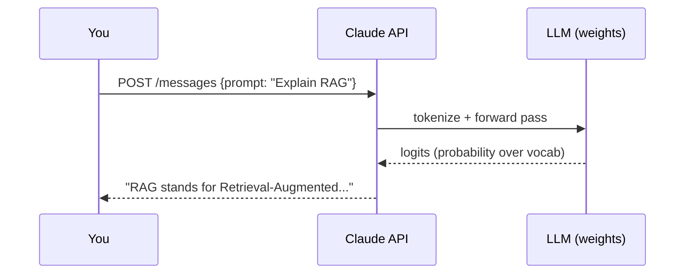
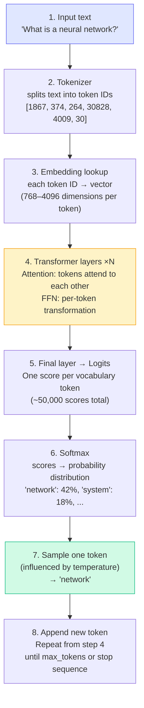
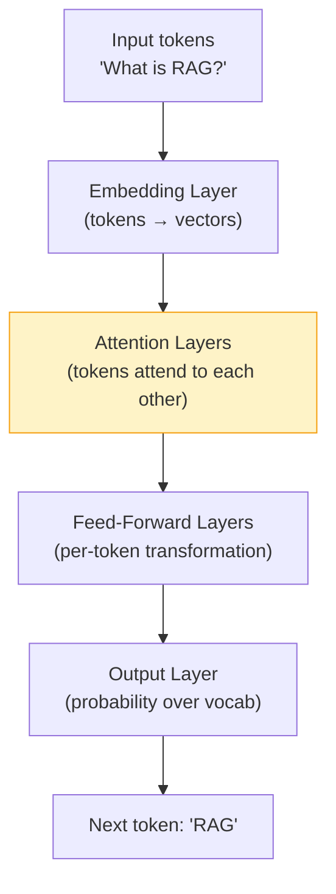

# Concepts: LLMs & How They Work

## The Problem This Solves

Before LLMs, building a system that could answer questions, summarize documents, or write code required massive hand-crafted rule systems or highly specialised ML models — one for each task.

LLMs changed everything. One model, trained on vast text, can do all of those tasks and more — just by reading instructions in plain English.

---

## The Intuition

<div className="concept-intuition">

**Think of an LLM as an extremely well-read autocomplete.**

You've seen phone autocomplete — type "I want to" and it suggests "eat pizza". An LLM is the same idea, but trained on hundreds of billions of words. When you ask it a question, it's predicting the most likely helpful response — token by token.

The magic is that "predicting the next token" at scale, with enough data, produces something that *looks like* understanding.

</div>

---

## How It Works — Step by Step

### Step 1: Training (happens once, by the AI company)



The model learns by reading text and repeatedly asking: *"given these tokens, what comes next?"* It adjusts billions of numbers (weights) until it gets very good at this prediction.

**You never do this step** — it costs millions of dollars and months of GPU time.

### Step 2: Inference (what you do — every API call)



Each token is generated one at a time. The model looks at all previous tokens and predicts the next one. This is why LLMs stream — they're generating one word at a time.

---

## How Text Generation Actually Works

Understanding the mechanics of token-by-token generation helps you reason about latency, cost, and why models behave the way they do.



**Breaking down each step:**

**Step 1 — Input text.** Your prompt arrives as a plain string. Nothing happens until it is tokenised.

**Step 2 — Tokenise.** The text is split into tokens using a learned vocabulary (e.g. BPE — Byte Pair Encoding). A token is roughly ¾ of a word. "neural" might be one token; "network" another. Each token maps to an integer ID.

**Step 3 — Embedding lookup.** Each integer ID is looked up in an embedding table to produce a dense vector. Modern models use vectors with 768 dimensions (small models) up to 4096+ dimensions (large models). This is how the model converts discrete tokens into continuous mathematics it can process.

**Step 4 — Transformer layers.** The vectors pass through N stacked transformer blocks (e.g. 32 layers in a 7B model, 96 in GPT-4-class models). Each block runs two operations:
- **Attention**: every token can look at and "attend to" every other token in the context window. This is how "bank" in "bank by the river" knows to mean riverbank.
- **Feed-Forward Network (FFN)**: a per-token transformation that applies learned patterns.

**Step 5 — Logits.** The final transformer layer produces a vector of raw scores — one score per token in the entire vocabulary (~50,000 tokens for most modern models). These are called *logits*.

**Step 6 — Softmax.** Logits are converted to a proper probability distribution using the softmax function. Every token in the vocabulary now has a probability between 0 and 1, summing to 1.0.

**Step 7 — Sample one token.** One token is selected from this distribution. The *temperature* parameter controls how the distribution is used:
- **Temperature = 0**: always pick the highest-probability token (greedy/deterministic).
- **Temperature = 1**: sample proportionally from the distribution (default creative behaviour).
- **Temperature &gt; 1**: flatten the distribution, increasing randomness.

**Step 8 — Repeat.** The newly generated token is appended to the input and the process repeats from step 4 — until the model generates a stop token or hits `max_tokens`. This is why generation is sequential and why longer outputs cost more.

:::tip Why this matters for you as a builder
Every token generated requires a full forward pass through all N transformer layers. Longer outputs = more compute = higher latency and cost. This is why `max_tokens` is a hard cap you set, not a soft suggestion.
:::

---

## The Transformer Architecture (Simplified)

You don't need to understand this deeply to use LLMs. But knowing the basics helps you debug issues.



**The key insight**: The **attention mechanism** lets every token look at every other token. This is how "The bank by the river" knows "bank" means riverbank, not finance — the word attends to "river".

---

## The Three Families of LLM APIs

When building AI applications you will work with one of three API families. Each has different trade-offs on cost, capability, privacy, and operational complexity.

| Family | Examples | Pricing model | Key strengths |
|--------|----------|---------------|---------------|
| **Anthropic (Claude)** | Claude Haiku, Sonnet, Opus | Per token (input/output charged separately) | Long context, safety, instruction following |
| **OpenAI** | GPT-4o, GPT-4o mini | Per token (input/output charged separately) | Ecosystem, function calling, vision, broad tooling |
| **Open source / self-hosted** | Llama 3, Mistral, Phi-3 | Infrastructure cost (GPU hours, hosting) | Privacy, no API limits, fully customisable |

**How to choose:**

- **Claude** — use when you need long context windows, strong instruction-following, or are building safety-sensitive applications. This is the primary model used in this course.
- **OpenAI** — use when you need the broadest ecosystem of third-party integrations, or when you're working with an existing codebase already on the OpenAI SDK.
- **Open source / self-hosted** — use when data cannot leave your infrastructure (healthcare, legal, finance), when you need to fine-tune on proprietary data, or when you need to serve at a scale where per-token pricing becomes prohibitive.

:::note Cost reality check
At the time of writing, frontier models (Claude Sonnet, GPT-4o) cost roughly $3–15 per million input tokens and $15–75 per million output tokens. Small models (Claude Haiku, GPT-4o mini) cost 10–30x less. For most applications, output tokens are the dominant cost driver — keep `max_tokens` tight.
:::

---

## Major LLM Families

| Model | Company | Strengths | Access |
|-------|---------|-----------|--------|
| Claude (Haiku/Sonnet/Opus) | Anthropic | Safety, long context, coding | API |
| GPT-4o / GPT-4o-mini | OpenAI | General purpose, vision | API |
| Gemini 1.5 Pro | Google | Very long context (1M tokens), multimodal | API |
| Llama 3 | Meta | Open weights, runs locally | Download |
| Mistral / Mixtral | Mistral AI | Efficient, open weights | API + Download |

**For this course:** We use Claude (Anthropic) as the primary model. It has excellent API ergonomics and generous context windows.

---

## Your First API Call — Annotated

Here is a complete, minimal API call with every line explained. Read this carefully — this pattern is the foundation of every AI application you will build.

```python
import anthropic  # Official Anthropic Python SDK — install with: pip install anthropic

client = anthropic.Anthropic()
# Reads ANTHROPIC_API_KEY from the environment automatically.
# You can also pass it explicitly: anthropic.Anthropic(api_key="sk-ant-...")
# Never hard-code API keys in source files.

response = client.messages.create(
    model="claude-3-haiku-20240307",
    # Which model to use. Haiku is the smallest and fastest Claude model —
    # good for learning because it responds quickly and costs the least.
    # Other options: "claude-3-5-sonnet-20241022", "claude-3-opus-20240229"

    max_tokens=1024,
    # Hard upper limit on tokens the model can generate in this response.
    # The model may stop earlier (e.g. it finishes its answer), but it will
    # NEVER exceed this. Set it deliberately — it directly controls your cost ceiling.

    messages=[
        # The conversation history as a list of turn objects.
        # Even for a single-turn request you still pass a list with one item.
        # For multi-turn conversations, append each new turn to this list.
        {
            "role": "user",
            # "user" = the human turn. The other valid value is "assistant"
            # (used when you want to pre-fill the model's response, or when
            # replaying conversation history in a multi-turn session).

            "content": "Explain what a neural network is in 2 sentences."
            # The actual text of your message. For more complex inputs (images,
            # files, multi-part content) this can also be a list of content blocks.
        }
    ]
)

print(response.content[0].text)
# response.content is a list of content blocks (the API supports mixed
# text + tool_use responses). For a plain text response, [0] is the text block
# and .text is the string you want.

print(f"Input tokens: {response.usage.input_tokens}")
# How many tokens were in your input (messages + system prompt if any).
# Use this to track costs and stay within context window limits.

print(f"Output tokens: {response.usage.output_tokens}")
# How many tokens the model generated. This is usually the bigger cost driver.
# If this is always hitting your max_tokens limit, increase it or rethink
# whether you're asking for too much in one call.
```

**To run this yourself:**

```bash
pip install anthropic
export ANTHROPIC_API_KEY="your-key-here"
python your_script.py
```

---

## Understanding the Response Object

Every call to `client.messages.create()` returns a `Message` object. Here is the full JSON structure the API returns, with every field explained:

```json
{
  "id": "msg_01XFDUDYJgAACzvnptvVoYEL",
  "type": "message",
  "role": "assistant",
  "content": [
    {
      "type": "text",
      "text": "A neural network is a computational model loosely inspired by the human brain, consisting of layers of interconnected nodes that transform input data through learned mathematical operations. It learns by adjusting the strength of connections between nodes to minimise the difference between its predictions and the correct answers on training data."
    }
  ],
  "model": "claude-3-haiku-20240307",
  "stop_reason": "end_turn",
  "stop_sequence": null,
  "usage": {
    "input_tokens": 20,
    "output_tokens": 63
  }
}
```

**Field-by-field breakdown:**

| Field | Type | What it means |
|-------|------|---------------|
| `id` | string | Unique identifier for this specific response. Use this for logging, debugging, and support requests. |
| `type` | string | Always `"message"` for the Messages API. Reserved for future API extensions. |
| `role` | string | Always `"assistant"` in a response — confirms this is the model's turn. |
| `content` | array | A list of content blocks. Usually one `&#123;"type": "text", "text": "..."&#125;` block. When the model calls tools, additional `tool_use` blocks appear here. |
| `model` | string | The exact model version that generated this response. Useful when you're testing multiple models and want to confirm which one ran. |
| `stop_reason` | string | **Why the model stopped generating.** The four values you will encounter: `"end_turn"` (model finished naturally), `"max_tokens"` (hit your `max_tokens` limit — output may be truncated), `"stop_sequence"` (hit a custom stop sequence you defined), `"tool_use"` (model wants to call a tool). |
| `stop_sequence` | string or null | If `stop_reason` is `"stop_sequence"`, this shows which stop sequence triggered the stop. Otherwise `null`. |
| `usage.input_tokens` | integer | Tokens consumed by your input (prompt + any system prompt). Billed at the input rate. |
| `usage.output_tokens` | integer | Tokens generated by the model. Billed at the output rate (typically 3–5x more expensive than input). |

**The most important field to check in production is `stop_reason`.** If it is `"max_tokens"`, your output was cut off — the response may be incomplete. Always check this before processing the response content in production code.

```python
# Production-safe pattern for checking stop reason
if response.stop_reason == "max_tokens":
    # Output was truncated — handle this case explicitly
    raise ValueError(f"Response truncated. Increase max_tokens (currently at limit).")

text = response.content[0].text
```

---

## Key Terms

| Term | What It Means |
|------|---------------|
| **Token** | The unit LLMs work with — roughly ¾ of a word |
| **Context window** | Max tokens in one request (input + output) |
| **Temperature** | Randomness in outputs (0 = deterministic, 1 = creative) |
| **Inference** | Running the model to get outputs |
| **Weights** | The billions of numbers that make up the model |
| **System prompt** | Instructions you give the model before the conversation |
| **Logits** | Raw unnormalised scores output by the final model layer — one per vocabulary token |
| **Softmax** | Function that converts logits into a probability distribution summing to 1.0 |
| **stop_reason** | Why the model stopped generating — critical to check in production |

---

## The Interview Angle

<div className="interview-angle">

**Common interview questions about LLMs:**

1. *"How does an LLM generate text?"* → Token-by-token prediction using a transformer. Each token is sampled from a probability distribution over the vocabulary.

2. *"What's the difference between training and inference?"* → Training updates weights (expensive, done once). Inference runs fixed weights to produce outputs (cheap, done per request).

3. *"Why do LLMs hallucinate?"* → They predict likely text, not factual text. If the training data had wrong information, or if the model is uncertain, it generates plausible-sounding but incorrect content.

4. *"Walk me through what happens when you call an LLM API."* → Input text is tokenised into IDs → IDs are looked up in an embedding table to get vectors → vectors pass through N transformer layers (attention + FFN) → the final layer produces logits over the vocabulary → softmax converts logits to probabilities → one token is sampled (influenced by temperature) → the new token is appended and the process repeats until the stop condition is met.

5. *"What does `stop_reason: max_tokens` mean and why does it matter?"* → The model hit the hard token limit you set before it naturally finished its response. The output may be truncated. In production, you must handle this case to avoid acting on an incomplete response.

</div>

---

## Common Mistakes

<div className="antipattern">

**❌ Treating LLMs as a database**
LLMs don't store facts reliably. Don't ask "What is our company's refund policy?" without providing the policy in the prompt. This is what RAG (Chapter 14) solves.

**❌ Using temperature=0 for everything**
Temperature 0 is deterministic but can be repetitive and boring. For creative tasks, try 0.7–1.0. For factual/code tasks, 0–0.3 works well.

**❌ Assuming one model fits all tasks**
GPT-4o-mini is 30x cheaper than GPT-4o. Use small models for classification, routing, and simple extraction. Use large models for complex reasoning.

**❌ Not checking `stop_reason` in production**
If `stop_reason` is `"max_tokens"`, the model's response was cut off mid-sentence. Processing truncated output as if it were complete leads to subtle, hard-to-debug bugs downstream.

**❌ Setting `max_tokens` arbitrarily high**
`max_tokens` is a cost ceiling, not a target. Setting it to 4096 for a task that needs 100 tokens won't improve quality, but it does mean you could be billed for 4096 tokens if something goes wrong. Set it to roughly 2x what you expect the output to be.

</div>

---

## Further Reading

- 📄 [Attention Is All You Need (Vaswani et al., 2017)](https://arxiv.org/abs/1706.03762) — the original transformer paper
- 🎥 [3Blue1Brown: But what is a GPT?](https://www.youtube.com/watch?v=wjZofJX0v4M) — best visual explanation
- 📄 [Anthropic's Claude API Docs](https://docs.anthropic.com/en/api/getting-started) — what you'll use in the lab
- 📄 [Anthropic Messages API Reference](https://docs.anthropic.com/en/api/messages) — full response object documentation
