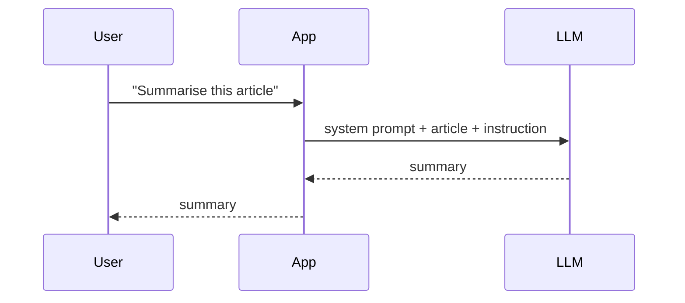
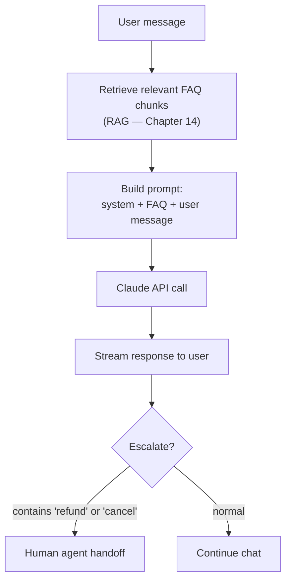

# Patterns: LLMs in the Real World

## Pattern 1: Direct Q&A

The simplest pattern. User asks, LLM answers.



**When to use:** One-shot tasks. Summarisation, classification, translation, simple generation.

**Limitation:** LLM only knows what's in its training data + what you put in the prompt.

---

## Pattern 2: System Prompt + User Message

Every production LLM integration uses this. The system prompt sets persona, constraints, and format. The user message is the actual input.

```python
# This is the pattern you'll use in 90% of labs
response = client.messages.create(
    model="claude-haiku-4-5-20251001",
    max_tokens=1024,
    system="You are a helpful assistant that answers concisely in bullet points.",
    messages=[{"role": "user", "content": "What is a transformer?"}]
)
```

**System prompt controls:**
- Persona ("You are an expert Python developer")
- Output format ("Always respond in JSON")
- Constraints ("Do not discuss competitors")
- Context ("You work for Acme Corp, here are our policies: ...")

---

## Pattern 3: Multi-turn Conversation

Build up context across multiple messages.

```python
messages = []

# Turn 1
messages.append({"role": "user", "content": "What is RAG?"})
response = client.messages.create(model="claude-haiku-4-5-20251001", max_tokens=512, messages=messages)
messages.append({"role": "assistant", "content": response.content[0].text})

# Turn 2 — model remembers previous context
messages.append({"role": "user", "content": "Give me a Python code example"})
response = client.messages.create(model="claude-haiku-4-5-20251001", max_tokens=512, messages=messages)
```

**Important:** LLMs are stateless. There's no "memory" on the server. You resend the entire conversation history every request.

---

## Anti-Patterns

<div className="antipattern">

**❌ Sending sensitive data to a public API without consent**
API providers log requests. Don't send PII, credentials, or confidential business data to Claude/OpenAI without reviewing their data policies and getting appropriate consent.

**❌ Not handling API errors**
LLM APIs can return rate limit errors, server errors, and timeouts. Always wrap API calls in retry logic (see `tenacity` library).

**❌ Ignoring costs**
A single GPT-4o call with a 10,000-token context costs ~$0.10. At scale, that's $100 for 1,000 users. Always estimate costs before shipping. Use cheaper models for simple tasks.

</div>

---

## Real-World Example: Customer Support Bot



This pattern — RAG + streaming + conditional routing — is what 80% of customer support AI looks like in production. You'll build each piece of it across Tier 1 and Tier 2.
