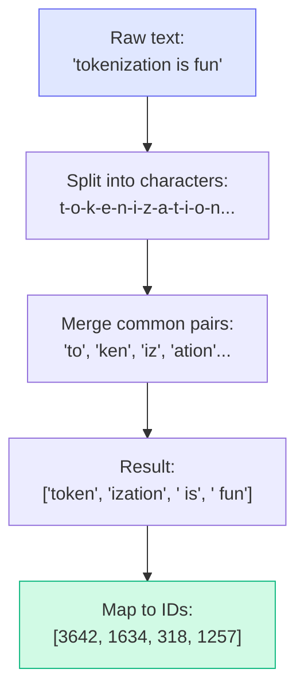
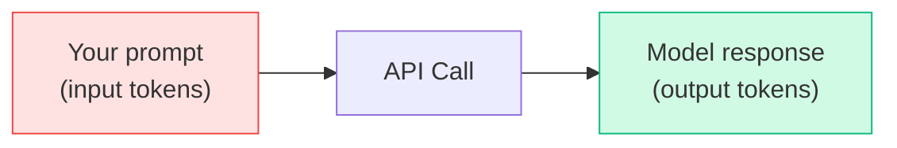

# Concepts: Tokens & Tokenization

## The Problem

LLMs don't read words — they read **tokens**. Every API call is priced per token. Every model has a maximum token limit. If you don't understand tokens, you'll hit unexpected limits and surprise bills.

---

## The Intuition

<div className="concept-intuition">

**A token is roughly ¾ of a word.**

- "Hello" → 1 token
- "tokenization" → 3 tokens (`token`, `ization` is wrong — actually `token`, `iz`, `ation`)
- " Hello" (with a space) → 1 token (different from "Hello"!)
- `print("hello")` → 4 tokens

The tokenizer was trained to split text efficiently. Common words are one token. Rare words and code get split into subword pieces.

</div>

---

## How Tokenization Works

The most common tokenizer for modern LLMs is **BPE (Byte-Pair Encoding)**. Here's the intuition:



BPE starts with individual characters and repeatedly merges the most frequent adjacent pairs until reaching a vocabulary size (typically 50k–100k tokens).

---

## Tokens vs Words vs Characters

| Input | Tokens | Words | Characters |
|-------|--------|-------|------------|
| "Hello, world!" | 4 | 2 | 13 |
| "The quick brown fox" | 5 | 4 | 19 |
| "supercalifragilistic" | 8 | 1 | 20 |
| `def fibonacci(n):` | 7 | 1 | 18 |
| "こんにちは" (Japanese) | 15 | 1 | 5 |

**Key takeaway:** Non-English text uses significantly more tokens per character. This matters for cost.

---

## Token Counting with tiktoken

```python
import tiktoken

# cl100k_base is used by Claude and GPT-4
enc = tiktoken.get_encoding("cl100k_base")

text = "Hello, how are you today?"
tokens = enc.encode(text)
print(f"Token IDs: {tokens}")
print(f"Token count: {len(tokens)}")
print(f"Tokens: {[enc.decode([t]) for t in tokens]}")

# Output:
# Token IDs: [9906, 11, 1268, 527, 499, 3432, 30]
# Token count: 7
# Tokens: ['Hello', ',', ' how', ' are', ' you', ' today', '?']
```

---

## API Pricing and Cost Estimation

Every LLM API charges per token. You pay for **input tokens** (what you send) and **output tokens** (what you receive).



**Approximate prices (early 2026):**

| Model | Input (per 1M tokens) | Output (per 1M tokens) |
|-------|----------------------|------------------------|
| claude-haiku-4-5-20251001 | $0.80 | $4.00 |
| claude-sonnet-4-6 | $3.00 | $15.00 |
| claude-opus-4-6 | $15.00 | $75.00 |
| gpt-4o-mini | $0.15 | $0.60 |
| gpt-4o | $5.00 | $15.00 |

**Cost formula:**
```python
cost = (input_tokens / 1_000_000) * input_price_per_million
     + (output_tokens / 1_000_000) * output_price_per_million
```

---

## Practical Token Budgets

| Use Case | Typical Input Tokens | Typical Output Tokens | Monthly Cost (1000 req/day) |
|----------|---------------------|----------------------|---------------------------|
| Short Q&A | 200 | 150 | ~$1.50 (haiku) |
| Document summary | 3,000 | 500 | ~$10 (haiku) |
| RAG pipeline | 2,000 | 800 | ~$7 (haiku) |
| Code generation | 1,000 | 2,000 | ~$12 (haiku) |

---

## Key Terms

| Term | Meaning |
|------|---------|
| **Token** | Subword unit — roughly ¾ of a word |
| **BPE** | Byte-Pair Encoding — common tokenization algorithm |
| **tiktoken** | OpenAI's tokenizer library (works for Claude too) |
| **cl100k_base** | The encoding used by GPT-4 and Claude |
| **Input tokens** | Tokens in your prompt (system + user messages) |
| **Output tokens** | Tokens in the model's response |

---

## The Interview Angle

<div className="interview-angle">

**Common interview questions about tokens:**

1. *"Why does tokenization matter for LLMs?"* → Pricing is per token. Context limits are in tokens. Understanding tokens helps you estimate costs and avoid hitting limits.

2. *"Why is non-English text more expensive?"* → BPE was trained on mostly English text. Non-English characters don't appear as frequently, so they get split into more subword pieces — meaning more tokens per word.

3. *"What's the difference between input and output tokens in API pricing?"* → Output tokens are 3-5x more expensive because generation requires more compute (autoregressive decoding) than encoding the input.

</div>

---

## Common Mistakes

<div className="antipattern">

**❌ Using character count to estimate tokens**
Characters ÷ 4 is a rough heuristic. Code, JSON, and non-English text break this badly. Always use tiktoken for accurate counts.

**❌ Forgetting that output tokens cost more**
Input: $0.80/M, Output: $4.00/M for Haiku. If your use case generates long responses, output cost dominates. Optimize `max_tokens` accordingly.

**❌ Not setting max_tokens**
If you don't set `max_tokens`, the model can generate up to its limit (4096 or more). A single runaway response can cost 10x what you expected.

</div>

---

## Further Reading

- 📄 [OpenAI Tokenizer (visual)](https://platform.openai.com/tokenizer) — paste text and see tokens highlighted
- 🐍 [tiktoken on GitHub](https://github.com/openai/tiktoken) — the library you'll use
- 📄 [Anthropic pricing](https://www.anthropic.com/pricing) — current Claude prices
