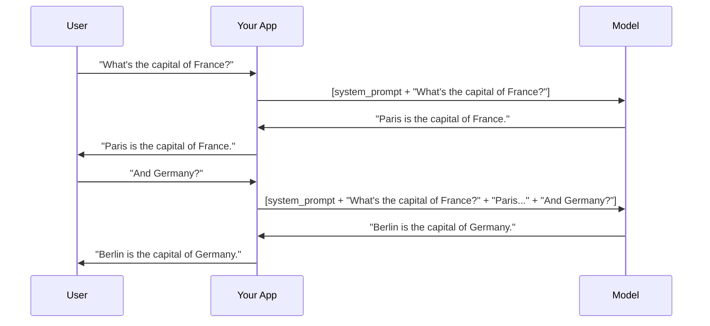
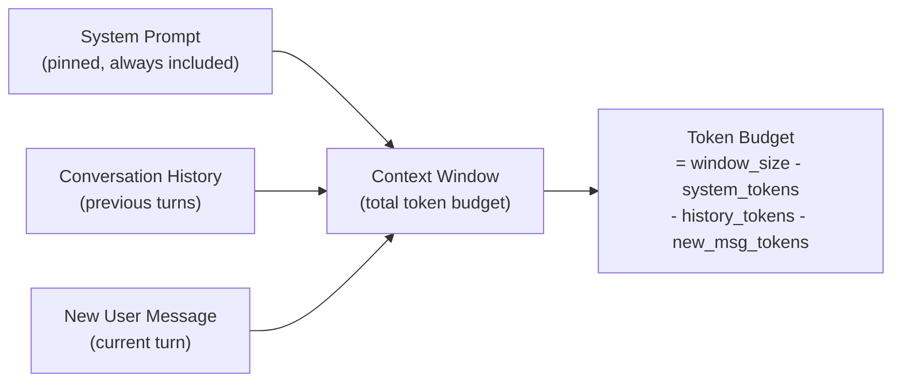

import TokenVisualizer from '@site/src/components/TokenVisualizer';

# Concepts: Context Window

## The Problem

You ask an LLM a follow-up question — "And what about the second option?" — and it responds as if it has never heard of any options. Why?

Because LLMs have **no persistent memory**. Every API call starts fresh. The only "memory" the model has is what you put in the request right now. If your previous conversation isn't included in the current request, the model has no knowledge of it.

This is the context window problem: you have a fixed-size space to fit everything the model needs to know, and once it's full, something has to give.

---

## The Intuition

<div className="concept-intuition">

**Think of the context window as the LLM's desk.**

The model can only work with what's physically on the desk in front of it. You can place papers (messages) on the desk, but the desk has a fixed surface area. If you keep adding papers, the old ones fall off the back edge.

- The **system prompt** is a sticky note pinned to the top of the desk — always visible
- **Conversation history** is the stack of papers from previous exchanges
- The **new user message** is the paper you just placed down
- The **model's response** is written on a new paper and placed back on the desk

When the desk overflows, the oldest papers fall off. The model can no longer "see" them.

</div>

---

## How It Works

The context window is a fixed number of tokens that a model can process in a single request. It includes **everything**: system prompt, conversation history, the new user message, and the model's response.

**Context window sizes (early 2026):**

| Model | Context Window |
|-------|---------------|
| claude-haiku-4-5 | 200K tokens |
| claude-sonnet-4-6 | 200K tokens |
| GPT-4o | 128K tokens |
| GPT-4o mini | 128K tokens |
| Llama 3.1 70B | 128K tokens |

**Important:** Input tokens + output tokens must both fit within this limit. If your context window is 128K and you send 127K tokens of input, you only have 1K tokens left for the response.

### The KV Cache

When you send a request, the model converts every input token into key-value vectors (the "KV cache"). These are computed in one forward pass. The model then generates output tokens one at a time, each time attending to the full KV cache.

This is why:
1. **Longer inputs cost more** — more tokens to encode
2. **Every new call re-processes everything** — the model has no persistent cache between API calls (unless you use prompt caching features)
3. **Position matters** — models can sometimes lose track of information buried in the middle of very long contexts

---

## Multi-Turn Conversation Flow

Here's what actually happens when you build a chatbot:



The key insight: **your app is responsible for collecting and re-sending the conversation history** on every call. The model itself is stateless.

---

## Anatomy of a Context Window



Your available budget for generating a response is:

```
response_budget = context_window_size
                - system_prompt_tokens
                - history_tokens
                - new_message_tokens
```

---

## Token Visualizer

Here's an example of how a context window message gets tokenized:

<TokenVisualizer
  text="You are a helpful assistant. The user asked: What is the context window?"
  model="cl100k_base"
/>

---

## Key Terms

| Term | Meaning |
|------|---------|
| **Context window** | Maximum tokens (input + output) a model can process per request |
| **KV cache** | Key-value vectors computed from input tokens during the forward pass |
| **Context poisoning** | When bad or irrelevant content in the context degrades response quality |
| **Sliding window** | Technique to keep a rolling window of the most recent N tokens of history |
| **Truncation** | Removing messages from history to fit within the token budget |

---

## The Interview Angle

<div className="interview-angle">

**"Explain how you'd manage a long conversation that might exceed the context window."**

A strong answer covers three strategies:

1. **FIFO Truncation** — Remove the oldest messages when the context fills up. Simple and predictable. Downside: the model loses early context (e.g., the user's original goal stated at the start).

2. **Summarization** — When history grows long, call the model to summarize the early messages into a compressed summary, then replace the old messages with that summary. Preserves semantic meaning. Downside: adds latency and cost for the summarization call.

3. **Sliding Window** — Keep a fixed window of the most recent N tokens of conversation. Similar to FIFO but token-based rather than message-based. Good for real-time chat where recent context matters most.

In production, the right choice depends on the use case: customer support usually needs early context (user's problem statement), while code assistants benefit most from recent context.

</div>

---

## Common Mistakes

<div className="antipattern">

**Sending full history without checking token count**

Every message you add to history increases the token count on the next API call. After 50 exchanges, you might be sending 20K tokens of history for a simple follow-up question. Always count tokens before sending and truncate proactively.

**Not accounting for system prompt tokens in budget calculation**

The system prompt consumes tokens too. If your system prompt is 2K tokens and your context window is 8K, you only have 6K tokens for the actual conversation. Budget carefully.

</div>

---

## Further Reading

- [Anthropic: Long context tips](https://docs.anthropic.com/en/docs/build-with-claude/long-context-tips) — official guidance on working with large contexts
- [OpenAI Cookbook: Managing conversation history](https://cookbook.openai.com/examples/how_to_format_inputs_to_chatgpt_models) — practical patterns for chat history management
- [Anthropic: Prompt caching](https://docs.anthropic.com/en/docs/build-with-claude/prompt-caching) — how to cache repeated context to reduce costs and latency
