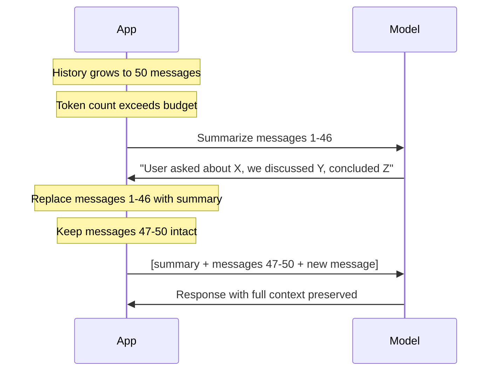

# Patterns: Context Window Management

## Pattern 1: FIFO Truncation

The simplest strategy: when history exceeds the token budget, drop the oldest messages first (First In, First Out).

```python
import tiktoken

ENCODING = tiktoken.get_encoding("cl100k_base")

def count_tokens(text: str) -> int:
    return len(ENCODING.encode(text))

def count_history_tokens(history: list[dict]) -> int:
    """Count total tokens across all messages in history."""
    total = 0
    for msg in history:
        total += count_tokens(msg["content"]) + 4  # ~4 tokens overhead per message
    return total

def fifo_truncate(history: list[dict], max_tokens: int) -> list[dict]:
    """Remove oldest messages until history fits within max_tokens."""
    result = list(history)  # don't mutate original
    while result and count_history_tokens(result) > max_tokens:
        result.pop(0)  # remove oldest message
    return result
```

**When to use:** Simple chatbots, customer support, any use case where recent context matters more than old context.

**Limitation:** Drops the earliest context — including potentially important information like the user's original question or stated preferences.

---

## Pattern 2: Sliding Window with Summary

For use cases where early context is important, compress old messages into a rolling summary before dropping them.

```python
def summarize_messages(messages: list[dict], client) -> str:
    """Compress a list of messages into a brief summary."""
    history_text = "\n".join(
        f"{msg['role'].upper()}: {msg['content']}"
        for msg in messages
    )
    response = client.messages.create(
        model="claude-3-haiku-20240307",
        max_tokens=256,
        messages=[{
            "role": "user",
            "content": (
                f"Summarize this conversation in 2-3 sentences, "
                f"keeping the key facts:\n\n{history_text}"
            )
        }]
    )
    return response.content[0].text

def sliding_window_truncate(
    history: list[dict],
    max_tokens: int,
    client,
    keep_last_n: int = 4,
) -> list[dict]:
    """
    When history exceeds max_tokens:
    1. Keep the last keep_last_n messages intact
    2. Summarize all older messages into a single system-style message
    3. Return [summary_message] + recent_messages
    """
    if count_history_tokens(history) <= max_tokens:
        return list(history)

    recent = history[-keep_last_n:]
    older = history[:-keep_last_n]

    if not older:
        # Nothing to summarize — just truncate from the front
        return fifo_truncate(history, max_tokens)

    summary_text = summarize_messages(older, client)
    summary_message = {
        "role": "user",
        "content": f"[Earlier conversation summary: {summary_text}]"
    }

    return [summary_message] + recent
```

**Sliding window flow:**



**When to use:** Long research sessions, complex problem-solving conversations, any case where early context contains critical information (user goals, constraints, prior decisions).

---

## Pattern 3: Token Budget Management

Always calculate your available token budget before constructing the messages payload.

```python
def build_messages_within_budget(
    system_prompt: str,
    history: list[dict],
    new_message: str,
    context_window: int = 200_000,
    max_output_tokens: int = 1024,
) -> list[dict]:
    """
    Build a messages list that fits within the context window.
    Reserves space for system prompt, new message, and output.
    """
    # Calculate fixed costs
    system_tokens = count_tokens(system_prompt)
    new_msg_tokens = count_tokens(new_message) + 4
    reserved = system_tokens + new_msg_tokens + max_output_tokens + 100  # safety margin

    # Available budget for history
    history_budget = context_window - reserved

    if history_budget <= 0:
        raise ValueError(
            f"System prompt ({system_tokens} tokens) + new message "
            f"({new_msg_tokens} tokens) exceeds context window"
        )

    # Truncate history to fit
    truncated_history = fifo_truncate(history, history_budget)

    return truncated_history + [{"role": "user", "content": new_message}]
```

**Key insight:** Always reserve output tokens in your budget calculation. A context window of 8K with a 7.5K input leaves only 512 tokens for the model to respond.

---

## Pattern 4: System Prompt Pinning

Always keep the system prompt. Only truncate user/assistant turns.

```python
def send_with_pinned_system(
    system: str,
    history: list[dict],
    user_message: str,
    client,
    max_history_tokens: int = 6000,
) -> str:
    """
    Send a message with:
    - System prompt always included (never truncated)
    - History truncated to max_history_tokens
    - New user message always included
    """
    truncated = fifo_truncate(history, max_history_tokens)
    messages = truncated + [{"role": "user", "content": user_message}]

    response = client.messages.create(
        model="claude-3-haiku-20240307",
        max_tokens=1024,
        system=system,   # sent separately — always included
        messages=messages,
    )
    return response.content[0].text
```

**Why this matters:** The system prompt defines the model's behavior, persona, and constraints. If it gets truncated, the model may behave unexpectedly — ignoring instructions it never saw.

---

## Anti-Patterns

<div className="antipattern">

**Sending the full conversation every time without checking token count**

After 100 exchanges at ~100 tokens each, you're sending 10K tokens of history on every call. For a model with a 4K context window, this fails entirely. For a 128K model, it's expensive and slow. Always count before you send.

**Truncating mid-message**

Never split a message in half. If you're removing messages to fit the budget, always remove whole messages (keeping user/assistant pairs intact). A half-message confuses the model about whose turn it is and corrupts the conversation structure.

**Forgetting the output token budget**

The context window limit covers input AND output combined. If your input is 127K tokens on a 128K model, the model has only 1K tokens to respond. It will cut off mid-sentence. Always calculate: `available_for_output = window_size - input_tokens`.

</div>
