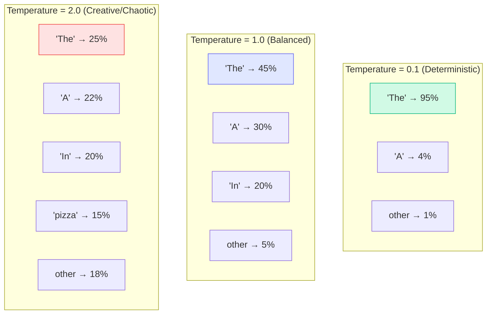
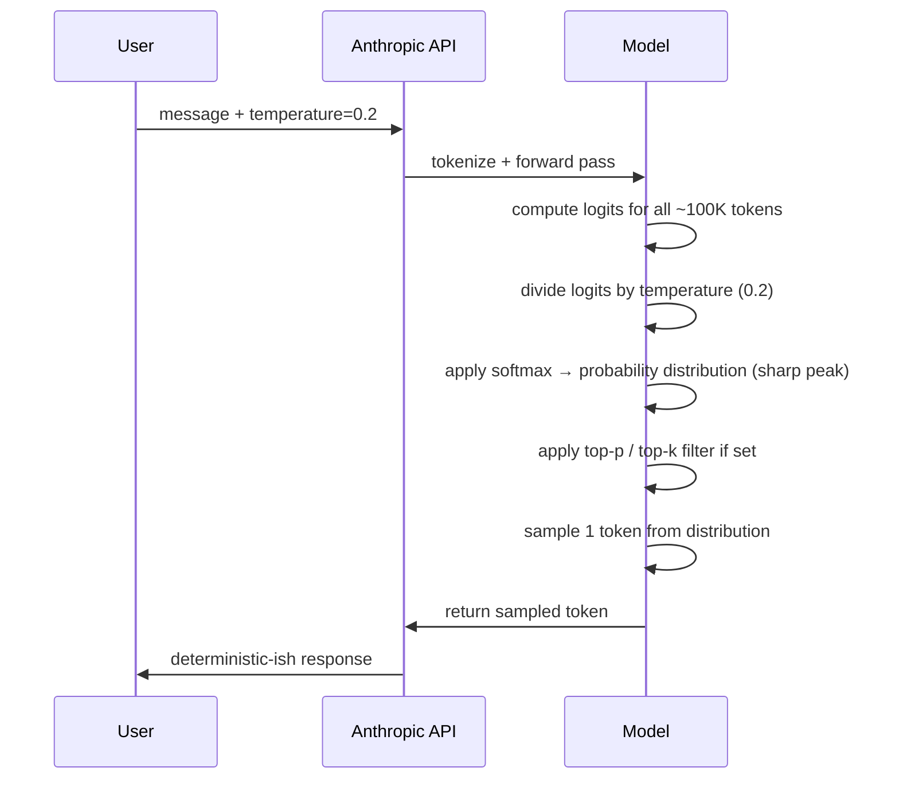

# Concepts: Temperature & Sampling

## The Problem

You want your code generator to produce the exact same output every time — predictable, deterministic, safe. But you want your brainstorming assistant to surprise you with fresh ideas on every run. These are opposite goals, and the **same model** needs to serve both.

How do you control this?

---

## The Intuition

<div className="concept-intuition">

**Temperature is a randomness dial.**

- **Temperature = 0.0** — always pick the single most likely next token. Completely deterministic. The same prompt always produces the same output.
- **Temperature = 1.0** — sample proportionally from the probability distribution. Natural variation, similar to how the model was trained.
- **Temperature = 2.0** — flatten the distribution aggressively. Even unlikely tokens get a real shot. Outputs become wild and often incoherent.

Think of it like a volume knob for chaos.

</div>

---

## How It Works

### Step 1: The Model Outputs Logits

For every token position, the model outputs a **logit** (a raw score) for each of its ~100,000 vocabulary tokens. Higher logit = the model thinks this token is more likely.

```
Token: "The"   → logit: 8.2
Token: "A"     → logit: 7.1
Token: "In"    → logit: 6.4
Token: "pizza" → logit: 1.3
Token: "xkz"   → logit: -4.1
...
```

### Step 2: Temperature Scales the Logits

Before converting logits to probabilities, each logit is **divided by the temperature**:

```
adjusted_logit = logit / temperature
```

- **Low temperature (e.g. 0.1)** → logits become very large → after softmax, the top token gets a probability close to 1.0 (sharp peak)
- **High temperature (e.g. 2.0)** → logits shrink → after softmax, probability spreads across many tokens (flat distribution)

### Step 3: Softmax Converts to Probabilities

```python
import math

def softmax(logits):
    exp_logits = [math.exp(l) for l in logits]
    total = sum(exp_logits)
    return [e / total for e in exp_logits]
```

### Step 4: Sample from the Distribution

One token is sampled from this probability distribution. This is the next token in the output.

---

## Visualizing Temperature Effects



---

## top-p: Nucleus Sampling

**top-p** (also called nucleus sampling) limits sampling to the smallest set of tokens whose cumulative probability reaches `p`.

```
tokens sorted by probability:
"The"  → 45%   cumulative: 45%
"A"    → 30%   cumulative: 75%
"In"   → 20%   cumulative: 95%  ← stop here if top-p=0.95
"pizza"→  4%   cumulative: 99%
...
```

With `top-p=0.9`, you'd only sample from the first 2–3 tokens that together cover 90% of probability mass. The long tail of rare tokens is excluded.

**Why it's useful:** top-p adapts dynamically to the context. When the model is very confident, few tokens are included. When uncertain, more tokens enter the nucleus.

---

## top-k: Fixed Token Sampling

**top-k** samples only from the top `k` most likely tokens, regardless of their probabilities.

```
top-k=5: only consider the 5 highest-probability tokens
```

**Difference from top-p:** top-k is a fixed window. If top 5 tokens cover 99% of probability, you still sample from all 5. If top 5 tokens cover only 20%, you might still miss good candidates.

---

## Sampling Flow Diagram



---

## Key Terms

| Term | Meaning |
|------|---------|
| **Temperature** | Scalar divides logits before softmax; controls distribution sharpness |
| **Logits** | Raw unnormalized scores output by the model for each token |
| **Softmax** | Converts logits into a probability distribution (sums to 1.0) |
| **Nucleus sampling (top-p)** | Sample only from tokens whose cumulative prob ≥ p |
| **top-k** | Sample only from the k most probable tokens |
| **Greedy decoding** | Always pick the most probable token (equivalent to temperature=0) |

---

## The Interview Angle

<div className="interview-angle">

**"When would you set temperature to 0?"**

When you need deterministic, structured output: classification labels, JSON extraction, SQL generation, tool-calling, or any task where there is a single correct answer. Temperature=0 means greedy decoding — the model always picks the most probable token.

**"When would you raise temperature above 1.0?"**

For creative tasks where diversity is valuable: brainstorming taglines, generating story variations, A/B test copy, or exploring a wider range of ideas. Keep in mind that above ~1.5, coherence degrades quickly.

**"What's the difference between temperature and top-p?"**

Temperature reshapes the entire probability distribution. top-p truncates the tail of the distribution after reshaping. They're often used together: temperature controls how "flat" the distribution is, top-p controls the minimum coverage you sample from.

</div>

---

## Common Mistakes

<div className="antipattern">

**Using high temperature for JSON extraction**
Setting temperature=1.0+ when extracting structured data almost guarantees malformed JSON at some point. The model may invent keys, skip brackets, or hallucinate values. Always use temperature=0.0 for structured output tasks.

**Using temperature=0 for everything**
Deterministic outputs sound safe, but they produce repetitive, monotonous text. Users notice. Creative and conversational tasks need some variation to feel natural.

**Confusing temperature with max_tokens**
Temperature controls the *distribution* of possible outputs. `max_tokens` controls the *length*. These are completely independent. A temperature=0 run can still produce a long response; a temperature=2.0 run can still be short.

</div>

---

## Further Reading

- [Anthropic model API parameters](https://docs.anthropic.com/en/api/messages) — official docs on `temperature`, `top_p`, `top_k`
- [OpenAI sampling documentation](https://platform.openai.com/docs/api-reference/chat/create#chat-create-temperature) — covers temperature, top-p, and frequency/presence penalties
- [The Illustrated GPT-2](https://jalammar.github.io/illustrated-gpt2/) — visual walkthrough of how next-token generation works
