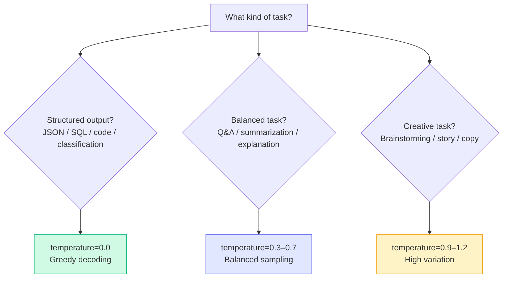

# Patterns: Temperature Configuration

## Choosing the Right Temperature



---

## Pattern 1: Zero-Temperature for Deterministic Tasks

Use `temperature=0` whenever the task has a single correct answer or requires consistent, reproducible output.

**Use cases:** JSON extraction, classification, SQL generation, code generation, structured data parsing.

```python
import anthropic

client = anthropic.Anthropic()

def classify_sentiment(text: str) -> str:
    """Classify text as POSITIVE, NEGATIVE, or NEUTRAL — deterministically."""
    response = client.messages.create(
        model="claude-haiku-4-5-20251001",
        max_tokens=10,
        temperature=0,  # Always pick the most likely token
        messages=[
            {
                "role": "user",
                "content": f"Classify this text as POSITIVE, NEGATIVE, or NEUTRAL. Reply with only the label.\n\nText: {text}"
            }
        ]
    )
    return response.content[0].text.strip()

def extract_json_fields(invoice_text: str) -> dict:
    """Extract structured fields from an invoice."""
    response = client.messages.create(
        model="claude-haiku-4-5-20251001",
        max_tokens=500,
        temperature=0,  # Malformed JSON risk increases sharply above 0
        messages=[
            {
                "role": "user",
                "content": f"""Extract the following fields from this invoice as JSON:
- vendor_name
- invoice_number
- total_amount
- due_date

Invoice:
{invoice_text}

Return only valid JSON, no explanation."""
            }
        ]
    )
    return response.content[0].text
```

---

## Pattern 2: Medium Temperature for Balanced Tasks

Use `temperature=0.3–0.7` for tasks where you want coherent, useful answers but benefit from slight variation between runs.

**Use cases:** Q&A, document summarization, explanation generation, customer support responses.

```python
def answer_question(question: str, context: str) -> str:
    """Answer a question with slight natural variation between runs."""
    response = client.messages.create(
        model="claude-haiku-4-5-20251001",
        max_tokens=300,
        temperature=0.5,  # Balanced: coherent but not robotic
        messages=[
            {
                "role": "user",
                "content": f"Context:\n{context}\n\nQuestion: {question}"
            }
        ]
    )
    return response.content[0].text

def summarize_document(document: str) -> str:
    """Summarize a document — slight variation acceptable."""
    response = client.messages.create(
        model="claude-haiku-4-5-20251001",
        max_tokens=200,
        temperature=0.3,  # Low-medium: factual summaries shouldn't vary much
        messages=[
            {
                "role": "user",
                "content": f"Summarize this document in 3 bullet points:\n\n{document}"
            }
        ]
    )
    return response.content[0].text
```

---

## Pattern 3: High Temperature for Creative Tasks

Use `temperature=0.9–1.2` when diversity and surprise are desirable. Stay below 1.5 to maintain coherence.

**Use cases:** Brainstorming, tagline generation, story writing, generating multiple creative options.

```python
def brainstorm_ideas(topic: str, n_ideas: int = 5) -> str:
    """Generate creative, varied brainstorming ideas."""
    response = client.messages.create(
        model="claude-haiku-4-5-20251001",
        max_tokens=400,
        temperature=1.0,  # High variation: we want diverse ideas
        messages=[
            {
                "role": "user",
                "content": f"Brainstorm {n_ideas} creative and distinct ideas for: {topic}\n\nBe inventive. Don't play it safe."
            }
        ]
    )
    return response.content[0].text

def write_story_opening(premise: str) -> str:
    """Generate a creative story opening."""
    response = client.messages.create(
        model="claude-haiku-4-5-20251001",
        max_tokens=250,
        temperature=1.1,  # Slightly above 1.0 for extra creativity
        top_p=0.95,       # Still constrain the very long tail
        messages=[
            {
                "role": "user",
                "content": f"Write a compelling opening paragraph for a story about: {premise}"
            }
        ]
    )
    return response.content[0].text
```

---

## Pattern 4: Sampling Multiple Outputs

Generate `N` responses at different temperatures and select the best one. Useful when you want diversity but still need quality control.

```python
def sample_multiple_responses(
    prompt: str,
    temperatures: list[float] = [0.5, 0.8, 1.0, 1.2],
) -> list[dict]:
    """
    Generate one response per temperature setting.
    Returns a list of dicts with 'temperature' and 'response' keys.
    """
    results = []
    for temp in temperatures:
        response = client.messages.create(
            model="claude-haiku-4-5-20251001",
            max_tokens=200,
            temperature=temp,
            messages=[{"role": "user", "content": prompt}]
        )
        results.append({
            "temperature": temp,
            "response": response.content[0].text
        })
    return results

# Example: generate 4 product taglines and let a human pick the best
taglines = sample_multiple_responses(
    prompt="Write a one-sentence tagline for a productivity app for developers.",
    temperatures=[0.5, 0.8, 1.0, 1.2]
)

for item in taglines:
    print(f"[temp={item['temperature']}] {item['response']}\n")
```

---

## Anti-Patterns

<div className="antipattern">

**Using high temperature for structured output (JSON/CSV)**
At temperature=1.0+, the model frequently produces malformed JSON: missing brackets, invented keys, or invalid escape sequences. Always use `temperature=0` for any task where the output format must be machine-parseable.

```python
# WRONG — will produce malformed JSON unpredictably
response = client.messages.create(
    temperature=1.0,  # ← dangerous for structured output
    messages=[{"role": "user", "content": "Extract as JSON: ..."}]
)

# RIGHT
response = client.messages.create(
    temperature=0,   # ← deterministic JSON output
    messages=[{"role": "user", "content": "Extract as JSON: ..."}]
)
```

**Using temperature=0 for everything**
Temperature=0 produces the statistically most likely output — which is often generic, repetitive, and boring. Conversational assistants, creative tools, and any task benefiting from variety should use higher temperatures.

**Setting temperature > 2.0**
Most APIs cap temperature at 2.0. Above 1.5, outputs become noticeably incoherent — the distribution is so flat that tokens are chosen nearly at random. There is no practical use case for temperature > 1.5 in production systems.

**Ignoring top-p alongside temperature**
Temperature and top-p interact. For creative tasks, pairing `temperature=1.0` with `top_p=0.95` is safer than temperature alone — it keeps diversity while preventing the truly garbage tail tokens from appearing.

</div>
