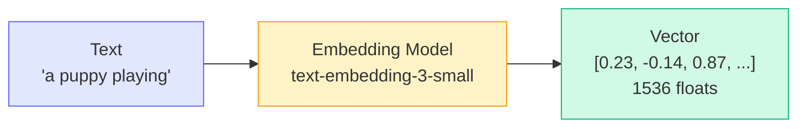
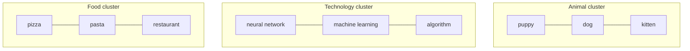

# Concepts: Embeddings

## The Problem

Search for "puppy" and you won't find documents that only mention "dog" — even though they mean the same thing. Keyword search compares strings, not meanings. If the letters don't match, you get nothing.

Embeddings fix this. Instead of comparing characters, you compare meaning.

---

## The Intuition

<div className="concept-intuition">

Every sentence can be expressed as a point in a high-dimensional space. Sentences with similar meanings land near each other. Sentences with opposite meanings land far apart.

The famous example: **"King" − "Man" + "Woman" ≈ "Queen"**

This works because the embedding model has learned that `king` and `queen` are related in the same way `man` and `woman` are — and that relationship is captured as a consistent direction in the vector space.

You don't program this in. The model learns it from billions of text examples.

</div>

---

## How It Works

1. An embedding model reads your text and outputs a **vector** — a list of floating-point numbers. For `text-embedding-3-small`, that's 1536 numbers.
2. Each number represents how strongly the text activates a learned feature (you can't interpret individual dimensions — think of it as a fingerprint).
3. To compare two pieces of text, compute **cosine similarity**: the cosine of the angle between their vectors.

```
cos(θ) = (A · B) / (|A| × |B|)
```

Where `A · B` is the dot product and `|A|`, `|B|` are the magnitudes.

| Score | Meaning |
|-------|---------|
| **1.0** | Identical meaning |
| **0.7–0.9** | Very similar |
| **0.3–0.6** | Loosely related |
| **0.0** | Unrelated |
| **-1.0** | Opposite meaning |

---

## The Pipeline



---

## Embedding Space

Similar topics cluster together in the high-dimensional space:



"puppy" and "dog" are close together. "puppy" and "pizza" are far apart. This geometry is what semantic search exploits.

---

## OpenAI Embedding Models

| Model | Dimensions | Speed | Use Case |
|-------|-----------|-------|----------|
| `text-embedding-3-small` | 1536 | Fast | General use, cost-efficient |
| `text-embedding-3-large` | 3072 | Slower | Higher accuracy tasks |

For most applications, `text-embedding-3-small` is the right choice — it's fast, cheap, and remarkably accurate.

---

## Key Terms

| Term | Meaning |
|------|---------|
| **Embedding** | A vector representation of text that captures meaning |
| **Vector** | An ordered list of floating-point numbers |
| **Cosine similarity** | A measure of the angle between two vectors (1.0 = identical, 0 = orthogonal) |
| **Semantic similarity** | How close two pieces of text are in meaning |
| **Embedding model** | A model that converts text → vector (distinct from a generative LLM) |
| **Dimensions** | The length of the vector; higher = more expressive (at a compute cost) |

---

## The Interview Angle

<div className="interview-angle">

**"How do you find the most semantically similar document from a large corpus?"**

1. Pre-embed all documents and store the vectors (do this once)
2. When a query arrives, embed the query
3. Compute cosine similarity between the query vector and each document vector
4. Return the top-k documents by similarity score

This is O(n) per query for a brute-force scan. For large corpora, you'd use an approximate nearest-neighbour index (e.g. FAISS, Pinecone, pgvector) to make it sub-linear.

</div>

---

## Common Mistakes

<div className="antipattern">

**Comparing embeddings from different models**
Each model produces vectors in its own coordinate system. Cosine similarity between a `text-embedding-3-small` vector and a `text-embedding-3-large` vector is meaningless. Always use the same model throughout a project.

**Not normalising vectors before cosine similarity**
If you use dot product instead of cosine similarity, longer documents score higher just because their vectors have larger magnitudes — not because they're more relevant. Normalise first, or use cosine similarity directly.

**Using embeddings for exact keyword matching**
If users are searching for exact product codes, SKUs, or names, use BM25 or a simple string search. Embeddings are designed for semantic matching — they're the wrong tool for exact-match problems.

</div>

---

## Further Reading

- [OpenAI Embeddings Guide](https://platform.openai.com/docs/guides/embeddings) — official documentation with best practices
- [The Illustrated Word2Vec](https://jalammar.github.io/illustrated-word2vec/) by Jay Alammar — the best visual explanation of how word embeddings work
