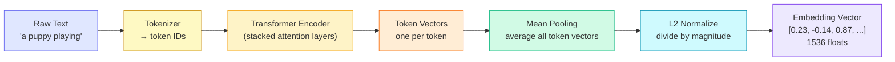
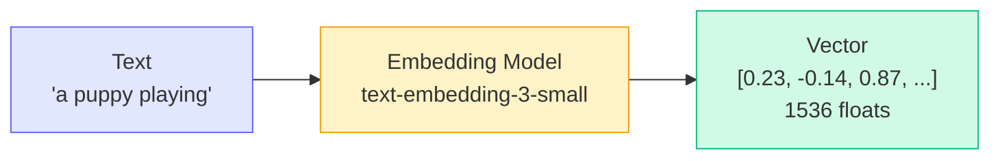
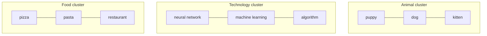

# Concepts: Embeddings

## The Problem

Search for "puppy" and you won't find documents that only mention "dog" — even though they mean the same thing. Keyword search compares strings, not meanings. If the letters don't match, you get nothing.

Embeddings fix this. Instead of comparing characters, you compare meaning.

---

## The Intuition

<div className="concept-intuition">

Every sentence can be expressed as a point in a high-dimensional space. Sentences with similar meanings land near each other. Sentences with opposite meanings land far apart.

The famous example: **"King" − "Man" + "Woman" ≈ "Queen"**

This works because the embedding model has learned that `king` and `queen` are related in the same way `man` and `woman` are — and that relationship is captured as a consistent direction in the vector space.

You don't program this in. The model learns it from billions of text examples.

</div>

---

## How Embeddings Are Created

You don't need to understand the math to use embeddings effectively — but knowing what's happening under the hood helps you make better decisions about models, dimensions, and tradeoffs.

Here is the pipeline that turns raw text into a vector:



**Step by step in plain terms:**

1. **Tokenize** — The text is split into tokens (roughly words or word-pieces). "Playing" might become two tokens: "play" and "ing". Each token is mapped to an integer ID.

2. **Transformer encoder layers** — Each token passes through many layers of self-attention. Attention lets every token look at every other token and update its meaning based on context. "Bank" near "river" and "bank" near "money" end up with different internal representations, even though the word is the same.

3. **Mean pooling** — The encoder outputs one vector per token. To get a single vector for the whole sentence, you average them all together (mean pool). This is the simplest and most common strategy.

4. **L2 normalize** — Divide the vector by its own magnitude (length) so that it lands on the surface of a unit sphere. After normalization, every vector has a magnitude of exactly 1. This is what makes cosine similarity equivalent to a simple dot product — and it's why scores reliably fall between −1 and 1.

The final output is a dense vector of fixed length (e.g. 1536 floats). That's your embedding.

---

## How It Works

1. An embedding model reads your text and outputs a **vector** — a list of floating-point numbers. For `text-embedding-3-small`, that's 1536 numbers.
2. Each number represents how strongly the text activates a learned feature (you can't interpret individual dimensions — think of it as a fingerprint).
3. To compare two pieces of text, compute **cosine similarity**: the cosine of the angle between their vectors.

```
cos(θ) = (A · B) / (|A| × |B|)
```

Where `A · B` is the dot product and `|A|`, `|B|` are the magnitudes.

| Score | Meaning |
|-------|---------|
| **1.0** | Identical meaning |
| **0.7–0.9** | Very similar |
| **0.3–0.6** | Loosely related |
| **0.0** | Unrelated |
| **-1.0** | Opposite meaning |

---

## Why Cosine Similarity?

You might wonder: why not just use plain Euclidean distance (the straight-line distance between two points)? The answer comes down to **direction vs. magnitude**.

**The core insight:** after L2 normalization, two vectors with identical meaning point in exactly the same direction — regardless of how "long" the original vectors were. Cosine similarity measures the angle between vectors, which captures direction. Euclidean distance measures how far apart the tips of the vectors are, which also depends on magnitude.

**A concrete 2D example:**

Imagine two documents about dogs:
- Document A (short): vector roughly `[2, 1]`
- Document B (long, same topic): vector roughly `[6, 3]`

Both vectors point in the same direction — Document B is just scaled up because it has more words. Euclidean distance says they are far apart (distance ≈ 4.5). Cosine similarity says they are identical (score = 1.0), because the angle between them is zero.

```
         ↑ dimension 2
         |
    B [6,3] •——————
         |   ↗
    A [2,1] •——
         |↗
         +————————→ dimension 1
```

Both arrows point in the same direction. The angle between them is 0°. cos(0°) = 1.0 — perfect similarity.

**The practical rule:** use cosine similarity (or dot product on normalized vectors) for embedding comparisons. Euclidean distance is the wrong tool here because it conflates length with meaning.

---

## The Pipeline



---

## Embedding Space

Similar topics cluster together in the high-dimensional space:



"puppy" and "dog" are close together. "puppy" and "pizza" are far apart. This geometry is what semantic search exploits.

---

## Practical: Choosing an Embedding Model

Not all embedding models are equal. Here is a quick comparison of the most common OpenAI options:

| Model | Dimensions | Cost per 1M tokens | Best for |
|-------|------------|--------------------|---------|
| `text-embedding-3-small` | 1536 | $0.02 | Most use cases |
| `text-embedding-3-large` | 3072 | $0.13 | Higher accuracy needed |
| `text-embedding-ada-002` | 1536 | $0.10 | Legacy, avoid for new projects |

**How to choose:**

- **Start with `text-embedding-3-small`** for nearly everything. It is 5× cheaper than `ada-002`, faster, and more accurate on benchmarks.
- **Upgrade to `text-embedding-3-large`** only when you measure a meaningful accuracy gap on your specific retrieval task. The higher dimension gives the model more room to encode nuance, but also costs 6.5× more.
- **Avoid `text-embedding-ada-002`** for new projects. It is an older model, costs more than `3-small`, and performs worse. You will encounter it in legacy codebases — migrate when you can.

> **Tip:** Dimension count is not the only signal of quality. A well-trained smaller model often beats a larger model from an earlier generation. Always evaluate on your own data.

---

## From Embeddings to Semantic Search

Here is a minimal, working end-to-end example that shows the full loop: embed documents, embed a query, rank by cosine similarity, return the best match.

```python
import openai
import numpy as np

def embed(text, client):
    return client.embeddings.create(model="text-embedding-3-small", input=text).data[0].embedding

def cosine_sim(a, b):
    a, b = np.array(a), np.array(b)
    return np.dot(a, b) / (np.linalg.norm(a) * np.linalg.norm(b))

client = openai.OpenAI()
docs = ["Cats are mammals.", "Python is a programming language.", "Dogs are loyal pets."]
doc_embeddings = [embed(d, client) for d in docs]

query = "What pets make good companions?"
q_emb = embed(query, client)
scores = [(docs[i], cosine_sim(q_emb, doc_embeddings[i])) for i in range(len(docs))]
scores.sort(key=lambda x: x[1], reverse=True)
print(scores[0])  # ('Dogs are loyal pets.', 0.87...)
```

**What this code does, step by step:**

1. `embed()` calls the OpenAI API and returns the raw list of floats for a piece of text.
2. `cosine_sim()` computes the cosine similarity between two vectors using NumPy.
3. All three documents are embedded up front (do this once and cache the results).
4. The query is embedded at request time.
5. Similarity scores are computed against every document and sorted descending.
6. The top result — "Dogs are loyal pets." — wins because it is semantically closest to the question about pet companions.

This is the foundation of every RAG pipeline, semantic search engine, and recommendation system that uses embeddings. The only thing that changes at scale is the retrieval step: instead of a brute-force loop, you use a vector index (FAISS, pgvector, Pinecone) to find the top-k matches in sub-linear time.

---

## OpenAI Embedding Models

| Model | Dimensions | Speed | Use Case |
|-------|-----------|-------|----------|
| `text-embedding-3-small` | 1536 | Fast | General use, cost-efficient |
| `text-embedding-3-large` | 3072 | Slower | Higher accuracy tasks |

For most applications, `text-embedding-3-small` is the right choice — it's fast, cheap, and remarkably accurate.

---

## Key Terms

| Term | Meaning |
|------|---------|
| **Embedding** | A vector representation of text that captures meaning |
| **Vector** | An ordered list of floating-point numbers |
| **Cosine similarity** | A measure of the angle between two vectors (1.0 = identical, 0 = orthogonal) |
| **Semantic similarity** | How close two pieces of text are in meaning |
| **Embedding model** | A model that converts text → vector (distinct from a generative LLM) |
| **Dimensions** | The length of the vector; higher = more expressive (at a compute cost) |

---

## The Interview Angle

<div className="interview-angle">

**"How do you find the most semantically similar document from a large corpus?"**

1. Pre-embed all documents and store the vectors (do this once)
2. When a query arrives, embed the query
3. Compute cosine similarity between the query vector and each document vector
4. Return the top-k documents by similarity score

This is O(n) per query for a brute-force scan. For large corpora, you'd use an approximate nearest-neighbour index (e.g. FAISS, Pinecone, pgvector) to make it sub-linear.

</div>

---

## Common Mistakes

<div className="antipattern">

**Comparing embeddings from different models**
Each model produces vectors in its own coordinate system. Cosine similarity between a `text-embedding-3-small` vector and a `text-embedding-3-large` vector is meaningless. Always use the same model throughout a project.

**Not normalising vectors before cosine similarity**
If you use dot product instead of cosine similarity, longer documents score higher just because their vectors have larger magnitudes — not because they're more relevant. Normalise first, or use cosine similarity directly.

**Using embeddings for exact keyword matching**
If users are searching for exact product codes, SKUs, or names, use BM25 or a simple string search. Embeddings are designed for semantic matching — they're the wrong tool for exact-match problems.

</div>

---

## Further Reading

- [OpenAI Embeddings Guide](https://platform.openai.com/docs/guides/embeddings) — official documentation with best practices
- [The Illustrated Word2Vec](https://jalammar.github.io/illustrated-word2vec/) by Jay Alammar — the best visual explanation of how word embeddings work
