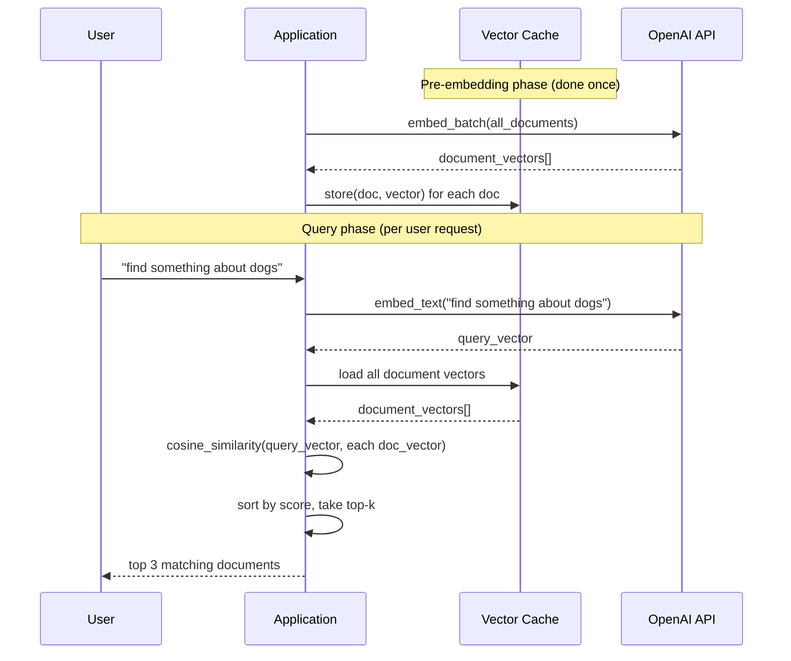

# Patterns: Working with Embeddings

## Pattern 1: Semantic Search

Embed a query, compare to a pre-embedded corpus, return the top-k most similar results.

```python
import math
from utils import get_openai_client

EMBEDDING_MODEL = "text-embedding-3-small"

def embed_text(text: str) -> list[float]:
    client = get_openai_client()
    response = client.embeddings.create(model=EMBEDDING_MODEL, input=text)
    return response.data[0].embedding

def cosine_similarity(v1: list[float], v2: list[float]) -> float:
    dot = sum(a * b for a, b in zip(v1, v2))
    mag1 = math.sqrt(sum(a ** 2 for a in v1))
    mag2 = math.sqrt(sum(b ** 2 for b in v2))
    return dot / (mag1 * mag2)

def semantic_search(query: str, corpus: list[str], top_k: int = 3) -> list[tuple[str, float]]:
    """Return the top_k most semantically similar strings from corpus."""
    query_vec = embed_text(query)
    scored = [
        (doc, cosine_similarity(query_vec, embed_text(doc)))
        for doc in corpus
    ]
    scored.sort(key=lambda x: x[1], reverse=True)
    return scored[:top_k]
```

**When to use:** FAQ search, document retrieval, product matching, anything where meaning matters more than exact wording.

---

## Pattern 2: Clustering Similar Documents

Embed all documents and use the cosine similarity matrix to identify groups of related content.

```python
import math

def similarity_matrix(texts: list[str]) -> list[list[float]]:
    """Compute an N×N cosine similarity matrix for a list of texts."""
    vectors = [embed_text(t) for t in texts]
    n = len(vectors)
    matrix = [[0.0] * n for _ in range(n)]
    for i in range(n):
        for j in range(n):
            matrix[i][j] = cosine_similarity(vectors[i], vectors[j])
    return matrix
```

For visualisation, reduce the vectors to 2D using **UMAP** or **PCA** and plot them — similar documents will form visible clusters. Libraries: `umap-learn`, `scikit-learn`.

---

## Pattern 3: Caching Embeddings

Embedding API calls cost money and take time. If you embed the same text twice, you're wasting both. Cache aggressively.

```python
import pickle
from pathlib import Path

CACHE_FILE = Path("embedding_cache.pkl")

def load_cache() -> dict[str, list[float]]:
    if CACHE_FILE.exists():
        with open(CACHE_FILE, "rb") as f:
            return pickle.load(f)
    return {}

def save_cache(cache: dict[str, list[float]]) -> None:
    with open(CACHE_FILE, "wb") as f:
        pickle.dump(cache, f)

def embed_with_cache(text: str) -> list[float]:
    cache = load_cache()
    if text in cache:
        return cache[text]
    vector = embed_text(text)
    cache[text] = vector
    save_cache(cache)
    return vector
```

**Production note:** For larger corpora, use a vector database (Pinecone, Weaviate, pgvector) instead of a pickle file. But pickle is fine for development and small datasets.

---

## Pattern 4: Batch Embedding

The OpenAI embeddings API accepts a list of strings. Send multiple texts in one call instead of one at a time — much faster.

```python
def embed_batch(texts: list[str]) -> list[list[float]]:
    """Embed multiple texts in a single API call."""
    client = get_openai_client()
    response = client.embeddings.create(
        model=EMBEDDING_MODEL,
        input=texts  # pass a list, not a single string
    )
    # response.data is a list, ordered the same as input
    return [item.embedding for item in response.data]
```

**Performance difference:** Embedding 100 texts one at a time takes ~100 HTTP round trips. Batching them takes 1. Use batching whenever you're embedding more than a handful of strings.

---

## Anti-Patterns

<div className="antipattern">

**Re-embedding the same texts on every request**
If your product catalogue has 10,000 items, embedding all of them on every user search is catastrophically slow and expensive. Pre-embed once, cache the vectors, embed only the incoming query at runtime.

**Embedding very long texts without chunking**
Embedding models have context window limits (typically 8,192 tokens for `text-embedding-3-small`). A 50-page document sent as a single string will either be truncated or error. Chunk long documents into paragraphs or fixed-size windows before embedding.

**Mixing embedding models for comparison**
If you embedded your corpus with `text-embedding-3-small` and then switch to `text-embedding-3-large`, all your stored vectors are in a different coordinate space. Cosine similarity scores will be wrong. Pick one model and stick with it — or re-embed everything when you switch.

</div>

---

## The Semantic Search Pipeline


