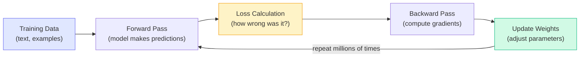
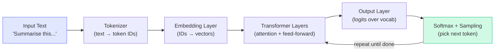

# Concepts: Inference vs Training

## The Problem This Solves

"Should I fine-tune the model or just use prompts?"

This is one of the most common questions in applied AI. The answer depends entirely on understanding the difference between training and inference — what each does, what each costs, and what each is designed for.

---

## The Intuition

**Think of training as teaching a student, and inference as asking that student a question.**

Training a student takes weeks of study, textbooks, and effort — it's expensive and slow, but at the end they have genuinely learned something. The knowledge is baked in.

Asking the student a question takes seconds and is nearly free. But you're working with whatever knowledge they already have.

Fine-tuning is like sending a student back to school for a specialist course. It's worth it when the base knowledge isn't enough — but if the student already knows the subject and just needs good questions, skip the course.

---

## How It Works — Step by Step

### 1. Training: Forward Pass + Backward Pass + Weight Update

Training is how a model learns. It requires massive compute, datasets, and time. The core loop:

**What each step does:**

- **Forward pass**: Input tokens flow through the transformer layers and produce a prediction.
- **Loss**: The difference between the model's prediction and the correct answer is measured (e.g., cross-entropy loss).
- **Backward pass**: Gradients are computed — how should each weight change to reduce the loss? This is the expensive part.
- **Weight update**: Weights are nudged in the direction that reduces the loss (gradient descent).

**Key facts about training:**
- Requires GPU clusters (hundreds to thousands of GPUs)
- Pre-training takes days to weeks and costs millions of dollars
- Fine-tuning is cheaper but still requires 1000+ examples and GPU time
- **Changes model weights permanently**

### 2. Inference: Forward Pass Only

Inference is what happens when you call the API. The model's weights are fixed — no learning occurs.

**What each step does:**

- **Tokenize**: Text is split into tokens and converted to integer IDs.
- **Embed**: Token IDs become dense vectors.
- **Transformer layers**: Attention lets tokens attend to each other; feed-forward layers transform each token's representation.
- **Softmax**: Logits are converted to probabilities over the entire vocabulary.
- **Sample**: The next token is picked based on the probability distribution (controlled by temperature).

**Key facts about inference:**
- Only the forward pass runs — no gradient computation
- Milliseconds per token on modern hardware
- Scales horizontally — many requests can be served in parallel
- **Weights are unchanged** — the model doesn't learn from your inputs

---

## Training vs Inference: Side-by-Side

| Dimension | Training | Inference |
|-----------|----------|-----------|
| **Passes** | Forward + backward | Forward only |
| **Cost** | Very high (GPU clusters) | Low (per-token pricing) |
| **Speed** | Hours to weeks | Milliseconds to seconds |
| **Purpose** | Teach the model | Use the model |
| **Changes weights?** | Yes | No |
| **Who does it?** | AI companies (pre-training) / you (fine-tuning) | You (every API call) |
| **Data required** | Billions of tokens (pre-training) / 1000+ examples (fine-tuning) | Just the prompt |

---

## When to Use Inference (API Call)

Use the inference API — with good prompt engineering — when:

- You're **prototyping**: you don't know if the approach works yet
- The **base model is already capable** enough with a well-crafted prompt
- Your task **changes frequently**: prompts are easy to update, fine-tuned weights aren't
- You need **flexibility**: different users, different formats, different tones
- You have **fewer than ~1000 examples**: not enough data to fine-tune reliably

**Rule of thumb**: exhaust prompt engineering before considering fine-tuning.

---

## When to Fine-Tune

Fine-tuning is worth it when:

- You need a **specific output format consistently** (e.g., always respond in JSON with a fixed schema) and prompt engineering is failing
- The **base model frequently fails your task** — even with good prompts
- You have **1000+ high-quality labelled examples** of input/output pairs
- You need to **reduce latency or cost** at high volume (fine-tuned smaller models can outperform larger base models on specific tasks)
- The task requires **specialized domain knowledge** not well represented in the base model's training

---

## Key Terms

| Term | What It Means |
|------|---------------|
| **Training** | The process of updating model weights using data and gradient descent |
| **Inference** | Running a model with fixed weights to produce outputs |
| **Forward pass** | Input flowing through the network to produce a prediction |
| **Backward pass** | Computing gradients by flowing error backwards through the network |
| **Gradient** | The direction and magnitude each weight should change to reduce loss |
| **Fine-tuning** | Continuing training a pre-trained model on a smaller, task-specific dataset |
| **Pre-training** | The initial large-scale training on broad internet data |
| **Weights / Parameters** | The billions of numbers that make up the model — adjusted during training, fixed during inference |

---

## The Interview Angle

**"When would you fine-tune vs use prompt engineering?"**

Strong answer: *"I always start with prompt engineering. It's faster, cheaper, and more flexible. I'd only consider fine-tuning if: (1) I have 1000+ quality examples, (2) the base model is consistently failing despite good prompts, and (3) I need a specific consistent output format or style. Fine-tuning when prompting would work is premature optimization — it's slow, expensive, and makes iteration harder."*

Follow-up you might get: *"What's the difference between fine-tuning and RAG?"*

Answer: *"Fine-tuning changes the model's weights — it's good for style, format, and behavior. RAG keeps the model unchanged but injects relevant documents at inference time — it's good for knowledge and facts. They solve different problems. For knowledge, RAG is almost always cheaper and more maintainable."*

---

## Common Mistakes

**Fine-tuning when prompt engineering would work**
Fine-tuning takes time, requires data, costs money, and makes your model harder to update. Many teams jump to fine-tuning after a few prompt failures. Invest an afternoon in prompt engineering first — you'll often get 90% of the way there.

**Using the inference API for a task where fine-tuning is clearly needed**
If your model consistently hallucinates on a specialized domain (medical codes, legal citations, proprietary terminology), prompt engineering may not be enough. Evaluate honestly — if you have good data and the failure mode is consistent, fine-tuning is the right call.

**Confusing fine-tuning with RAG**
Fine-tuning teaches the model a style or behavior. RAG gives it knowledge. Don't fine-tune to memorize facts — models forget, update, and hallucinate even after fine-tuning. Use RAG for knowledge, fine-tuning for format/style.

---

## Further Reading

- [Andrej Karpathy — "Let's build GPT from scratch"](https://www.youtube.com/watch?v=kCc8FmEb1nY) — the best hands-on explanation of training
- [Anthropic Fine-tuning Docs](https://docs.anthropic.com/en/docs/build-with-claude/model-context-protocol) — official guidance on when and how to fine-tune
- [OpenAI Fine-tuning Guide](https://platform.openai.com/docs/guides/fine-tuning) — useful conceptual overview applicable across providers
