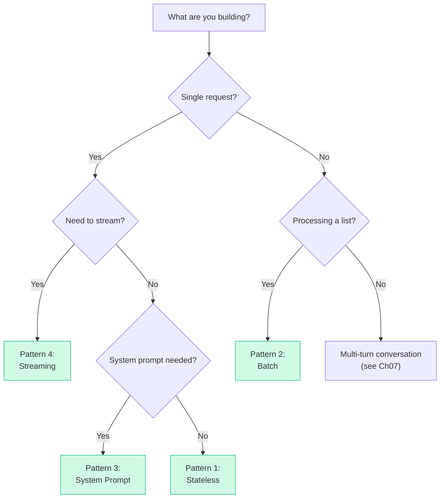

# Patterns: Inference API Usage

Every time you call Claude, you're running inference. These are the four core patterns that cover 95% of real-world usage.

---

## Pattern 1: Stateless Inference

The most common pattern. Each call is completely independent — no state is carried between calls. The model doesn't remember your previous requests.

```python
import anthropic

client = anthropic.Anthropic()

def ask(prompt: str) -> str:
    response = client.messages.create(
        model="claude-3-haiku-20240307",
        max_tokens=1024,
        messages=[{"role": "user", "content": prompt}]
    )
    return response.content[0].text

# Each call is independent
answer1 = ask("What is gradient descent?")
answer2 = ask("What is backpropagation?")  # has no memory of answer1
```

**When to use:** Single-shot tasks — classification, summarisation, extraction, Q&A over a provided document.

**Key insight:** Statelessness is a feature, not a bug. It means the model is predictable and parallelisable. You own the state — keep it in your application.

---

## Pattern 2: Batch Inference

Process many inputs efficiently by calling the model in a loop. Useful for processing datasets, transforming lists of documents, or running evaluations.

```python
import anthropic

client = anthropic.Anthropic()

def batch_classify(texts: list[str], label_options: str) -> list[str]:
    """Classify a list of texts using the same prompt template."""
    results = []
    for text in texts:
        response = client.messages.create(
            model="claude-3-haiku-20240307",
            max_tokens=64,
            messages=[{
                "role": "user",
                "content": f"Classify this text as {label_options}. Reply with only the label.\n\nText: {text}"
            }]
        )
        results.append(response.content[0].text.strip())
    return results

# Example usage
emails = [
    "My order hasn't arrived after 2 weeks",
    "Can I change my billing address?",
    "Your product is amazing, 10/10!"
]
labels = batch_classify(emails, "complaint, inquiry, or praise")
# → ["complaint", "inquiry", "praise"]
```

**When to use:** ETL pipelines, dataset labelling, bulk document processing, offline evaluations.

**Performance tip:** For high-volume batch jobs, use `asyncio` + `asyncio.gather()` or Anthropic's Batch API to process requests in parallel rather than sequentially.

---

## Pattern 3: Inference with System Prompt

Set model persona, output format, and constraints once in a system prompt. Every user message in the session inherits those instructions.

```python
import anthropic

client = anthropic.Anthropic()

SYSTEM_PROMPT = """You are a JSON extraction assistant.
Given any text, extract structured data and return ONLY valid JSON.
Never include explanations or markdown — just the raw JSON object."""

def extract_to_json(text: str, schema_hint: str) -> str:
    """Extract structured data from text as JSON."""
    response = client.messages.create(
        model="claude-3-haiku-20240307",
        max_tokens=1024,
        system=SYSTEM_PROMPT,
        messages=[{
            "role": "user",
            "content": f"Extract this data as JSON with fields: {schema_hint}\n\nText: {text}"
        }]
    )
    return response.content[0].text

# Usage
raw = "John Smith, age 34, joined Acme Corp on March 1 2023 as a Senior Engineer."
result = extract_to_json(raw, "name, age, company, start_date, job_title")
# → '{"name": "John Smith", "age": 34, "company": "Acme Corp", ...}'
```

**When to use:** Any production integration where you need consistent format, persona, or behaviour. Almost every real-world use case.

**System prompt tips:**
- Be specific about output format
- Include constraints ("never say X", "always respond in Y")
- Keep it focused — long, vague system prompts reduce reliability

---

## Pattern 4: Streaming Inference

Get tokens as they're generated instead of waiting for the full response. Essential for chat UIs and any case where perceived latency matters.

```python
import anthropic

client = anthropic.Anthropic()

def stream_response(prompt: str) -> str:
    """Stream tokens as they're generated; return the full text."""
    full_text = ""

    with client.messages.stream(
        model="claude-3-haiku-20240307",
        max_tokens=1024,
        messages=[{"role": "user", "content": prompt}]
    ) as stream:
        for text_chunk in stream.text_stream:
            print(text_chunk, end="", flush=True)  # print each token as it arrives
            full_text += text_chunk

    print()  # newline at the end
    return full_text

# Usage — user sees output immediately rather than waiting
result = stream_response("Explain the difference between training and inference in 3 bullet points.")
```

**When to use:** Chat interfaces, any generation task where the user is watching, long-form output where you want to show progress.

**How it works:** The model generates tokens sequentially. Without streaming, the API buffers all tokens and sends them at the end. With streaming, each token is sent as a server-sent event (SSE) as soon as it's generated.

---

## Anti-Patterns

<div className="antipattern">

**Treating inference like a database (it has no persistent state by default)**
The model has no memory between calls. If you call it twice, the second call doesn't know about the first. You must pass conversation history explicitly if you want continuity. Forgetting this leads to confusing bugs where the model seems to "forget" instructions.

**Fine-tuning before exhausting prompt engineering (premature optimization)**
Many teams hit an edge case with the base model and immediately reach for fine-tuning. Fine-tuning takes days to set up, requires labelled data, and makes iteration slow. Spend an afternoon on prompt engineering first — chain-of-thought, few-shot examples, output format instructions. You'll often solve the problem without fine-tuning at all.

**Sending identical prompts hundreds of times without caching**
If you're using the same large system prompt or document in every call, use prompt caching (supported by Anthropic and OpenAI). Repeated uncached input tokens are wasteful — caching can reduce costs by 80%+ on prompt-heavy workloads.

</div>

---

## Choosing the Right Pattern


