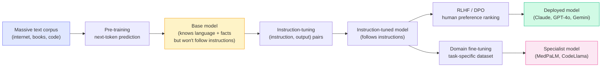
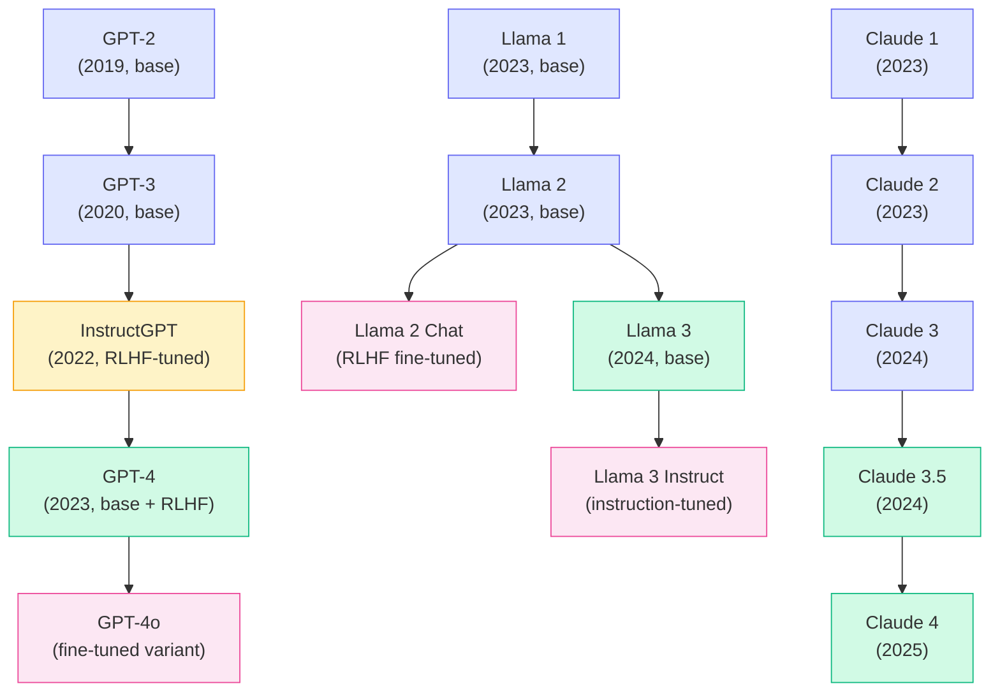

# Concepts: Foundation vs Fine-tuned Models

## The Problem

GPT-4 can write poetry, debug Python, and explain quantum physics — all adequately. But a model fine-tuned on ten thousand annotated medical billing records does medical coding far better than GPT-4 ever will. On the flip side, that specialist model is useless outside its narrow domain.

So which do you reach for — the generalist or the specialist?

---

## The Intuition

<div className="concept-intuition">

A **foundation model** is like a generalist doctor fresh out of medical school. They have read every textbook, understand all the systems, and can hold a reasonable conversation about any condition. Ask about anything and they will give you a sensible answer.

A **fine-tuned model** is like a specialist surgeon who has spent ten years doing only one procedure. Within that narrow domain they are faster, more precise, and make fewer mistakes than the generalist — but ask them about anything else and they are no more useful than anyone else.

The decision is not "which is better." It is "what does my task actually need?"

</div>

---

## How It Works

### 1. Foundation / Base Models

A base model is pre-trained on a massive corpus of internet text — books, code, Wikipedia, web pages. The training objective is simple: **predict the next token**.

After pre-training the model has absorbed an enormous amount of world knowledge, learned grammar, learned reasoning patterns, and learned code syntax. What it has **not** learned is how to follow instructions. Ask a raw base model "What is the capital of France?" and it will likely continue your text in a way that makes statistical sense — not answer your question helpfully.

Examples: `Llama 3` (base), `Mistral 7B` (base).

### 2. Instruction-Tuned Models

Instruction-tuning is a fine-tuning step applied on top of the base model using thousands to millions of `(instruction, ideal_output)` pairs. The model learns that when it sees a question it should answer it, when it sees a task it should complete it.

This is the step that converts a raw next-token predictor into something that behaves like an assistant.

**All the models you call through commercial APIs — Claude, GPT-4o, Gemini — are instruction-tuned.** You never interact with a raw base model through these APIs.

### 3. RLHF — Reinforcement Learning from Human Feedback

RLHF is an additional alignment step applied after instruction-tuning. Human annotators rank pairs of model outputs ("which of these responses is better?"). Those rankings train a **reward model** which predicts human preference scores. The base model is then fine-tuned using reinforcement learning to maximise those scores.

RLHF is why modern assistants are not just capable but also helpful, safe, and appropriately concise. It is the training step that bakes in values like "don't help with harmful requests" and "be honest about uncertainty."

A related technique, **DPO** (Direct Preference Optimisation), achieves similar results with a simpler training procedure and has become increasingly common.

### 4. Task-Specific Fine-Tuned Models

You can take any instruction-tuned model and fine-tune it further on a curated domain dataset. This trades breadth for depth:

- **Medical models** (MedPaLM, Med-PaLM 2): Fine-tuned on clinical notes, research papers, exam questions. Outperform GPT-4 on medical benchmarks.
- **Code models** (CodeLlama, StarCoder): Fine-tuned on code repositories. Faster and cheaper for code generation than large general models.
- **Legal models**: Fine-tuned on case law and contracts. More consistent output structure for legal documents.

The risk is **catastrophic forgetting**: if you fine-tune too aggressively on a narrow dataset, the model forgets general capabilities. A model over-tuned on medical billing codes may produce worse prose or reasoning than before.

### 5. Model Families at a Glance

| Stage | Examples | Behaviour |
|-------|----------|-----------|
| **Base / Foundation** | Llama 3 (base), Mistral 7B (base) | Next-token prediction, no instruction following |
| **Instruction-tuned** | Claude 3.5, GPT-4o, Gemini 1.5 Pro | Follows instructions, helpful assistant behaviour |
| **Domain-specific fine-tuned** | MedPaLM, CodeLlama, Legal-BERT | Deep expertise in one domain, reduced breadth |

---

## The Training Pipeline



---

## Foundation Model Family Tree

The major commercial and open-source model families share a common evolutionary structure: each generation builds on the last, and instruction-tuned or RLHF-aligned variants branch off from each base release.



**Key pattern:** Every deployed assistant model is a fine-tuned variant of a base model. The base model provides raw capability; instruction tuning and RLHF provide alignment and usability. Domain fine-tuning then narrows the model further toward a specific task.

---

## What RLHF Does to a Foundation Model

RLHF is the most misunderstood step in modern LLM training. Here is what actually happens at each stage.

### Stage 1 — Pre-training: raw capability

The model reads the internet. Trillions of tokens. The only signal is: "predict the next word correctly." After this stage, the model is extraordinarily capable — it has absorbed vast amounts of knowledge — but it is also unpredictable. Ask it a question and it might answer, might continue the question, or might generate a plausible-sounding paragraph that has nothing to do with what you asked.

### Stage 2 — SFT (Supervised Fine-Tuning): instruction following

Human contractors write thousands of example conversations: a prompt and an ideal response. The model is fine-tuned on these demonstrations. It learns that prompts should be followed and responses should be coherent and helpful. This is the step that turns a language model into a proto-assistant.

### Stage 3 — RLHF: alignment

Human annotators are now shown pairs of SFT model outputs and asked "which is better?" Those preference rankings train a separate **reward model** — a classifier that predicts which response a human would prefer. The SFT model is then optimised via reinforcement learning (PPO) to maximise the reward model's score.

The result: the model learns to be not just capable but **aligned** — it becomes more honest, appropriately declines harmful requests, gives more useful answers, and adjusts tone to context.

```mermaid
graph LR
  PT["Pre-training\non internet text\n(trillions of tokens)"]
  BM["Base model\nHigh capability\nLow controllability"]
  SFT["SFT\nHuman demonstrations\n(thousands of examples)"]
  SM["SFT model\nFollows instructions\nStill inconsistent values"]
  RM["Reward model training\nHuman preference pairs\n(A is better than B)"]
  RLHF["RLHF optimisation\nPPO against reward model"]
  AM["Aligned model\nHelpful, harmless, honest\n(Claude, GPT-4o, Gemini)"]

  PT --> BM --> SFT --> SM --> RM --> RLHF --> AM

  style PT fill:#e0e7ff,stroke:#6366f1
  style BM fill:#fef3c7,stroke:#f59e0b
  style SM fill:#fef3c7,stroke:#f59e0b
  style AM fill:#d1fae5,stroke:#10b981
```



**The key insight:** RLHF does not add new knowledge. The base capability — the knowledge of facts, code, language — comes from pre-training. RLHF reshapes *how* the model uses that capability: it learns which outputs humans consider good and steers toward them.

---

## Foundation vs. Fine-tuned — Decision Guide

Before reaching for fine-tuning, work through this flowchart. Most use cases do not need it.

```mermaid
flowchart TD
  Start([What does your task need?])

  Start --> Q1{Consistent style,\nformat, or persona?}
  Q1 -->|Yes| FT1["Fine-tune on\ncurated style examples"]

  Start --> Q2{Factual accuracy\non a specific domain?}
  Q2 -->|Yes| RAG["Try RAG first\n(retrieval-augmented generation)"]
  RAG --> Q2b{RAG sufficient?}
  Q2b -->|Yes| UseRAG["Use RAG — done"]
  Q2b -->|No| FT2["Fine-tune on\ndomain data + RAG"]

  Start --> Q3{General task?\n(writing, coding,\nanalysis)}
  Q3 -->|Yes| Prompt["Foundation model\nwith a strong system prompt\nand few-shot examples"]

  Start --> Q4{Must run offline\nor privately?}
  Q4 -->|Yes| SelfHost["Self-host Llama 3\nor Mistral via Ollama"]

  Start --> Q5{Needs latest\ninformation?}
  Q5 -->|Yes| RAG2["RAG, not fine-tuning\nFine-tuning has a knowledge cutoff"]

  style FT1 fill:#fce7f3,stroke:#ec4899
  style FT2 fill:#fce7f3,stroke:#ec4899
  style UseRAG fill:#d1fae5,stroke:#10b981
  style Prompt fill:#d1fae5,stroke:#10b981
  style SelfHost fill:#fef3c7,stroke:#f59e0b
  style RAG2 fill:#d1fae5,stroke:#10b981
```

**The default answer is always:** start with a foundation model and a well-crafted system prompt. Only escalate to fine-tuning when you have clear evidence that prompting alone cannot close the performance gap, and you have at least 1,000 high-quality labelled examples.

---

## Model Capability vs. Size

Larger models are more capable — but cost scales super-linearly with size. A model twice as large costs more than twice as much to run. The practical question is: at what point do you stop paying for capability you don't need?

| Model | Relative Parameters | Relative Cost per 1M tokens | Typical Capability Index* | Best for |
|-------|--------------------|-----------------------------|--------------------------|----------|
| Claude Haiku / GPT-4o mini | ~8B–20B | 1× (baseline) | ~85% | High-volume tasks, classification, extraction |
| Claude Sonnet / GPT-4o | ~70B–200B | 8× | ~95% | Complex reasoning, code generation, analysis |
| Claude Opus / GPT-4 (full) | ~500B+ | 12× | 100% | Hardest tasks, research-grade reasoning |
| Llama 3 8B (self-hosted) | 8B | ~0.1× (compute only) | ~70% | Privacy-sensitive, offline, cost-critical |
| Llama 3 70B (self-hosted) | 70B | ~1× (compute only) | ~90% | Strong open-source alternative to mid-tier APIs |

*Capability index is a rough composite across coding, reasoning, and instruction-following benchmarks. Real-world performance varies significantly by task type.

**The key insight:** Haiku / GPT-4o mini at roughly 8% of Opus cost delivers around 85% of the capability for most production tasks — classification, summarisation, extraction, simple Q&A. Reserve the large flagship models for the genuinely hard problems: multi-step reasoning, novel code architecture, or tasks where a wrong answer has high stakes.

**Super-linear cost scaling explained:** Inference cost scales roughly with the square of the attention window and linearly with parameter count. Doubling parameters more than doubles latency and memory. This is why a 500B model costs 12× more than a 20B model, not just 25×.

---

## Key Terms

| Term | Meaning |
|------|---------|
| **Foundation model** | A large model pre-trained on broad data — the starting point for further training |
| **Base model** | Synonym for foundation model; specifically a model before instruction-tuning |
| **Chat model** | An instruction-tuned (and usually RLHF'd) model designed for dialogue |
| **Instruction tuning** | Fine-tuning on (instruction, output) pairs to teach the model to follow directions |
| **RLHF** | Reinforcement Learning from Human Feedback — alignment step using human preference rankings |
| **DPO** | Direct Preference Optimisation — a simpler alternative to RLHF |
| **SFT** | Supervised Fine-Tuning — training on human demonstrations of good responses |
| **Reward model** | A classifier trained on human preference pairs to score model outputs |
| **Fine-tuning** | Any additional training on top of a pre-trained model |
| **Catastrophic forgetting** | When a model loses general capabilities after being fine-tuned too narrowly |

---

## The Interview Angle

<div className="interview-angle">

**"What is the difference between a base model and a chat model?"**

A base model is trained only to predict the next token. It has no concept of "answering a question" or "completing a task" — it just continues text. A chat model is a base model that has been instruction-tuned on (instruction, response) pairs and typically aligned with RLHF or DPO. The instruction-tuning step is what makes the model behave like an assistant rather than a text autocomplete engine.

When you call the Claude or OpenAI API, you are always talking to a chat model — never the raw base.

</div>

---

## Common Mistakes

<div className="antipattern">

**Using a base model expecting chat behaviour**
Base models are not available through consumer APIs for good reason — they do not follow instructions. If you somehow access a base model checkpoint and ask it a question, it will continue your text, not answer it. Always check whether you have a base or instruction-tuned checkpoint before diagnosing "bad outputs."

**Fine-tuning when good prompting would suffice**
Fine-tuning is expensive (compute + data labelling) and introduces maintenance burden. Around 90% of use cases that appear to need fine-tuning can be solved with a well-crafted system prompt and few-shot examples. Try prompt engineering first. Fine-tune only when you have a large, consistent, task-specific dataset and a measurable performance gap.

**Catastrophic forgetting from aggressive fine-tuning**
Fine-tuning on a small domain dataset with a high learning rate overwrites general capabilities. Techniques like LoRA (Low-Rank Adaptation) mitigate this by fine-tuning only a small number of additional parameters rather than the full model weights.

**Fine-tuning on too little data**
Fewer than ~100 high-quality labelled examples rarely produces reliable improvements. You may see the model overfit to surface patterns in your examples. The sweet spot for most domain fine-tuning tasks is 1,000–10,000 diverse, high-quality examples.

**Confusing RLHF with adding knowledge**
RLHF does not inject new information into the model. It reshapes the model's output distribution toward responses humans prefer. If a model lacks domain knowledge, RLHF will not fix that — RAG or domain fine-tuning on a factual dataset will.

</div>

---

## Further Reading

- [InstructGPT paper](https://arxiv.org/abs/2203.02155) — the original paper describing instruction-tuning + RLHF that produced ChatGPT
- [Llama 2 paper](https://arxiv.org/abs/2307.09288) — Meta's open model paper with detailed description of the RLHF pipeline
- ["RLHF: From Zero to ChatGPT"](https://huggingface.co/blog/rlhf) — Hugging Face blog post with a clear, visual walkthrough of the RLHF training loop
