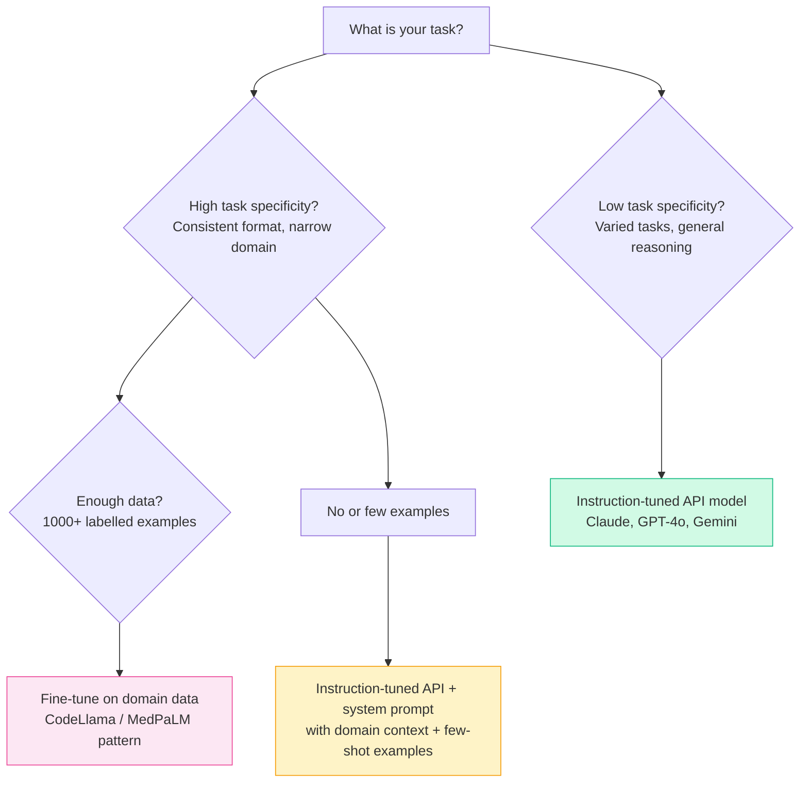

# Patterns: Choosing the Right Model

## Decision Framework

Two axes drive the choice:

- **Task specificity** — how narrow and consistent is the target task?
- **Data availability** — how many high-quality labelled examples do you have?



---

## Pattern 1: General Tasks — Use Instruction-Tuned API Models

For most tasks — summarisation, Q&A, code generation, classification, explanation — a well-prompted instruction-tuned model (Claude, GPT-4o, Gemini) is the right choice. These models are already instruction-tuned and RLHF-aligned. A detailed system prompt is almost always enough.

```python
import anthropic

client = anthropic.Anthropic()

def classify_support_ticket(ticket_text: str) -> str:
    """
    Classify a support ticket into a category.
    Uses the general-purpose instruction-tuned model — no fine-tuning needed.
    """
    response = client.messages.create(
        model="claude-3-5-sonnet-20241022",
        max_tokens=20,
        temperature=0,
        system=(
            "You are a support ticket classifier. "
            "Classify tickets into exactly one of: billing, technical, account, general. "
            "Reply with only the category label."
        ),
        messages=[{"role": "user", "content": ticket_text}],
    )
    return response.content[0].text.strip().lower()
```

**When to use:** Varied tasks, prototyping, low data availability, or when flexibility matters more than peak accuracy on one task.

---

## Pattern 2: Domain-Specific Consistent Format — Consider Fine-Tuning

If your task produces the same structured output every time (JSON, a specific report format, standardised codes) and you have thousands of labelled examples, fine-tuning pays off. The fine-tuned model learns the exact output schema and produces it reliably.

```python
# This is a conceptual example — fine-tuning is done offline, not in real-time.
# After fine-tuning, you call the fine-tuned model exactly like a regular model.

import anthropic

client = anthropic.Anthropic()

# After fine-tuning on 5000 medical billing records, the model reliably
# outputs valid ICD-10 codes without needing a long prompt.
def code_medical_record(clinical_note: str) -> dict:
    response = client.messages.create(
        model="your-fine-tuned-model-id",  # deployed fine-tuned checkpoint
        max_tokens=100,
        temperature=0,
        messages=[{"role": "user", "content": clinical_note}],
    )
    return response.content[0].text
```

**When to use:** Consistent structured output, 1,000+ high-quality labelled examples, measurable performance gap versus prompting alone.

---

## Pattern 3: Cost-Sensitive High-Volume Tasks — Smaller Fine-Tuned Model

A small model (7B parameters) fine-tuned on your exact task can outperform a large general model (70B+ parameters) at a fraction of the inference cost. If you are running millions of requests per day on a narrow classification task, this trade-off is worth exploring.

| Approach | Accuracy on task | Inference cost | Flexibility |
|----------|-----------------|----------------|-------------|
| GPT-4o (general) | 85% | High | Very high |
| Small fine-tuned model | 91% | Low | Low |

The fine-tuned model wins on both accuracy and cost — but only for that specific task.

---

## Pattern 4: Comparing Models on the Same Task

Before committing to any model choice, benchmark multiple models on your actual data. This code runs the same prompt through several model configurations and surfaces disagreements.

```python
import anthropic

client = anthropic.Anthropic()

MODELS = {
    "haiku": "claude-3-haiku-20240307",
    "sonnet": "claude-3-5-sonnet-20241022",
}

PROMPT_TEMPLATE = """Classify the sentiment of this text as exactly one word: positive, negative, or neutral.
Text: {text}
Sentiment:"""


def classify_with_model(text: str, model_key: str) -> str:
    response = client.messages.create(
        model=MODELS[model_key],
        max_tokens=10,
        temperature=0,
        messages=[{"role": "user", "content": PROMPT_TEMPLATE.format(text=text)}],
    )
    return response.content[0].text.strip().lower()


def compare_models_on_texts(texts: list[str]) -> dict:
    """Run all models on all texts. Return {model: [result, ...]}."""
    results = {}
    for model_key in MODELS:
        results[model_key] = [classify_with_model(t, model_key) for t in texts]
    return results


def agreement_rate(results: dict) -> float:
    """Fraction of texts where all models agree."""
    model_keys = list(results.keys())
    if len(model_keys) < 2:
        return 1.0
    n = len(results[model_keys[0]])
    agreed = sum(
        len({results[m][i] for m in model_keys}) == 1
        for i in range(n)
    )
    return agreed / n


# Example usage
texts = [
    "I love this product, it changed my life!",
    "Terrible experience, would not recommend.",
    "It arrived on time.",
]

results = compare_models_on_texts(texts)
for model, labels in results.items():
    print(f"{model}: {labels}")

print(f"Agreement rate: {agreement_rate(results):.0%}")
```

---

## Anti-Patterns

<div className="antipattern">

**Fine-tuning without first trying prompting**
Fine-tuning requires labelled data, compute, and ongoing maintenance. Before investing in it, try a well-crafted system prompt with 5–10 few-shot examples. In practice, around 90% of tasks that appear to need fine-tuning are solved this way.

**Using a base model expecting chat behaviour**
Base model checkpoints do not follow instructions — they continue text. If you load a raw Llama or Mistral base checkpoint and send it a question, you will not get a helpful answer. Always verify you have an instruction-tuned checkpoint (`-Instruct`, `-chat`, or similar suffix) before debugging "bad outputs."

**Fine-tuning on fewer than 100 examples**
Small datasets cause overfitting. The model memorises surface patterns in your examples rather than learning the underlying task. Below ~100 examples, you are almost always better off with few-shot prompting than fine-tuning.

</div>
