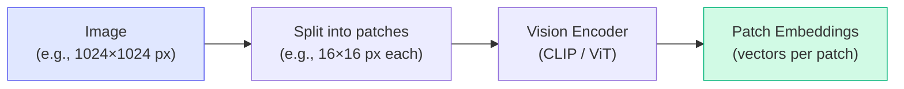
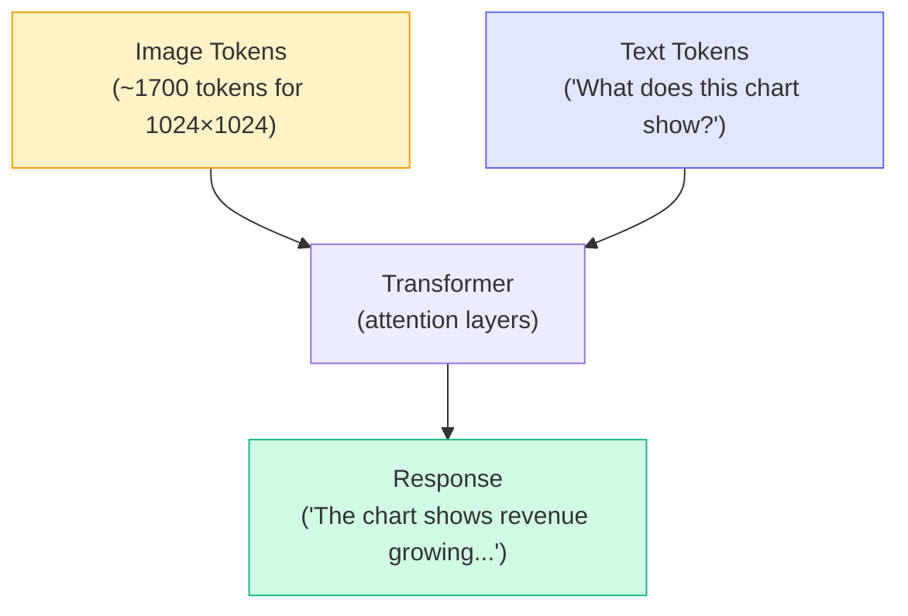
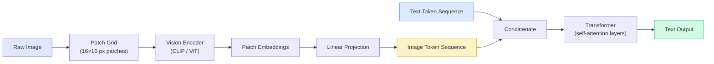
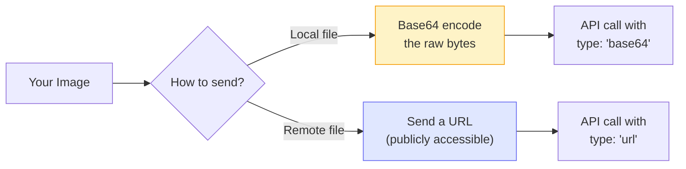

# Concepts: Multimodal Models

## The Problem

Text-only models are blind. They cannot analyze a chart, read the text in a scanned document, interpret a UI screenshot, or describe a product photo. Before multimodal models, handling these tasks required separate, specialised pipelines — OCR libraries, computer vision models, preprocessing scripts — all stitched together by hand.

Vision-language models collapse that complexity. One API call, one model, images and text together.

---

## The Intuition

<div className="concept-intuition">

**Think of a multimodal model as a text model with eyes.**

A standard LLM reads tokens — little chunks of text. A vision-language model does the same thing, but it can also "read" images by converting them into a sequence of tokens first. Once the image is tokenized, it sits alongside your text tokens, and the transformer processes everything together.

From the model's perspective, it's all just tokens.

</div>

---

## How It Works — Step by Step

### Step 1: Vision Encoder converts image to patch embeddings

The image is split into small patches (e.g., 16×16 pixels each). A vision encoder (like CLIP or ViT — Vision Transformer) converts each patch into a dense vector called a **patch embedding**.



### Step 2: Patch embeddings become image tokens

The patch embeddings are projected into the same space as text token embeddings. A 1024×1024 image may produce approximately **1,700 image tokens** — which is why large images are expensive.

### Step 3: Image tokens + text tokens enter the transformer together



The attention mechanism lets text tokens attend to image tokens and vice versa. This is how the model can answer "What city is on the sign in the upper-left corner?" — text attends to the relevant image patch.

### Step 4: Responding

The model generates a text response, just like any other LLM call. The difference is that its context includes both image-derived and text-derived information.

---

## How Vision Works in Multimodal Models

Understanding the internal architecture helps you reason about costs, limits, and failure modes.

### The Patch-Based Architecture

Every image is processed using the same fundamental pipeline:

1. **Divide** — the image is partitioned into a grid of non-overlapping patches (commonly 16×16 pixels each). A 512×512 image produces (512÷16)² = 1,024 patches.
2. **Encode** — each patch is passed through a **vision encoder** (either CLIP or ViT). The encoder maps the raw pixel values of that patch to a dense floating-point vector — the **patch embedding**.
3. **Project** — a linear projection layer maps the patch embedding into the same dimensionality as the text token embeddings. After projection, a patch embedding and a text token embedding are the same shape, so the transformer can treat them interchangeably.
4. **Concatenate** — the projected patch embeddings are prepended to the text token sequence to form a single combined sequence.
5. **Transform** — the full combined sequence flows through the standard transformer (self-attention + feed-forward). Every patch can attend to every other patch and to every text token. This is what makes answers like "what does the label in the top-left box say?" possible — the text token "label" can attend directly to the patch that contains it.



### Why This Matters in Practice

- **More patches = more tokens = higher cost.** A 1024×1024 image has 4× the patches of a 512×512 image.
- **The model cannot zoom in on demand.** It only sees what is encoded at the resolution you send. Highly compressed or very small text may be unreadable.
- **Order matters.** Image tokens are typically prepended before text tokens, so the model reads the image first and then the question.
- **The vision encoder is frozen during fine-tuning** in many architectures. Only the projection layer and the language model itself are updated. This means the model's "raw visual perception" is fixed; what changes is how it interprets and describes what it sees.

---

## What Multimodal Models Can and Can't Do

| Capability | Can do | Can't do |
|-----------|--------|---------|
| **Image understanding** | Describe scenes, read text in images, identify objects | Identify specific people by face (privacy restriction) |
| **Document analysis** | Extract structured data from PDFs, forms, receipts | Edit or modify the image |
| **Visual reasoning** | Count objects, compare items, answer questions about charts | Generate images (text-to-image is a separate model type) |
| **Code from screenshots** | Convert UI screenshots to code | Execute the code from the screenshot |

### The Important Nuances

**"Read text in images"** works well for printed text at reasonable resolution. It degrades significantly for handwriting, decorative fonts, or text smaller than ~12px in the sent image.

**"Count objects"** is reliable up to roughly 20–30 items. Dense grids of small identical objects (e.g., 200 screws on a table) produce unreliable counts — the model reasons spatially, not by exhaustive enumeration.

**"Identify specific people by face"** is intentionally restricted in Claude and most production models for privacy and safety reasons. The model will describe a person's appearance but will not name them.

**"Generate images"** requires a diffusion model (DALL-E, Stable Diffusion, Midjourney, etc.) — not a language model. Vision-language models are input-side only for images.

---

## Image Input Formats

Claude (and most vision APIs) accept images in two ways:



| Method | When to use | Notes |
|--------|------------|-------|
| **Base64** | Local files, private images, any image you have in memory | Slightly larger payload, works for any image |
| **URL** | Images already hosted publicly (e.g., CDN, S3 public bucket) | Simpler payload, image must be reachable by Anthropic's servers |

---

## Sending Images to Claude — Code

### Option 1: URL (image must be publicly accessible)

```python
import anthropic
import base64
from pathlib import Path

client = anthropic.Anthropic()

# Option 1: URL (image must be publicly accessible)
response = client.messages.create(
    model="claude-3-5-sonnet-20241022",
    max_tokens=1024,
    messages=[{
        "role": "user",
        "content": [
            {"type": "image", "source": {"type": "url", "url": "https://example.com/image.jpg"}},
            {"type": "text", "text": "What's in this image?"}
        ]
    }]
)

# Option 2: Base64 (for local files)
image_data = base64.standard_b64encode(Path("image.jpg").read_bytes()).decode()
response = client.messages.create(
    model="claude-3-5-sonnet-20241022",
    max_tokens=1024,
    messages=[{
        "role": "user",
        "content": [
            {"type": "image", "source": {"type": "base64", "media_type": "image/jpeg", "data": image_data}},
            {"type": "text", "text": "Extract all text from this image."}
        ]
    }]
)
```

### Sending multiple images in a single request

You can include more than one image in a single `messages` call by adding multiple image content blocks. The model processes all images together in context:

```python
response = client.messages.create(
    model="claude-3-5-sonnet-20241022",
    max_tokens=1024,
    messages=[{
        "role": "user",
        "content": [
            {"type": "image", "source": {"type": "url", "url": "https://example.com/before.jpg"}},
            {"type": "image", "source": {"type": "url", "url": "https://example.com/after.jpg"}},
            {"type": "text", "text": "What changed between the before and after images?"}
        ]
    }]
)
```

### Supported media types

| Format | `media_type` value | Notes |
|--------|-------------------|-------|
| JPEG | `image/jpeg` | Smallest file size; lossy — avoid for OCR |
| PNG | `image/png` | Lossless; best for screenshots, diagrams, text |
| GIF | `image/gif` | Only the first frame is used |
| WebP | `image/webp` | Good compression with quality |

---

## Image Token Costs

Images are not free — they are tokenized just like text, and token count drives both **latency** and **cost**.

### How image token count is calculated

Claude uses a tile-based tokenisation approach:

- **Base cost**: every image costs a minimum of **85 tokens** regardless of size (covers the overhead of the vision encoder call)
- **Tile cost**: the image is divided into 512×512 tiles; each tile costs approximately **170 tokens**
- **Formula**: `total_tokens ≈ 85 + (number_of_tiles × 170)`

For a 1024×1024 image: 4 tiles → `85 + (4 × 170)` = **765 tokens** (low-detail mode)
In high-detail mode (default for most tasks), the model upscales internally, producing closer to **1,700 tokens** for the same image.

### Token cost table for common sizes

| Image size | Tiles (approx) | Approx tokens (low detail) | Approx tokens (high detail) |
|-----------|---------------|--------------------------|----------------------------|
| 256×256 | 1 | ~255 | ~255 |
| 512×512 | 1 | ~255 | ~765 |
| 768×768 | 4 | ~765 | ~1,105 |
| 1024×1024 | 4 | ~765 | ~1,700 |
| 1920×1080 | 6 | ~1,105 | ~2,550 |
| 4000×3000 | 24 | ~4,165 | ~7,000+ |

### Practical rules

1. **Resize before sending.** A 4K photograph sent for invoice OCR is wasteful — the text is readable at 1024px. Resize to the longest edge you actually need.
2. **Use low-detail mode for classification tasks.** If you are asking "is this a cat or a dog?", you do not need high-detail tokenisation. Pass `"detail": "low"` in the image source if the API supports it.
3. **Batch wisely.** Each image in a multi-image request contributes its full token cost to the context window. Ten 1024×1024 images = ~17,000 tokens before your prompt even starts.
4. **Cache repeated images.** If you send the same image multiple times across requests (e.g., a company logo in every invoice), use prompt caching where supported to avoid re-tokenising it each time.

---

## Claude Vision Models

All recent Claude models support vision:

| Model | Vision Support | Best For |
|-------|---------------|---------|
| `claude-3-haiku-20240307` | Yes | Fast, cheap visual tasks |
| `claude-3-5-sonnet-20241022` | Yes | Balanced quality and cost |
| `claude-3-opus-20240229` | Yes | Complex visual reasoning |

**Token cost for images:** A 512×512 image costs approximately 300–600 tokens depending on content detail. A 1024×1024 image costs approximately 1,700 tokens. Always resize before sending unless full resolution is necessary.

---

## Key Terms

| Term | What It Means |
|------|---------------|
| **Multimodal** | A model that accepts more than one type of input (e.g., text + images) |
| **Vision encoder** | The component that converts image pixels into embeddings (e.g., CLIP, ViT) |
| **Patch embeddings** | Dense vector representations of small image regions |
| **Image tokens** | The tokenized form of patch embeddings — treated like text tokens by the transformer |
| **Vision-language model (VLM)** | A model that handles both visual and textual inputs |
| **OCR** | Optical Character Recognition — extracting text from images |
| **Grounding** | Linking model outputs to specific regions of an image |

---

## The Interview Angle

<div className="interview-angle">

**"How would you extract data from a scanned PDF?"**

A strong answer:
1. Convert each PDF page to an image (e.g., using `pdf2image` or similar)
2. Send each page image to a vision model with a prompt like: *"Extract all line items from this invoice and return them as JSON with fields: description, quantity, unit_price, total."*
3. Parse and validate the returned JSON
4. Optionally validate across pages for consistency

This avoids complex OCR + regex pipelines and handles varied layouts (different invoice formats, handwritten notes, stamps) that rules-based systems break on.

**Follow-up:** *"What if the PDF has 500 pages?"*
→ Batch the requests, use a cheaper model (Haiku), consider parallel processing, cache results by page hash to avoid reprocessing unchanged documents.

</div>

---

## Common Mistakes

<div className="antipattern">

**Sending full-resolution images unnecessarily**
A 4K photograph sent for text extraction is ~7,000 tokens. The same image resized to 1024px longest edge is ~1,700 tokens. Resize before sending unless you genuinely need detail at full resolution.

**Asking for exact pixel coordinates**
Vision models reason about images — they do not pixel-read. Asking "What is the exact pixel coordinate of the button?" will get unreliable results. If you need coordinates, use a dedicated computer vision library or the `computer-use` capability.

**Not handling image load failures**
When sending via URL, the image might be behind authentication, have moved, or be temporarily unavailable. Always handle errors from the API gracefully and provide a fallback.

**Assuming the model sees all detail in compressed images**
Heavy JPEG compression destroys text edges and fine details. For OCR tasks, use PNG or lightly compressed JPEG.

</div>

---

## Further Reading

- [Anthropic Vision API docs](https://docs.anthropic.com/en/docs/build-with-claude/vision) — official guide with code examples
- [Claude's vision capabilities guide](https://docs.anthropic.com/en/docs/build-with-claude/vision#vision-capabilities) — what Claude can and cannot do with images
- [GPT-4V System Card](https://openai.com/research/gpt-4v-system-card) — detailed analysis of VLM capabilities and limitations
