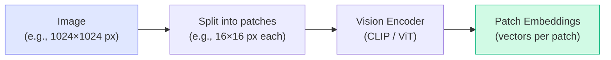
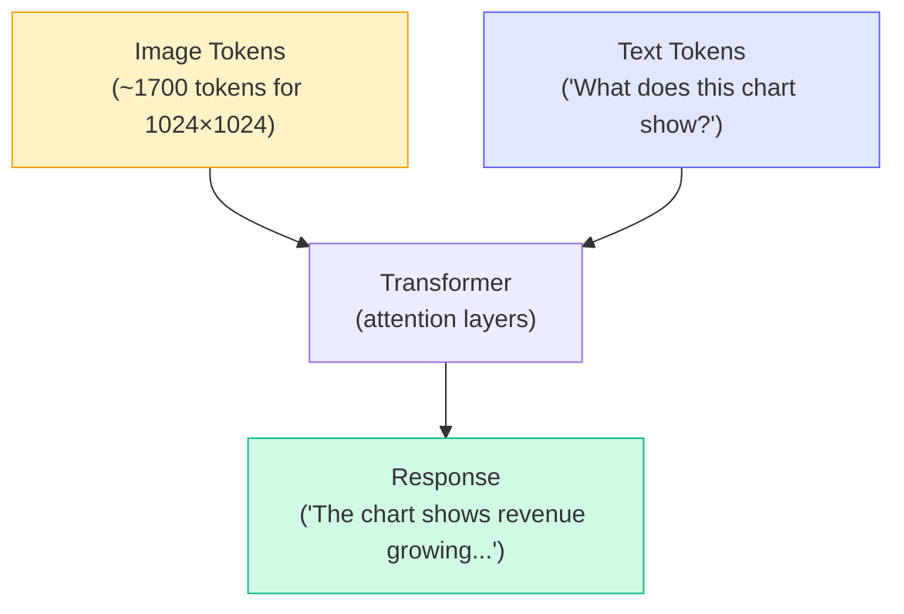
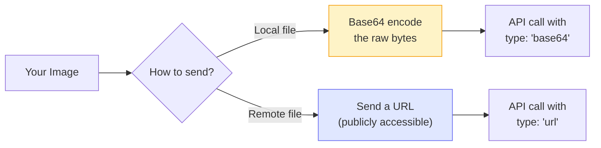

# Concepts: Multimodal Models

## The Problem

Text-only models are blind. They cannot analyze a chart, read the text in a scanned document, interpret a UI screenshot, or describe a product photo. Before multimodal models, handling these tasks required separate, specialised pipelines — OCR libraries, computer vision models, preprocessing scripts — all stitched together by hand.

Vision-language models collapse that complexity. One API call, one model, images and text together.

---

## The Intuition

**Think of a multimodal model as a text model with eyes.**

A standard LLM reads tokens — little chunks of text. A vision-language model does the same thing, but it can also "read" images by converting them into a sequence of tokens first. Once the image is tokenized, it sits alongside your text tokens, and the transformer processes everything together.

From the model's perspective, it's all just tokens.

---

## How It Works — Step by Step

### Step 1: Vision Encoder converts image to patch embeddings

The image is split into small patches (e.g., 16×16 pixels each). A vision encoder (like CLIP or ViT — Vision Transformer) converts each patch into a dense vector called a **patch embedding**.

### Step 2: Patch embeddings become image tokens

The patch embeddings are projected into the same space as text token embeddings. A 1024×1024 image may produce approximately **1,700 image tokens** — which is why large images are expensive.

### Step 3: Image tokens + text tokens enter the transformer together

The attention mechanism lets text tokens attend to image tokens and vice versa. This is how the model can answer "What city is on the sign in the upper-left corner?" — text attends to the relevant image patch.

### Step 4: Responding

The model generates a text response, just like any other LLM call. The difference is that its context includes both image-derived and text-derived information.

---

## Image Input Formats

Claude (and most vision APIs) accept images in two ways:

| Method | When to use | Notes |
|--------|------------|-------|
| **Base64** | Local files, private images, any image you have in memory | Slightly larger payload, works for any image |
| **URL** | Images already hosted publicly (e.g., CDN, S3 public bucket) | Simpler payload, image must be reachable by Anthropic's servers |

---

## Claude Vision Models

All recent Claude models support vision:

| Model | Vision Support | Best For |
|-------|---------------|---------|
| `claude-3-haiku-20240307` | Yes | Fast, cheap visual tasks |
| `claude-3-5-sonnet-20241022` | Yes | Balanced quality and cost |
| `claude-3-opus-20240229` | Yes | Complex visual reasoning |

**Token cost for images:** A 512×512 image costs approximately 300–600 tokens depending on content detail. A 1024×1024 image costs approximately 1,700 tokens. Always resize before sending unless full resolution is necessary.

---

## Key Terms

| Term | What It Means |
|------|---------------|
| **Multimodal** | A model that accepts more than one type of input (e.g., text + images) |
| **Vision encoder** | The component that converts image pixels into embeddings (e.g., CLIP, ViT) |
| **Patch embeddings** | Dense vector representations of small image regions |
| **Image tokens** | The tokenized form of patch embeddings — treated like text tokens by the transformer |
| **Vision-language model (VLM)** | A model that handles both visual and textual inputs |
| **OCR** | Optical Character Recognition — extracting text from images |
| **Grounding** | Linking model outputs to specific regions of an image |

---

## The Interview Angle

**"How would you extract data from a scanned PDF?"**

A strong answer:
1. Convert each PDF page to an image (e.g., using `pdf2image` or similar)
2. Send each page image to a vision model with a prompt like: *"Extract all line items from this invoice and return them as JSON with fields: description, quantity, unit_price, total."*
3. Parse and validate the returned JSON
4. Optionally validate across pages for consistency

This avoids complex OCR + regex pipelines and handles varied layouts (different invoice formats, handwritten notes, stamps) that rules-based systems break on.

**Follow-up:** *"What if the PDF has 500 pages?"*
→ Batch the requests, use a cheaper model (Haiku), consider parallel processing, cache results by page hash to avoid reprocessing unchanged documents.

---

## Common Mistakes

**Sending full-resolution images unnecessarily**
A 4K photograph sent for text extraction is ~7,000 tokens. The same image resized to 1024px longest edge is ~1,700 tokens. Resize before sending unless you genuinely need detail at full resolution.

**Asking for exact pixel coordinates**
Vision models reason about images — they do not pixel-read. Asking "What is the exact pixel coordinate of the button?" will get unreliable results. If you need coordinates, use a dedicated computer vision library or the `computer-use` capability.

**Not handling image load failures**
When sending via URL, the image might be behind authentication, have moved, or be temporarily unavailable. Always handle errors from the API gracefully and provide a fallback.

**Assuming the model sees all detail in compressed images**
Heavy JPEG compression destroys text edges and fine details. For OCR tasks, use PNG or lightly compressed JPEG.

---

## Further Reading

- [Anthropic Vision API docs](https://docs.anthropic.com/en/docs/build-with-claude/vision) — official guide with code examples
- [Claude's vision capabilities guide](https://docs.anthropic.com/en/docs/build-with-claude/vision#vision-capabilities) — what Claude can and cannot do with images
- [GPT-4V System Card](https://openai.com/research/gpt-4v-system-card) — detailed analysis of VLM capabilities and limitations
