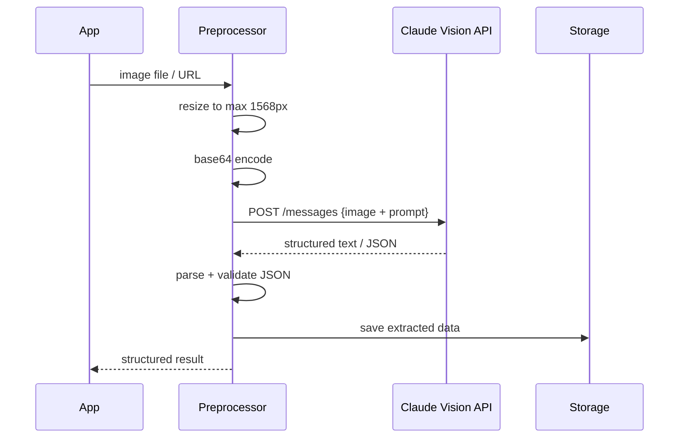

# Patterns: Working with Vision Models

## Before You Start — Image Preprocessing Tip

Resize large images before sending. The maximum useful resolution for most tasks is **1568px on the longest edge** — Claude's vision encoder doesn't gain meaningful information from larger images, but you pay for more tokens.

```python
from PIL import Image

def resize_for_api(image_path: str, max_px: int = 1568) -> Image.Image:
    img = Image.open(image_path)
    img.thumbnail((max_px, max_px), Image.LANCZOS)
    return img
```

---

## Pattern 1: Image Description

The simplest vision pattern. Send an image, ask what's in it.

```python
import anthropic
import base64
from pathlib import Path

client = anthropic.Anthropic()

def describe_image(image_path: str) -> str:
    image_data = base64.standard_b64encode(Path(image_path).read_bytes()).decode("utf-8")

    response = client.messages.create(
        model="claude-3-haiku-20240307",
        max_tokens=1024,
        messages=[
            {
                "role": "user",
                "content": [
                    {
                        "type": "image",
                        "source": {
                            "type": "base64",
                            "media_type": "image/jpeg",
                            "data": image_data,
                        },
                    },
                    {
                        "type": "text",
                        "text": "Describe this image in detail."
                    }
                ],
            }
        ],
    )
    return response.content[0].text
```

**When to use:** Product photo descriptions, accessibility alt-text generation, content moderation, image cataloguing.

---

## Pattern 2: Document Extraction

Send an invoice, receipt, or form image. Ask for structured JSON output. No regex required.

```python
import json

def extract_invoice_data(image_path: str) -> dict:
    image_data = base64.standard_b64encode(Path(image_path).read_bytes()).decode("utf-8")

    prompt = """Extract the invoice data from this image and return it as JSON with exactly these fields:
{
  "vendor": "string",
  "invoice_number": "string",
  "date": "string (YYYY-MM-DD)",
  "line_items": [
    {"description": "string", "quantity": number, "unit_price": number, "total": number}
  ],
  "subtotal": number,
  "tax": number,
  "total": number
}
Return only the JSON, no other text."""

    response = client.messages.create(
        model="claude-3-5-sonnet-20241022",
        max_tokens=2048,
        messages=[
            {
                "role": "user",
                "content": [
                    {
                        "type": "image",
                        "source": {
                            "type": "base64",
                            "media_type": "image/png",
                            "data": image_data,
                        },
                    },
                    {"type": "text", "text": prompt}
                ],
            }
        ],
    )
    return json.loads(response.content[0].text)
```

**When to use:** Accounts payable automation, expense report processing, form digitisation.

---

## Pattern 3: Chart Interpretation

Send a chart or graph image and extract the underlying data.

```python
def interpret_chart(image_path: str) -> dict:
    image_data = base64.standard_b64encode(Path(image_path).read_bytes()).decode("utf-8")

    prompt = """Analyze this chart and extract:
1. Chart type (bar, line, pie, scatter, etc.)
2. Title (if visible)
3. X-axis label and values/categories
4. Y-axis label and range
5. All data series with their values
6. Key trends or insights

Return as JSON:
{
  "chart_type": "string",
  "title": "string or null",
  "x_axis": {"label": "string", "values": []},
  "y_axis": {"label": "string", "min": number, "max": number},
  "series": [{"name": "string", "data": []}],
  "insights": ["string"]
}"""

    response = client.messages.create(
        model="claude-3-5-sonnet-20241022",
        max_tokens=2048,
        messages=[
            {
                "role": "user",
                "content": [
                    {
                        "type": "image",
                        "source": {"type": "base64", "media_type": "image/png", "data": image_data},
                    },
                    {"type": "text", "text": prompt}
                ],
            }
        ],
    )
    return json.loads(response.content[0].text)
```

**When to use:** Business intelligence, report generation, converting legacy charts to data tables.

---

## Pattern 4: Screenshot Analysis

Capture a screenshot and analyse the UI state — useful for automated testing or monitoring.

```python
def analyze_screenshot(image_path: str, question: str) -> str:
    """Ask a specific question about a UI screenshot."""
    image_data = base64.standard_b64encode(Path(image_path).read_bytes()).decode("utf-8")

    response = client.messages.create(
        model="claude-3-haiku-20240307",
        max_tokens=1024,
        messages=[
            {
                "role": "user",
                "content": [
                    {
                        "type": "image",
                        "source": {"type": "base64", "media_type": "image/png", "data": image_data},
                    },
                    {"type": "text", "text": question}
                ],
            }
        ],
    )
    return response.content[0].text

# Example uses:
# analyze_screenshot("checkout.png", "Is there an error message visible on this page?")
# analyze_screenshot("dashboard.png", "List all the navigation items visible in the sidebar.")
# analyze_screenshot("form.png", "Are all required fields filled in?")
```

**When to use:** Visual regression testing, accessibility audits, automated UI monitoring, debugging production issues from screenshots.

---

## Full Pipeline: Image to Structured Data



---

## Anti-Patterns

<div className="antipattern">

**Sending 4K images when 512px is enough**
If you're extracting text from a receipt, 1024px is more than enough. A 4K image costs 4–5x more tokens for no benefit. Always resize to the minimum resolution that preserves the detail you need.

**Asking for exact pixel coordinates**
Vision models understand spatial layout ("the button in the top-right corner") but cannot reliably tell you "the button is at pixel (342, 127)". For precise coordinates, use dedicated computer vision tools.

**Not handling base64 encoding errors**
Corrupted or truncated image files will encode without error but produce garbage tokens. Always validate images exist and are readable before encoding:
```python
from PIL import Image
try:
    img = Image.open(image_path)
    img.verify()  # raises if invalid
except Exception as e:
    raise ValueError(f"Invalid image at {image_path}: {e}")
```

**Sending all PDF pages when you only need one**
If you're extracting a total from a 50-page PDF and it's always on page 1, only send page 1. Process pages lazily or in parallel with early exit when you find what you need.

</div>
