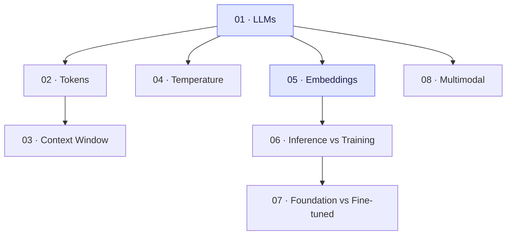

# 🧱 Tier 1 — Foundations

**Pre-requisite:** Basic Python (variables, functions, pip install). No AI knowledge needed.

**Goal:** By the end of Tier 1, you can confidently call any LLM API, understand what's happening under the hood, and work with embeddings.

---

## Concept Map

## Chapters

| # | Chapter | Time | Lab |
|---|---------|------|-----|
| 01 | LLMs & How They Work | 30 min | Call your first LLM |
| 02 | Tokens & Tokenization | 20 min | Count tokens & estimate cost |
| 03 | Context Window | 25 min | Build a context-aware Q&A |
| 04 | Temperature & Sampling | 20 min | Compare outputs at different temps |
| 05 | Embeddings | 35 min | Find semantically similar sentences |
| 06 | Inference vs Training | 15 min | Run inference via API |
| 07 | Foundation vs Fine-tuned | 20 min | Compare models on the same task |
| 08 | Multimodal Models | 25 min | Describe an image via API |

**Total estimated time:** ~3 hours (concepts + labs)
