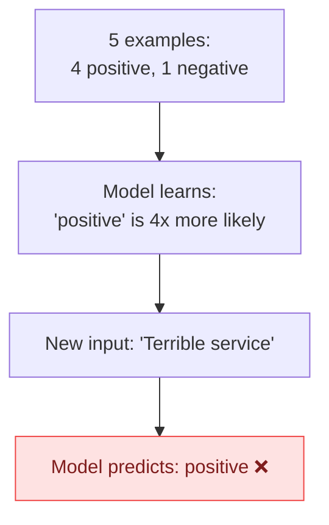
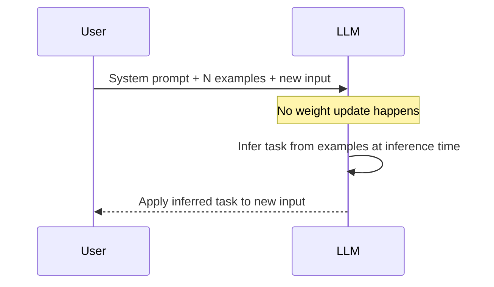

# Concepts: Zero/Few-shot Prompting

## The Problem

You need to classify customer sentiment. With a plain zero-shot prompt the model misclassifies edge cases like sarcasm ("Yeah, great service — waited 3 hours."). Add 5 well-chosen examples and accuracy jumps ~20%. That delta is purely from examples in the prompt — no fine-tuning, no new model.

---

## The Intuition

<div className="concept-intuition">

**Zero-shot** = asking a new hire to do a task with no worked examples.
**Few-shot** = showing them 3–5 done examples before they start.

LLMs are the same. They're powerful generalists, but a few concrete examples help them lock onto the exact format, tone, and decision boundary you want — at inference time, without changing the model's weights.

</div>

---

## How It Works

### 1. Zero-shot

Just the task description. No examples.

```
Classify the sentiment of the following text.
Respond with exactly one word: positive, negative, or neutral.

Text: The new update completely broke my workflow.
Sentiment:
```

**When it works:** Clear, well-defined tasks the model has seen millions of times in training (translation, basic summarisation, simple classification of common categories).

**When it fails:** Novel tasks, fine-grained distinctions, tasks where format matters precisely, domain-specific jargon.

---

### 2. One-shot

One example in the prompt. Enough to show the desired output format.

```
Classify sentiment. Respond with one word: positive, negative, or neutral.

Text: I love this product!
Sentiment: positive

Text: The new update completely broke my workflow.
Sentiment:
```

---

### 3. Few-shot (2–10 examples)

Multiple examples demonstrating the pattern. The model infers the task, format, and decision boundary from the examples.

```
Classify sentiment. Respond with one word: positive, negative, or neutral.

Text: Best purchase I've made all year.
Sentiment: positive

Text: Arrived two weeks late and damaged.
Sentiment: negative

Text: It's okay, nothing special.
Sentiment: neutral

Text: The new update completely broke my workflow.
Sentiment:
```

**Why 2–10?** Below 2, there's little benefit over one-shot. Above 10, returns diminish fast and you pay for extra tokens on every call.

---

### 4. What Makes Good Few-Shot Examples

| Property | Why It Matters |
|----------|----------------|
| **Representative** | Examples should look like real production inputs, not textbook-clean examples |
| **Diverse** | Cover different lengths, styles, and edge cases — not 5 variations of the same sentence |
| **Label-balanced** | Equal (or proportional) representation of each class — see below |
| **High-quality** | Errors in your examples teach the model to make the same errors |
| **Consistent format** | Every example uses the exact same structure — the model copies format |

---

### 5. Label Balance

If your 5 examples are 4 positive + 1 negative, the model sees a skewed prior. It will over-predict "positive" even on clearly negative inputs.



Fix: use balanced examples (2-2-1 for 3-class, or weight examples by real class frequency).

---

### 6. In-Context Learning

This is the technical name for what few-shot prompting exploits.



The model's weights do **not** change. The model uses the attention mechanism to look at your examples and infer the pattern — all inside a single forward pass. This is fundamentally different from fine-tuning.

---

## Zero-shot vs Few-shot — When to Use Each

| Situation | Use |
|-----------|-----|
| Model understands the task from pre-training | Zero-shot — save tokens |
| Novel task the model hasn't seen | Few-shot |
| Format matters precisely (JSON schema, specific labels) | Few-shot to anchor format |
| Tight token budget / high-volume API calls | Zero-shot or 1-shot |
| High accuracy needed on edge cases | Few-shot with diverse examples |
| Task is ambiguous (multiple valid interpretations) | Few-shot to disambiguate |

---

## Key Terms

| Term | Definition |
|------|------------|
| **Zero-shot** | Prompting with no examples — just the task description |
| **One-shot** | Prompting with exactly one example |
| **Few-shot** | Prompting with 2–10 examples |
| **In-context learning** | The model infers the task from examples at inference time, without weight updates |
| **Prompt template** | The reusable structure holding examples + new input |
| **Label balance** | Equal or proportional representation of each class in examples |
| **Calibration** | Ensuring the model's predicted class probabilities match real-world frequencies |

---

## The Interview Angle

<div className="interview-angle">

**"How do you decide how many examples to use in a few-shot prompt?"**

Start with 3–5. That covers most format anchoring and decision boundary benefits. More isn't always better:
- Each example consumes tokens (cost + latency)
- Past ~10 examples, accuracy gains flatten
- Examples must fit inside your context window
- Check for label imbalance — 10 examples all the same class actively hurts performance

A good answer mentions: start small, measure accuracy, check label balance, consider token cost.

</div>

---

## Common Mistakes

<div className="antipattern">

**Using too many examples** — 20 examples costs 5–10x the tokens of 3 examples with minimal accuracy gain. Profile first, then add examples only if zero/few-shot accuracy is insufficient.

**Unbalanced labels** — If 80% of your examples are "positive", the model inherits that bias. Always check class distribution in your example set.

**Poorly formatted examples** — The model mimics the *format* of your examples, not just the logic. Inconsistent spacing, capitalisation, or label names in different examples causes unpredictable output format.

**Examples too similar to each other** — Five slight variations of "great product!" teach the model almost nothing new. Use examples that cover different styles, lengths, and edge cases.

**Using examples from a different distribution** — If your examples are from formal business emails but your real inputs are casual social media posts, the model over-fits to the formal register.

</div>

---

## Further Reading

- Brown et al. (2020) — [Language Models are Few-Shot Learners (GPT-3)](https://arxiv.org/abs/2005.14165) — the paper that introduced the term "few-shot learners" for LLMs
- [Anthropic Prompt Engineering Guide](https://docs.anthropic.com/en/docs/build-with-claude/prompt-engineering/overview) — practical examples with Claude
- Min et al. (2022) — [Rethinking the Role of Demonstrations in Few-Shot Learning](https://arxiv.org/abs/2202.12837) — surprising finding: labels in examples matter less than format and distribution
