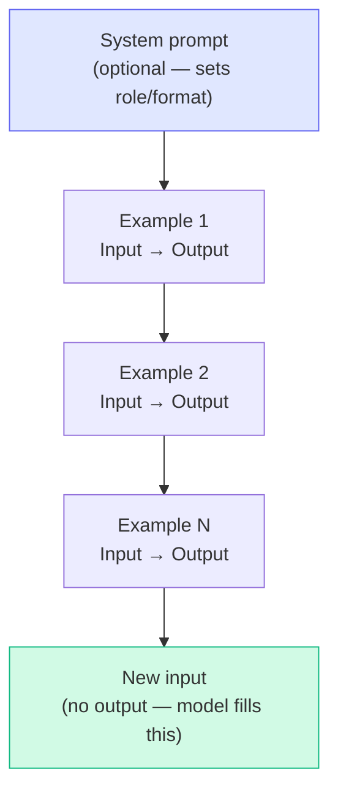

# Patterns: Zero/Few-shot Prompting

## Prompt Structure

Every few-shot prompt follows the same skeleton:



---

## Pattern 1: Zero-shot Classification

Use when the task is clear and the model handles it well from pre-training.

```python
import anthropic

client = anthropic.Anthropic()

ZERO_SHOT_PROMPT = """Classify the sentiment of the following text.
Respond with exactly one word: positive, negative, or neutral.

Text: {text}
Sentiment:"""

def classify_zero_shot(text: str) -> str:
    response = client.messages.create(
        model="claude-3-haiku-20240307",
        max_tokens=10,
        temperature=0,
        messages=[{
            "role": "user",
            "content": ZERO_SHOT_PROMPT.format(text=text)
        }]
    )
    return response.content[0].text.strip().lower()

# Usage
label = classify_zero_shot("The product arrived broken and customer service ignored me.")
print(label)  # "negative"
```

**Key choices:**
- `temperature=0` for deterministic classification
- `max_tokens=10` — we only need one word, keeps cost low
- Explicit format instruction ("exactly one word") reduces parsing errors

---

## Pattern 2: Few-shot Classification (Static Examples)

Use when zero-shot accuracy is insufficient or the task has subtle distinctions.

```python
EXAMPLES = [
    {"text": "Best purchase I've made this year!", "label": "positive"},
    {"text": "Arrived damaged and two weeks late.", "label": "negative"},
    {"text": "It's fine, does what it says.", "label": "neutral"},
    {"text": "Absolutely love it, exceeded expectations.", "label": "positive"},
    {"text": "Terrible customer service, won't buy again.", "label": "negative"},
]

FEW_SHOT_TEMPLATE = """Classify the sentiment of text.
Respond with exactly one word: positive, negative, or neutral.

Examples:
{examples}

Text: {text}
Sentiment:"""

def build_few_shot_prompt(examples: list[dict], text: str) -> str:
    example_lines = []
    for ex in examples:
        example_lines.append(f"Text: {ex['text']}\nSentiment: {ex['label']}")
    examples_str = "\n\n".join(example_lines)
    return FEW_SHOT_TEMPLATE.format(examples=examples_str, text=text)

def classify_few_shot(text: str, examples: list[dict]) -> str:
    prompt = build_few_shot_prompt(examples, text)
    response = client.messages.create(
        model="claude-3-haiku-20240307",
        max_tokens=10,
        temperature=0,
        messages=[{"role": "user", "content": prompt}]
    )
    return response.content[0].text.strip().lower()

# Usage
label = classify_few_shot(
    "Yeah, great service — waited 3 hours.",  # sarcasm edge case
    EXAMPLES
)
print(label)  # "negative" — examples anchored the sarcasm decision
```

---

## Pattern 3: Dynamic Few-shot Selection

Static examples are fine for small datasets. For large example pools, pick the examples most similar to the current input. This is called *dynamic few-shot selection*.

```python
# Requires: pip install sentence-transformers numpy
from sentence_transformers import SentenceTransformer
import numpy as np

model_embed = SentenceTransformer("all-MiniLM-L6-v2")

# Large pool of labeled examples
EXAMPLE_POOL = [
    {"text": "Best purchase I've made this year!", "label": "positive"},
    {"text": "Arrived damaged and two weeks late.", "label": "negative"},
    {"text": "It's fine, does what it says.", "label": "neutral"},
    {"text": "Absolutely love it, exceeded expectations.", "label": "positive"},
    {"text": "Terrible customer service, won't buy again.", "label": "negative"},
    {"text": "Not great, not terrible.", "label": "neutral"},
    {"text": "Wow, shipped in 1 day — amazing!", "label": "positive"},
    {"text": "Product stopped working after 2 days.", "label": "negative"},
]

# Pre-compute embeddings for the pool
pool_texts = [ex["text"] for ex in EXAMPLE_POOL]
pool_embeddings = model_embed.encode(pool_texts)

def select_examples(query: str, k: int = 5) -> list[dict]:
    """Return the k examples most similar to the query."""
    query_emb = model_embed.encode([query])
    # Cosine similarity
    sims = np.dot(pool_embeddings, query_emb.T).flatten()
    top_k_idx = np.argsort(sims)[::-1][:k]
    return [EXAMPLE_POOL[i] for i in top_k_idx]

def classify_dynamic_few_shot(text: str, k: int = 5) -> str:
    examples = select_examples(text, k=k)
    return classify_few_shot(text, examples)

# Usage
label = classify_dynamic_few_shot("Package was smashed beyond recognition.")
```

**When to use dynamic selection:**
- You have 50+ labeled examples and can't fit them all in context
- Accuracy varies across input types — similar examples help the model
- You're building a classifier that handles many domains

---

## Pattern 4: Format Few-shot (Anchor Output Structure)

Few-shot is not just for classification. Use it to anchor complex output formats like JSON.

```python
FORMAT_EXAMPLES = """Extract product info as JSON.

Text: The iPhone 15 Pro in black costs $999 and has 256GB storage.
Output: {"name": "iPhone 15 Pro", "color": "black", "price_usd": 999, "storage_gb": 256}

Text: Blue running shoes by Nike, size 10, priced at $120.
Output: {"name": "running shoes", "color": "blue", "brand": "Nike", "size": 10, "price_usd": 120}

Text: {text}
Output:"""

def extract_product_info(text: str) -> str:
    response = client.messages.create(
        model="claude-3-haiku-20240307",
        max_tokens=200,
        temperature=0,
        messages=[{
            "role": "user",
            "content": FORMAT_EXAMPLES.format(text=text)
        }]
    )
    return response.content[0].text.strip()

# Usage
result = extract_product_info("Red leather wallet by Gucci for $450.")
# Output: {"name": "leather wallet", "color": "red", "brand": "Gucci", "price_usd": 450}
```

**Why this works:** The model learns the exact JSON structure from examples — field names, data types, ordering — without needing a schema definition.

---

## Anti-Patterns

<div className="antipattern">

**Using 20+ examples hoping more is always better**

```python
# BAD: 25 examples, every API call costs 5x more
examples = load_all_examples()  # returns 25
prompt = build_few_shot_prompt(examples, text)  # ~2000 extra tokens per call

# GOOD: Test with 3, 5, 10 — measure accuracy delta, stop when it flattens
for k in [3, 5, 10]:
    acc = evaluate(classify_few_shot, k_examples=k)
    print(f"k={k}: accuracy={acc:.2%}")
```

**All examples from the same class**

```python
# BAD: Model learns "always predict positive"
examples = [
    {"text": "Great!", "label": "positive"},
    {"text": "Love it!", "label": "positive"},
    {"text": "Amazing!", "label": "positive"},
    {"text": "Fantastic!", "label": "positive"},
    {"text": "Wonderful!", "label": "positive"},
]

# GOOD: Balanced across classes
examples = [
    {"text": "Great!", "label": "positive"},
    {"text": "Terrible!", "label": "negative"},
    {"text": "It's okay.", "label": "neutral"},
    {"text": "Love it!", "label": "positive"},
    {"text": "Broken on arrival.", "label": "negative"},
]
```

**Inconsistent example format**

```python
# BAD: Mixed capitalisation, punctuation — model copies inconsistency
examples = """
text: Great product
sentiment: Positive

Text: terrible.
Sentiment: negative

TEXT: ok I guess
SENTIMENT: Neutral
"""

# GOOD: Identical structure every time
examples = """
Text: Great product!
Sentiment: positive

Text: Terrible quality.
Sentiment: negative

Text: It's okay, nothing special.
Sentiment: neutral
"""
```

</div>
