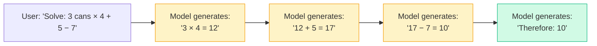
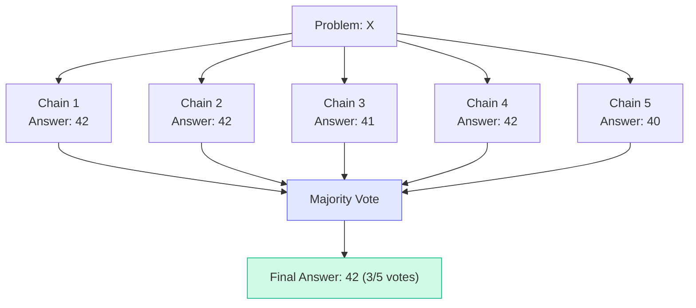
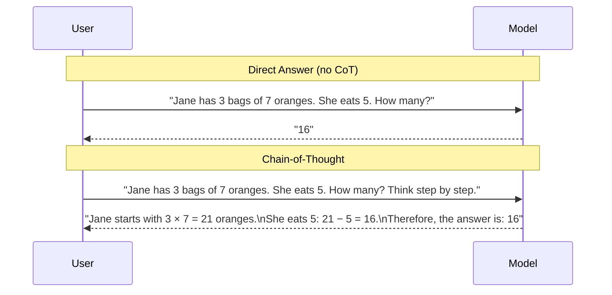

# Concepts: Chain-of-Thought Prompting

## The Problem

Ask an LLM this question directly:

> "Roger has 5 tennis balls. He buys 2 more cans of tennis balls. Each can has 3 balls. How many tennis balls does he have now?"

Without any guidance, many models (especially smaller ones) answer **"11"** — simply adding 5 + 2 + 3 instead of computing 5 + (2 × 3).

With chain-of-thought, the model works through it:

> "Roger starts with 5 balls. He buys 2 cans × 3 balls each = 6 more balls. 5 + 6 = **11**."

Wait — that's still 11, and it's correct! The multi-step arithmetic *was* the trap. CoT prevents errors in more complex variants:

> "Roger has 5 balls. He buys 3 cans of 4 balls each, then gives away 7. How many?"
>
> Without CoT: common wrong answer — **10**
>
> With CoT: "3 cans × 4 = 12 new balls. 5 + 12 = 17. 17 − 7 = **10**." ✓

CoT forces the model to generate intermediate steps, reducing compounding errors across multiple operations.

---

## The Intuition

<div className="concept-intuition">

**Think of CoT as giving the model a scratchpad.**

When you solve a hard math problem, you don't go straight from question to answer — you write out intermediate steps. Each step builds on the last. If you make an error, you can often catch it because the next step looks wrong.

LLMs work the same way. Transformers are autoregressive — each token generated becomes part of the context for the next token. When the model writes out reasoning steps, those steps are *in the context window* when it generates the final answer. More correct intermediate tokens = better final answer.

**Zero-shot CoT** exploits this with a single phrase: *"Let's think step by step."*

**Few-shot CoT** makes it stronger by showing complete worked examples with explicit reasoning chains.

</div>

---

## How It Works

### 1. Zero-Shot CoT

The simplest form. Append a single instruction to your prompt:

```
Solve this problem. Let's think step by step.
```

Discovered by Kojima et al. (2022), this phrase reliably triggers the model to generate a reasoning trace. It works because the model has seen countless "let's think step by step" followed by careful reasoning in its training data.

### 2. Few-Shot CoT

Provide full worked examples — not just question → answer, but question → reasoning → answer:

```
Q: A store has 40 apples. It sells 18 on Monday and gets a delivery of 25 on Tuesday.
   How many apples does it have?
A: The store starts with 40 apples.
   On Monday, it sells 18: 40 − 18 = 22 apples.
   On Tuesday, it receives 25: 22 + 25 = 47 apples.
   Therefore, the answer is: 47

Q: [your actual question]
A:
```

This is more reliable than zero-shot CoT, especially on novel problem types, because it shows the model exactly what format and depth of reasoning you want.

### 3. Why It Works: The Autoregressive Mechanism



Each reasoning token is input context for the next generation step. More correct intermediate steps = lower probability of errors compounding into a wrong final answer.

### 4. Self-Consistency

Even with CoT, a single reasoning chain can go wrong. Self-consistency (Wang et al., 2022) samples multiple reasoning chains and takes a majority vote:



This works because different random seeds produce different reasoning paths. Some paths will make errors — but if the problem has a definitive answer, most correct chains converge on it. Setting temperature > 0 (typically 0.5–0.8) introduces the variance needed for the vote to be meaningful.

### 5. Limitations

| Limitation | Why It Matters |
|-----------|---------------|
| **Increases token usage** | A CoT response is 5–10x longer. At scale, this means 5–10x more output token cost. |
| **Doesn't help with factual recall** | "Who won the 2022 World Cup?" — no amount of reasoning chains changes whether the model knows the answer. |
| **Can hallucinate reasoning steps** | The model can generate a plausible-looking but wrong reasoning chain, then arrive at a wrong answer confidently. |
| **Overkill for simple tasks** | "Classify this email as spam or not spam" — CoT adds cost with no benefit. |

---

## Direct vs Chain-of-Thought



Both arrive at 16 here — but on harder problems, the CoT version is significantly more reliable.

---

## Key Terms

| Term | Definition |
|------|-----------|
| **Chain-of-thought (CoT)** | A prompting technique that elicits intermediate reasoning steps before the final answer |
| **Zero-shot CoT** | CoT triggered only by appending "Let's think step by step" — no examples |
| **Few-shot CoT** | CoT elicited by showing full worked examples with explicit reasoning |
| **Self-consistency** | Sampling multiple CoT chains and taking a majority vote on the final answer |
| **Scratchpad** | The intermediate reasoning text generated before the answer |
| **Reasoning trace** | The visible chain of inference steps in the model's output |

---

## The Interview Angle

<div className="interview-angle">

**"When does chain-of-thought NOT help?"**

This is a favourite interview question. The honest answer has three parts:

1. **Factual retrieval** — "What year was Python created?" — the answer is in the model's weights or it isn't. No reasoning chain changes that.

2. **Simple classification or lookup** — "Is 'Buy now!' spam?" — the decision requires pattern matching, not multi-step reasoning. CoT wastes tokens.

3. **Tasks with no reasoning chain** — "Translate this sentence to French." — there's no chain of logic to follow. The model just translates.

CoT is specifically valuable for tasks requiring multiple reasoning steps to reach a conclusion: arithmetic, logic puzzles, multi-hop QA, causal reasoning, code debugging.

</div>

---

## Common Mistakes

<div className="antipattern">

**Mistake 1: Using CoT for every task**

If you add "think step by step" to a spam classifier, you've just made every response 5x longer and 5x more expensive — with no improvement in accuracy. Match the technique to the task.

**Mistake 2: Returning the full reasoning chain to the user**

CoT responses end with "Therefore, the answer is: X." Your application should extract just the answer ("X") for the user. Returning 500 words of reasoning to a user who asked a simple question is poor UX. Use `extract_answer()` patterns (see Chapter 12: Structured Output).

**Mistake 3: Using temperature=0 for self-consistency**

Self-consistency depends on *variance* across reasoning chains. At temperature=0 the model produces identical outputs every time — so all N chains vote the same way, defeating the purpose. Use temperature=0.5–0.8.

</div>

---

## Further Reading

- Wei et al. (2022) — [Chain-of-Thought Prompting Elicits Reasoning in Large Language Models](https://arxiv.org/abs/2201.11903) — the original CoT paper
- Kojima et al. (2022) — [Large Language Models are Zero-Shot Reasoners](https://arxiv.org/abs/2205.11916) — discovers "Let's think step by step"
- Wang et al. (2022) — [Self-Consistency Improves Chain of Thought Reasoning in Language Models](https://arxiv.org/abs/2203.11171) — the self-consistency paper
