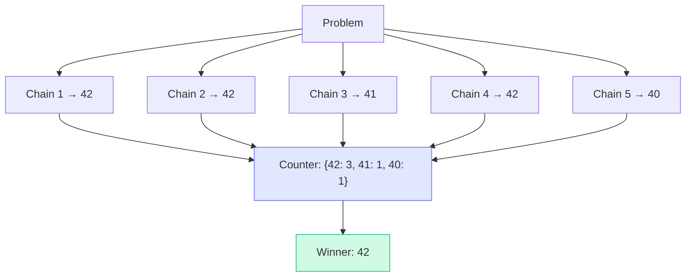

# Patterns: Chain-of-Thought Techniques

## Pattern 1: Zero-Shot CoT

The simplest pattern. Append "Let's think step by step." to your prompt. No examples needed.

```python
import anthropic

client = anthropic.Anthropic()

def solve_zero_shot_cot(problem: str) -> str:
    """Solve a reasoning problem using zero-shot chain-of-thought."""
    prompt = f"""Solve this problem. Think step by step, showing all your work.
End your response with "Therefore, the answer is: [answer]"

Problem: {problem}"""

    response = client.messages.create(
        model="claude-3-haiku-20240307",
        max_tokens=512,
        temperature=0,
        messages=[{"role": "user", "content": prompt}]
    )
    return response.content[0].text


# Example
result = solve_zero_shot_cot(
    "A train travels 60 mph for 2.5 hours, then 80 mph for 1.5 hours. "
    "What is the total distance?"
)
print(result)
# Step 1: First leg — 60 mph × 2.5 h = 150 miles
# Step 2: Second leg — 80 mph × 1.5 h = 120 miles
# Step 3: Total — 150 + 120 = 270 miles
# Therefore, the answer is: 270
```

**When to use:** Any multi-step reasoning problem where you don't have pre-written examples.

---

## Pattern 2: Few-Shot CoT with Explicit Reasoning Examples

Provide complete worked examples — including the full reasoning chain — to establish the expected format and depth of reasoning.

```python
FEW_SHOT_COT_PROMPT = """Solve each math word problem by showing your reasoning step by step.
End each answer with "Therefore, the answer is: [number]"

Example 1:
Problem: A baker makes 3 batches of cookies. Each batch has 24 cookies.
She sells 40 cookies at a market. How many are left?
Solution: The baker makes 3 × 24 = 72 cookies total.
She sells 40, so 72 − 40 = 32 cookies remain.
Therefore, the answer is: 32

Example 2:
Problem: A car park has 5 floors. Each floor holds 48 cars. Currently 127 cars
are parked. How many spaces are free?
Solution: Total spaces = 5 × 48 = 240.
Currently occupied = 127.
Free spaces = 240 − 127 = 113.
Therefore, the answer is: 113

Problem: {problem}
Solution:"""


def solve_few_shot_cot(problem: str) -> str:
    """Solve using few-shot chain-of-thought with worked examples."""
    prompt = FEW_SHOT_COT_PROMPT.format(problem=problem)

    response = client.messages.create(
        model="claude-3-haiku-20240307",
        max_tokens=512,
        temperature=0,
        messages=[{"role": "user", "content": prompt}]
    )
    return response.content[0].text
```

**When to use:** When you want to control the format of reasoning, or when zero-shot CoT produces inconsistent output structure.

---

## Pattern 3: Self-Consistency

Generate N reasoning chains at temperature > 0, extract the final answer from each, take the majority vote.

```python
from collections import Counter

def solve_with_self_consistency(problem: str, n: int = 5) -> str | None:
    """
    Self-consistency: generate n independent reasoning chains,
    take majority vote on the final answer.
    """
    answers = []

    for _ in range(n):
        response = client.messages.create(
            model="claude-3-haiku-20240307",
            max_tokens=512,
            temperature=0.7,   # Non-zero to get variance across chains
            messages=[{
                "role": "user",
                "content": (
                    f"Solve this problem step by step. "
                    f"End with 'Therefore, the answer is: [number]'\n\n"
                    f"Problem: {problem}"
                )
            }]
        )
        answer = extract_answer(response.content[0].text)
        if answer is not None:
            answers.append(answer)

    if not answers:
        return None

    # Majority vote
    counter = Counter(answers)
    most_common_answer, _ = counter.most_common(1)[0]
    return most_common_answer
```



**When to use:** High-stakes reasoning tasks where accuracy matters more than cost. Accuracy gains can be 5–15% on hard benchmarks.

---

## Pattern 4: Extract the Final Answer

CoT responses mix reasoning and the answer. Your application should extract just the answer.

```python
import re

def extract_answer(response: str) -> str | None:
    """
    Extract the final numerical answer from a CoT response.
    Looks for 'Therefore, the answer is: X' pattern.
    Returns the number as a string, or None if not found.
    """
    match = re.search(
        r"Therefore,\s+the\s+answer\s+is:\s*(\d+(?:\.\d+)?)",
        response,
        re.IGNORECASE
    )
    if match:
        return match.group(1)
    return None


# Example
response = """
The store starts with 40 apples.
Monday sales: 40 − 18 = 22 apples.
Tuesday delivery: 22 + 25 = 47 apples.
Therefore, the answer is: 47
"""

answer = extract_answer(response)
print(answer)  # "47"
```

For more complex extraction needs — structured JSON, multiple fields — see Chapter 12: Structured Output.

---

## Putting It Together: Full Pipeline

```python
def math_pipeline(problem: str, use_self_consistency: bool = False) -> dict:
    """Full math-solving pipeline with optional self-consistency."""
    if use_self_consistency:
        answer = solve_with_self_consistency(problem, n=5)
        method = "self-consistency (n=5)"
    else:
        full_response = solve_zero_shot_cot(problem)
        answer = extract_answer(full_response)
        method = "zero-shot CoT"

    return {
        "problem": problem,
        "answer": answer,
        "method": method,
    }
```

---

## Anti-Patterns

<div className="antipattern">

**Anti-pattern 1: Using CoT for simple factual questions**

```python
# WRONG — wastes tokens and money
response = client.messages.create(
    model="claude-3-haiku-20240307",
    max_tokens=512,
    messages=[{
        "role": "user",
        "content": "What is the capital of France? Think step by step."
    }]
)
# Model writes 200 tokens of reasoning about European geography
# when "Paris" would have sufficed in 1 token
```

**Anti-pattern 2: Returning the full reasoning chain to the user**

```python
# WRONG — sends 500 words of scratchpad to the user
def answer_question(q):
    return solve_zero_shot_cot(q)   # returns full CoT response

# CORRECT — extract just the answer
def answer_question(q):
    full_response = solve_zero_shot_cot(q)
    return extract_answer(full_response)  # returns "42"
```

**Anti-pattern 3: Temperature=0 for self-consistency**

```python
# WRONG — all chains are identical at temperature=0, majority vote is meaningless
for _ in range(5):
    response = client.messages.create(
        temperature=0,   # produces the same chain every time
        ...
    )

# CORRECT — use temperature > 0 to get variance across chains
for _ in range(5):
    response = client.messages.create(
        temperature=0.7,  # different chains, meaningful vote
        ...
    )
```

</div>
