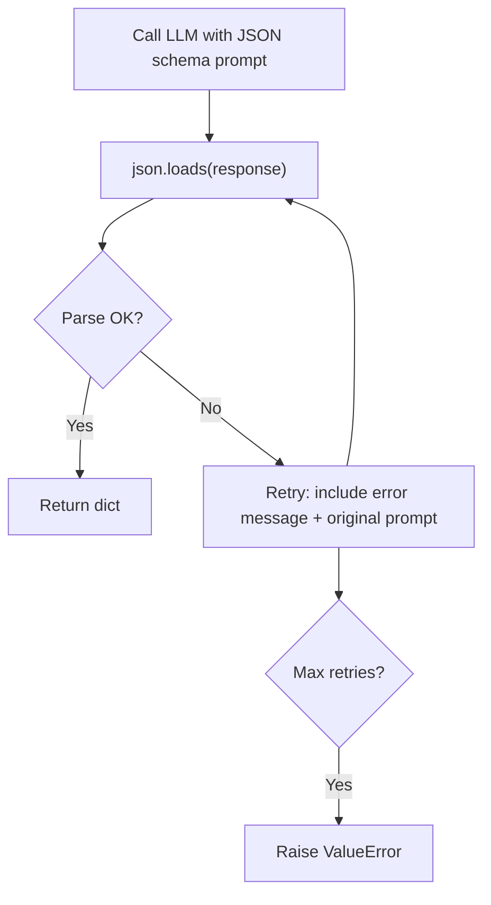
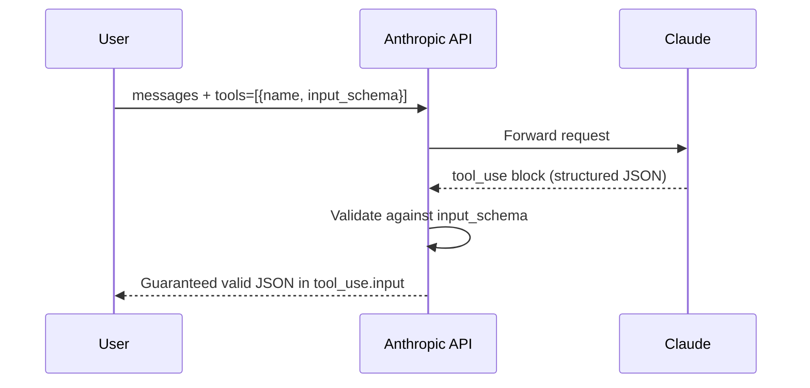
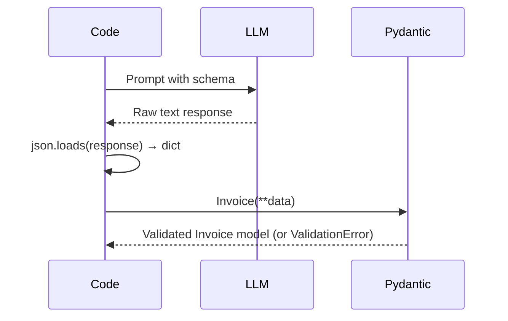

# Concepts: Structured Output

## The Problem

You ask an LLM to extract invoice data. It returns:

> "The invoice is for $150 from ACME Corp dated Jan 5."

That sentence is correct — but you cannot parse it programmatically. Your code needs a dict. `data["vendor"]` will raise a `KeyError` on freeform text. You need JSON.

---

## The Intuition

<div className="concept-intuition">

LLMs are exceptional at understanding and reasoning over text. But their training objective is to predict the next token — not to produce machine-readable output. By default, they write sentences.

Think of it like asking a smart colleague to fill in a form. If you hand them a blank page and say "tell me about this invoice", they'll write a paragraph. If you hand them a form with labelled fields, they'll fill in the fields. You need to give the model the form.

</div>

---

## How It Works

### 1. Prompt-based JSON (simple, fragile)

Add "respond with JSON" to the prompt. Works often, fails unpredictably.

```
Extract the vendor, amount, and date from this invoice. Respond with JSON.

Invoice: ACME Corp — $150 — January 5
```

The model might respond with:

```json
{"vendor": "ACME Corp", "amount": 150, "date": "January 5"}
```

Or it might respond with:

```
Sure! Here's the JSON you requested:
{"vendor": "ACME Corp", "amount": 150, "date": "January 5"}
```

The second response breaks `json.loads` — it starts with text, not `{`.

---

### 2. System prompt enforcement

Move the JSON instruction to the system prompt with strong language, and include the exact schema you want.

```
SYSTEM: You MUST respond with valid JSON only.
        No explanations, no markdown, no code fences. Only the JSON object.
        Required schema: {"vendor": "string", "amount": number, "date": "string"}
```

More reliable, but still not guaranteed. The model can still occasionally add a preamble or wrap the JSON in a code fence.

---

### 3. Temperature = 0

Set `temperature=0` for all structured output tasks. This is critical.

Higher temperature introduces randomness in token selection. That randomness is useful for creative tasks but fatal for format consistency. A temperature of 0.7 might produce valid JSON 90% of the time. Temperature 0 pushes that closer to 100% for well-designed prompts.

**Rule of thumb:** Any time you need deterministic, machine-readable output, use `temperature=0`.

---

### 4. JSON extraction with retry

Parse the response. If `json.loads` fails, tell the model what went wrong and ask again. Repeat up to 3 times.



This catches the cases where the model occasionally adds preamble text or formatting quirks.

---

### 5. Tool/function calling — most reliable

Anthropic's tool use feature lets you define an `input_schema` that the model must conform to. The API validates and enforces the schema before returning — invalid JSON is structurally impossible.



This is the production-grade approach. The schema is enforced at the API level, not just by the prompt.

---

### 6. Pydantic validation

Even when JSON parses successfully, the data might be wrong: `amount` is a string instead of a float, `items` is missing, or a field has the wrong type. Pydantic catches these after parsing.



---

## Key Terms

| Term | Definition |
|------|------------|
| **Structured output** | LLM responses formatted as machine-readable data (JSON, XML, etc.) rather than freeform text |
| **JSON schema** | A description of the expected keys, types, and structure of a JSON object |
| **Pydantic** | A Python library for data validation using type annotations |
| **Serialization** | Converting a Python object to a string (e.g., JSON) for storage or transport |
| **Tool calling** | Anthropic's API feature where you define a schema and the model is forced to respond with conforming JSON |
| **Output parsing** | Extracting structured data from model responses |
| **Validation** | Checking that extracted data conforms to expected types and constraints |

---

## The Interview Angle

<div className="interview-angle">

**"How do you guarantee JSON output from an LLM?"**

The gold-standard answer is: use tool calling (Anthropic function calling with `input_schema`). The API enforces the schema before returning the response, so invalid JSON is impossible at the transport level.

Prompt-based approaches ("respond with JSON") are fragile — they work most of the time but fail under load in production. A good answer acknowledges the spectrum:

1. Prompt-only: simple, ~90% reliable
2. System prompt + temperature=0: ~95% reliable
3. Retry loop: recovers from most failures, ~99% reliable
4. Tool calling: API-enforced, structurally guaranteed

Mention Pydantic for type validation after parsing — getting valid JSON back isn't enough if `amount` is `"150"` (string) instead of `150.0` (float).

</div>

---

## Common Mistakes

<div className="antipattern">

**Not setting temperature=0** — Even a small temperature introduces format variance. Always use `temperature=0` for extraction tasks.

**Not wrapping `json.loads` in try/except** — A single malformed response crashes your pipeline in production. Always catch `json.JSONDecodeError`.

**Not specifying the schema in the prompt** — Saying "respond with JSON" lets the model invent arbitrary keys. Always specify the exact schema: field names, types, and nesting.

**Trusting LLM output without validation** — Parsing succeeds doesn't mean the data is correct. Use Pydantic or manual checks to verify types and required fields.

**Using code fences in the prompt without stripping them** — If your prompt uses a JSON example in a code block, the model often mirrors the code fence in its response. Strip fences before parsing, or explicitly say "no code fences".

</div>

---

## Further Reading

- [Anthropic Tool Use Documentation](https://docs.anthropic.com/en/docs/build-with-claude/tool-use) — API-enforced structured output
- [Pydantic Documentation](https://docs.pydantic.dev/) — Python data validation
- [Instructor library](https://github.com/jxnl/instructor) — popular wrapper that adds Pydantic validation to LLM calls
