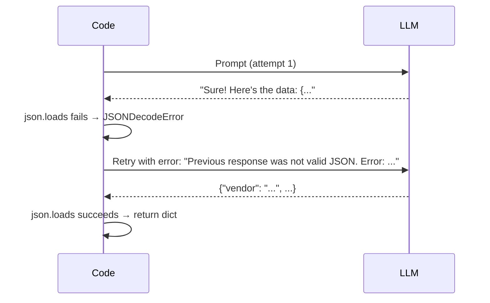

# Patterns: Structured Output Techniques

## Pattern 1: JSON Schema in System Prompt

The simplest approach. Put the schema in the system prompt with strong instructions. Use `temperature=0`.

```python
import json
import anthropic

client = anthropic.Anthropic()

SYSTEM_PROMPT = """You are a data extraction assistant.
You MUST respond with valid JSON only.
No explanations, no markdown code fences, no preamble. Only the JSON object.

Required schema:
{
  "vendor": "string — company name",
  "amount": "number — total amount as float",
  "currency": "string — e.g. USD",
  "date": "string — YYYY-MM-DD"
}"""

def extract_simple(text: str) -> dict:
    response = client.messages.create(
        model="claude-3-haiku-20240307",
        max_tokens=512,
        temperature=0,
        system=SYSTEM_PROMPT,
        messages=[{"role": "user", "content": f"Extract invoice data:\n\n{text}"}]
    )
    return json.loads(response.content[0].text)

result = extract_simple("Invoice from TechCorp for $299.99 USD on 2024-03-15")
print(result)
# {'vendor': 'TechCorp', 'amount': 299.99, 'currency': 'USD', 'date': '2024-03-15'}
```

**When to use:** Prototyping, internal tools, low-stakes extraction where occasional failures are acceptable.

**Failure mode:** The model occasionally adds preamble text or wraps JSON in code fences, causing `json.loads` to raise `JSONDecodeError`.

---

## Pattern 2: JSON with Retry Loop

Catch parse failures and retry with error feedback. The model can usually correct itself when you show it what went wrong.



```python
import json
import anthropic

client = anthropic.Anthropic()

def parse_json_with_retry(prompt: str, max_retries: int = 3) -> dict:
    """Call LLM and retry on JSON parse failures, passing error feedback."""
    messages = [{"role": "user", "content": prompt}]

    for attempt in range(max_retries):
        response = client.messages.create(
            model="claude-3-haiku-20240307",
            max_tokens=512,
            temperature=0,
            system="Respond with valid JSON only. No explanations or code fences.",
            messages=messages
        )
        raw = response.content[0].text.strip()

        try:
            return json.loads(raw)
        except json.JSONDecodeError as e:
            if attempt == max_retries - 1:
                raise ValueError(
                    f"Failed to parse JSON after {max_retries} attempts. "
                    f"Last response: {raw!r}"
                ) from e

            # Feed the error back to the model for self-correction
            messages.append({"role": "assistant", "content": raw})
            messages.append({
                "role": "user",
                "content": (
                    f"Your response was not valid JSON. "
                    f"Parse error: {e}. "
                    f"Please respond with ONLY the JSON object, nothing else."
                )
            })

    raise ValueError("Unreachable")
```

**When to use:** Production pipelines where reliability matters but tool calling is too complex to set up quickly.

**Key insight:** The error message tells the model exactly what went wrong. "Your response started with 'Sure!' which is not valid JSON" is more useful than a generic retry.

---

## Pattern 3: Tool Calling for Structured Output

The most reliable approach. Define the schema as a tool `input_schema`. The API enforces it — invalid JSON is impossible.

```python
import anthropic

client = anthropic.Anthropic()

INVOICE_TOOL = {
    "name": "extract_invoice",
    "description": "Extract structured invoice data from the provided text.",
    "input_schema": {
        "type": "object",
        "properties": {
            "vendor": {
                "type": "string",
                "description": "The vendor or company name"
            },
            "amount": {
                "type": "number",
                "description": "Total invoice amount as a float"
            },
            "currency": {
                "type": "string",
                "description": "Currency code, e.g. USD, EUR, GBP"
            },
            "date": {
                "type": "string",
                "description": "Invoice date in YYYY-MM-DD format"
            },
            "items": {
                "type": "array",
                "items": {
                    "type": "object",
                    "properties": {
                        "description": {"type": "string"},
                        "price": {"type": "number"}
                    },
                    "required": ["description", "price"]
                }
            }
        },
        "required": ["vendor", "amount", "currency", "date", "items"]
    }
}

def extract_with_tool_calling(text: str) -> dict:
    """Extract invoice data using tool calling — API-enforced schema."""
    response = client.messages.create(
        model="claude-3-haiku-20240307",
        max_tokens=1024,
        temperature=0,
        tools=[INVOICE_TOOL],
        tool_choice={"type": "tool", "name": "extract_invoice"},
        messages=[{
            "role": "user",
            "content": f"Extract invoice data from this text:\n\n{text}"
        }]
    )

    # Find the tool_use block in the response
    for block in response.content:
        if block.type == "tool_use" and block.name == "extract_invoice":
            return block.input  # Already a validated dict — no json.loads needed

    raise ValueError("No tool_use block found in response")

result = extract_with_tool_calling(
    "Invoice #1042 from CloudHost Inc. $89.00 USD on 2024-01-15. "
    "Items: Server hosting $79.00, Domain renewal $10.00"
)
print(result)
```

**When to use:** Production systems, high-volume processing, anywhere JSON validity must be guaranteed.

**Key advantage:** `block.input` is already a Python dict — no `json.loads` required. The schema is validated by the API.

---

## Pattern 4: Pydantic Validation

After parsing JSON, validate field types and business rules with Pydantic. Catches type mismatches that `json.loads` misses.

```python
from pydantic import BaseModel, field_validator
from typing import List
import json

class InvoiceItem(BaseModel):
    description: str
    price: float

class Invoice(BaseModel):
    vendor: str
    amount: float
    currency: str
    date: str
    items: List[InvoiceItem]

    @field_validator("amount")
    @classmethod
    def amount_must_be_positive(cls, v: float) -> float:
        if v <= 0:
            raise ValueError("Amount must be positive")
        return v

    @field_validator("currency")
    @classmethod
    def currency_must_be_uppercase(cls, v: str) -> str:
        return v.upper()

def parse_and_validate(raw_json: str) -> Invoice:
    """Parse JSON string and validate against Invoice model."""
    data = json.loads(raw_json)        # Step 1: parse JSON
    invoice = Invoice(**data)          # Step 2: validate types and constraints
    return invoice

# Usage
raw = '{"vendor": "ACME", "amount": "150", "currency": "usd", "date": "2024-01-05", "items": []}'
try:
    invoice = parse_and_validate(raw)
    print(invoice.amount)     # 150.0 — Pydantic coerced "150" string to float
    print(invoice.currency)   # "USD" — validator uppercased it
except Exception as e:
    print(f"Validation failed: {e}")
```

**When to use:** Whenever you need type guarantees beyond what `json.loads` provides. Especially useful when feeding extracted data into downstream systems that have strict type requirements.

---

## Anti-Patterns

<div className="antipattern">

**Asking for JSON without specifying the schema**

```python
# Bad — model invents arbitrary keys
"Extract the invoice data as JSON."

# Good — model knows exactly what to produce
"Extract invoice data as JSON with this schema: {vendor, amount, currency, date}"
```

**Not handling JSONDecodeError**

```python
# Bad — crashes in production when LLM adds preamble
data = json.loads(response.text)

# Good — handle and retry or raise with context
try:
    data = json.loads(response.text)
except json.JSONDecodeError as e:
    raise ValueError(f"LLM returned invalid JSON: {e}\nResponse: {response.text!r}")
```

**Using high temperature for extraction**

```python
# Bad — format variance causes parse failures at scale
response = client.messages.create(..., temperature=0.7)

# Good — deterministic output
response = client.messages.create(..., temperature=0)
```

</div>
