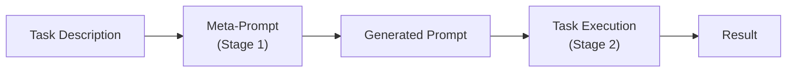

# Concepts: Role + Meta Prompting

## The Problem

You ask an LLM: "Explain photosynthesis."

You get a mediocre paragraph — correct, but flat. No structure, no scaffolding, no acknowledgement of what the reader already knows.

Now you ask: "You are a biology professor teaching first-year university students. Explain photosynthesis."

You get a structured, pedagogically sound answer with an analogy, a step-by-step breakdown, and a check for understanding at the end. Same model. Same question. Completely different quality.

Role matters.

---

## The Intuition

**Role prompting** works because the model has seen vast amounts of text written by and about specific roles during pre-training. When you say "You are a senior security engineer", you activate the model's knowledge in that domain's vocabulary, structure, and reasoning patterns — the same way a job title on a business card signals what kind of conversation you're in.

**Meta-prompting** flips the script: instead of struggling to write the perfect prompt yourself, you ask the LLM to write it for you. "Write a prompt that would make an LLM produce excellent, idiomatic Python code with error handling and type hints." The model generates a detailed, field-tested prompt. You then use that generated prompt for your actual coding tasks.

Think of meta-prompting as hiring a prompt consultant who works for free and never gets tired.

---

## How It Works

### 1. Role Prompting

The basic form is: `"You are a [role] with [expertise] and [constraints]."`

More specificity produces better results.

| Vague | Specific |
|-------|----------|
| "You are an expert" | "You are a senior Python engineer with 10 years of FastAPI experience, reviewing code for security vulnerabilities" |
| "You are a writer" | "You are a technical writer at a developer tools company, writing for an audience of intermediate Python developers" |
| "You are a teacher" | "You are a high-school chemistry teacher explaining concepts to 16-year-olds who have just completed their first year of chemistry" |

The role description is typically placed in the **system prompt**, so it applies to the entire conversation rather than just one turn.

---

### 2. Why Roles Work

During pre-training, the model ingested vast corpora of text from the internet — documentation, textbooks, code, forum posts, books, and much more. That corpus contains text written **by** experts in every domain, and text written **about** those domains for different audiences.

When you include a role in the system prompt, you steer the model's output distribution toward the writing style, vocabulary, reasoning patterns, and structural choices typical of that role. A "senior security engineer reviewing for vulnerabilities" activates threat-modelling vocabulary and adversarial reasoning. A "high school teacher explaining to beginners" activates analogies, simplified language, and progressive scaffolding.

The model is not pretending — it is sampling from the part of its knowledge that best matches the role you described.

---

### 3. Meta-Prompting

Meta-prompting is a two-stage process:

1. **Stage 1 (generate):** Give the model a task description and ask it to write a prompt for that task.
2. **Stage 2 (execute):** Take the generated prompt and use it for your actual task.

You are not writing the prompt yourself — you are describing the goal, and the model handles prompt engineering.

**When is this useful?**
- You need a high-quality prompt for a domain you are not expert in
- You want to generate many prompt variants quickly for A/B testing
- You are building a system where prompts are generated dynamically at runtime

---

### 4. Prompt Chaining

Prompt chaining extends meta-prompting into a multi-step pipeline. Each LLM call produces output that feeds the next call. Different stages can carry different roles.

**Example: blog post pipeline**
1. **Researcher role** → generates an outline from a topic
2. **Writer role** → expands each outline section into prose
3. **Editor role** → reviews and tightens the draft
4. **SEO specialist role** → optimises title and meta description

Each stage uses the output of the previous one as its input. The roles ensure each stage operates with the right expertise and framing.

---

## Key Terms

| Term | Definition |
|------|------------|
| **Role prompting** | Assigning an expert persona to the model via the system prompt to steer domain vocabulary, structure, and reasoning style |
| **Persona** | The specific role, expertise level, and constraints assigned to the model |
| **Meta-prompting** | Using an LLM to generate or improve a prompt for a specific task |
| **Prompt chaining** | Multiple sequential LLM calls where each output feeds the next, often with different roles per stage |
| **Prompt engineering** | The practice of designing inputs that reliably elicit the desired model behaviour |
| **Few-shot of prompts** | Providing example prompts in the meta-prompt to guide the style and format of generated prompts |

---

## The Interview Angle

**"How do you get more expert-level responses on technical topics?"**

The strong answer is: role-prompt with a specific expertise, include relevant constraints, and specify the target audience.

Walk through the spectrum:
1. **No role:** generic answer, mid-level vocabulary, no domain structure
2. **Vague role ("You are an expert"):** marginal improvement — the model doesn't know which domain or depth to activate
3. **Specific role ("You are a senior Python engineer with FastAPI experience, reviewing for security vulnerabilities, writing for a team lead who needs actionable feedback"):** activates the right knowledge distribution, produces structured, actionable output

Mention meta-prompting as a way to scale prompt quality: instead of hand-crafting every prompt, use the LLM to generate and refine prompts for each task type.

---

## Common Mistakes

**Using a vague role**

`"You are an expert"` tells the model almost nothing. Expert in what? For whom? With what constraints? The model defaults to a generic, safe answer.

Always specify: domain, seniority/depth, task context, and target audience.

---

**Overcomplicating meta-prompting when direct prompting works**

Meta-prompting adds a network call and latency. If you already know how to write a good prompt for a task, write it directly. Meta-prompting shines when:
- You need many variants quickly
- The task domain is unfamiliar to you
- Prompts need to be generated dynamically at runtime

---

**Not testing generated prompts**

Generated prompts can be poor quality. A meta-prompt that asks for "a prompt to write good code" might produce something generic and unhelpful. Always evaluate generated prompts against real inputs before using them in production.

---

## Further Reading

- [Anthropic Prompt Engineering Guide](https://docs.anthropic.com/en/docs/build-with-claude/prompt-engineering/overview) — official techniques including role prompting
- [Automatic Prompt Engineer (APE)](https://arxiv.org/abs/2211.01910) — research paper on automatic prompt generation and selection
