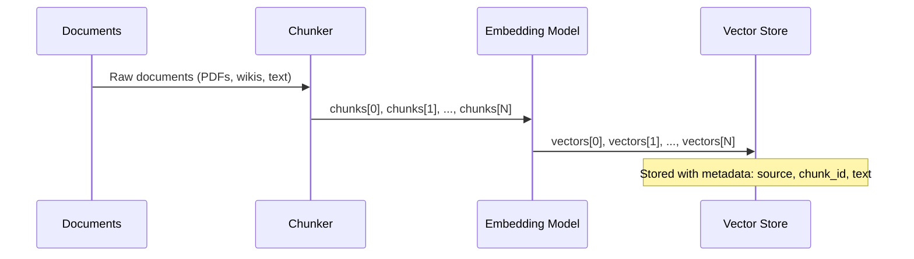
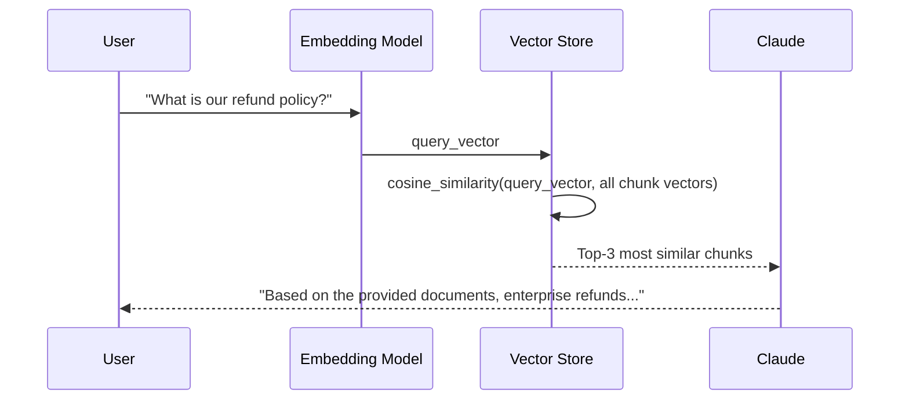
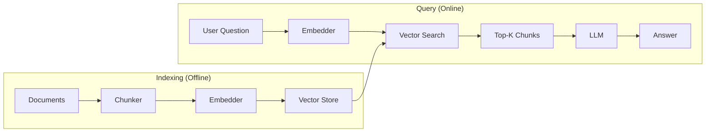

# Concepts: Retrieval-Augmented Generation

## The Problem

You have 10,000 internal company documents — wikis, PDFs, support tickets, runbooks. An employee asks:

> "What's our refund policy for enterprise customers?"

If you send this question to an LLM, it will either:

1. Hallucinate a plausible-sounding but wrong answer based on training data
2. Correctly say "I don't have access to your internal documents"

Neither is useful. The LLM was trained on public internet data up to a cutoff date. It has no knowledge of your internal documents. Fine-tuning would be expensive, slow to update, and still wouldn't reliably cite sources.

**RAG solves this**: it lets you query your documents with natural language — no fine-tuning required, no stale knowledge problem, with citations to the source documents.

---

## The Intuition

**RAG = Google + LLM.**

Think of Google: you type a question, it finds the most relevant web pages, then you read those pages and form an answer. RAG does the same thing, but the "reading and answering" step is done by an LLM instead of a human.

1. **Retrieval** — find the most relevant document snippets (like Google finding the right pages)
2. **Generation** — have the LLM read those snippets and answer the question (like a human expert reading the results)

The LLM doesn't need to "know" the answer from training. You provide the relevant knowledge in the prompt context. The LLM's job is just to synthesise and explain — which it's very good at.

---

## How It Works

RAG has two distinct phases: an offline **indexing phase** and an online **query phase**.

### Phase 1: Indexing (Offline)

You do this once (or whenever documents change):

1. **Split** your documents into chunks (e.g., 200–400 words each)
2. **Embed** each chunk using an embedding model — this converts each chunk into a vector of numbers that captures its meaning
3. **Store** the vectors in a vector database (or in-memory list for small corpora)

### Phase 2: Query (Online)

You do this on every user question:

1. **Embed** the user's question using the same embedding model
2. **Search** the vector store for the top-k chunks whose vectors are most similar to the question vector
3. **Inject** those chunks into an LLM prompt as context
4. **Generate** an answer — the LLM reads the provided context and answers the question

### Why This Works

The LLM gets the relevant information delivered directly into its context window. It doesn't need to retrieve anything from memory — it just needs to read and reason over the provided text. This is exactly what LLMs are exceptional at.

The embedding search step ensures that only the most relevant chunks are included, keeping the context focused and preventing context window overflow.

---

## Full Pipeline Diagrams

### Indexing Phase (Run Once)

### Query Phase (Run Per Request)

### Architecture Overview

---

## Naive RAG Limitations

The basic RAG pipeline described above is the right starting point, but it has known failure modes:

| Problem | Cause | Fix |
|---------|-------|-----|
| Wrong chunks retrieved | Chunk size too large — retrieves broad context, not the specific answer | Smaller chunks with overlap |
| Missing context | Chunk size too small — the answer spans multiple chunks | Larger chunks or parent-child chunking |
| Off-topic retrieval | No similarity threshold — any chunk can be returned | Filter chunks below a similarity cutoff |
| Context overflow | Too many chunks injected into prompt | Limit top-k; use re-ranking |
| No attribution | Chunks injected without source metadata | Label each chunk with its source document |

---

## Key Terms

| Term | Definition |
|------|------------|
| **RAG** | Retrieval-Augmented Generation — a pattern that retrieves relevant documents and injects them into an LLM prompt before generating an answer |
| **Retrieval-augmented generation** | Full name for RAG |
| **Vector store** | A database (or in-memory structure) that stores embedding vectors and supports similarity search |
| **Chunk** | A segment of a document (typically 100–500 words) that is embedded and stored as a unit |
| **Embedding** | A dense numerical vector representing the semantic meaning of a piece of text |
| **Top-k retrieval** | Returning the k most similar chunks to a query, ranked by cosine similarity |
| **Context injection** | Adding retrieved chunks into the LLM prompt before the user's question |
| **Grounding** | The practice of tying LLM answers to specific source documents, reducing hallucination |

---

## The Interview Angle

**"How would you build a Q&A system for 10,000 internal company documents?"**

The complete answer follows the RAG pipeline:

**Indexing (offline):**
1. Extract text from PDFs, wikis, etc. using a document parser
2. Split each document into chunks (e.g., 300 words with 50-word overlap)
3. Embed each chunk using `text-embedding-3-small` (OpenAI) or equivalent
4. Store vectors + metadata (source, chunk text, document ID) in a vector DB (Pinecone, Chroma, pgvector)

**Query (online, per request):**
1. Embed the user's question
2. Run cosine similarity search against the vector DB — return top-3 to top-5 chunks
3. Format chunks as context in the system/user prompt with source labels
4. Call Claude with the context + question
5. Return the answer with citations to the source documents

**Production considerations to mention:**
- Chunking strategy (size, overlap, semantic vs. fixed-size)
- Similarity threshold — don't return chunks below 0.7 similarity
- Re-ranking step (cross-encoder) for higher precision
- Hybrid search (BM25 + embeddings) for better recall

---

## Common Mistakes

**Chunks too large (1000+ tokens)** — Retrieval becomes imprecise. A 1000-token chunk covers many topics. The similarity score averages over all of them, so a chunk about "refund policies and shipping times and return labels" will match weakly on any single topic. Use 200–400 word chunks.

**Chunks too small (1 sentence)** — The answer to most questions requires several sentences of context. A single sentence rarely provides enough information for the LLM to generate a complete answer.

**No similarity threshold** — If the user asks a question that has no relevant document, the top-k chunks will still be returned (just with low similarity). The LLM will then try to answer from irrelevant context. Always check similarity scores and fall back to "I don't have information on that" when all scores are below a threshold.

**Injecting too many chunks** — More context isn't always better. Injecting 20 chunks dilutes the relevant information and can cause the LLM to synthesise contradictory content. Start with top-3 and tune from there.

**Not labelling chunks with their source** — The LLM cannot cite sources it wasn't told about. Always label each injected chunk: `[Source: refund-policy-v2.pdf]`.

---

## Further Reading

- [Lewis et al. (2020) — "Retrieval-Augmented Generation for Knowledge-Intensive NLP Tasks"](https://arxiv.org/abs/2005.11401) — the original RAG paper
- [LangChain RAG Documentation](https://python.langchain.com/docs/use_cases/question_answering/) — practical RAG implementation guide
- [LlamaIndex](https://www.llamaindex.ai/) — a framework specifically designed for building RAG pipelines over your data
