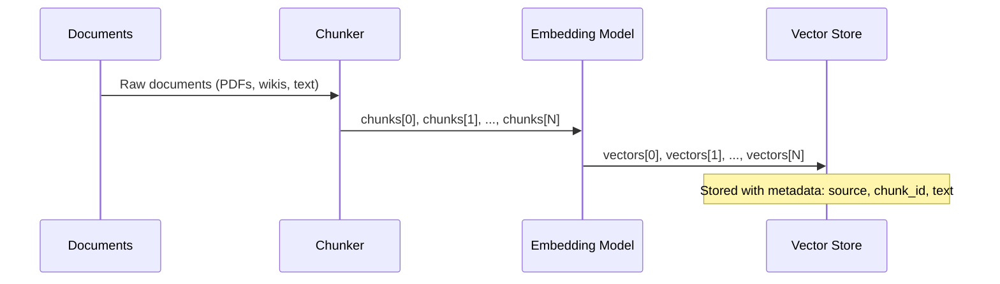
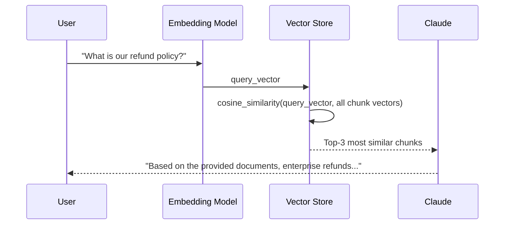
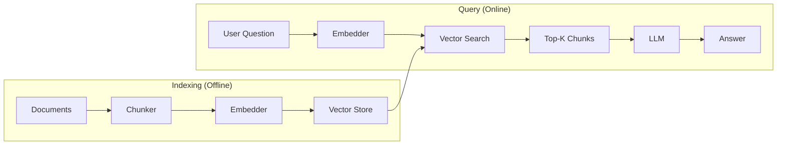
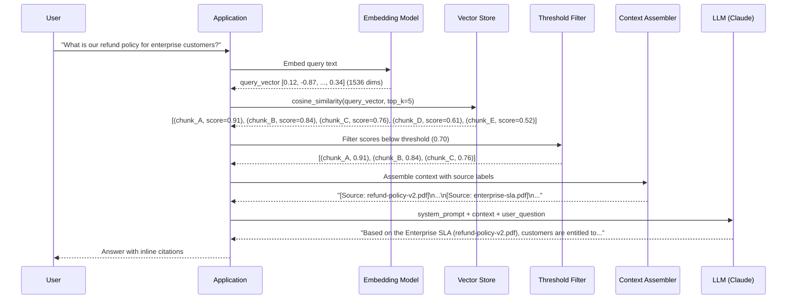

# Concepts: Retrieval-Augmented Generation

## The Problem

You have 10,000 internal company documents — wikis, PDFs, support tickets, runbooks. An employee asks:

> "What's our refund policy for enterprise customers?"

If you send this question to an LLM, it will either:

1. Hallucinate a plausible-sounding but wrong answer based on training data
2. Correctly say "I don't have access to your internal documents"

Neither is useful. The LLM was trained on public internet data up to a cutoff date. It has no knowledge of your internal documents. Fine-tuning would be expensive, slow to update, and still wouldn't reliably cite sources.

**RAG solves this**: it lets you query your documents with natural language — no fine-tuning required, no stale knowledge problem, with citations to the source documents.

---

## The Intuition

**RAG = Google + LLM.**

Think of Google: you type a question, it finds the most relevant web pages, then you read those pages and form an answer. RAG does the same thing, but the "reading and answering" step is done by an LLM instead of a human.

1. **Retrieval** — find the most relevant document snippets (like Google finding the right pages)
2. **Generation** — have the LLM read those snippets and answer the question (like a human expert reading the results)

The LLM doesn't need to "know" the answer from training. You provide the relevant knowledge in the prompt context. The LLM's job is just to synthesise and explain — which it's very good at.

---

## How It Works

RAG has two distinct phases: an offline **indexing phase** and an online **query phase**.

### Phase 1: Indexing (Offline)

You do this once (or whenever documents change):

1. **Split** your documents into chunks (e.g., 200–400 words each)
2. **Embed** each chunk using an embedding model — this converts each chunk into a vector of numbers that captures its meaning
3. **Store** the vectors in a vector database (or in-memory list for small corpora)

### Phase 2: Query (Online)

You do this on every user question:

1. **Embed** the user's question using the same embedding model
2. **Search** the vector store for the top-k chunks whose vectors are most similar to the question vector
3. **Inject** those chunks into an LLM prompt as context
4. **Generate** an answer — the LLM reads the provided context and answers the question

### Why This Works

The LLM gets the relevant information delivered directly into its context window. It doesn't need to retrieve anything from memory — it just needs to read and reason over the provided text. This is exactly what LLMs are exceptional at.

The embedding search step ensures that only the most relevant chunks are included, keeping the context focused and preventing context window overflow.

---

## Full Pipeline Diagrams

### Indexing Phase (Run Once)

### Query Phase (Run Per Request)

### Architecture Overview

---

## Naive RAG Limitations

The basic RAG pipeline described above is the right starting point, but it has known failure modes:

| Problem | Cause | Fix |
|---------|-------|-----|
| Wrong chunks retrieved | Chunk size too large — retrieves broad context, not the specific answer | Smaller chunks with overlap |
| Missing context | Chunk size too small — the answer spans multiple chunks | Larger chunks or parent-child chunking |
| Off-topic retrieval | No similarity threshold — any chunk can be returned | Filter chunks below a similarity cutoff |
| Context overflow | Too many chunks injected into prompt | Limit top-k; use re-ranking |
| No attribution | Chunks injected without source metadata | Label each chunk with its source document |

---

## How Retrieval Actually Works

Understanding the mechanics behind each step helps you debug failures and tune performance. Here is the complete request lifecycle from raw user input to a cited response.

**What each step is doing:**

- **Embed query** — The query string is converted into the same vector space as your indexed chunks. Semantic similarity becomes geometric proximity.
- **Vector search** — The vector store computes cosine similarity between the query vector and every stored chunk vector. This is fast (milliseconds) even over millions of vectors because approximate nearest-neighbour indexes (HNSW, IVF) are used under the hood.
- **Threshold filter** — Raw top-k results always return *something*, even when no chunk is relevant. The threshold filter discards results whose similarity score falls below a minimum (0.70 is a sensible default). Without this step, the LLM will confidently answer from irrelevant context.
- **Context assembly** — Retrieved chunks are formatted with source labels before being inserted into the prompt. The label is what makes citations possible — the LLM can only reference sources it was told about.
- **LLM call** — The LLM receives a prompt that contains the assembled context and the original question. It never "searches" anything itself; it only reads what you gave it and synthesises an answer.
- **Response with citations** — Because each chunk is labelled, a well-prompted LLM will ground its answer in specific sources, making the output auditable.

---

## Design Decisions That Matter

The naive pipeline works in a notebook demo. Production requires deliberate choices at each configuration point.

### Chunk Size vs. Retrieval Precision

Chunk size is the single most impactful tuning decision. Every chunk is embedded as one vector, so the vector represents the *average* semantic content of the whole chunk. Larger chunks average over more topics, which dilutes the signal.

| Chunk Size | Behaviour | Best For |
|------------|-----------|----------|
| **256 tokens** | High precision — the retrieved chunk is tightly focused on one idea. Low recall — multi-part answers may be split across chunks that are never co-retrieved. | FAQ lookups, policy clauses, definitions |
| **512 tokens** | Balanced — good precision with enough context for single-topic answers. The practical sweet spot for most knowledge bases. | General Q&A, support docs, runbooks |
| **1024 tokens** | High recall — rarely misses the right passage. Low precision — the retrieved chunk contains extra noise that can distract the LLM or push you over token limits. | Long-form technical docs where answers require extended context |

**Overlap matters too.** Use a 10–15% overlap between consecutive chunks (e.g., a 50-token overlap on a 512-token chunk). This prevents answers that happen to sit at a chunk boundary from being split across two chunks that may not both be retrieved.

### Embedding Model Choice

The embedding model determines the quality of your vector space. Every chunk and every query is mapped to a point in that space — the model decides how meaningful those positions are.

| Model | Dimensions | Cost (approx.) | When to Use |
|-------|------------|----------------|-------------|
| `text-embedding-3-small` | 1536 | ~$0.02 / 1M tokens | Cost-effective default. Excellent for English-language corpora. Good starting point for any project. |
| `text-embedding-3-large` | 3072 | ~$0.13 / 1M tokens | Higher quality representation. Worth the cost when retrieval precision is critical (legal, medical, compliance use cases) or when your corpus is multilingual. |

For a 10,000-document corpus with average 500 tokens per document, the full indexing run costs roughly $0.10 with `text-embedding-3-small` and $0.65 with `text-embedding-3-large`. The query-time cost is negligible — one embedding call per user query.

**Critical rule:** always use the same model for indexing and querying. Mixing models produces incompatible vector spaces and nonsensical similarity scores.

### Top-k Selection

Top-k controls how many chunks are retrieved and injected into the LLM prompt.

**Why 3–5 is the sweet spot:**

- At k=1, you have high precision but fragile recall. If the single retrieved chunk is slightly off, the whole answer fails.
- At k=3–5, you get coverage for multi-part questions and resilience against one slightly-mismatched chunk, without overwhelming the LLM with noisy context.
- Beyond k=7–10, the returns diminish rapidly. Empirically, the 6th-retrieved chunk rarely contains information not already covered by the top 5. More importantly, injecting 10+ chunks pushes you toward the "lost in the middle" problem — LLMs attend more strongly to the beginning and end of context, so middle chunks are often effectively ignored.

**Tuning heuristic:** start at k=3, measure answer quality on a held-out evaluation set, increment by 1 until quality stops improving. For most corpora, quality plateaus between k=3 and k=5.

### Similarity Threshold

The similarity threshold is your quality gate. It prevents the system from answering questions when no relevant document exists.

**0.70 as a starting point:** cosine similarity scores above 0.70 generally indicate genuine semantic overlap between the query and the chunk. Scores in the 0.50–0.69 range are often coincidental — the model found words in common but not shared meaning. Scores below 0.50 are essentially random matches.

**How to calibrate:**

1. Collect 50–100 representative questions from your domain.
2. Run retrieval and record the similarity scores for the top-1 result.
3. Manually label each result as "relevant" or "irrelevant".
4. Find the score threshold that maximises F1 (or precision, if false positives are costly) on your labelled set.
5. For most general knowledge bases, this lands between 0.68 and 0.75.

**What to do when all chunks fall below the threshold:** return a controlled fallback — "I don't have information on that topic in the available documents." This is far better than confidently answering from irrelevant context.

---

## Mental Model: RAG vs. Fine-tuning

Both RAG and fine-tuning are ways to make an LLM useful for a specific domain. They solve different problems and should not be seen as interchangeable.

| Dimension | RAG | Fine-tuning |
|-----------|-----|-------------|
| **What you're changing** | What the model *sees* at inference time | What the model *knows* from training |
| **Knowledge updates** | Real-time — update the vector store, no retraining | Slow — requires re-running (or re-running a portion of) training |
| **Citeability** | Native — every answer can reference the exact source chunk | Hard — the model learned from examples, not retrievable documents |
| **Cost** | Low upfront, pay per query for embeddings | High upfront (compute for training), lower per-query after |
| **Data required** | Any documents in any format | Hundreds to thousands of labelled examples |
| **Best for** | Dynamic, factual, citable knowledge — internal docs, product catalogs, support bases, legal corpora | Style, tone, format, task-specific behaviour — write like our brand, always respond in JSON, follow our triage protocol |

**The practical decision rule:**

- If the question is "how do I make the model *know* our documentation?" → use RAG.
- If the question is "how do I make the model *behave* a certain way consistently?" → use fine-tuning.
- If both are required (e.g., a customer support bot that must know your products AND always respond in a specific structured format) → combine them: fine-tune for behaviour, RAG for knowledge.

**Why RAG beats fine-tuning for factual knowledge:**

Fine-tuning encodes knowledge into model weights. Weights are static — the moment your policy document changes, the fine-tuned model is wrong. More subtly, fine-tuned models often fail to surface *which* training example informed a given output, making errors hard to trace. RAG keeps knowledge in a versioned, queryable store. When the policy changes, you re-index one document. When an answer is wrong, you inspect the retrieved chunks. The system is auditable by design.

---

## Key Terms

| Term | Definition |
|------|------------|
| **RAG** | Retrieval-Augmented Generation — a pattern that retrieves relevant documents and injects them into an LLM prompt before generating an answer |
| **Retrieval-augmented generation** | Full name for RAG |
| **Vector store** | A database (or in-memory structure) that stores embedding vectors and supports similarity search |
| **Chunk** | A segment of a document (typically 100–500 words) that is embedded and stored as a unit |
| **Embedding** | A dense numerical vector representing the semantic meaning of a piece of text |
| **Top-k retrieval** | Returning the k most similar chunks to a query, ranked by cosine similarity |
| **Context injection** | Adding retrieved chunks into the LLM prompt before the user's question |
| **Grounding** | The practice of tying LLM answers to specific source documents, reducing hallucination |

---

## The Interview Angle

**"How would you build a Q&A system for 10,000 internal company documents?"**

The complete answer follows the RAG pipeline:

**Indexing (offline):**
1. Extract text from PDFs, wikis, etc. using a document parser
2. Split each document into chunks (e.g., 300 words with 50-word overlap)
3. Embed each chunk using `text-embedding-3-small` (OpenAI) or equivalent
4. Store vectors + metadata (source, chunk text, document ID) in a vector DB (Pinecone, Chroma, pgvector)

**Query (online, per request):**
1. Embed the user's question
2. Run cosine similarity search against the vector DB — return top-3 to top-5 chunks
3. Format chunks as context in the system/user prompt with source labels
4. Call Claude with the context + question
5. Return the answer with citations to the source documents

**Production considerations to mention:**
- Chunking strategy (size, overlap, semantic vs. fixed-size)
- Similarity threshold — don't return chunks below 0.7 similarity
- Re-ranking step (cross-encoder) for higher precision
- Hybrid search (BM25 + embeddings) for better recall

---

## Common Mistakes

**Chunks too large (1000+ tokens)** — Retrieval becomes imprecise. A 1000-token chunk covers many topics. The similarity score averages over all of them, so a chunk about "refund policies and shipping times and return labels" will match weakly on any single topic. Use 200–400 word chunks.

**Chunks too small (1 sentence)** — The answer to most questions requires several sentences of context. A single sentence rarely provides enough information for the LLM to generate a complete answer.

**No similarity threshold** — If the user asks a question that has no relevant document, the top-k chunks will still be returned (just with low similarity). The LLM will then try to answer from irrelevant context. Always check similarity scores and fall back to "I don't have information on that" when all scores are below a threshold.

**Injecting too many chunks** — More context isn't always better. Injecting 20 chunks dilutes the relevant information and can cause the LLM to synthesise contradictory content. Start with top-3 and tune from there.

**Not labelling chunks with their source** — The LLM cannot cite sources it wasn't told about. Always label each injected chunk: `[Source: refund-policy-v2.pdf]`.

---

## Further Reading

- [Lewis et al. (2020) — "Retrieval-Augmented Generation for Knowledge-Intensive NLP Tasks"](https://arxiv.org/abs/2005.11401) — the original RAG paper
- [LangChain RAG Documentation](https://python.langchain.com/docs/use_cases/question_answering/) — practical RAG implementation guide
- [LlamaIndex](https://www.llamaindex.ai/) — a framework specifically designed for building RAG pipelines over your data
