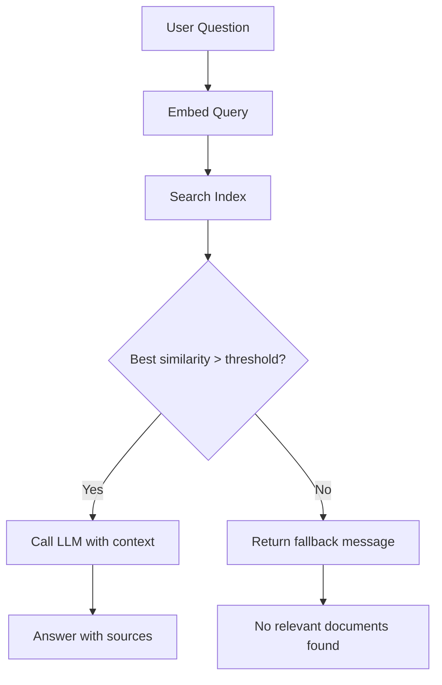
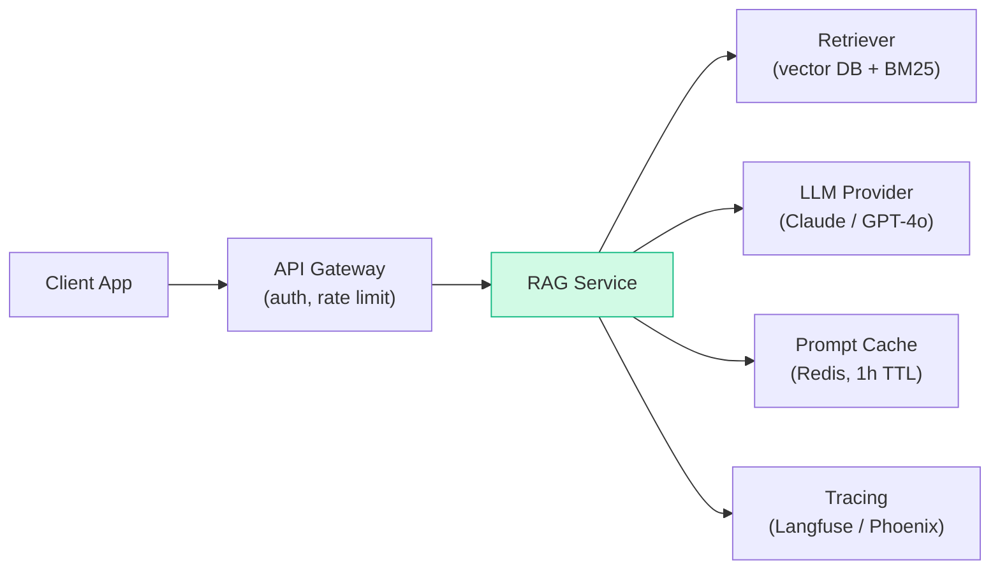

# Patterns: RAG Pipelines

## Pattern 1: Basic RAG Pipeline

The simplest working RAG: an in-memory index built with cosine similarity. No external dependencies. Good for learning, prototyping, and small corpora (< 10,000 chunks).

```python
import math
import sys
from pathlib import Path
sys.path.insert(0, str(Path(__file__).parent.parent.parent.parent.parent / "shared"))

from utils import get_anthropic_client, get_openai_client

EMBEDDING_MODEL = "text-embedding-3-small"
LLM_MODEL = "claude-3-haiku-20240307"

SYSTEM_PROMPT = """You are a helpful assistant that answers questions based only on the provided context.
If the context does not contain the answer, say so clearly."""


def cosine_similarity(v1: list[float], v2: list[float]) -> float:
    dot = sum(a * b for a, b in zip(v1, v2))
    mag1 = math.sqrt(sum(a ** 2 for a in v1))
    mag2 = math.sqrt(sum(b ** 2 for b in v2))
    if mag1 == 0 or mag2 == 0:
        return 0.0
    return dot / (mag1 * mag2)


def build_index(documents: list[dict]) -> list[dict]:
    """
    Build in-memory vector index from documents.
    Each document: {"id": str, "text": str, "source": str}
    """
    openai_client = get_openai_client()
    indexed = []
    for doc in documents:
        response = openai_client.embeddings.create(
            model=EMBEDDING_MODEL,
            input=doc["text"]
        )
        indexed.append({
            **doc,
            "embedding": response.data[0].embedding
        })
    return indexed


def retrieve_chunks(query: str, index: list[dict], top_k: int = 3) -> list[dict]:
    """Find the top_k chunks most similar to the query."""
    openai_client = get_openai_client()
    response = openai_client.embeddings.create(
        model=EMBEDDING_MODEL,
        input=query
    )
    query_vector = response.data[0].embedding

    scored = []
    for chunk in index:
        sim = cosine_similarity(query_vector, chunk["embedding"])
        scored.append({**chunk, "similarity": sim})

    scored.sort(key=lambda x: x["similarity"], reverse=True)
    return scored[:top_k]


def answer_question(question: str, index: list[dict], top_k: int = 3) -> dict:
    """Answer a question using RAG."""
    chunks = retrieve_chunks(question, index, top_k)

    context = "\n\n".join(
        f"[Source: {c['source']}]\n{c['text']}" for c in chunks
    )

    prompt = f"""Context documents:
{context}

Question: {question}

Answer based only on the context above:"""

    client = get_anthropic_client()
    response = client.messages.create(
        model=LLM_MODEL,
        max_tokens=512,
        system=SYSTEM_PROMPT,
        messages=[{"role": "user", "content": prompt}]
    )

    sources = list({c["source"] for c in chunks})
    return {
        "answer": response.content[0].text,
        "sources": sources,
        "chunks_used": top_k
    }


# --- Usage ---
docs = [
    {"id": "1", "text": "Enterprise customers get a 60-day refund window.", "source": "refund-policy.txt"},
    {"id": "2", "text": "Standard accounts have a 30-day refund window.", "source": "refund-policy.txt"},
    {"id": "3", "text": "Refunds are processed within 5–7 business days.", "source": "refund-policy.txt"},
]

index = build_index(docs)
result = answer_question("How long do enterprise customers have to request a refund?", index)
print(result["answer"])
print("Sources:", result["sources"])
```

**When to use:** Prototyping, small document sets, learning RAG fundamentals.

**Limitation:** No similarity threshold — will always return `top_k` chunks even if they're irrelevant.

---

## Pattern 2: RAG with Source Citation

Include document metadata in context and ask the model to explicitly cite sources. Critical for production use where users need to verify answers.

```python
CITATION_SYSTEM_PROMPT = """You are a helpful assistant that answers questions based only on the provided context.
Always cite which document your answer comes from using the [Source: ...] label.
If the context does not contain the answer, say "I don't have information about that in the provided documents."
"""

CITATION_PROMPT_TEMPLATE = """Context documents:
{context}

Question: {question}

Instructions: Answer the question using only the context above. For each claim you make, cite the source document in parentheses like: (Source: document-name.txt)."""


def answer_with_citations(question: str, index: list[dict], top_k: int = 3) -> dict:
    """Answer a question and return structured citations."""
    chunks = retrieve_chunks(question, index, top_k)

    context_parts = []
    for i, chunk in enumerate(chunks, 1):
        context_parts.append(
            f"[Document {i} — Source: {chunk['source']}]\n{chunk['text']}"
        )
    context = "\n\n".join(context_parts)

    prompt = CITATION_PROMPT_TEMPLATE.format(context=context, question=question)

    client = get_anthropic_client()
    response = client.messages.create(
        model=LLM_MODEL,
        max_tokens=512,
        system=CITATION_SYSTEM_PROMPT,
        messages=[{"role": "user", "content": prompt}]
    )

    return {
        "answer": response.content[0].text,
        "sources": [c["source"] for c in chunks],
        "similarity_scores": [round(c["similarity"], 3) for c in chunks],
        "chunks_used": len(chunks)
    }
```

**When to use:** Any production RAG where users need to verify answers or trust is important (legal, medical, compliance, customer support).

---

## Pattern 3: Fallback When No Relevant Docs

Check similarity scores before calling the LLM. If no chunk is similar enough, respond with a graceful fallback instead of hallucinating from irrelevant context.



```python
SIMILARITY_THRESHOLD = 0.70


def answer_with_fallback(
    question: str,
    index: list[dict],
    top_k: int = 3,
    threshold: float = SIMILARITY_THRESHOLD
) -> dict:
    """Answer with graceful fallback when no relevant docs are found."""
    chunks = retrieve_chunks(question, index, top_k)

    # Filter to chunks above the similarity threshold
    relevant_chunks = [c for c in chunks if c["similarity"] >= threshold]

    if not relevant_chunks:
        return {
            "answer": "I don't have information about that topic in the provided documents.",
            "sources": [],
            "chunks_used": 0,
            "fallback": True
        }

    context = "\n\n".join(
        f"[Source: {c['source']}]\n{c['text']}" for c in relevant_chunks
    )

    prompt = f"""Context documents:
{context}

Question: {question}

Answer based only on the context above:"""

    client = get_anthropic_client()
    response = client.messages.create(
        model=LLM_MODEL,
        max_tokens=512,
        system=SYSTEM_PROMPT,
        messages=[{"role": "user", "content": prompt}]
    )

    return {
        "answer": response.content[0].text,
        "sources": list({c["source"] for c in relevant_chunks}),
        "chunks_used": len(relevant_chunks),
        "fallback": False
    }
```

**When to use:** Always in production. Without a threshold, RAG confidently answers from irrelevant context — the worst type of hallucination because it looks grounded.

**Tuning the threshold:** Start at 0.70. Increase if you're getting irrelevant answers; decrease if you're getting too many fallbacks.

---

## Pattern 4: Multi-Document RAG

Index multiple documents and preserve metadata tags for filtering. Useful when you want to narrow retrieval to a specific document type or category.

```python
from datetime import datetime


def build_multi_doc_index(document_sources: list[dict]) -> list[dict]:
    """
    Index multiple documents with rich metadata.
    Each source: {"path": str, "text": str, "source": str, "category": str, "date": str}
    """
    openai_client = get_openai_client()
    index = []

    for doc in document_sources:
        # Simple sentence-boundary chunking
        sentences = doc["text"].split(". ")
        chunks = []
        current = ""
        for sentence in sentences:
            if len(current.split()) + len(sentence.split()) < 150:
                current = (current + ". " + sentence).strip(". ")
            else:
                if current:
                    chunks.append(current)
                current = sentence
        if current:
            chunks.append(current)

        for i, chunk_text in enumerate(chunks):
            response = openai_client.embeddings.create(
                model=EMBEDDING_MODEL,
                input=chunk_text
            )
            index.append({
                "id": f"{doc['source']}::{i}",
                "text": chunk_text,
                "source": doc["source"],
                "category": doc.get("category", "general"),
                "date": doc.get("date", ""),
                "embedding": response.data[0].embedding
            })

    return index


def retrieve_by_category(
    query: str,
    index: list[dict],
    category: str | None = None,
    top_k: int = 3
) -> list[dict]:
    """Retrieve chunks, optionally filtered to a specific document category."""
    filtered_index = index
    if category:
        filtered_index = [c for c in index if c.get("category") == category]

    return retrieve_chunks(query, filtered_index, top_k)


# --- Usage ---
sources = [
    {
        "text": "Enterprise refund window is 60 days. Standard is 30 days.",
        "source": "refund-policy.txt",
        "category": "policies",
        "date": "2024-01-01"
    },
    {
        "text": "Python SDK v2.0 supports async calls and streaming.",
        "source": "sdk-changelog.txt",
        "category": "technical",
        "date": "2024-03-15"
    },
]

multi_index = build_multi_doc_index(sources)

# Query only policy documents
policy_chunks = retrieve_by_category(
    "What is the refund policy?",
    multi_index,
    category="policies"
)
```

**When to use:** Document collections with distinct categories (policies vs. technical docs vs. FAQs). Category filtering prevents cross-contamination between domains.

---

## Pattern 4: Error Handling in RAG Pipelines

RAG has three distinct failure points: the embedding call, the LLM call, and the retrieval step itself. Each needs its own error strategy.

```python
import anthropic
import openai
from typing import Optional

def embed_with_retry(text: str, client, max_retries: int = 3) -> Optional[list[float]]:
    """Embed text with retry on transient errors."""
    for attempt in range(max_retries):
        try:
            response = client.embeddings.create(
                model="text-embedding-3-small",
                input=text,
            )
            return response.data[0].embedding
        except openai.RateLimitError:
            if attempt == max_retries - 1:
                raise
            import time
            time.sleep(2 ** attempt)  # 1s, 2s, 4s
        except openai.APIConnectionError as e:
            raise RuntimeError(f"Embedding API unreachable: {e}") from e
    return None


def rag_query_safe(
    question: str,
    index: list[dict],
    embed_client,
    llm_client,
    top_k: int = 3,
    threshold: float = 0.70,
) -> dict:
    """
    Full RAG query with structured error returns.
    Returns: {"answer": str, "sources": list, "error": str | None}
    """
    # Step 1: embed the question
    try:
        query_vec = embed_with_retry(question, embed_client)
    except Exception as e:
        return {"answer": None, "sources": [], "error": f"Embedding failed: {e}"}

    # Step 2: retrieve chunks
    results = retrieve_chunks(question, index, query_vec, top_k)
    relevant = [r for r in results if r["similarity"] >= threshold]

    if not relevant:
        # Soft failure — retrieval succeeded but found nothing useful
        return {
            "answer": "I don't have information about that topic in the provided documents.",
            "sources": [],
            "error": None,
        }

    # Step 3: call the LLM
    context = "\n\n".join(f"[Source: {c['source']}]\n{c['text']}" for c in relevant)
    try:
        response = llm_client.messages.create(
            model="claude-3-haiku-20240307",
            max_tokens=512,
            system="Answer only from the provided context. Cite sources.",
            messages=[{"role": "user", "content": f"Context:\n{context}\n\nQuestion: {question}"}],
        )
        return {
            "answer": response.content[0].text,
            "sources": [c["source"] for c in relevant],
            "error": None,
        }
    except anthropic.RateLimitError:
        return {"answer": None, "sources": [], "error": "Rate limit hit — retry in a few seconds"}
    except anthropic.APIConnectionError as e:
        return {"answer": None, "sources": [], "error": f"LLM API unreachable: {e}"}
    except anthropic.APIError as e:
        return {"answer": None, "sources": [], "error": f"LLM API error: {e}"}


# Usage — always check the error field
result = rag_query_safe("What is the refund policy?", index, embed_client, llm_client)
if result["error"]:
    print(f"Error: {result['error']}")
else:
    print(result["answer"])
    print("Sources:", result["sources"])
```

**Key principle:** return a structured result dict, not a bare string. Callers can check `result["error"]` and decide whether to retry, degrade gracefully, or surface the error to the user.

---

## Anti-Patterns

<div className="antipattern">

**Chunk size too large (1000+ tokens)**

```python
# Bad — retrieves too much context, dilutes relevance
chunks = split_by_tokens(text, chunk_size=1000)

# Good — smaller chunks, more precise retrieval
chunks = split_by_tokens(text, chunk_size=300, overlap=50)
```

Large chunks average out similarity scores across many topics. A chunk about "refunds, shipping, and returns" will match weakly on any single topic. Smaller, focused chunks retrieve more precisely.

**No similarity threshold**

```python
# Bad — always returns top_k even if they're irrelevant
results = retrieve_chunks(query, index, top_k=3)
answer = call_llm(context=results)  # answers from garbage context

# Good — filter below threshold, return fallback
results = retrieve_chunks(query, index, top_k=3)
relevant = [r for r in results if r["similarity"] > 0.70]
if not relevant:
    return "I don't have information about that topic."
```

**Injecting raw chunks without source labels**

```python
# Bad — LLM cannot cite sources it wasn't told about
context = "\n\n".join(chunk["text"] for chunk in chunks)

# Good — label each chunk with its source
context = "\n\n".join(
    f"[Source: {c['source']}]\n{c['text']}" for c in chunks
)
```

Without source labels, the model synthesises an answer but cannot tell the user where it came from. This breaks trust and makes verification impossible.

</div>

---

## Where This Fits in Production

RAG is rarely a standalone service — it sits in a larger inference pipeline:



**Typical cost breakdown** for a 1,000-token RAG query (GPT-4o pricing):

| Step | Tokens | Cost |
|------|--------|------|
| System prompt + retrieved context | ~700 | $0.0035 |
| User question | ~50 | $0.00025 |
| LLM answer generation | ~250 | $0.005 |
| **Total per query** | ~1,000 | **~$0.009** |

At 10,000 queries/day that's ~$90/day — prompt caching and response caching cut this by 40–60%.

**Failure modes to plan for:**

| Failure | Symptom | Mitigation |
|---------|---------|------------|
| Empty retrieval | LLM hallucinates or says "I don't know" | Return "no relevant documents found" before calling LLM |
| Stale index | Answers reference outdated information | Re-index on document update events, not on a fixed schedule |
| Context overflow | Request exceeds model context limit | Truncate or summarise retrieved chunks; check token count before calling |
| Latency spike | p99 &gt; 5s hurts UX | Cache embeddings for common queries; use smaller retrieval models |

**Where to go next:** Ch15 (Vector Databases) covers choosing and scaling the retrieval layer; Ch17 (Hybrid Search) improves recall; Ch44 (LLM Caching) cuts cost.
