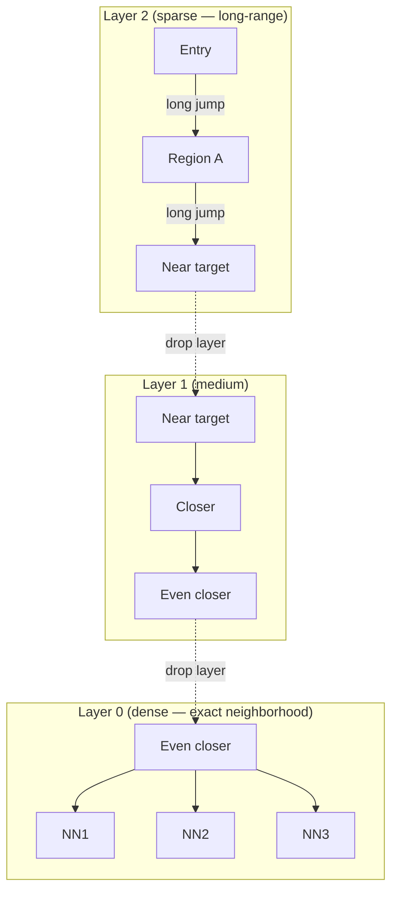
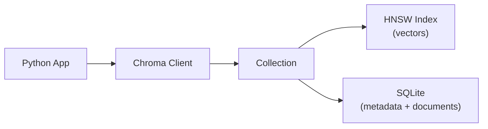

# Concepts: Vector Databases

## The Problem

Your RAG system embeds 1 million product descriptions. Each embedding is 1536 floats. To find the 10 most similar vectors for a query, you compute cosine similarity against all 1,000,000 vectors — brute-force O(n) search. At 1M vectors that takes seconds, not milliseconds. At 10M vectors it becomes unusable.

You need a database that can find the 10 most similar vectors in milliseconds — and still support filtering, persistence, and concurrent access.

---

## The Intuition

<div className="concept-intuition">

Vector databases are like libraries organised by meaning, not by alphabetical order.

In a regular library, books are shelved by title or Dewey Decimal number. To find everything about "distributed systems" you'd have to check the whole catalogue. In a meaning-organised library, books on similar topics sit physically close together — distributed systems, databases, and networking are all in the same wing. Finding related books is O(log n), not O(n).

A vector database organises embeddings the same way: vectors that are semantically similar are stored close together in the index. When a query arrives, the database navigates to the relevant neighbourhood instead of scanning everything.

</div>

---

## How It Works

### 1. ANN — Approximate Nearest Neighbor

Exact nearest neighbor search requires comparing every vector. ANN trades a tiny accuracy loss for a massive speed gain. Instead of finding the *exact* top-10, it finds the *approximate* top-10 — typically with 95-99% recall. In practice, the small accuracy loss has negligible impact on retrieval quality because the differences between rank-9 and rank-11 are almost never meaningful.

**Exact KNN:** O(n) — compare every vector
**ANN:** O(log n) — navigate the index structure

---

### 2. HNSW — Hierarchical Navigable Small World

HNSW is the most widely used ANN algorithm. It builds a multi-layer graph where:

- **Upper layers** are sparse — few long-range connections for fast coarse navigation
- **Lower layers** are dense — many short-range connections for precise local search
- **Query:** Start at the entry point in the top layer, greedily navigate toward the query vector, drop to a lower layer, repeat until the bottom layer gives you the nearest neighbors



High recall (typically 95-99%), sub-millisecond queries at millions of vectors, tunable via `ef_construction` and `M` parameters.

---

### 3. Chroma

Chroma is an embedded Python vector database — no server, no Docker, no infrastructure. It runs inside your Python process.

- **Storage:** SQLite (metadata) + HNSW (vectors)
- **Modes:** `EphemeralClient` (in-memory, lost on restart) and `PersistentClient` (saved to disk)
- **Best for:** Development, prototyping, small-to-medium corpora (up to ~1M vectors)



---

### 4. pgvector

A PostgreSQL extension that adds a `vector` column type and ANN index support. Best choice when:

- You already use Postgres and want one fewer infrastructure component
- You need to join vector search with relational data in a single query
- Your team owns and operates the database

```sql
SELECT id, content, embedding <=> $1 AS distance
FROM documents
WHERE source = 'hr-policy.pdf'
ORDER BY distance
LIMIT 10;
```

---

### 5. Pinecone

A fully managed cloud vector database. No infrastructure to operate, auto-scales, supports billions of vectors. Best for:

- Production systems with millions of vectors
- Teams without database ops capacity
- Multi-tenant SaaS applications

---

### 6. Metadata Filtering

Without metadata filtering, a query for "vacation policy" might return documents from engineering specs, finance reports, and HR policies — all semantically adjacent to "policy". With metadata filtering, you narrow the search space first:

```python
collection.query(
    query_embeddings=[query_embedding],
    n_results=5,
    where={"source": {"$eq": "hr-policy.pdf"}}
)
```

This filters to only HR policy documents *before* the vector comparison — faster and more relevant.

---

## Key Terms

| Term | Definition |
|------|------------|
| **Vector database** | A database optimised for storing and querying high-dimensional embedding vectors |
| **ANN** | Approximate Nearest Neighbor — fast similarity search that trades tiny accuracy loss for speed |
| **HNSW** | Hierarchical Navigable Small World — graph-based ANN algorithm, high recall, tunable |
| **Index** | The data structure (e.g., HNSW graph) that enables fast vector search |
| **Collection** | A named group of vectors in Chroma, analogous to a table |
| **Metadata filter** | A condition applied before vector search to narrow the candidate set |
| **Persistence** | Saving the vector index and documents to disk so data survives restarts |
| **Cosine distance** | Measures the angle between two vectors — standard for semantic similarity |
| **L2 distance** | Euclidean distance — suitable when vector magnitude matters |
| **IP distance** | Inner product — often used with pre-normalised vectors |

---

## The Interview Angle

<div className="interview-angle">

**"How do you choose between Chroma and Pinecone?"**

Chroma for development and small-to-medium scale: it's embedded, zero-infrastructure, and ideal for building and testing RAG pipelines locally. It handles up to roughly 1M vectors comfortably.

Pinecone for production at scale: fully managed, auto-scales to billions of vectors, no operational overhead. The right choice when your team cannot own database infrastructure or your corpus is large enough that operational concerns matter.

pgvector sits in the middle: if you already run Postgres in production and your vector workload is moderate, pgvector avoids adding a new system to your stack.

The follow-up often probes persistence: "What happens if you forget to persist Chroma?" Answer: EphemeralClient loses all data on process restart. Always use PersistentClient in any environment where data must survive.

</div>

---

## Common Mistakes

<div className="antipattern">

**Forgetting to persist Chroma** — `EphemeralClient` stores data in memory only. Restart your process and everything is gone. Use `PersistentClient(path="./chroma_db")` whenever data needs to survive.

**Not using metadata filtering** — Querying without a `where` clause searches your entire collection. For multi-source corpora this returns irrelevant results from unrelated sources. Always add source metadata at indexing time and filter at query time.

**Using L2 distance when cosine is appropriate** — For semantic text embeddings, cosine similarity is almost always the right metric. L2 distance is sensitive to vector magnitude, which is usually not meaningful for normalised embeddings. Pass `metadata={"hnsw:space": "cosine"}` when creating a Chroma collection.

</div>

---

## Further Reading

- [Chroma Documentation](https://docs.trychroma.com/) — full API reference and guides
- [pgvector GitHub](https://github.com/pgvector/pgvector) — installation, index types, and SQL examples
- [Pinecone Learning Center](https://www.pinecone.io/learn/) — ANN algorithms, HNSW deep-dive, production patterns
