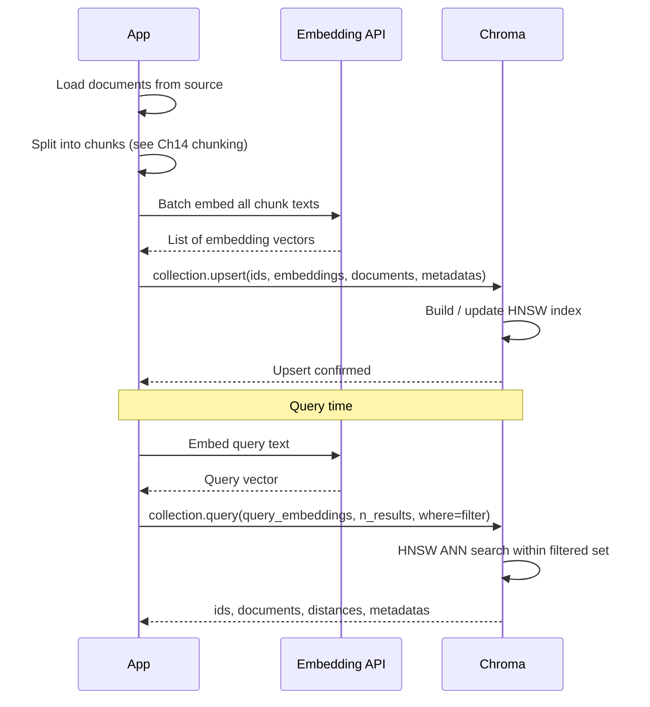

# Patterns: Working with Vector Databases

## Pattern 1: Chroma Basic — Create, Add, Query

The minimal Chroma workflow: create an ephemeral collection, add documents with embeddings, query by similarity.

```python
import chromadb

# EphemeralClient: in-memory, data is lost when the process exits
client = chromadb.EphemeralClient()

# Create (or retrieve) a collection with cosine distance
collection = client.get_or_create_collection(
    name="documents",
    metadata={"hnsw:space": "cosine"}
)

# Add documents — ids, embeddings, and raw text
collection.add(
    ids=["doc1", "doc2", "doc3"],
    embeddings=[
        [0.1, 0.2, 0.3],   # pre-computed embedding for doc1
        [0.4, 0.5, 0.6],   # pre-computed embedding for doc2
        [0.7, 0.8, 0.9],   # pre-computed embedding for doc3
    ],
    documents=[
        "The vacation policy allows 20 days per year.",
        "Engineers must submit code reviews within 48 hours.",
        "Parental leave is 16 weeks for primary caregivers.",
    ]
)

# Query: find the 2 most similar documents to a query embedding
results = collection.query(
    query_embeddings=[[0.15, 0.25, 0.35]],
    n_results=2
)

for doc, dist in zip(results["documents"][0], results["distances"][0]):
    print(f"[{dist:.4f}] {doc}")
```

**When to use:** Rapid prototyping, local experiments, unit tests. Do not use `EphemeralClient` in any environment where data must survive process restarts.

---

## Pattern 2: Chroma with Persistence

Use `PersistentClient` to save the collection to disk. Data survives process restarts.

```python
import chromadb

# PersistentClient: data is written to ./chroma_db on disk
client = chromadb.PersistentClient(path="./chroma_db")

collection = client.get_or_create_collection(
    name="hr-documents",
    metadata={"hnsw:space": "cosine"}
)

# Add documents — same API as EphemeralClient
collection.add(
    ids=["hr-001"],
    embeddings=[[0.1, 0.2, 0.3]],
    documents=["Remote work policy: employees may work remotely up to 3 days per week."],
    metadatas=[{"source": "hr-policy.pdf", "page": 4}]
)

print(f"Collection size: {collection.count()}")

# Later — in a new process — reload from disk:
# client = chromadb.PersistentClient(path="./chroma_db")
# collection = client.get_collection("hr-documents")
# Data is still there.
```

**When to use:** Any non-ephemeral use case — staging, demos, small production deployments. The `path` directory is created automatically if it does not exist.

---

## Pattern 3: Metadata Filtering

Store metadata at index time (source, date, category) and filter at query time. This narrows the search space to relevant documents before vector comparison runs.

```python
import chromadb

client = chromadb.PersistentClient(path="./chroma_db")
collection = client.get_or_create_collection(
    name="knowledge-base",
    metadata={"hnsw:space": "cosine"}
)

# Index documents with rich metadata
collection.add(
    ids=["hr-001", "hr-002", "eng-001"],
    embeddings=[[0.1, 0.2, 0.3], [0.4, 0.5, 0.6], [0.7, 0.8, 0.9]],
    documents=[
        "Vacation days accrue at 1.67 days per month.",
        "Performance reviews happen twice per year.",
        "Deployment pipelines must include integration tests.",
    ],
    metadatas=[
        {"source": "hr-policy.pdf", "category": "hr"},
        {"source": "hr-policy.pdf", "category": "hr"},
        {"source": "eng-handbook.pdf", "category": "engineering"},
    ]
)

# Query — only search within HR documents
results = collection.query(
    query_embeddings=[[0.15, 0.25, 0.35]],
    n_results=2,
    where={"source": {"$eq": "hr-policy.pdf"}}  # filter before vector search
)

# Chroma filter operators: $eq, $ne, $gt, $gte, $lt, $lte, $in, $nin
# Combine with $and / $or:
results_multi = collection.query(
    query_embeddings=[[0.15, 0.25, 0.35]],
    n_results=2,
    where={
        "$and": [
            {"category": {"$eq": "hr"}},
            {"source": {"$ne": "old-policy.pdf"}}
        ]
    }
)
```

**When to use:** Any multi-source corpus where queries should be scoped to a specific document set, tenant, or category.

---

## Pattern 4: Batch Upsert

Add documents in batches to avoid memory issues and to handle large corpora efficiently. `collection.upsert` is idempotent — safe to re-run if your indexing job fails partway through.

```python
import chromadb

client = chromadb.PersistentClient(path="./chroma_db")
collection = client.get_or_create_collection(
    name="product-catalog",
    metadata={"hnsw:space": "cosine"}
)

def batch_upsert(collection, documents: list[dict], batch_size: int = 100):
    """
    Upsert documents in batches.
    Each document: {"id": str, "text": str, "embedding": list[float], **metadata}
    """
    for i in range(0, len(documents), batch_size):
        batch = documents[i : i + batch_size]

        collection.upsert(
            ids=[doc["id"] for doc in batch],
            embeddings=[doc["embedding"] for doc in batch],
            documents=[doc["text"] for doc in batch],
            metadatas=[
                {k: v for k, v in doc.items() if k not in ("id", "text", "embedding")}
                for doc in batch
            ]
        )
        print(f"Upserted batch {i // batch_size + 1}: {len(batch)} documents")

# Usage
docs = [
    {
        "id": f"product-{i}",
        "text": f"Product {i}: high-quality widget for industrial use.",
        "embedding": [0.1 * i, 0.2 * i, 0.3 * i],  # replace with real embeddings
        "category": "widgets",
        "sku": f"WGT-{i:04d}"
    }
    for i in range(250)
]

batch_upsert(collection, docs, batch_size=100)
print(f"Total documents: {collection.count()}")
```

**When to use:** Any time you index more than a few hundred documents. Batching avoids out-of-memory errors and gives you progress visibility. `upsert` (vs `add`) is safe to call multiple times — existing IDs are updated rather than erroring.

---

## Document Indexing Pipeline



---

## Anti-Patterns

<div className="antipattern">

**Adding documents one-by-one**

```python
# Bad — N separate API calls and N HNSW index updates
for doc in documents:
    collection.add(ids=[doc["id"]], embeddings=[doc["embedding"]], documents=[doc["text"]])

# Good — single batch call
collection.add(
    ids=[d["id"] for d in documents],
    embeddings=[d["embedding"] for d in documents],
    documents=[d["text"] for d in documents]
)
```

**Not storing metadata**

```python
# Bad — you can never filter by source, date, or category later
collection.add(ids=["doc1"], embeddings=[vec], documents=["..."])

# Good — always store source and any dimension you'll want to filter on
collection.add(
    ids=["doc1"],
    embeddings=[vec],
    documents=["..."],
    metadatas=[{"source": "policy.pdf", "date": "2024-01-15"}]
)
```

**Using EphemeralClient in production**

```python
# Bad — all data is lost when the process exits
client = chromadb.EphemeralClient()

# Good — data persists across restarts
client = chromadb.PersistentClient(path="/data/chroma_db")
```

</div>
