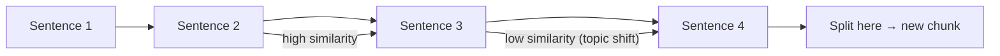
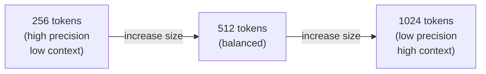

# Concepts: Chunking Strategies

## The Problem

You load a 200-page PDF. Python hands you one giant string — 400,000 characters of continuous text. You cannot embed the whole thing:

- Most embedding models have a 512–8192 token context limit
- Even if you could embed it, retrieving "the whole document" is useless — you need the specific paragraph that answers the user's question
- You cannot pass the whole document to the LLM either (cost, latency, and context limits)

You need to split it into smaller pieces that can be individually embedded and retrieved.

---

## The Intuition

<div className="concept-intuition">

Think of chunking like cutting a newspaper into individual articles. If you keep full pages, your search returns too much irrelevant content. If you cut every sentence individually, each snippet is too short to be meaningful on its own.

The goal is pieces that are:
- Small enough to be precise (so retrieval returns the right section)
- Large enough to be self-contained (so the LLM has enough context to answer)

</div>

---

## How It Works

### 1. Fixed-Size Chunking

Split every N characters or tokens, regardless of sentence or paragraph boundaries.

```
Document: "The revenue was $1.2M in Q1. The costs were $800K. Net profit was $400K."

chunk_size=40, overlap=0:
  chunk 0: "The revenue was $1.2M in Q1. The costs"
  chunk 1: "were $800K. Net profit was $400K."
```

**Pros:** Fast, simple, no dependencies, predictable chunk sizes.

**Cons:** Breaks mid-sentence. "The costs" is separated from "were $800K", losing meaning.

**Use when:** You need a quick baseline, or you're working with already-structured text (e.g., CSV rows).

---

### 2. Sentence-Based Chunking

Split on sentence boundaries (`.`, `!`, `?`). Accumulate sentences until the chunk reaches a token limit.

```
Document: "The revenue was $1.2M in Q1. The costs were $800K. Net profit was $400K."

max_tokens=30:
  chunk 0: "The revenue was $1.2M in Q1. The costs were $800K."
  chunk 1: "Net profit was $400K."
```

**Pros:** Semantically coherent chunks — no broken sentences.

**Cons:** Variable chunk sizes. One long sentence can exceed the token limit.

**Use when:** Documents have well-formed prose (articles, reports, legal text).

---

### 3. Recursive Character Splitting

Try progressively smaller separators until the chunk fits. LangChain's default splitter uses this approach.

```
Priority order: ["\n\n", "\n", ". ", " ", ""]
```

1. Try splitting on double newlines (paragraphs)
2. If chunks are still too large, try single newlines
3. If still too large, try sentences
4. If still too large, try words
5. If still too large, split characters

**Pros:** Preserves document structure as much as possible. Respects paragraphs > sentences > words.

**Cons:** More complex. Behaviour depends on document formatting.

**Use when:** Working with markdown, HTML, or well-structured documents.

---

### 4. Semantic Chunking

Use embeddings to detect topic shifts. Embed each sentence, compute similarity between adjacent sentences, and split where similarity drops sharply.



**Pros:** Chunks align with actual topic boundaries. Best retrieval quality.

**Cons:** Requires embedding every sentence first — slow and expensive. Not suitable for real-time pipelines.

**Use when:** Offline document processing where quality matters more than speed (e.g., legal, medical, scientific text).

---

### 5. Chunk Overlap

Include a portion of the previous chunk at the start of the next one.

```
chunk_size=100, overlap=20:
  chunk 0: characters  0–100
  chunk 1: characters 80–180   ← 20 chars overlap with chunk 0
  chunk 2: characters 160–260  ← 20 chars overlap with chunk 1
```

**Why it matters:** Without overlap, a sentence that straddles a chunk boundary is split in two. Neither chunk contains the complete sentence, so a query about that sentence retrieves nothing useful.

**Rule of thumb:** 10–20% overlap. Too much overlap wastes storage and reduces index efficiency.

---

### 6. Chunk Size Recommendations

| Use case | Recommended size |
|----------|-----------------|
| Precise Q&A (legal, medical, technical) | 256–512 tokens |
| General document Q&A | 512–768 tokens |
| Summary or thematic retrieval | 768–1024 tokens |
| Passage-level retrieval | 1024+ tokens |

Smaller chunks = more precise retrieval, less context per chunk.
Larger chunks = more context per chunk, less retrieval precision.



---

## Key Terms

| Term | Definition |
|------|------------|
| **Chunk** | A piece of a document, produced by splitting the original text |
| **Chunk size** | The maximum number of characters or tokens in a single chunk |
| **Overlap** | The number of characters/tokens shared between adjacent chunks |
| **Recursive splitting** | Splitting strategy that tries progressively smaller separators until chunk size is met |
| **Semantic chunking** | Splitting based on embedding similarity to detect topic shifts |
| **Token-based chunking** | Splitting based on token counts rather than character counts |

---

## The Interview Angle

<div className="interview-angle">

**"What chunk size would you use for a legal contract Q&A system?"**

The correct answer is smaller chunks — 256–512 tokens. Legal contracts contain specific clauses that need to be retrieved with precision. A query like "what is the termination clause?" should retrieve the exact paragraph about termination, not a 2000-token section containing it somewhere.

A strong answer also mentions:
- Overlap of ~50–100 tokens to prevent clause boundaries from splitting
- Sentence-based or recursive splitting (not fixed character) to avoid cutting mid-clause
- Metadata enrichment: attach the contract name, section number, and page to every chunk

</div>

---

## Common Mistakes

<div className="antipattern">

**No overlap** — Without overlap, a sentence spanning a chunk boundary is split between chunk N and chunk N+1. Neither chunk contains the full sentence. Queries about that content retrieve nothing useful. Always set overlap to 10–20% of chunk size.

**Chunks too large** — A 2000-token chunk might contain the answer, but it also contains a lot of irrelevant content. The retrieval score is diluted. Smaller, focused chunks produce better recall.

**Chunking mid-sentence** — Fixed character splitting cuts at arbitrary positions. A chunk ending "The quarterly rev" and next chunk starting "enue was $1.2M" is semantically broken. Use sentence-aware splitting for prose.

**Chunking without cleaning** — Headers, footers, page numbers, and navigation text should be removed before chunking. Otherwise chunks containing "Page 3 of 47" or "CONFIDENTIAL" are embedded and pollute retrieval results.

**Ignoring token limits of embedding models** — Most embedding models have a 512 or 8192 token limit. A chunk larger than that limit will be silently truncated. Check your embedding model's limit and set chunk size accordingly.

</div>

---

## Further Reading

- [LangChain Text Splitters documentation](https://python.langchain.com/docs/modules/data_connection/document_transformers/) — recursive character splitter and others
- [Greg Kamradt's Chunking Strategy evaluation](https://www.youtube.com/watch?v=8OJC21T2SL4) — empirical comparison of chunking strategies
