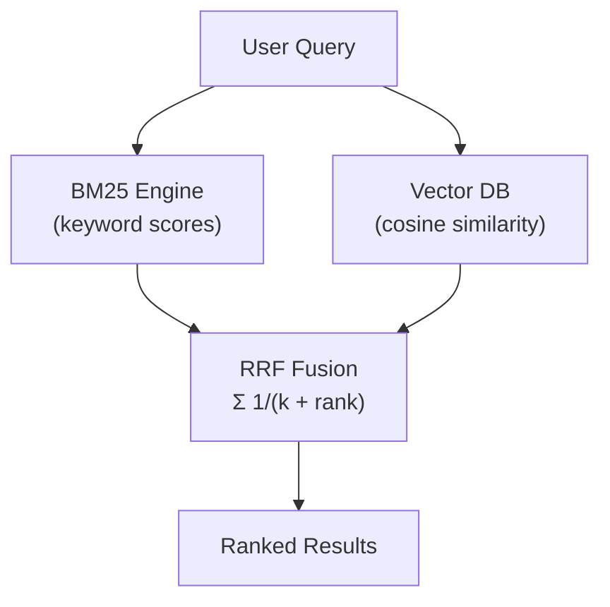

# Concepts: Hybrid Search

## The Problem

Semantic search is powerful, but it has a specific failure mode:

> User query: `"2024 Toyota Camry XSE V6 towing capacity"`

A vector search finds documents about "cars" and "vehicles" — because that's what the embedding knows the query means semantically. But it may miss the exact document that contains `"2024 Toyota Camry XSE V6"` as literal text, because that specific product code is underrepresented in the embedding model's training data.

The same failure occurs with:
- Software version numbers: `"Python 3.12.4 release notes"`
- Part numbers: `"AWS-EC2-t3.micro"`
- Legal clause references: `"Section 4.2(b)(iii)"`
- Exact error messages: `"SIGABRT signal 6 abort trap"`

Semantic search generalises. For these queries, you need exact matching.

---

## The Intuition

<div className="concept-intuition">

Think of two detectives working the same case.

**Detective BM25** is the forensic specialist. She finds every document that contains the exact phrase "2024 Toyota Camry XSE V6". She scores documents by how frequently and unusually specific those terms appear.

**Detective Vector** is the lateral thinker. He finds documents that are *about* the same topic even if they use different words — "automobile", "sedan", "Toyota vehicle".

Neither detective catches everything. But together, comparing notes and combining their ranked lists, they miss far fewer clues.

</div>

---

## How It Works

### 1. BM25: Keyword Search

BM25 (Best Match 25) is a TF-IDF variant that scores documents based on:

- **Term frequency (TF)**: how often does the query term appear in the document?
- **Inverse document frequency (IDF)**: how rare is this term across the entire corpus? (rare terms are more informative)
- **Document length normalization**: longer documents aren't unfairly penalised for having more occurrences just because they're long

The formula for a query with terms `q₁, q₂, ...`:

```
BM25(D, Q) = Σ IDF(qᵢ) × [f(qᵢ, D) × (k₁ + 1)] / [f(qᵢ, D) + k₁ × (1 - b + b × |D| / avgdl)]
```

Where `k₁=1.5` (term frequency saturation) and `b=0.75` (length normalization) are standard constants.

**Key property:** BM25 rewards exact lexical matches. It gives high scores to documents that contain the exact query terms and penalises very common words (stop words) via IDF.

---

### 2. Vector Search: Semantic Retrieval

Embed the query and all documents. Compute cosine similarity. Return the top-K most similar documents.

```
similarity(query, doc) = cos(θ) = (query · doc) / (|query| × |doc|)
```

**Key property:** Vector search captures synonyms, paraphrases, and topic relationships. It doesn't care about exact word matches — it cares about semantic proximity in embedding space.

---

### 3. Reciprocal Rank Fusion (RRF)

RRF is the standard method for combining multiple ranked lists. The formula is:

```
RRF_score(doc) = Σ  1 / (k + rank_i)
                 i
```

Where:
- `rank_i` is the position of the document in the i-th ranked list (1-indexed)
- `k = 60` is a constant that dampens the influence of very high ranks (prevents rank-1 from dominating)
- The sum is over all ranked lists that contain this document

**Example:** Document B appears at rank 1 in BM25 results and rank 2 in vector results.

```
RRF_score(B) = 1/(60+1) + 1/(60+2) = 0.01639 + 0.01613 = 0.03252
```

Document A appears at rank 2 in BM25 and rank 6 in vector:

```
RRF_score(A) = 1/(60+2) + 1/(60+6) = 0.01613 + 0.01515 = 0.03128
```

B scores higher because it ranks well in both lists.



---

### 4. When Hybrid Wins

| Query type | Best approach | Why |
|-----------|--------------|-----|
| Product codes, part numbers | Hybrid (BM25 strong) | Exact term match critical |
| Version numbers, error codes | Hybrid (BM25 strong) | Semantic model may not know these |
| Legal clause references | Hybrid (BM25 strong) | Exact phrasing matters |
| Natural language questions | Hybrid or pure semantic | Semantic handles paraphrasing |
| Conceptual questions ("explain X") | Pure semantic | No exact terms to match |
| Synonym-heavy queries | Pure semantic | "automobile" ≠ "car" in BM25 |

---

### 5. When Pure Semantic Wins

Pure semantic search beats hybrid when:
- The user's words and the document's words are different but mean the same thing
- The query is a natural language question with no domain-specific terminology
- You are doing fuzzy matching across multilingual documents

---

## Key Terms

| Term | Definition |
|------|------------|
| **BM25** | Best Match 25 — a TF-IDF variant that scores documents by term frequency, inverse document frequency, and document length normalisation |
| **TF-IDF** | Term Frequency × Inverse Document Frequency — the classic keyword relevance measure BM25 improves upon |
| **Hybrid search** | Combining keyword (sparse) and semantic (dense) retrieval for better overall recall |
| **RRF** | Reciprocal Rank Fusion — a technique for merging multiple ranked lists by summing 1/(k+rank) scores |
| **Sparse retrieval** | Retrieval based on exact token/keyword matching (BM25 is sparse) |
| **Dense retrieval** | Retrieval based on continuous embedding vectors (vector search is dense) |
| **Reciprocal rank** | The inverse of a document's rank position: rank-1 → 1/1, rank-2 → 1/2, etc. |

---

## The Interview Angle

<div className="interview-angle">

**"When would you choose hybrid search over pure vector search?"**

The strong answer covers:

1. **Exact terminology matters** — technical docs, product codes, version numbers, legal references. A user searching for `"EC2 t3.micro"` needs BM25 to find the exact string, not semantic neighbours.

2. **Domain-specific vocabulary** — embedding models trained on general text may not capture the semantic meaning of domain-specific terms accurately. BM25 doesn't need to "understand" the term — it just matches it.

3. **Production quality** — in benchmarks, hybrid search consistently outperforms pure semantic on retrieval recall across most document types. The cost (one BM25 pass + RRF fusion) is minimal.

4. **When to use pure semantic** — conceptual questions, multilingual content, when the user is unlikely to use the exact words in the documents.

</div>

---

## Common Mistakes

<div className="antipattern">

**Using pure semantic for exact code or product lookups** — A user searching for `"CVE-2024-1234"` (a security vulnerability ID) won't get good results from semantic search alone. BM25 finds it instantly as an exact string match.

**Equal weighting for all query types** — Not all queries benefit equally from BM25 vs. vector. Production systems tune these weights (or use RRF's rank-based approach which is naturally weight-balanced) based on query analysis.

**Not tokenizing correctly for BM25** — BM25 operates on tokens (words). Lowercasing the text before tokenizing (`doc.lower().split()`) is a minimum. Production systems add stopword removal and stemming.

**Forgetting that RRF requires ranked lists, not scores** — RRF uses positions, not raw scores. You must sort BM25 results by score descending and vector results by similarity descending, then pass the ordered indices to RRF — not the raw floats.

</div>

---

## Further Reading

- [Pinecone: Hybrid Search](https://www.pinecone.io/learn/hybrid-search-intro/) — practical guide to hybrid search in production
- [Elasticsearch: Reciprocal Rank Fusion](https://www.elastic.co/guide/en/elasticsearch/reference/current/rrf.html) — RRF in a production search engine
- [rank_bm25 library](https://github.com/dorianbrown/rank_bm25) — Python BM25 implementation
