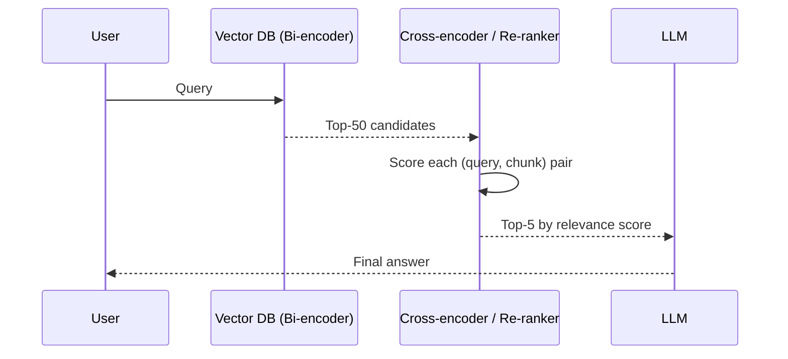

# Concepts: Re-ranking

## The Problem

Your RAG pipeline embeds a query, runs cosine similarity against 100,000 chunks, and returns the top 20. You send all 20 to the LLM with the instruction "use these documents to answer the question."

In practice, only 3 of those 20 chunks are actually relevant. The other 17 are topically adjacent but don't contain the answer. The LLM now has to sift through noise, which dilutes the response and wastes tokens. At worst, irrelevant chunks actively confuse the model.

You need a way to pick the best 3 from the noisy top-20 before they reach the LLM.

---

## The Intuition

<div className="concept-intuition">

Think of retrieval as a two-step fishing trip.

**First pass — cast a wide net.** Your bi-encoder (vector search) sweeps the entire lake quickly. It's fast because every fish (document) was pre-tagged at indexing time. The net hauls in 50 fish, including some you want and some you don't.

**Second pass — pick the best fish from the net.** Your cross-encoder examines each of the 50 fish carefully, comparing it directly against what you're actually looking for. It takes longer but it's working on 50 fish, not the whole lake. You pick the 5 best fish.

Only those 5 fish go to the LLM.

</div>

---

## How It Works

### 1. Bi-encoders (Vector Search)

A bi-encoder encodes the query and each document **separately** into embedding vectors. Relevance is approximated by cosine similarity between those two vectors.

- **Fast:** Documents are pre-embedded at index time. Query time is just one embedding call plus ANN search — O(1) against the index regardless of corpus size.
- **Lower precision:** The query and document vectors never see each other during encoding. The model can't detect subtle query-document interactions.

This is what your vector database uses.

---

### 2. Cross-encoders (Re-rankers)

A cross-encoder takes the query and a candidate document **together** as a single input and outputs a relevance score.

- **Higher precision:** The model sees the full query-document pair simultaneously. It can detect subtle matches, synonyms, negations, and context dependencies that a bi-encoder misses.
- **Slower:** You can't pre-encode documents because the encoding depends on the query. Must run the model once per candidate at query time.

This is why cross-encoders are only feasible as a second stage over a small candidate set (20–100), not for initial retrieval over millions of documents.

---

### 3. Two-Stage Pipeline

Combine both approaches:



| Stage | Model Type | Speed | Precision | Corpus |
|-------|-----------|-------|-----------|--------|
| Retrieval | Bi-encoder | Fast | Lower | Full corpus (millions) |
| Re-ranking | Cross-encoder | Slower | Higher | Candidate set (20–100) |

---

### 4. Cohere Rerank API

The Cohere Rerank API is the most widely used production re-ranker. It's a managed cross-encoder service — no model hosting required.

```python
import cohere

co = cohere.Client("YOUR_API_KEY")

results = co.rerank(
    model="rerank-english-v3.0",
    query="What is the vacation policy?",
    documents=[
        "Employees receive 15 days of vacation per year.",
        "The company was founded in 2010.",
        "Vacation accrues at 1.25 days per month.",
    ],
    top_n=2,
)

for r in results.results:
    print(f"[{r.relevance_score:.4f}] {r.document['text']}")
```

The API returns each document with a `relevance_score` between 0 and 1. You sort by score and take the top-n.

---

### 5. LLM-as-Reranker

When you don't have access to a cross-encoder model, you can ask an LLM to score each chunk for relevance on a scale of 1–10.

- **Advantage:** No special model or API needed — works with any LLM you already use.
- **Disadvantage:** Expensive. One API call per candidate chunk.

Use LLM-as-reranker for low-volume use cases or when prototyping before you set up Cohere.

---

## Key Terms

| Term | Definition |
|------|------------|
| **Re-ranking** | A second-stage process that re-scores a small candidate set for relevance before passing results to the LLM |
| **Cross-encoder** | A model that encodes query and document together to produce a precise relevance score |
| **Bi-encoder** | A model that encodes query and document separately; used for fast initial retrieval |
| **Two-stage retrieval** | A pipeline that uses a fast bi-encoder for initial retrieval and a slower cross-encoder for re-scoring |
| **Cohere Rerank** | A managed cross-encoder API that scores (query, document) pairs and returns relevance scores |
| **Relevance score** | A scalar value (0–1 or 1–10) indicating how well a chunk answers the query |
| **Candidate set** | The initial pool of chunks returned by vector search, passed to the re-ranker |

---

## The Interview Angle

<div className="interview-angle">

**"How would you improve RAG answer quality without increasing the number of chunks sent to the LLM?"**

Add a re-ranker between retrieval and generation.

Increase the initial retrieval size (e.g., top-50) so you cast a wider net, then use a cross-encoder to re-score all 50 candidates and select the top-3 or top-5 by relevance. The LLM sees fewer chunks — but higher-quality ones. Answer quality improves because the relevant context is concentrated, not diluted by noise.

The follow-up is often: "Why not just use the cross-encoder for the initial retrieval?" Because cross-encoders can't be pre-computed at index time — they need the query. Running a cross-encoder against every document in a million-document corpus at query time would take minutes, not milliseconds.

</div>

---

## Common Mistakes

<div className="antipattern">

**Re-ranking too few candidates** — If you only retrieve 5 chunks before re-ranking, you might miss the most relevant chunk entirely. The point of re-ranking is to rescue the relevant chunk that was ranked 8th or 15th by vector similarity. Retrieve at least 20–50 candidates.

**Using a re-ranker for initial retrieval** — Cross-encoders cannot pre-compute document representations. Running one against a full corpus is O(n) at query time — impractical for any meaningful corpus size. Always use a bi-encoder for the first stage.

**Not batching re-rank calls** — If using LLM-as-reranker, make sure you're aware that each chunk requires one API call. For 50 candidates that's 50 calls. Manage latency and cost accordingly, or switch to the Cohere Rerank API which handles all candidates in a single call.

</div>
