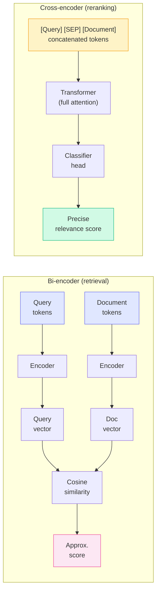
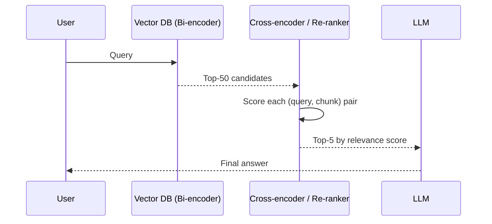

# Concepts: Re-ranking

## The Problem

Your RAG pipeline embeds a query, runs cosine similarity against 100,000 chunks, and returns the top 20. You send all 20 to the LLM with the instruction "use these documents to answer the question."

In practice, only 3 of those 20 chunks are actually relevant. The other 17 are topically adjacent but don't contain the answer. The LLM now has to sift through noise, which dilutes the response and wastes tokens. At worst, irrelevant chunks actively confuse the model.

You need a way to pick the best 3 from the noisy top-20 before they reach the LLM.

---

## The Intuition

<div className="concept-intuition">

Think of retrieval as a two-step fishing trip.

**First pass — cast a wide net.** Your bi-encoder (vector search) sweeps the entire lake quickly. It's fast because every fish (document) was pre-tagged at indexing time. The net hauls in 50 fish, including some you want and some you don't.

**Second pass — pick the best fish from the net.** Your cross-encoder examines each of the 50 fish carefully, comparing it directly against what you're actually looking for. It takes longer but it's working on 50 fish, not the whole lake. You pick the 5 best fish.

Only those 5 fish go to the LLM.

</div>

---

## Why Retrieval Gets It Wrong — The Precision-Recall Tradeoff

Vector search is optimised for **recall** — finding all documents that might be relevant. It achieves this by casting a wide net, which inevitably includes documents that are topically related but do not actually answer the query. The trade-off is **precision** — the fraction of retrieved documents that are genuinely relevant.

### Concrete numbers

Suppose you have a corpus of 50,000 chunks and 10 truly relevant chunks exist for a given query.

| Retrieval setting | Chunks returned | Relevant chunks found | Recall | Precision |
|-------------------|----------------|-----------------------|--------|-----------|
| Top-5 | 5 | 4 | 40% | 80% |
| Top-10 | 10 | 9 | 90% | 50% |
| Top-20 | 20 | 10 | 100% | 50% |
| Top-50 | 50 | 10 | 100% | 20% |

At top-10 you achieve 90% recall — but only 50% of the retrieved chunks are actually relevant. Half the context you send to the LLM is noise.

**Why this matters:** LLMs are not immune to irrelevant context. Research consistently shows that adding irrelevant chunks to the prompt degrades answer quality, increases hallucination rates, and wastes tokens. The "lost in the middle" effect means models weight context at the beginning and end of the prompt more heavily — irrelevant chunks in the middle actively displace relevant information.

**A reranker restores precision.** By re-scoring the top-50 retrieval results with a cross-encoder and keeping only the top-5, you can simultaneously achieve high recall (you retrieved all the relevant chunks) and high precision (you only forward the genuinely relevant ones to the LLM).

---

## How It Works

### 1. Bi-encoders (Vector Search)

A bi-encoder encodes the query and each document **separately** into embedding vectors. Relevance is approximated by cosine similarity between those two vectors.

- **Fast:** Documents are pre-embedded at index time. Query time is just one embedding call plus ANN search — O(1) against the index regardless of corpus size.
- **Lower precision:** The query and document vectors never see each other during encoding. The model can't detect subtle query-document interactions.

This is what your vector database uses.

---

### 2. Cross-encoders (Re-rankers)

A cross-encoder takes the query and a candidate document **together** as a single input and outputs a relevance score.

- **Higher precision:** The model sees the full query-document pair simultaneously. It can detect subtle matches, synonyms, negations, and context dependencies that a bi-encoder misses.
- **Slower:** You can't pre-encode documents because the encoding depends on the query. Must run the model once per candidate at query time.

This is why cross-encoders are only feasible as a second stage over a small candidate set (20–100), not for initial retrieval over millions of documents.

---

## How Cross-Encoder Reranking Works

The architectural difference between bi-encoders and cross-encoders determines everything about when each is appropriate.

### Bi-encoder architecture (fast, scalable)

```
Query ──► [Encoder] ──► query vector  ──┐
                                        ├──► cosine similarity ──► score
Doc   ──► [Encoder] ──► doc vector    ──┘
```

The query and document are encoded **independently**. This means document vectors can be computed once at index time and stored. At query time, you only need to encode the query and run approximate nearest-neighbour (ANN) search — microsecond-scale over millions of documents.

The downside: because the query and document never interact during encoding, the model cannot detect nuanced relationships. "What is the maximum speed of a passenger aircraft?" and "The Boeing 747 cruises at 575 mph" have a high cosine similarity — but so does "aircraft speed limits in controlled airspace," which is topically related but answers a completely different question.

### Cross-encoder architecture (precise, expensive)

```
[Query + Document concatenated] ──► [Encoder + Classifier] ──► relevance score (0–1)
```

The query and document are concatenated and processed **together** by a transformer. Every attention layer can attend across both query and document tokens simultaneously. The model develops a rich, joint representation before the classifier head produces a score.

This allows cross-encoders to detect:
- **Exact answer presence:** Does this chunk actually contain the answer?
- **Negations:** "What not to do" vs "what to do"
- **Specificity:** Is this chunk specifically about the query topic, or does it merely mention it?



**The fundamental constraint:** Cross-encoders require both query and document at inference time — you cannot pre-compute document representations. For a corpus of 1 million documents, running a cross-encoder at query time would require 1 million forward passes. At 10ms per pass, that is 2.7 hours per query. This is why cross-encoders are only used as a reranking step over a small candidate set (20–100 documents) pre-filtered by a bi-encoder.

---

### 3. Two-Stage Pipeline

Combine both approaches:



| Stage | Model Type | Speed | Precision | Corpus |
|-------|-----------|-------|-----------|--------|
| Retrieval | Bi-encoder | Fast | Lower | Full corpus (millions) |
| Re-ranking | Cross-encoder | Slower | Higher | Candidate set (20–100) |

---

## Reranking in Code — Using Cohere or a Local Model

### Option 1 — Cohere Rerank API (production-ready, no model hosting)

The Cohere Rerank API is the simplest production path. One API call re-ranks all candidates and returns relevance scores. No model deployment required.

```python
import cohere

co = cohere.Client("YOUR_API_KEY")

# Candidates from your vector search
candidates = [
    "Employees receive 15 days of vacation per year.",
    "The company was founded in 2010 in San Francisco.",
    "Vacation accrues at 1.25 days per month after the probationary period.",
    "Health benefits begin on the first day of employment.",
    "Unused vacation up to 10 days rolls over to the following year.",
]

results = co.rerank(
    model="rerank-english-v3.0",
    query="What is the vacation policy?",
    documents=candidates,
    top_n=3,  # keep top 3 after reranking
)

# Results are sorted by relevance score, highest first
for r in results.results:
    print(f"[score={r.relevance_score:.4f}] {r.document['text']}")

# Output (approximate):
# [score=0.9821] Employees receive 15 days of vacation per year.
# [score=0.9134] Vacation accrues at 1.25 days per month after the probationary period.
# [score=0.8701] Unused vacation up to 10 days rolls over to the following year.
```

The `relevance_score` is a value between 0 and 1. Scores above ~0.7 are generally high-confidence matches. The API handles all candidates in a single HTTP request — no per-document API calls.

---

### Option 2 — Local cross-encoder with sentence-transformers (no API cost)

For self-hosted or cost-sensitive deployments, `sentence-transformers` ships with several pre-trained cross-encoder models that run locally.

```python
from sentence_transformers.cross_encoder import CrossEncoder

# Load a pre-trained cross-encoder model (downloads once, cached locally)
# ms-marco-MiniLM-L-6-v2 is a good balance of speed and accuracy
model = CrossEncoder("cross-encoder/ms-marco-MiniLM-L-6-v2")

query = "What is the vacation policy?"

candidates = [
    "Employees receive 15 days of vacation per year.",
    "The company was founded in 2010 in San Francisco.",
    "Vacation accrues at 1.25 days per month after the probationary period.",
    "Health benefits begin on the first day of employment.",
    "Unused vacation up to 10 days rolls over to the following year.",
]

# CrossEncoder.predict takes a list of (query, document) pairs
pairs = [(query, doc) for doc in candidates]
scores = model.predict(pairs)

# Zip scores back to documents and sort
ranked = sorted(zip(scores, candidates), reverse=True)

for score, doc in ranked:
    print(f"[score={score:.4f}] {doc}")
```

**Choosing a local cross-encoder model:**

| Model | Size | Speed | Quality | Use case |
|-------|------|-------|---------|----------|
| `cross-encoder/ms-marco-MiniLM-L-6-v2` | 68MB | Fast | Good | Default choice, general English |
| `cross-encoder/ms-marco-MiniLM-L-12-v2` | 134MB | Medium | Better | Higher accuracy when latency allows |
| `cross-encoder/ms-marco-electra-base` | 435MB | Slow | Best | When accuracy is critical, latency &lt;1s acceptable |
| `BAAI/bge-reranker-base` | 278MB | Medium | Very good | Strong multilingual performance |

**Integrating into a RAG pipeline:**

```python
from sentence_transformers.cross_encoder import CrossEncoder
import numpy as np

def rerank(query: str, candidates: list[str], top_n: int = 5) -> list[str]:
    """
    Re-rank a list of candidate documents for a given query.
    Returns the top_n most relevant documents, in order.
    """
    model = CrossEncoder("cross-encoder/ms-marco-MiniLM-L-6-v2")
    pairs = [(query, doc) for doc in candidates]
    scores = model.predict(pairs)

    # argsort descending
    ranked_indices = np.argsort(scores)[::-1][:top_n]
    return [candidates[i] for i in ranked_indices]


# In your RAG pipeline:
# 1. Retrieve top-50 from vector DB
vector_results = vector_db.search(query, top_k=50)

# 2. Rerank to top-5
reranked = rerank(query, vector_results, top_n=5)

# 3. Send only the top-5 to the LLM
response = llm.generate(context=reranked, question=query)
```

---

### 4. Cohere Rerank API

The Cohere Rerank API is the most widely used production re-ranker. It's a managed cross-encoder service — no model hosting required.

```python
import cohere

co = cohere.Client("YOUR_API_KEY")

results = co.rerank(
    model="rerank-english-v3.0",
    query="What is the vacation policy?",
    documents=[
        "Employees receive 15 days of vacation per year.",
        "The company was founded in 2010.",
        "Vacation accrues at 1.25 days per month.",
    ],
    top_n=2,
)

for r in results.results:
    print(f"[{r.relevance_score:.4f}] {r.document['text']}")
```

The API returns each document with a `relevance_score` between 0 and 1. You sort by score and take the top-n.

---

### 5. LLM-as-Reranker

When you don't have access to a cross-encoder model, you can ask an LLM to score each chunk for relevance on a scale of 1–10.

- **Advantage:** No special model or API needed — works with any LLM you already use.
- **Disadvantage:** Expensive. One API call per candidate chunk.

Use LLM-as-reranker for low-volume use cases or when prototyping before you set up Cohere.

---

## When Reranking Helps vs. Hurts

Reranking is not universally beneficial. The cross-encoder adds latency and cost. Whether that overhead is justified depends on your retrieval characteristics and latency budget.

| Scenario | Reranking | Why |
|----------|-----------|-----|
| Short queries (&lt;5 words) | Helps a lot | Vector search struggles to represent short queries as accurate embedding vectors — the embedding space is under-constrained. Cross-encoders handle short queries well because they see both query and document tokens together. |
| Long, specific queries (&gt;15 words with precise terminology) | Marginal benefit | Vector search is already strong at long, specific queries because the embedding captures richer intent. Reranking cost may not justify the small precision gain. |
| Large corpus (10k+ documents) | Essential | ANN search over large corpora generates many false positives. Without reranking, the LLM context is dominated by noise. |
| Small corpus (&lt;1,000 documents) | Optional | With a small corpus, vector search precision is already high. Reranking helps but is not critical. |
| Real-time requirement (&lt;100ms end-to-end) | Hurts | A cross-encoder adds 100–500ms depending on candidate set size and model. For &lt;100ms budgets, skip the reranker or use a smaller, faster model. |
| Batch or async processing | Strongly recommended | When latency is not a constraint, always rerank. The quality improvement is consistent and the cost is negligible compared to LLM generation. |
| Multilingual queries | Helps | Cross-encoders trained on multilingual data (e.g., `BAAI/bge-reranker-base`) handle cross-language query-document matching better than most multilingual bi-encoders. |
| High-stakes answers (medical, legal, financial) | Essential | The cost of sending an irrelevant chunk to the LLM and getting a wrong, confident answer far exceeds the cost of the reranker. Always rerank in high-stakes contexts. |

**Rule of thumb:** If your retrieval corpus is larger than 5,000 documents, your average query is fewer than 10 words, and latency tolerance is &gt;200ms — add a reranker. It will improve answer quality in almost every case.

---

## Key Terms

| Term | Definition |
|------|------------|
| **Re-ranking** | A second-stage process that re-scores a small candidate set for relevance before passing results to the LLM |
| **Cross-encoder** | A model that encodes query and document together to produce a precise relevance score |
| **Bi-encoder** | A model that encodes query and document separately; used for fast initial retrieval |
| **Two-stage retrieval** | A pipeline that uses a fast bi-encoder for initial retrieval and a slower cross-encoder for re-scoring |
| **Cohere Rerank** | A managed cross-encoder API that scores (query, document) pairs and returns relevance scores |
| **Relevance score** | A scalar value (0–1 or 1–10) indicating how well a chunk answers the query |
| **Candidate set** | The initial pool of chunks returned by vector search, passed to the re-ranker |
| **Recall** | The fraction of all genuinely relevant documents that were retrieved |
| **Precision** | The fraction of retrieved documents that are genuinely relevant |
| **ANN search** | Approximate Nearest Neighbour — the fast vector similarity search method used by vector databases |

---

## The Interview Angle

<div className="interview-angle">

**"How would you improve RAG answer quality without increasing the number of chunks sent to the LLM?"**

Add a re-ranker between retrieval and generation.

Increase the initial retrieval size (e.g., top-50) so you cast a wider net, then use a cross-encoder to re-score all 50 candidates and select the top-3 or top-5 by relevance. The LLM sees fewer chunks — but higher-quality ones. Answer quality improves because the relevant context is concentrated, not diluted by noise.

The follow-up is often: "Why not just use the cross-encoder for the initial retrieval?" Because cross-encoders can't be pre-computed at index time — they need the query. Running a cross-encoder against every document in a million-document corpus at query time would take minutes, not milliseconds.

</div>

---

## Common Mistakes

<div className="antipattern">

**Re-ranking too few candidates** — If you only retrieve 5 chunks before re-ranking, you might miss the most relevant chunk entirely. The point of re-ranking is to rescue the relevant chunk that was ranked 8th or 15th by vector similarity. Retrieve at least 20–50 candidates.

**Using a re-ranker for initial retrieval** — Cross-encoders cannot pre-compute document representations. Running one against a full corpus is O(n) at query time — impractical for any meaningful corpus size. Always use a bi-encoder for the first stage.

**Not batching re-rank calls** — If using LLM-as-reranker, make sure you're aware that each chunk requires one API call. For 50 candidates that's 50 calls. Manage latency and cost accordingly, or switch to the Cohere Rerank API which handles all candidates in a single call.

**Skipping reranking because retrieval "looks good"** — Vector search results can appear relevant at a glance but fail to answer the specific question. A chunk titled "Vacation Policy Overview" may score high on "vacation policy" queries but contain only a summary with no actionable details. Always evaluate precision with a reranker, not just topical relevance by inspection.

</div>
