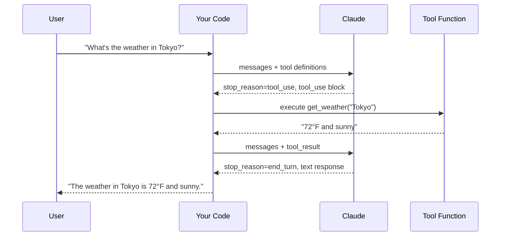
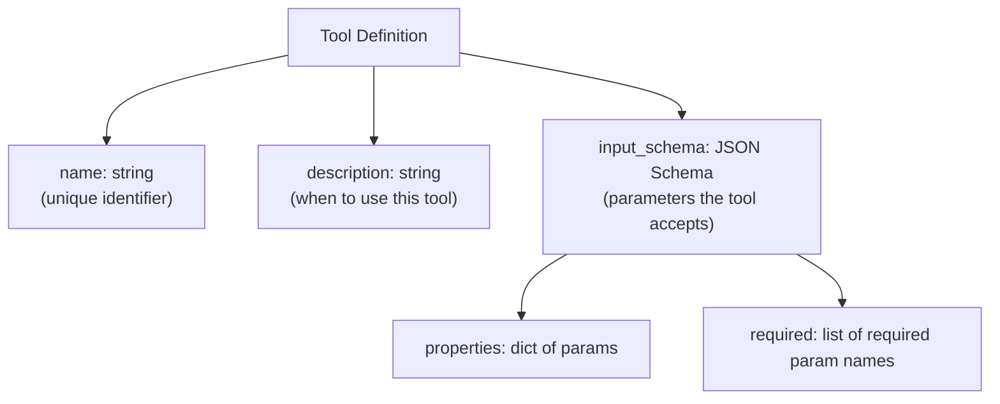

# Concepts: Tool Use / Function Calling

## The Problem

LLMs are trained on text. They're excellent at reasoning, summarising, and generating. But they cannot:

- Look up today's weather in Tokyo
- Calculate 2^32 with guaranteed precision
- Query your database for the latest order status
- Call your payment API

They're language models, not databases or calculators. When you ask a question that requires real-time data or precise computation, the LLM either hallucinates an answer or admits it doesn't know.

Tool use bridges this gap — you give the LLM access to functions it can call, and it calls them when it needs to.

---

## The Intuition

<div className="concept-intuition">

Imagine giving a very smart assistant a smartphone.

Without the phone, the assistant can answer from memory — history, general knowledge, reasoning. With the phone, they can check live flight status, calculate currency exchange rates, look up today's meeting schedule.

The key insight: **the assistant doesn't press the buttons.** They tell you "please look up flight AA123 arriving today." You look it up and hand them the result. They incorporate it into their answer.

That's exactly how tool use works. The LLM tells you which tool to call and with what inputs. Your code calls the function. You hand the result back. The LLM uses it in its final response.

</div>

---

## How It Works

### 1. Define Tools with JSON Schema

You describe each tool to the model using a JSON schema: what it's called, what it does, and what parameters it accepts.

```json
{
  "name": "get_weather",
  "description": "Get the current weather for a city.",
  "input_schema": {
    "type": "object",
    "properties": {
      "location": {
        "type": "string",
        "description": "The city name, e.g. 'London' or 'New York'"
      }
    },
    "required": ["location"]
  }
}
```

The description is critical — the model uses it to decide *when* to call this tool. Write descriptions that are precise and unambiguous.

---

### 2. Pass Tools to the API

You include the tool definitions in your API call alongside the messages:

```python
response = client.messages.create(
    model="claude-3-haiku-20240307",
    max_tokens=1024,
    tools=[get_weather_tool],       # list of tool definitions
    messages=[{"role": "user", "content": "What's the weather in Tokyo?"}]
)
```

---

### 3. Model Returns a `tool_use` Block

If the model decides to use a tool, it returns a response with `stop_reason="tool_use"` and a `tool_use` content block instead of regular text:

```json
{
  "stop_reason": "tool_use",
  "content": [
    {
      "type": "tool_use",
      "id": "toolu_01ABC",
      "name": "get_weather",
      "input": {"location": "Tokyo"}
    }
  ]
}
```

The model is **not executing the tool**. It's requesting that your code execute it.

---

### 4. You Execute the Tool and Return the Result

Your code reads the `tool_use` block, calls the actual function, and appends the result to the conversation as a `tool_result` content block:

```python
tool_result = execute_tool(tool_use_block.name, tool_use_block.input)

messages.append({"role": "assistant", "content": response.content})
messages.append({
    "role": "user",
    "content": [{
        "type": "tool_result",
        "tool_use_id": tool_use_block.id,   # must match the tool_use id
        "content": tool_result              # string result from your function
    }]
})
```

---

### 5. Model Uses the Result to Generate Its Final Answer

You call the API again with the updated message history. The model now has the tool result in context and generates its final text response:

```json
{
  "stop_reason": "end_turn",
  "content": [
    {
      "type": "text",
      "text": "The current weather in Tokyo is 18°C and partly cloudy."
    }
  ]
}
```

---

### 6. The Full Tool Use Loop



---

### Tool Definition Structure



---

## Key Terms

| Term | Definition |
|------|------------|
| **Tool use** | A mechanism for LLMs to request execution of external functions |
| **Function calling** | OpenAI's term for the same concept — tool use and function calling are equivalent |
| **Tool definition** | A JSON object describing a tool's name, description, and input schema |
| **`tool_use` block** | A content block in the model's response requesting execution of a named tool with specific inputs |
| **`tool_result`** | A content block you send back containing the output of the executed tool |
| **JSON Schema** | A vocabulary for describing the structure of JSON data — used to define tool parameters |
| **Agentic loop** | The pattern of repeatedly calling the model, executing tools, and returning results until `stop_reason=end_turn` |
| **`stop_reason`** | Indicates why the model stopped: `end_turn` (done), `tool_use` (wants to call a tool), `max_tokens` (truncated) |

---

## The Interview Angle

<div className="interview-angle">

**"How does the LLM 'call' a tool? Does it actually execute code?"**

No. The LLM cannot execute code directly. When it wants to use a tool, it outputs a structured `tool_use` content block containing the tool name and its input parameters. This is just text — a structured request.

Your code reads that block, calls the actual function, and returns the result as a `tool_result` message. The model only ever sees text; all real execution happens in your code.

The follow-up is often about error handling: "What if the tool fails?" You return the error message as the `tool_result` content. The model can then decide how to handle it — retry with different parameters, tell the user the tool is unavailable, or fall back to answering from its training data.

</div>

---

## Common Mistakes

<div className="antipattern">

**Not returning `tool_result` after `tool_use`** — If the model returns `stop_reason=tool_use` and you don't append a `tool_result` message before calling the API again, the model will hang or produce an error. The `tool_result` with the matching `tool_use_id` is required to continue the conversation.

**Returning tool errors by raising exceptions** — If your tool function throws an exception and you let it propagate, your agent crashes. Instead, catch the exception and return the error message as the `tool_result` content string. The model can then reason about the error and respond gracefully.

**No max_iterations guard** — In rare cases (model bugs, ambiguous tasks), a tool use loop can cycle indefinitely. Always add a `max_iterations` counter and break out of the loop if it's exceeded, returning a fallback message.

</div>
