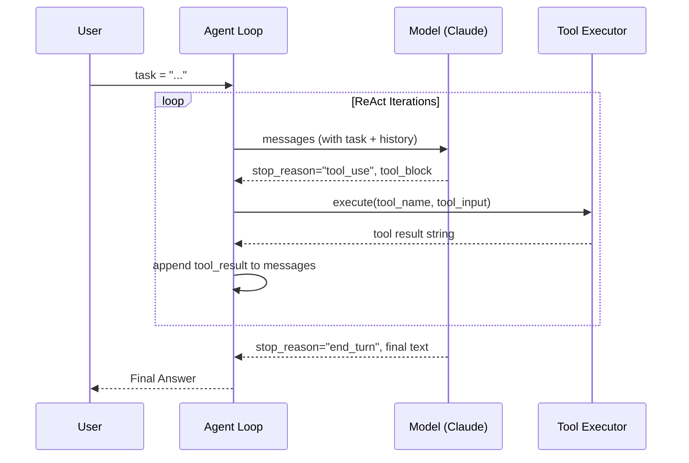
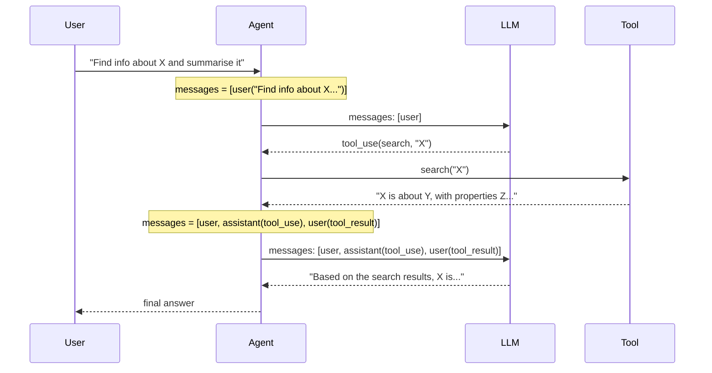

import AgentLoop from '@site/src/components/AgentLoop';

# Concepts: Agentic Loop

## The Problem

Chapter 19 (Tool Use) handles a single tool call perfectly. The model receives a prompt, decides to call a tool, you execute it, and you send the result back. Done.

But what about this task?

> "Search the web for the latest Python release, check the release notes for breaking changes, and then write a migration guide."

That's at least three separate tool calls — each one depending on the result of the previous. You can't know in advance how many steps you'll need. Some tasks require 2 tool calls; others require 10.

**You need a loop.**

---

## The Intuition: ReAct

ReAct stands for **Reasoning + Acting**. It's a pattern where the model:

1. **Thinks out loud** — writes its reasoning before deciding what to do (Thought)
2. **Takes an action** — calls a tool (Action)
3. **Observes the result** — receives the tool output (Observation)
4. **Thinks again** — uses the observation to reason about the next step
5. **Repeats** — until it has enough information to produce a Final Answer

The key insight: by interleaving reasoning with tool use, the model can handle tasks that require dynamic decision-making. It doesn't need a pre-planned sequence of steps — it figures out the next step based on what it just learned.

<AgentLoop steps={["Observe", "Think", "Act"]} animated={true} />

---

## How It Works

### 1. ReAct Format

In the original ReAct paper (Yao et al., 2022), the format looks like this:

```
Thought: I need to find the current Python version. Let me search for it.
Action: web_search(query="latest Python release 2024")
Observation: Python 3.13 was released on October 7, 2024.

Thought: Now I need the release notes to find breaking changes.
Action: web_search(query="Python 3.13 release notes breaking changes")
Observation: Key breaking changes include removal of deprecated APIs...

Thought: I have enough information to write the migration guide.
Final Answer: Here is the Python 3.13 migration guide...
```

Each cycle is: Thought → Action → Observation. The loop continues until the model outputs `Final Answer:`.

### 2. Loop Structure

```python
while not done:
    thought = model.think(messages)    # What should I do next?
    action = model.decide(thought)     # Which tool? What args?
    observation = tools.execute(action) # Run the tool
    messages.append(observation)       # Feed result back
    # repeat
```

### 3. Stopping Conditions

Without stopping conditions, an agent can loop forever. Three mechanisms stop the loop:

| Condition | Description |
|-----------|-------------|
| **Final Answer token** | Model outputs "Final Answer:" or `stop_reason == "end_turn"` with no tool call |
| **Max iterations** | Hard limit (e.g., 10 steps) — prevents runaway loops |
| **Error threshold** | N consecutive tool errors → abort gracefully |

### 4. Safety Constraints

| Constraint | Why |
|------------|-----|
| **Max iterations** | Bounds cost and prevents infinite loops |
| **Tool whitelist** | Agent can only call approved tools — no arbitrary code execution |
| **Human-in-the-loop** | For high-stakes actions (send email, charge card), require human approval |
| **Read-only mode** | Some agents observe only, never write |

### 5. Modern Implementation with Anthropic SDK

You don't need to parse "Thought:" and "Action:" out of raw text. The Anthropic API implements ReAct natively via `tool_use`:

- When the model wants to act, `stop_reason == "tool_use"` — the response contains a structured `tool_use` block with `name` and `input`
- You execute the tool and return a `tool_result` message
- The model receives the result and continues reasoning
- When the model has the final answer, `stop_reason == "end_turn"` — the response is a plain text message

**The `tool_use` stop_reason IS the ReAct loop — no custom parsing needed.**

---

## The Full ReAct Loop


---

## Sequence Diagram



---

## The Message Structure at Each Step

One of the most important things to understand about an agentic loop is **what the `messages` array actually looks like** as it accumulates. The LLM has no memory between API calls — its entire "working memory" is the messages list you send each time.

### After Step 1 — User sends the task

The agent makes its first API call with only the user's message:

```json
[
  {
    "role": "user",
    "content": "Find info about Python 3.13 and summarise the breaking changes."
  }
]
```

The LLM responds with `stop_reason: "tool_use"`, deciding it needs to call a search tool.

### After Step 2 — LLM returns a tool_use block

You append the assistant's response (which contains the `tool_use` block) to messages, then execute the tool. At this point messages looks like:

```json
[
  {
    "role": "user",
    "content": "Find info about Python 3.13 and summarise the breaking changes."
  },
  {
    "role": "assistant",
    "content": [
      {
        "type": "text",
        "text": "I'll search for Python 3.13 breaking changes."
      },
      {
        "type": "tool_use",
        "id": "toolu_01XYZ",
        "name": "web_search",
        "input": { "query": "Python 3.13 breaking changes" }
      }
    ]
  }
]
```

### After Step 3 — Tool result is appended, LLM responds with final answer

You wrap the tool output in a `tool_result` block and append it as a `user` role message (this is the Anthropic API convention). Then you call the LLM again. The full messages list is now:

```json
[
  {
    "role": "user",
    "content": "Find info about Python 3.13 and summarise the breaking changes."
  },
  {
    "role": "assistant",
    "content": [
      {
        "type": "text",
        "text": "I'll search for Python 3.13 breaking changes."
      },
      {
        "type": "tool_use",
        "id": "toolu_01XYZ",
        "name": "web_search",
        "input": { "query": "Python 3.13 breaking changes" }
      }
    ]
  },
  {
    "role": "user",
    "content": [
      {
        "type": "tool_result",
        "tool_use_id": "toolu_01XYZ",
        "content": "Python 3.13 removes several deprecated APIs: distutils, aifc, cgi..."
      }
    ]
  }
]
```

The LLM now responds with `stop_reason: "end_turn"` and a plain text summary — the loop exits.

**Key insight:** `tool_result` is sent with `role: "user"` because it represents external input back to the model, even though it was triggered by the model's own request. The alternating user/assistant pattern must always be maintained.

---

## What the LLM Sees at Each Iteration

This sequence diagram makes explicit which messages are passed to the LLM on each API call. Note how the context window grows with every iteration:



Each LLM call receives the **full accumulated history**. By iteration 3, the model sees the original task, its own prior reasoning and tool calls, and all tool results — giving it complete context to produce a grounded final answer.

---

## Why ReAct Works

### The Cognitive Science Angle

ReAct combines two capabilities that are individually limited:

| Approach | Strength | Weakness |
|----------|----------|----------|
| **Pure Chain-of-Thought (CoT)** | Rich reasoning, can plan multi-step solutions | Can only reason about what's in its training data — no fresh information, no real-world actions |
| **Pure Tool Use (no reasoning)** | Can fetch real data, take real actions | No principled way to decide *which* tool, *when*, or how to handle unexpected results |
| **ReAct (CoT + Tool Use)** | Reasons about what to do, acts to get real data, reasons again with that data | Slower and more expensive than a single LLM call |

### Why Reasoning Improves Tool Selection

When the model writes out its reasoning before choosing a tool, it activates a form of **chain-of-thought priming**: the intermediate text commits the model to a line of thinking and steers it toward a coherent tool choice. Without the reasoning step, the model is essentially guessing at the right tool call from the raw prompt — with it, the model has already partially solved the problem by the time it selects an action.

### Why Observation Grounds Subsequent Reasoning

Without observation, the model is doing closed-loop reasoning — building on its own outputs, which can drift from reality (hallucination compounds). Each observation is an injection of ground truth that resets the model's epistemic state. The reasoning in step N+1 is anchored to real data from step N, not to the model's internal prior.

### The Flywheel

```
Better reasoning → More precise tool call
→ Higher quality observation
→ Better reasoning in the next step
→ ...
→ Accurate final answer
```

This flywheel is why ReAct outperforms both pure CoT and pure tool use on multi-step tasks requiring external knowledge.

---

## Stopping Conditions

Stopping conditions are the most commonly under-specified part of an agentic loop. A production agent needs **all four** of the following:

### 1. `stop_reason == "end_turn"` — Natural completion

The model decided it has enough information and produced a final answer with no tool calls. This is the happy path. The loop exits cleanly.

```python
if response.stop_reason == "end_turn":
    return response.content[0].text  # done
```

### 2. `stop_reason == "tool_use"` — Continue the loop

The model wants to call a tool. This is not a stopping condition — it is the signal to **continue**. Execute the tool, append the result, and call the LLM again.

```python
if response.stop_reason == "tool_use":
    # find the tool_use block, execute it, append tool_result
    continue  # next iteration
```

### 3. `stop_reason == "max_tokens"` — Truncated response

The model ran out of output tokens mid-generation. The response is incomplete. This is an **error condition**, not a valid loop state. Options:

- Retry with a higher `max_tokens` limit
- Summarise the conversation so far to shrink the context window, then retry
- Abort with a clear error message rather than silently using a truncated response

```python
if response.stop_reason == "max_tokens":
    raise AgentError("Response truncated — increase max_tokens or summarise context")
```

### 4. `iteration >= max_iterations` — Safety guard

The agent has taken too many steps without reaching a conclusion. This catches:

- Infinite loops caused by tool errors the model keeps retrying
- Tasks that are genuinely unbounded and should never have been run this way
- Bugs in your loop logic

Always return a **partial result** with a clear message, not a silent failure:

```python
if iteration >= max_iterations:
    return f"[Partial result after {max_iterations} steps]: {last_observation}"
```

### 5. Consecutive tool errors — Abort with error message

If a tool returns an error, the model will often retry it — sometimes in a loop. Track consecutive failures and abort if you hit a threshold (typically 3):

```python
consecutive_errors = 0
MAX_CONSECUTIVE_ERRORS = 3

# inside the loop, after executing a tool:
if tool_result.startswith("Error:"):
    consecutive_errors += 1
    if consecutive_errors >= MAX_CONSECUTIVE_ERRORS:
        return f"Agent aborted: tool '{tool_name}' failed {MAX_CONSECUTIVE_ERRORS} times in a row."
else:
    consecutive_errors = 0  # reset on success
```

### Stopping Condition Decision Matrix

| `stop_reason` | Has tool call? | Action |
|---------------|---------------|--------|
| `"end_turn"` | No | Return final answer — done |
| `"tool_use"` | Yes | Execute tool, append result, loop |
| `"max_tokens"` | Either | Handle as error condition |
| Any | — | `iteration >= max_iterations` → return partial result |
| Any | — | N consecutive tool errors → abort |

---

## Key Terms

| Term | Definition |
|------|-----------|
| **ReAct** | Reasoning + Acting — the pattern of interleaving thought with tool use |
| **Agentic loop** | The while-loop that drives a ReAct agent: think → act → observe → repeat |
| **Thought** | The model's internal reasoning before taking an action |
| **Action** | A tool call with name and arguments |
| **Observation** | The result returned by the tool |
| **Stopping condition** | A rule that terminates the loop (final answer, max iterations, error budget) |
| **Scratchpad** | The running record of thoughts, actions, and observations — the agent's working memory |

---

## Interview Angle

**"What prevents an agent from running forever?"**

Three mechanisms work together:

1. **Max iterations** — hard cap, e.g., abort after 10 steps regardless of state
2. **Explicit final answer token** — when the model outputs "Final Answer:" or `stop_reason == "end_turn"` with no tool call, the loop exits cleanly
3. **Error budget** — N consecutive tool errors trigger an abort; the agent returns a graceful failure message rather than hammering a broken tool

A production agent should have all three. Max iterations catches runaway loops, the final answer token handles the happy path, and the error budget handles degraded environments.

---

## Common Mistakes

| Mistake | What Goes Wrong | Fix |
|---------|----------------|-----|
| No stopping condition | Infinite loop, runaway API costs | Add `max_iterations` and check `stop_reason` |
| Not passing observations back | Model can't use tool results — it repeats the same action forever | Always append `tool_result` to messages before the next call |
| Tool errors crash the loop | Agent dies on the first tool failure | Catch exceptions in `_execute_tool`, return an error string as the observation |
| No logging | Impossible to debug multi-step failures | Log each step: thought, action, observation |
| Ignoring `max_tokens` stop reason | Silently using a truncated, incomplete response as a final answer | Check for `stop_reason == "max_tokens"` and treat it as an error |
| No consecutive error tracking | Agent hammers a broken tool until max_iterations | Track consecutive errors and abort early with a clear message |

---

➡️ Next: [Patterns — Building Agentic Loops](./patterns.mdx)
