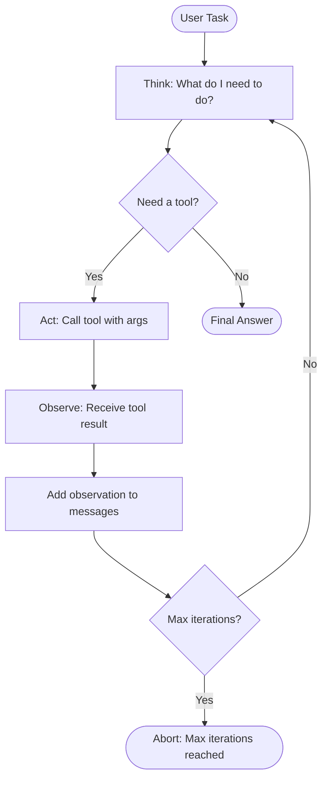
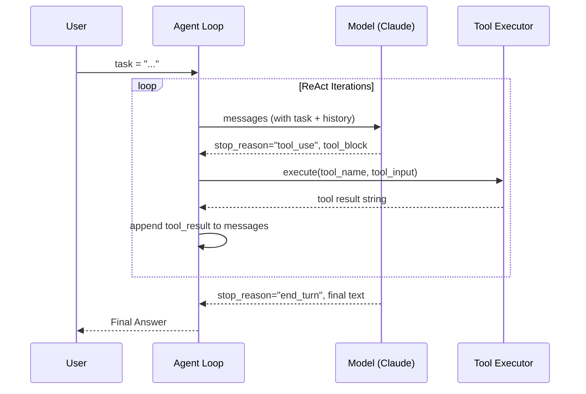

import AgentLoop from '@site/src/components/AgentLoop';

# Concepts: Agentic Loop

## The Problem

Chapter 19 (Tool Use) handles a single tool call perfectly. The model receives a prompt, decides to call a tool, you execute it, and you send the result back. Done.

But what about this task?

> "Search the web for the latest Python release, check the release notes for breaking changes, and then write a migration guide."

That's at least three separate tool calls — each one depending on the result of the previous. You can't know in advance how many steps you'll need. Some tasks require 2 tool calls; others require 10.

**You need a loop.**

---

## The Intuition: ReAct

ReAct stands for **Reasoning + Acting**. It's a pattern where the model:

1. **Thinks out loud** — writes its reasoning before deciding what to do (Thought)
2. **Takes an action** — calls a tool (Action)
3. **Observes the result** — receives the tool output (Observation)
4. **Thinks again** — uses the observation to reason about the next step
5. **Repeats** — until it has enough information to produce a Final Answer

The key insight: by interleaving reasoning with tool use, the model can handle tasks that require dynamic decision-making. It doesn't need a pre-planned sequence of steps — it figures out the next step based on what it just learned.

<AgentLoop steps={["Observe", "Think", "Act"]} animated={true} />

---

## How It Works

### 1. ReAct Format

In the original ReAct paper (Yao et al., 2022), the format looks like this:

```
Thought: I need to find the current Python version. Let me search for it.
Action: web_search(query="latest Python release 2024")
Observation: Python 3.13 was released on October 7, 2024.

Thought: Now I need the release notes to find breaking changes.
Action: web_search(query="Python 3.13 release notes breaking changes")
Observation: Key breaking changes include removal of deprecated APIs...

Thought: I have enough information to write the migration guide.
Final Answer: Here is the Python 3.13 migration guide...
```

Each cycle is: Thought → Action → Observation. The loop continues until the model outputs `Final Answer:`.

### 2. Loop Structure

```python
while not done:
    thought = model.think(messages)    # What should I do next?
    action = model.decide(thought)     # Which tool? What args?
    observation = tools.execute(action) # Run the tool
    messages.append(observation)       # Feed result back
    # repeat
```

### 3. Stopping Conditions

Without stopping conditions, an agent can loop forever. Three mechanisms stop the loop:

| Condition | Description |
|-----------|-------------|
| **Final Answer token** | Model outputs "Final Answer:" or `stop_reason == "end_turn"` with no tool call |
| **Max iterations** | Hard limit (e.g., 10 steps) — prevents runaway loops |
| **Error threshold** | N consecutive tool errors → abort gracefully |

### 4. Safety Constraints

| Constraint | Why |
|------------|-----|
| **Max iterations** | Bounds cost and prevents infinite loops |
| **Tool whitelist** | Agent can only call approved tools — no arbitrary code execution |
| **Human-in-the-loop** | For high-stakes actions (send email, charge card), require human approval |
| **Read-only mode** | Some agents observe only, never write |

### 5. Modern Implementation with Anthropic SDK

You don't need to parse "Thought:" and "Action:" out of raw text. The Anthropic API implements ReAct natively via `tool_use`:

- When the model wants to act, `stop_reason == "tool_use"` — the response contains a structured `tool_use` block with `name` and `input`
- You execute the tool and return a `tool_result` message
- The model receives the result and continues reasoning
- When the model has the final answer, `stop_reason == "end_turn"` — the response is a plain text message

**The `tool_use` stop_reason IS the ReAct loop — no custom parsing needed.**

---

## The Full ReAct Loop



---

## Sequence Diagram



---

## Key Terms

| Term | Definition |
|------|-----------|
| **ReAct** | Reasoning + Acting — the pattern of interleaving thought with tool use |
| **Agentic loop** | The while-loop that drives a ReAct agent: think → act → observe → repeat |
| **Thought** | The model's internal reasoning before taking an action |
| **Action** | A tool call with name and arguments |
| **Observation** | The result returned by the tool |
| **Stopping condition** | A rule that terminates the loop (final answer, max iterations, error budget) |
| **Scratchpad** | The running record of thoughts, actions, and observations — the agent's working memory |

---

## Interview Angle

**"What prevents an agent from running forever?"**

Three mechanisms work together:

1. **Max iterations** — hard cap, e.g., abort after 10 steps regardless of state
2. **Explicit final answer token** — when the model outputs "Final Answer:" or `stop_reason == "end_turn"` with no tool call, the loop exits cleanly
3. **Error budget** — N consecutive tool errors trigger an abort; the agent returns a graceful failure message rather than hammering a broken tool

A production agent should have all three. Max iterations catches runaway loops, the final answer token handles the happy path, and the error budget handles degraded environments.

---

## Common Mistakes

| Mistake | What Goes Wrong | Fix |
|---------|----------------|-----|
| No stopping condition | Infinite loop, runaway API costs | Add `max_iterations` and check `stop_reason` |
| Not passing observations back | Model can't use tool results — it repeats the same action forever | Always append `tool_result` to messages before the next call |
| Tool errors crash the loop | Agent dies on the first tool failure | Catch exceptions in `_execute_tool`, return an error string as the observation |
| No logging | Impossible to debug multi-step failures | Log each step: thought, action, observation |

---

➡️ Next: [Patterns — Building Agentic Loops](./patterns.mdx)
