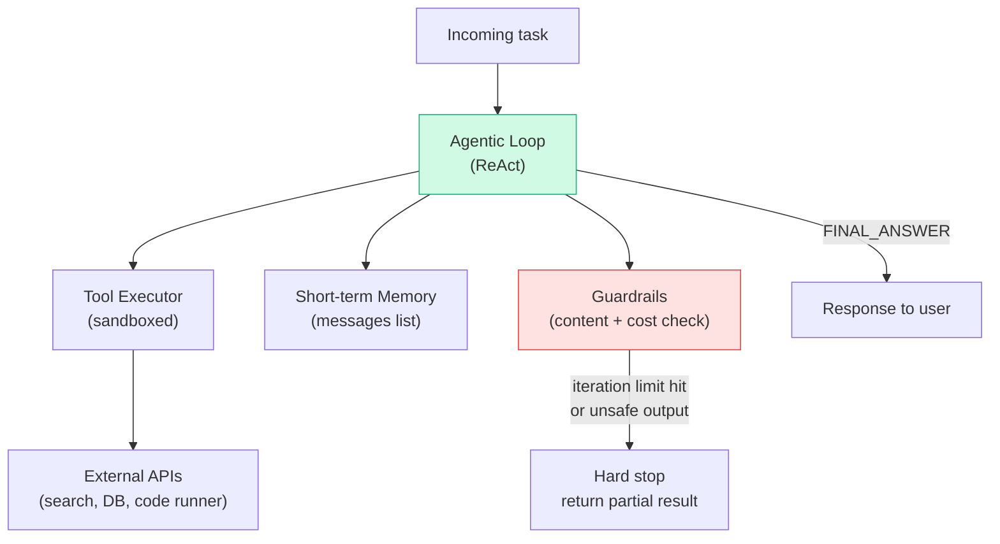

# Patterns: Building Agentic Loops

## Pattern 1: Simple ReAct Loop

The minimal agentic loop using Anthropic's native `tool_use` stop reason. No custom parsing — the SDK handles the ReAct format.

```python
import anthropic

client = anthropic.Anthropic()
MODEL = "claude-3-haiku-20240307"

def run_react_agent(task: str, tools: list[dict], tool_functions: dict) -> str:
    """
    Simple ReAct loop. Runs until model returns end_turn or max_iterations.
    """
    messages = [{"role": "user", "content": task}]
    max_iterations = 10

    for iteration in range(max_iterations):
        response = client.messages.create(
            model=MODEL,
            max_tokens=1024,
            tools=tools,
            messages=messages,
        )

        # Happy path: model has a final answer
        if response.stop_reason == "end_turn":
            # Extract text from the response
            for block in response.content:
                if hasattr(block, "text"):
                    return block.text
            return ""

        # ReAct step: model wants to call a tool
        if response.stop_reason == "tool_use":
            # Find the tool_use block
            tool_block = next(b for b in response.content if b.type == "tool_use")
            tool_name = tool_block.name
            tool_input = tool_block.input

            # Execute the tool
            if tool_name in tool_functions:
                result = str(tool_functions[tool_name](**tool_input))
            else:
                result = f"Unknown tool: {tool_name}"

            # Append assistant turn (with tool_use block) and tool result
            messages.append({"role": "assistant", "content": response.content})
            messages.append({
                "role": "user",
                "content": [{
                    "type": "tool_result",
                    "tool_use_id": tool_block.id,
                    "content": result,
                }]
            })

            print(f"[Step {iteration + 1}] Called {tool_name} → {result[:80]}...")

    return "Agent reached max iterations without completing the task."


# Example usage
import math

tools = [
    {
        "name": "calculator",
        "description": "Evaluate a mathematical expression.",
        "input_schema": {
            "type": "object",
            "properties": {
                "expression": {"type": "string", "description": "Math expression to evaluate"}
            },
            "required": ["expression"]
        }
    }
]

tool_functions = {
    "calculator": lambda expression: eval(expression, {"__builtins__": {}}, {"math": math})
}

answer = run_react_agent(
    "What is the square root of 144, divided by 3, then squared?",
    tools,
    tool_functions,
)
print(f"\nFinal Answer: {answer}")
```

---

## Pattern 2: Loop with Error Recovery

Catch tool errors and return them as observations. The model can read the error and try a different approach.

```python
import anthropic
import traceback

client = anthropic.Anthropic()
MODEL = "claude-3-haiku-20240307"


def execute_tool_safely(tool_name: str, tool_input: dict, tool_functions: dict) -> str:
    """Execute a tool, catching all exceptions and returning them as error strings."""
    if tool_name not in tool_functions:
        return f"Error: Unknown tool '{tool_name}'. Available tools: {list(tool_functions.keys())}"
    try:
        result = tool_functions[tool_name](**tool_input)
        return str(result)
    except TypeError as e:
        return f"Error: Wrong arguments for {tool_name} — {e}"
    except Exception as e:
        return f"Error: {tool_name} failed — {type(e).__name__}: {e}"


def run_agent_with_recovery(task: str, tools: list[dict], tool_functions: dict) -> str:
    """
    ReAct loop with error recovery.
    Tool errors are returned as observations — the model can adapt.
    """
    messages = [{"role": "user", "content": task}]
    max_iterations = 10
    consecutive_errors = 0
    max_consecutive_errors = 3

    for iteration in range(max_iterations):
        response = client.messages.create(
            model=MODEL,
            max_tokens=1024,
            tools=tools,
            messages=messages,
        )

        if response.stop_reason == "end_turn":
            consecutive_errors = 0  # reset on success
            for block in response.content:
                if hasattr(block, "text"):
                    return block.text
            return ""

        if response.stop_reason == "tool_use":
            tool_block = next(b for b in response.content if b.type == "tool_use")

            # Execute with full error recovery
            result = execute_tool_safely(
                tool_block.name,
                tool_block.input,
                tool_functions,
            )

            # Track consecutive errors for the error budget
            if result.startswith("Error:"):
                consecutive_errors += 1
                print(f"[Step {iteration + 1}] Tool error ({consecutive_errors}/{max_consecutive_errors}): {result}")
                if consecutive_errors >= max_consecutive_errors:
                    return f"Agent aborted: {max_consecutive_errors} consecutive tool errors. Last error: {result}"
            else:
                consecutive_errors = 0  # reset on success
                print(f"[Step {iteration + 1}] {tool_block.name} succeeded")

            messages.append({"role": "assistant", "content": response.content})
            messages.append({
                "role": "user",
                "content": [{
                    "type": "tool_result",
                    "tool_use_id": tool_block.id,
                    "content": result,
                }]
            })

    return "Agent reached max iterations without completing the task."
```

---

## Pattern 3: Streaming Agentic Loop

Yield tool calls and results as events so the UI can show progress in real time.

```python
import anthropic
from typing import Generator

client = anthropic.Anthropic()
MODEL = "claude-3-haiku-20240307"


def stream_agent_events(
    task: str,
    tools: list[dict],
    tool_functions: dict,
) -> Generator[dict, None, None]:
    """
    ReAct loop that yields events at each step.
    Events: {"type": "tool_call", "name": ..., "input": ...}
             {"type": "tool_result", "name": ..., "result": ...}
             {"type": "final_answer", "text": ...}
             {"type": "error", "message": ...}
    """
    messages = [{"role": "user", "content": task}]
    max_iterations = 10

    for iteration in range(max_iterations):
        response = client.messages.create(
            model=MODEL,
            max_tokens=1024,
            tools=tools,
            messages=messages,
        )

        if response.stop_reason == "end_turn":
            for block in response.content:
                if hasattr(block, "text"):
                    yield {"type": "final_answer", "text": block.text}
            return

        if response.stop_reason == "tool_use":
            tool_block = next(b for b in response.content if b.type == "tool_use")

            yield {
                "type": "tool_call",
                "name": tool_block.name,
                "input": tool_block.input,
                "iteration": iteration + 1,
            }

            # Execute tool
            if tool_block.name in tool_functions:
                try:
                    result = str(tool_functions[tool_block.name](**tool_block.input))
                except Exception as e:
                    result = f"Error: {e}"
            else:
                result = f"Unknown tool: {tool_block.name}"

            yield {
                "type": "tool_result",
                "name": tool_block.name,
                "result": result,
                "iteration": iteration + 1,
            }

            messages.append({"role": "assistant", "content": response.content})
            messages.append({
                "role": "user",
                "content": [{
                    "type": "tool_result",
                    "tool_use_id": tool_block.id,
                    "content": result,
                }]
            })

    yield {"type": "error", "message": "Max iterations reached"}


# Usage: consume the generator to stream progress
for event in stream_agent_events("Calculate 15 factorial", tools, tool_functions):
    if event["type"] == "tool_call":
        print(f"Calling {event['name']} with {event['input']}")
    elif event["type"] == "tool_result":
        print(f"Result: {event['result']}")
    elif event["type"] == "final_answer":
        print(f"Answer: {event['text']}")
    elif event["type"] == "error":
        print(f"Error: {event['message']}")
```

---

## Anti-Patterns

| Anti-Pattern | What Goes Wrong | Fix |
|-------------|----------------|-----|
| **No `max_iterations` guard** | Agent loops forever if model keeps calling tools; API costs spiral | Always set a hard iteration limit before entering the loop |
| **Crashing on tool errors** | A single bad tool call (network timeout, wrong args) kills the whole agent | Wrap every tool call in try/except; return error string as observation |
| **Not logging steps** | Multi-step failures are impossible to debug — you don't know which step failed | Log iteration number, tool name, input, and first 100 chars of result for every step |
| **Mutating messages in-place** | Race conditions and confusing state if you run multiple agents | Treat `messages` as append-only; never modify earlier entries |

---

## Where This Fits in Production

A single agentic loop is the inner engine of almost every AI product:



**Cost and latency profile** for a 5-step ReAct agent (Claude Sonnet):

| What | Rough numbers |
|------|---------------|
| Tokens per step (context grows) | 500 → 2,000 by step 5 |
| Cost for a 5-step run | ~$0.03–$0.08 |
| Latency per step | 1–3 s |
| Total wall-clock time | 5–15 s |

**Key production considerations:**

- **Timeouts** — set a per-step timeout (5–10 s) and a total task timeout (60 s) to protect against runaway agents
- **Tool sandboxing** — never run agent-generated code directly; use Docker or E2B for code execution tools
- **Idempotency** — if a tool is called twice (e.g., on retry), it should produce the same result; design tools to be idempotent
- **Async** — wrap the loop in an async background job (Celery, RQ) so the HTTP response isn't held open for 15 s

**Where to go next:** Ch23 (Planning) covers pre-generating tool call sequences; Ch24 (Multi-Agent) splits the loop across specialised agents; Ch28 (HITL) adds human approval gates.
