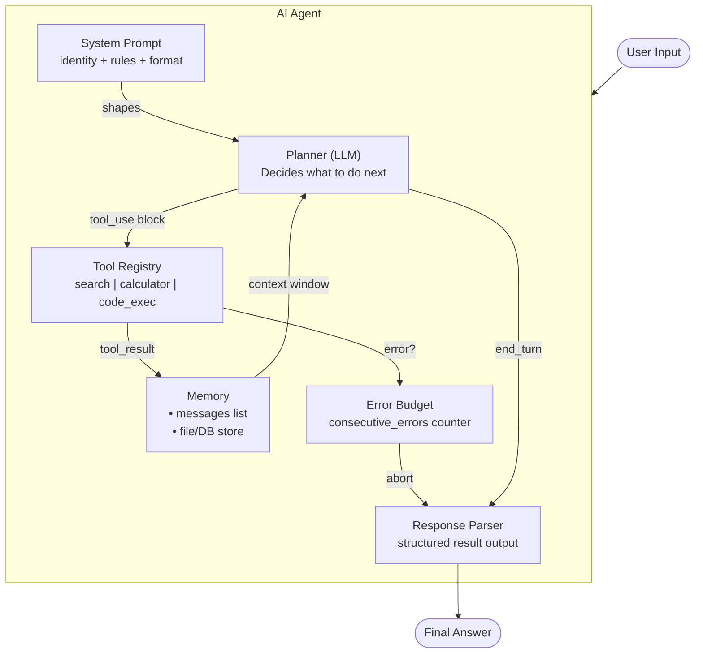

# Concepts: Full AI Agents

## What We've Built So Far

| Chapter | What You Got |
|---------|-------------|
| Ch 19: Tool Use | Single tool call — model decides to call a tool, you execute it, done |
| Ch 20: Agentic Loop | Multi-step loop — think → act → observe, repeat until final answer |
| **Ch 21: Full Agent** | **Everything assembled: system prompt + tool registry + memory + error recovery** |

---

## Agent Anatomy

A production AI agent has five components working together:

### 1. System Prompt

The system prompt is the agent's identity and behavioral contract. It tells the model:

- **Who it is** — "You are a research assistant that helps users find and summarize information."
- **What it can do** — "You have access to web search, a calculator, and a note-taking tool."
- **What it cannot do** — "Do not make up information. If you cannot find an answer, say so."
- **How to behave** — "Always cite your sources. Be concise. Ask for clarification if the task is ambiguous."
- **Output format** — "When your research is complete, provide a structured report with: Summary, Key Facts, Sources."

A weak system prompt produces an unreliable agent. A strong system prompt is the single biggest lever for agent reliability.

### 2. Tool Registry

A tool registry is a dict mapping tool names to callable functions. It's the contract between the agent and the environment.

```python
tool_registry = {
    "web_search":    search_function,
    "calculator":    calc_function,
    "read_file":     read_function,
    "take_note":     note_function,
}
```

The registry has two parts that must stay in sync:
- **Tool definitions** (JSON schema) — what the model sees, used in the `tools=` parameter
- **Tool functions** (callables) — what actually executes

### 3. Conversation Memory

The `messages` list IS the agent's memory. Every tool call, every result, every reasoning step is stored in it. The model reads this list at every iteration.

Two constraints shape memory management:
- **Context window limit** — if the conversation grows too long, old messages must be truncated or summarized
- **Relevant history** — the model reasons better when the most relevant context is near the end of the messages list

For most tasks under 10 steps, you can keep the full history without worrying about truncation.

### 4. Error Budget

An error budget tracks consecutive tool failures. Once the threshold is hit, the agent aborts gracefully rather than hammering a broken tool.

```
consecutive_errors = 0
max_consecutive_errors = 3

if tool_result.startswith("Error:"):
    consecutive_errors += 1
    if consecutive_errors >= max_consecutive_errors:
        abort("Too many consecutive errors")
else:
    consecutive_errors = 0  # reset on success
```

This pattern prevents:
- Infinite retry loops on a broken tool
- Burning the full iteration budget on recoverable errors
- Confusing the model with a stream of error observations

### 5. Response Parsing

After the loop, extract a structured result from the agent's final message. A simple approach: return a dataclass with the final text, number of steps taken, and whether the agent succeeded.

---

## Architecture Diagram


---

## Agent Architecture — All the Moving Parts

The flowchart above shows the data flow, but it helps to also see the internal structure as a component map. Every production agent is built from these six interlocking parts:



**Reading the diagram:**

| Component | Role | Failure mode if missing |
|-----------|------|------------------------|
| Planner (LLM) | Reads context, picks next action | N/A — this is the model itself |
| Memory | Accumulates observations across steps | Agent forgets what it already found |
| Tool Registry | Maps model decisions to real code | Hallucinated tool calls with no effect |
| Error Budget | Detects broken-tool spirals | Infinite loop burning tokens |
| System Prompt | Defines identity, capabilities, limits | Unpredictable / off-task behavior |
| Response Parser | Surfaces a clean result to the caller | Caller gets raw JSON or an empty string |

---

## The Full Agent Class

Below is a complete, working Python class that wires all six components together. Read it top to bottom — each method maps directly to one of the components above.

```python
import anthropic
import json
from dataclasses import dataclass, field
from typing import Any, Callable


@dataclass
class AgentResult:
    """Structured output from a completed agent run."""
    final_response: str
    steps_taken: int
    success: bool
    error: str | None = None


@dataclass
class ToolDefinition:
    """Everything the agent needs to know about one tool."""
    name: str
    description: str
    input_schema: dict
    handler: Callable[..., str]


class FullAgent:
    """
    A production-ready AI agent with:
    - Tool registry (register tools at runtime)
    - Conversation memory (full message history)
    - Error budget (abort after N consecutive failures)
    - ReAct loop (think → act → observe until end_turn)
    """

    def __init__(
        self,
        system_prompt: str,
        model: str = "claude-opus-4-5",
        max_iterations: int = 10,
        max_consecutive_errors: int = 3,
    ):
        self.client = anthropic.Anthropic()
        self.model = model
        self.system_prompt = system_prompt
        self.max_iterations = max_iterations
        self.max_consecutive_errors = max_consecutive_errors

        # Tool registry: name → ToolDefinition
        self._tools: dict[str, ToolDefinition] = {}

        # Conversation memory: the full message history
        self._messages: list[dict] = []

    # ------------------------------------------------------------------
    # Tool registration
    # ------------------------------------------------------------------

    def register_tool(
        self,
        name: str,
        description: str,
        input_schema: dict,
        handler: Callable[..., str],
    ) -> None:
        """Add a tool to the registry. Call this before running the agent."""
        self._tools[name] = ToolDefinition(
            name=name,
            description=description,
            input_schema=input_schema,
            handler=handler,
        )

    def tool(self, description: str, schema: dict):
        """
        Decorator shorthand for register_tool.

        Usage:
            @agent.tool(description="...", schema={...})
            def my_tool(arg: str) -> str: ...
        """
        def decorator(fn: Callable) -> Callable:
            self.register_tool(
                name=fn.__name__,
                description=description,
                input_schema=schema,
                handler=fn,
            )
            return fn
        return decorator

    def _tool_definitions_for_api(self) -> list[dict]:
        """Convert the registry into the format the Anthropic API expects."""
        return [
            {
                "name": td.name,
                "description": td.description,
                "input_schema": td.input_schema,
            }
            for td in self._tools.values()
        ]

    # ------------------------------------------------------------------
    # Tool execution
    # ------------------------------------------------------------------

    def _execute_tool(self, tool_name: str, tool_input: dict) -> str:
        """
        Dispatch a tool call to the right handler.
        Always returns a string — errors are observations, not exceptions.
        """
        if tool_name not in self._tools:
            return f"Error: unknown tool '{tool_name}'. Available: {list(self._tools)}"

        handler = self._tools[tool_name].handler
        try:
            result = handler(**tool_input)
            # Ensure we always return a string
            return result if isinstance(result, str) else json.dumps(result)
        except TypeError as exc:
            return f"Error: bad arguments for '{tool_name}': {exc}"
        except Exception as exc:
            return f"Error: '{tool_name}' raised {type(exc).__name__}: {exc}"

    # ------------------------------------------------------------------
    # ReAct loop
    # ------------------------------------------------------------------

    def _run(self, user_message: str) -> AgentResult:
        """
        Core ReAct loop:
          1. Append user message to history
          2. Call the model
          3. If stop_reason == 'tool_use': execute tools, append results, repeat
          4. If stop_reason == 'end_turn': extract final text, return AgentResult
        """
        # Append the user turn to memory
        self._messages.append({"role": "user", "content": user_message})

        consecutive_errors = 0
        steps = 0

        for iteration in range(self.max_iterations):
            steps = iteration + 1

            # --- Call the model ---
            response = self.client.messages.create(
                model=self.model,
                max_tokens=4096,
                system=self.system_prompt,
                tools=self._tool_definitions_for_api(),
                messages=self._messages,
            )

            # Append the assistant turn to memory
            self._messages.append({"role": "assistant", "content": response.content})

            # --- Check stop reason ---
            if response.stop_reason == "end_turn":
                # Extract the final text block
                final_text = ""
                for block in response.content:
                    if hasattr(block, "text"):
                        final_text = block.text
                        break
                return AgentResult(
                    final_response=final_text,
                    steps_taken=steps,
                    success=True,
                )

            if response.stop_reason != "tool_use":
                # Unexpected stop reason (e.g. max_tokens)
                return AgentResult(
                    final_response="",
                    steps_taken=steps,
                    success=False,
                    error=f"Unexpected stop_reason: {response.stop_reason}",
                )

            # --- Execute all tool calls in this turn ---
            tool_results = []
            for block in response.content:
                if block.type != "tool_use":
                    continue

                result_text = self._execute_tool(block.name, block.input)

                # Track error budget
                if result_text.startswith("Error:"):
                    consecutive_errors += 1
                else:
                    consecutive_errors = 0

                tool_results.append({
                    "type": "tool_result",
                    "tool_use_id": block.id,
                    "content": result_text,
                })

            # Append tool results as a user turn (Anthropic message format)
            self._messages.append({"role": "user", "content": tool_results})

            # Abort if error budget is exhausted
            if consecutive_errors >= self.max_consecutive_errors:
                return AgentResult(
                    final_response="",
                    steps_taken=steps,
                    success=False,
                    error=f"Aborted: {consecutive_errors} consecutive tool errors",
                )

        # Fell through the loop — max iterations reached
        return AgentResult(
            final_response="",
            steps_taken=steps,
            success=False,
            error=f"Reached max_iterations ({self.max_iterations}) without end_turn",
        )

    # ------------------------------------------------------------------
    # Public interface
    # ------------------------------------------------------------------

    def chat(self, user_message: str) -> str:
        """
        Public interface. Calls _run() and returns the final response text.
        Raises RuntimeError if the agent failed.
        """
        result = self._run(user_message)
        if not result.success:
            raise RuntimeError(
                f"Agent failed after {result.steps_taken} steps: {result.error}"
            )
        return result.final_response

    def reset(self) -> None:
        """Clear conversation memory. Call between independent tasks."""
        self._messages = []
```

### How the pieces connect

```
chat(user_message)
  └── _run(user_message)
        ├── append to self._messages          ← Memory
        ├── client.messages.create(...)        ← Planner (LLM)
        │     system=self.system_prompt        ← System Prompt
        │     tools=_tool_definitions_for_api()← Tool Registry (definitions)
        ├── stop_reason == "tool_use"?
        │     └── _execute_tool(name, input)   ← Tool Registry (handlers)
        │           └── error budget check     ← Error Budget
        └── stop_reason == "end_turn"?
              └── return AgentResult           ← Response Parser
```

---

## Composing Tools — The Registry Pattern

Tools follow a consistent interface: they accept typed keyword arguments and return a plain string. Use the `@agent.tool` decorator to register them with a description and JSON schema in one step.

```python
import anthropic
import math
from datetime import datetime, timezone

# Build the agent first, then register tools against it
agent = FullAgent(system_prompt="...")  # system prompt shown in next section


# ── Tool 1: Web search ────────────────────────────────────────────────

@agent.tool(
    description=(
        "Search the web for current information. "
        "Use this when the answer depends on recent events or real-time data."
    ),
    schema={
        "type": "object",
        "properties": {
            "query": {
                "type": "string",
                "description": "The search query string",
            },
            "max_results": {
                "type": "integer",
                "description": "Maximum number of results to return (default 5)",
                "default": 5,
            },
        },
        "required": ["query"],
    },
)
def web_search(query: str, max_results: int = 5) -> str:
    """Call a real search API here (DuckDuckGo, Serper, Brave, etc.)."""
    # Example stub — replace with a live API call
    # results = serper_client.search(query, num=max_results)
    # return "\n".join(f"- {r['title']}: {r['snippet']}" for r in results)
    return f"[stub] Search results for '{query}' (top {max_results})"


# ── Tool 2: Calculator ────────────────────────────────────────────────

@agent.tool(
    description=(
        "Evaluate a mathematical expression and return the numeric result. "
        "Use this instead of doing arithmetic in your head."
    ),
    schema={
        "type": "object",
        "properties": {
            "expression": {
                "type": "string",
                "description": "A Python math expression, e.g. '2 ** 10' or 'math.sqrt(144)'",
            },
        },
        "required": ["expression"],
    },
)
def calculator(expression: str) -> str:
    """Evaluate expression in a restricted namespace that includes math.*"""
    allowed_names = {k: getattr(math, k) for k in dir(math) if not k.startswith("_")}
    allowed_names["__builtins__"] = {}  # no builtins — safe eval
    try:
        result = eval(expression, allowed_names)  # noqa: S307
        return str(result)
    except Exception as exc:
        return f"Error: could not evaluate '{expression}': {exc}"


# ── Tool 3: Current time ──────────────────────────────────────────────

@agent.tool(
    description=(
        "Return the current UTC date and time. "
        "Use this when the user asks 'what time is it' or needs a timestamp."
    ),
    schema={
        "type": "object",
        "properties": {
            "format": {
                "type": "string",
                "description": "strftime format string (default: '%Y-%m-%d %H:%M:%S UTC')",
            },
        },
        "required": [],
    },
)
def get_current_time(format: str = "%Y-%m-%d %H:%M:%S UTC") -> str:
    now = datetime.now(tz=timezone.utc)
    return now.strftime(format)
```

### Why the decorator pattern scales

| Concern | How the pattern handles it |
|---------|---------------------------|
| Adding a new tool | One decorator — no need to touch the agent class |
| Sharing tools across agents | Define tools as plain functions; apply the decorator to each agent |
| Testing tools in isolation | Call the function directly — no agent required |
| Schema drift | Description and schema live next to the implementation |

---

## System Prompt Engineering for Agents

The system prompt is the highest-leverage configuration in any agent. A battle-tested template has four parts: role declaration, tool inventory, boundaries, and output contract.

```python
RESEARCH_AGENT_SYSTEM_PROMPT = """
You are a research assistant AI. Your job is to answer questions accurately
by searching the web, performing calculations, and reasoning over evidence.
You are thorough, concise, and always cite your sources.

## Tools available

You have access to the following tools. Use each tool for its stated purpose only.

| Tool | When to use |
|------|-------------|
| web_search | Any question that depends on current events, real-time data, or facts you are not certain about |
| calculator | Any arithmetic, percentage, unit conversion, or mathematical expression |
| get_current_time | When the user asks for the current date or time, or when a timestamp is needed |

## Rules

1. **Do not fabricate information.** If web_search returns no useful results, say so.
2. **Cite every factual claim** with the source URL from the search results.
3. **Do not execute code** or access the filesystem — you have no such tools.
4. **Do not guess at numeric answers** — use the calculator tool instead.
5. **Ask for clarification** if the user's request is ambiguous before searching.
6. **One tool at a time.** Do not call more than one tool per reasoning step unless
   the calls are fully independent (e.g., two searches on unrelated topics).

## Output format

When you have gathered enough information to answer the question, reply with:

**Summary**
A 2–4 sentence answer to the user's question.

**Key Facts**
- Bullet list of specific facts that support the summary

**Sources**
- [Title](URL) — one line per source used

If you cannot answer with confidence, reply:
> I was unable to find reliable information on this topic. [explain what you tried]
"""
```

### Anatomy of the template

```
┌───────────────────────────────────────────────────────┐
│  1. ROLE          Who the agent is and its purpose     │
│  2. TOOL TABLE    What each tool is for                │
│  3. RULES         Explicit constraints and guardrails  │
│  4. OUTPUT FMT    Exact structure of the final reply   │
└───────────────────────────────────────────────────────┘
```

**Why each part matters:**

- **Role** sets the model's reasoning persona. "You are a research assistant" primes the model to behave like one, including being appropriately skeptical of uncertain facts.
- **Tool table** prevents tool misuse. Without it, models occasionally use a calculator for a search query or vice versa.
- **Rules** are your guardrails. Each rule addresses a specific failure mode observed in production (hallucination, no-source answers, infinite tool loops).
- **Output format** makes downstream parsing reliable. If your caller expects a `## Summary` heading, put it here — not in application code.

:::tip Evolve the system prompt from failures
The best agent system prompts are written by observing what the agent does wrong, then adding a rule that prevents that specific failure. Start minimal and add rules as you encounter edge cases.
:::

---

## Key Terms

| Term | Definition |
|------|-----------|
| **Agent** | An LLM combined with tools, a loop, and memory — capable of autonomous multi-step task completion |
| **Tool registry** | A dict mapping tool names to callable functions |
| **Error budget** | A counter that aborts the agent after N consecutive tool failures |
| **Conversation memory** | The messages list — the agent's running context and working memory |
| **Agent system prompt** | The system prompt that defines agent persona, capabilities, and behavioral rules |
| **Emergent behavior** | Behaviors the agent exhibits that weren't explicitly programmed — arising from reasoning over observations |
| **ReAct loop** | The think → act → observe cycle: call LLM, execute tools, feed results back, repeat |
| **Decorator pattern** | Registering tools via `@agent.tool(...)` so the schema lives next to the implementation |

---

## Interview Angle

**"What makes a reliable agent vs an unreliable one?"**

Four factors separate reliable agents from unreliable ones:

1. **Bounded iterations** — a hard max_iterations ensures the agent always terminates
2. **Error recovery** — tool errors are observations, not exceptions; the model can adapt
3. **Good system prompt** — clear description of capabilities and constraints prevents the model from hallucinating actions
4. **Idempotent tools where possible** — if the same tool is called twice by mistake (e.g., due to a loop bug), idempotent tools don't double the side effect (no double-charges, no duplicate emails)

---

➡️ Next: [Patterns — Full Agent Architecture](./patterns.mdx)
