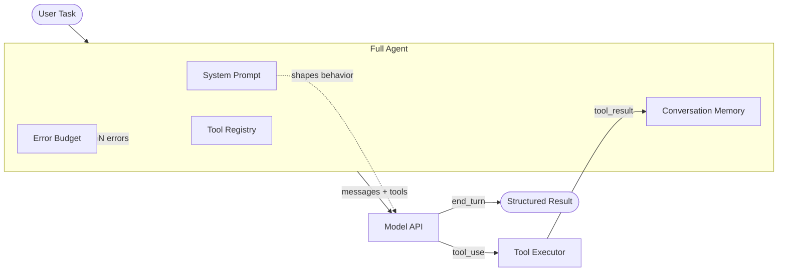

# Concepts: Full AI Agents

## What We've Built So Far

| Chapter | What You Got |
|---------|-------------|
| Ch 19: Tool Use | Single tool call — model decides to call a tool, you execute it, done |
| Ch 20: Agentic Loop | Multi-step loop — think → act → observe, repeat until final answer |
| **Ch 21: Full Agent** | **Everything assembled: system prompt + tool registry + memory + error recovery** |

---

## Agent Anatomy

A production AI agent has five components working together:

### 1. System Prompt

The system prompt is the agent's identity and behavioral contract. It tells the model:

- **Who it is** — "You are a research assistant that helps users find and summarize information."
- **What it can do** — "You have access to web search, a calculator, and a note-taking tool."
- **What it cannot do** — "Do not make up information. If you cannot find an answer, say so."
- **How to behave** — "Always cite your sources. Be concise. Ask for clarification if the task is ambiguous."
- **Output format** — "When your research is complete, provide a structured report with: Summary, Key Facts, Sources."

A weak system prompt produces an unreliable agent. A strong system prompt is the single biggest lever for agent reliability.

### 2. Tool Registry

A tool registry is a dict mapping tool names to callable functions. It's the contract between the agent and the environment.

```python
tool_registry = {
    "web_search":    search_function,
    "calculator":    calc_function,
    "read_file":     read_function,
    "take_note":     note_function,
}
```

The registry has two parts that must stay in sync:
- **Tool definitions** (JSON schema) — what the model sees, used in the `tools=` parameter
- **Tool functions** (callables) — what actually executes

### 3. Conversation Memory

The `messages` list IS the agent's memory. Every tool call, every result, every reasoning step is stored in it. The model reads this list at every iteration.

Two constraints shape memory management:
- **Context window limit** — if the conversation grows too long, old messages must be truncated or summarized
- **Relevant history** — the model reasons better when the most relevant context is near the end of the messages list

For most tasks under 10 steps, you can keep the full history without worrying about truncation.

### 4. Error Budget

An error budget tracks consecutive tool failures. Once the threshold is hit, the agent aborts gracefully rather than hammering a broken tool.

```
consecutive_errors = 0
max_consecutive_errors = 3

if tool_result.startswith("Error:"):
    consecutive_errors += 1
    if consecutive_errors >= max_consecutive_errors:
        abort("Too many consecutive errors")
else:
    consecutive_errors = 0  # reset on success
```

This pattern prevents:
- Infinite retry loops on a broken tool
- Burning the full iteration budget on recoverable errors
- Confusing the model with a stream of error observations

### 5. Response Parsing

After the loop, extract a structured result from the agent's final message. A simple approach: return a dataclass with the final text, number of steps taken, and whether the agent succeeded.

---

## Architecture Diagram



---

## Key Terms

| Term | Definition |
|------|-----------|
| **Agent** | An LLM combined with tools, a loop, and memory — capable of autonomous multi-step task completion |
| **Tool registry** | A dict mapping tool names to callable functions |
| **Error budget** | A counter that aborts the agent after N consecutive tool failures |
| **Conversation memory** | The messages list — the agent's running context and working memory |
| **Agent system prompt** | The system prompt that defines agent persona, capabilities, and behavioral rules |
| **Emergent behavior** | Behaviors the agent exhibits that weren't explicitly programmed — arising from reasoning over observations |

---

## Interview Angle

**"What makes a reliable agent vs an unreliable one?"**

Four factors separate reliable agents from unreliable ones:

1. **Bounded iterations** — a hard max_iterations ensures the agent always terminates
2. **Error recovery** — tool errors are observations, not exceptions; the model can adapt
3. **Good system prompt** — clear description of capabilities and constraints prevents the model from hallucinating actions
4. **Idempotent tools where possible** — if the same tool is called twice by mistake (e.g., due to a loop bug), idempotent tools don't double the side effect (no double-charges, no duplicate emails)

---

➡️ Next: [Patterns — Full Agent Architecture](./patterns.mdx)
