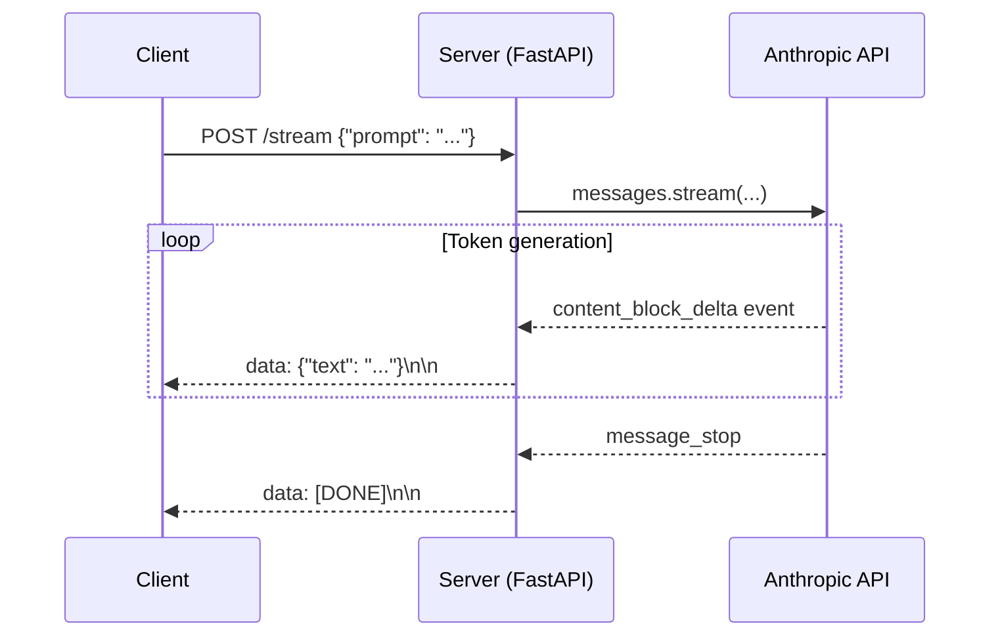

# Concepts: Streaming (SSE)

## The Problem

Without streaming, here's what happens when a user asks your chatbot a question:

1. User submits message
2. Your server calls `client.messages.create(...)`
3. **5–10 seconds of silence** — the model generates the full response on Anthropic's servers
4. Your server receives the complete response
5. Your server sends it to the user
6. The user finally sees text

That 5–10 second blank screen feels broken, even if the response is perfect.

## The Intuition: SSE

**SSE (Server-Sent Events)** is a one-way live stream from server to client over HTTP. The server sends events as they're ready. The client renders them immediately.

It's simpler than WebSockets (one direction only, built on plain HTTP) and purpose-built for exactly this use case: server → client data push.

With streaming, the user experience becomes:
1. User submits message
2. **First token appears in ~200–500ms**
3. Text streams in smoothly
4. Response complete

The total time is the same — but the user sees progress immediately.

---

## How It Works

### Without Streaming (Blocking)

```
Client ──── POST /chat ────> Server ──── messages.create() ────> Anthropic
Client <──── (wait 8s) ────  Server <──── (wait 8s) ──────────── Response
```

### With Streaming

```
Client ──── POST /stream ──> Server ──── messages.stream() ───> Anthropic
Client <── token event ──── Server <── content_block_delta ──── token
Client <── token event ──── Server <── content_block_delta ──── token
Client <── token event ──── Server <── content_block_delta ──── token
Client <── [DONE] ───────── Server <── message_stop ───────────
```

### Anthropic SDK Streaming

```python
import anthropic
client = anthropic.Anthropic()

with client.messages.stream(
    model="claude-3-haiku-20240307",
    max_tokens=1024,
    messages=[{"role": "user", "content": "Tell me a joke"}],
) as stream:
    for text in stream.text_stream:
        print(text, end="", flush=True)
```

`stream.text_stream` is a generator that yields each text chunk as it arrives from the API. The `with` block handles opening and closing the connection.

### SSE Event Format

When you build an SSE endpoint, the wire format looks like this:

```
data: {"type": "content_block_delta", "delta": {"type": "text_delta", "text": "Hello"}}

data: {"type": "content_block_delta", "delta": {"type": "text_delta", "text": " world"}}

data: [DONE]
```

Each event is a JSON payload prefixed with `data: ` and followed by a blank line. The client's `EventSource` API parses this automatically.

### Time to First Token (TTFT)

TTFT is the time from when the API call is made to when the first token arrives. It's the key UX metric for streaming because it determines how quickly the user perceives a response.

| TTFT | User experience |
|------|----------------|
| < 200ms | Feels instant |
| 200–500ms | Acceptable |
| 500ms–1s | Noticeable but tolerable |
| > 1s | Feels slow even with streaming |

TTFT is determined by model size, load, and your network latency to the API — not your application code.

---

## Sequence Diagram



---

## Key Terms

| Term | Definition |
|------|-----------|
| **SSE** | Server-Sent Events — a one-way HTTP streaming protocol from server to client |
| **Streaming** | Delivering data incrementally as it's produced, rather than waiting for the full result |
| **TTFT** | Time to First Token — milliseconds until the first chunk of text arrives |
| **Delta** | A single text chunk in a streaming response (e.g., one word or a few characters) |
| **Generator** | A Python function that `yield`s values lazily — perfect for wrapping streams |
| **text_stream** | The Anthropic SDK's iterator that yields text chunks from a streaming response |

---

## Interview Angle

**"How does streaming affect your backend architecture?"**

Three things change when you add streaming:

1. **Keep connections open** — instead of a quick request/response, the HTTP connection stays open for the duration of streaming. Your server needs to handle long-lived connections (FastAPI handles this well with `StreamingResponse`).
2. **Can't buffer the full response** — you need to forward chunks as they arrive. Buffering defeats the purpose.
3. **Handle client disconnects** — if the user closes the tab mid-stream, your server should detect the disconnect and stop calling the API. This saves API costs and prevents resource leaks.

---

## Common Mistakes

| Mistake | What Goes Wrong | Fix |
|---------|----------------|-----|
| Not closing the stream context manager | Connection stays open; resource leak | Always use `with client.messages.stream(...) as stream:` |
| Catching `StreamingError` as generic `Exception` | You lose error type information | Catch `anthropic.APIStatusError` and `anthropic.APIConnectionError` specifically |
| Buffering the full response before sending | Client waits as long as without streaming — no UX benefit | Forward chunks immediately with `flush=True` |
| Not measuring TTFT | You don't know if your streaming actually feels fast | Time from API call start to first `yield` |

---

➡️ Next: [Patterns — Streaming LLM Responses](./patterns.mdx)
