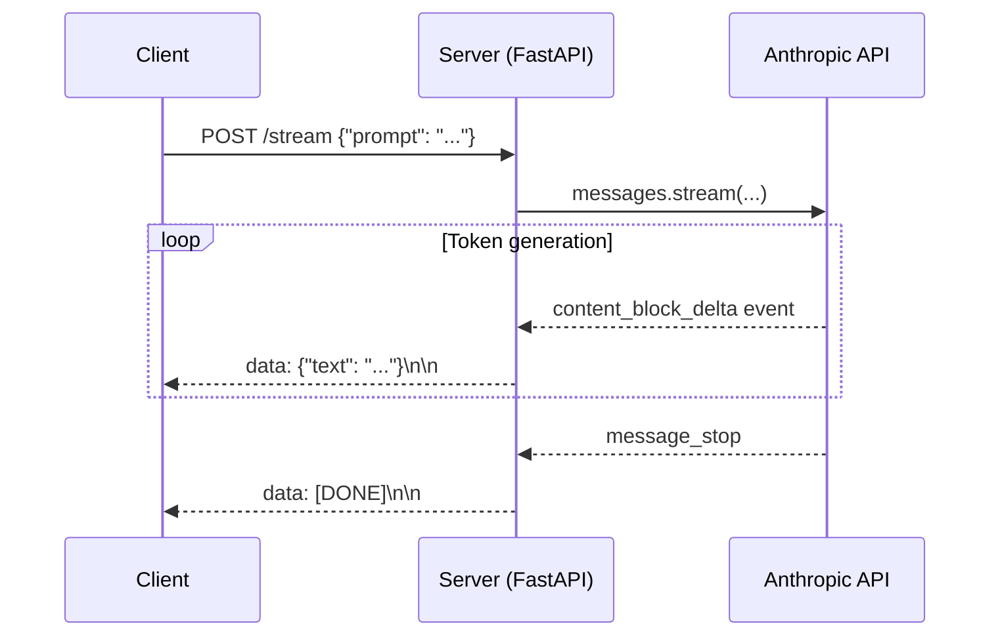
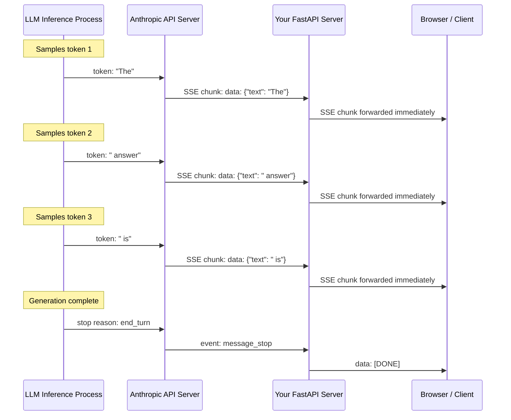

# Concepts: Streaming (SSE)

## The Problem

Without streaming, here's what happens when a user asks your chatbot a question:

1. User submits message
2. Your server calls `client.messages.create(...)`
3. **5–10 seconds of silence** — the model generates the full response on Anthropic's servers
4. Your server receives the complete response
5. Your server sends it to the user
6. The user finally sees text

That 5–10 second blank screen feels broken, even if the response is perfect.

## The Intuition: SSE

**SSE (Server-Sent Events)** is a one-way live stream from server to client over HTTP. The server sends events as they're ready. The client renders them immediately.

It's simpler than WebSockets (one direction only, built on plain HTTP) and purpose-built for exactly this use case: server → client data push.

With streaming, the user experience becomes:
1. User submits message
2. **First token appears in ~200–500ms**
3. Text streams in smoothly
4. Response complete

The total time is the same — but the user sees progress immediately.

---

## How It Works

### Without Streaming (Blocking)

```
Client ──── POST /chat ────> Server ──── messages.create() ────> Anthropic
Client <──── (wait 8s) ────  Server <──── (wait 8s) ──────────── Response
```

### With Streaming

```
Client ──── POST /stream ──> Server ──── messages.stream() ───> Anthropic
Client <── token event ──── Server <── content_block_delta ──── token
Client <── token event ──── Server <── content_block_delta ──── token
Client <── token event ──── Server <── content_block_delta ──── token
Client <── [DONE] ───────── Server <── message_stop ───────────
```

### Anthropic SDK Streaming

```python
import anthropic
client = anthropic.Anthropic()

with client.messages.stream(
    model="claude-3-haiku-20240307",
    max_tokens=1024,
    messages=[{"role": "user", "content": "Tell me a joke"}],
) as stream:
    for text in stream.text_stream:
        print(text, end="", flush=True)
```

`stream.text_stream` is a generator that yields each text chunk as it arrives from the API. The `with` block handles opening and closing the connection.

### SSE Event Format

When you build an SSE endpoint, the wire format looks like this:

```
data: {"type": "content_block_delta", "delta": {"type": "text_delta", "text": "Hello"}}

data: {"type": "content_block_delta", "delta": {"type": "text_delta", "text": " world"}}

data: [DONE]
```

Each event is a JSON payload prefixed with `data: ` and followed by a blank line. The client's `EventSource` API parses this automatically.

### Time to First Token (TTFT)

TTFT is the time from when the API call is made to when the first token arrives. It's the key UX metric for streaming because it determines how quickly the user perceives a response.

| TTFT | User experience |
|------|----------------|
| &lt; 200ms | Feels instant |
| 200–500ms | Acceptable |
| 500ms–1s | Noticeable but tolerable |
| &gt; 1s | Feels slow even with streaming |

TTFT is determined by model size, load, and your network latency to the API — not your application code.

---

## Sequence Diagram



---

## How Streaming Works Under the Hood

Understanding the full technical stack helps you reason about latency, failures, and architectural decisions.

### The LLM side: one token at a time

A large language model does not generate an entire response and then send it. It is autoregressive — it samples one token, appends it to the context, then samples the next token based on the updated context. A single "word" in a response may be 1–4 tokens. There is no batch or buffer at the model level: each token is available the moment it is sampled.

### The transport layer: chunked transfer encoding and SSE

HTTP/1.1 supports **chunked transfer encoding**, which lets the server begin sending the response body before it knows the total length. Each chunk is prefixed with its byte size and sent immediately. The connection stays open until the server sends a zero-length terminating chunk.

**Server-Sent Events (SSE)** are built on top of this. The server sets the `Content-Type` to `text/event-stream` and writes events line by line. The browser's built-in `EventSource` API handles reconnection and parsing automatically.

The API server (Anthropic's or your own FastAPI layer) receives each token from the model inference process and writes it to the open HTTP connection without buffering. This is what eliminates wait time: the client reads from the response body as bytes arrive, not after the body is complete.

### End-to-end token delivery



### What the client does

The browser reads the response body as a `ReadableStream`. Each time bytes arrive, the `EventSource` (or a manual `fetch` with a reader) fires a message event. The UI appends the token to the displayed text. No waiting, no batch render — just continuous incremental updates.

The key insight: **no component in this chain buffers the full response**. The model, the API server, your server, and the client all operate on individual chunks.

---

## Server-Sent Events (SSE) vs WebSockets

Both protocols enable real-time communication between server and client over a persistent connection. They solve different problems.

### SSE

SSE is a **unidirectional** protocol: the server pushes data to the client. The client can only send data via a new HTTP request. SSE runs over plain HTTP/1.1 or HTTP/2 with no special handshake. Browsers support it natively via the `EventSource` API, which handles reconnection automatically.

**On the wire, an SSE stream looks like:**

```
HTTP/1.1 200 OK
Content-Type: text/event-stream
Cache-Control: no-cache

data: {"token": "The"}

data: {"token": " quick"}

data: {"token": " brown"}

data: [DONE]

```

Each event is one or more `data:` lines followed by a blank line. The field name can also be `event:` (event type), `id:` (last event ID for reconnect), or `retry:` (reconnect delay in ms).

### WebSockets

WebSockets are **bidirectional** — either the server or client can send messages at any time over the same persistent connection. They use an HTTP upgrade handshake to switch protocols, then operate over a raw TCP socket with framing. There is no automatic reconnect; you manage it yourself.

### Comparison table

| Feature | SSE | WebSocket |
|---------|-----|-----------|
| Direction | Server → Client only | Bidirectional |
| Protocol | HTTP/1.1 or HTTP/2 | ws:// (TCP-based, upgraded from HTTP) |
| Browser native support | Yes (`EventSource`) | Yes (`WebSocket`) |
| Auto-reconnect | Yes (built in) | No (manual) |
| Firewall / proxy compatibility | Excellent (plain HTTP) | Sometimes blocked |
| Header support per message | No | No |
| Multiplexing (HTTP/2) | Yes | No |
| Complexity | Low | Higher |
| Best for | LLM token streaming, live feeds | Bidirectional chat, collaborative editing, real-time games |

### When to choose each

**Use SSE when:**
- You are streaming LLM output to the browser (one direction: server to client)
- You want simplicity and standard HTTP infrastructure
- You need automatic reconnect without custom code
- Your users are behind corporate proxies (HTTP traffic is rarely blocked)

**Use WebSockets when:**
- You need the user to be able to interrupt the model mid-stream (send a cancellation signal on the same connection)
- You are building a bidirectional chat where both sides send messages freely
- You need sub-100ms round-trips for interactive applications (games, collaborative tools)
- You have a custom binary framing requirement

For most LLM streaming use cases — including Claude-powered chatbots — SSE is the right choice. The client sends a prompt via a normal HTTP POST, then opens an SSE connection to receive tokens. User interrupts can be handled with `AbortController` on the fetch, which closes the SSE connection and signals the server to stop generation.

---

## Building a Streaming FastAPI Endpoint

Here is a complete, working FastAPI endpoint that streams Claude responses to the client using SSE.

```python
from fastapi import FastAPI
from fastapi.responses import StreamingResponse
import anthropic
import json

app = FastAPI()
client = anthropic.Anthropic()

@app.post("/chat/stream")
async def stream_chat(request: dict):
    async def generate():
        with client.messages.stream(
            model="claude-3-haiku-20240307",
            max_tokens=1024,
            messages=[{"role": "user", "content": request["message"]}]
        ) as stream:
            for text in stream.text_stream:
                yield f"data: {json.dumps({'token': text})}\n\n"
        yield "data: [DONE]\n\n"
    return StreamingResponse(generate(), media_type="text/event-stream")
```

**What each part does:**

- `StreamingResponse` tells FastAPI to keep the HTTP connection open and write chunks as they are yielded — it sets the right headers including `Transfer-Encoding: chunked`.
- `media_type="text/event-stream"` sets the `Content-Type` header that tells the browser this is an SSE stream.
- `generate()` is an async generator. `yield` sends each chunk to the client immediately, without waiting for the loop to finish.
- `json.dumps({'token': text})` encodes the token as JSON. The client parses `event.data` and reads `event.data.token`.
- The final `yield "data: [DONE]\n\n"` signals the client that the stream is complete.

**Calling this from the browser:**

```javascript
const response = await fetch('/chat/stream', {
  method: 'POST',
  headers: { 'Content-Type': 'application/json' },
  body: JSON.stringify({ message: 'Explain recursion' }),
});

const reader = response.body.getReader();
const decoder = new TextDecoder();

while (true) {
  const { done, value } = await reader.read();
  if (done) break;

  const chunk = decoder.decode(value);
  // chunk looks like: "data: {\"token\": \"Recursion\"}\n\n"
  const lines = chunk.split('\n').filter(line => line.startsWith('data: '));
  for (const line of lines) {
    const payload = line.slice(6); // strip "data: "
    if (payload === '[DONE]') break;
    const { token } = JSON.parse(payload);
    appendToUI(token);
  }
}
```

---

## Handling Stream Interruption

Users close tabs, navigate away, or click "Stop generating." Your server needs to detect this and stop calling the API — otherwise you burn API credits for a response nobody will read.

### Server side: try/finally cleanup

```python
from fastapi import FastAPI, Request
from fastapi.responses import StreamingResponse
import anthropic
import json

app = FastAPI()
client = anthropic.Anthropic()

@app.post("/chat/stream")
async def stream_chat(request: Request, body: dict):
    async def generate():
        try:
            with client.messages.stream(
                model="claude-3-haiku-20240307",
                max_tokens=1024,
                messages=[{"role": "user", "content": body["message"]}]
            ) as stream:
                for text in stream.text_stream:
                    # Check if the client has disconnected
                    if await request.is_disconnected():
                        print("Client disconnected — stopping generation")
                        break
                    yield f"data: {json.dumps({'token': text})}\n\n"
        except Exception as e:
            # Yield an error event so the client knows something went wrong
            yield f"data: {json.dumps({'error': str(e)})}\n\n"
        finally:
            # This block always runs — use it for logging, metrics, cleanup
            print("Stream ended (complete or interrupted)")
            yield "data: [DONE]\n\n"

    return StreamingResponse(generate(), media_type="text/event-stream")
```

Key points:
- `request.is_disconnected()` is a FastAPI/Starlette coroutine that returns `True` if the client has closed the connection. Check it each iteration to avoid continuing after disconnect.
- The `finally` block runs whether the loop completes normally, breaks early, or raises an exception. Put your cleanup there: close database connections, decrement active-stream counters, log token usage.
- Catching exceptions inside `generate()` lets you send an error event to the client instead of an abrupt close.

### Client side: AbortController to cancel the fetch

```javascript
let controller = new AbortController();

async function startStream(message) {
  controller = new AbortController(); // create a fresh controller each time

  try {
    const response = await fetch('/chat/stream', {
      method: 'POST',
      headers: { 'Content-Type': 'application/json' },
      body: JSON.stringify({ message }),
      signal: controller.signal, // attach the abort signal
    });

    const reader = response.body.getReader();
    const decoder = new TextDecoder();

    while (true) {
      const { done, value } = await reader.read();
      if (done) break;

      const chunk = decoder.decode(value);
      const lines = chunk.split('\n').filter(line => line.startsWith('data: '));
      for (const line of lines) {
        const payload = line.slice(6);
        if (payload === '[DONE]') return;
        const { token, error } = JSON.parse(payload);
        if (error) { showError(error); return; }
        appendToUI(token);
      }
    }
  } catch (err) {
    if (err.name === 'AbortError') {
      console.log('Stream cancelled by user');
    } else {
      console.error('Stream error:', err);
    }
  }
}

// Call this when the user clicks "Stop" or navigates away
function stopStream() {
  controller.abort();
}

// Clean up when user leaves the page
window.addEventListener('beforeunload', stopStream);
```

What happens when `controller.abort()` is called:
1. The `fetch` throws an `AbortError`, which is caught in the `catch` block.
2. The HTTP connection is closed from the client side.
3. The server detects the disconnection on the next `await request.is_disconnected()` check.
4. The server's `finally` block runs, cleaning up resources.

This round-trip ensures both sides stop cleanly and no API credits are wasted.

---

## Key Terms

| Term | Definition |
|------|-----------|
| **SSE** | Server-Sent Events — a one-way HTTP streaming protocol from server to client |
| **Streaming** | Delivering data incrementally as it's produced, rather than waiting for the full result |
| **TTFT** | Time to First Token — milliseconds until the first chunk of text arrives |
| **Delta** | A single text chunk in a streaming response (e.g., one word or a few characters) |
| **Generator** | A Python function that `yield`s values lazily — perfect for wrapping streams |
| **text_stream** | The Anthropic SDK's iterator that yields text chunks from a streaming response |
| **Chunked transfer encoding** | HTTP/1.1 mechanism that lets a server send a response body in pieces without knowing the total length upfront |
| **AbortController** | Browser API for cancelling a pending fetch request |
| **StreamingResponse** | FastAPI response class that keeps the HTTP connection open and streams a generator's output |

---

## Interview Angle

**"How does streaming affect your backend architecture?"**

Three things change when you add streaming:

1. **Keep connections open** — instead of a quick request/response, the HTTP connection stays open for the duration of streaming. Your server needs to handle long-lived connections (FastAPI handles this well with `StreamingResponse`).
2. **Can't buffer the full response** — you need to forward chunks as they arrive. Buffering defeats the purpose.
3. **Handle client disconnects** — if the user closes the tab mid-stream, your server should detect the disconnect and stop calling the API. This saves API costs and prevents resource leaks.

---

## Common Mistakes

| Mistake | What Goes Wrong | Fix |
|---------|----------------|-----|
| Not closing the stream context manager | Connection stays open; resource leak | Always use `with client.messages.stream(...) as stream:` |
| Catching `StreamingError` as generic `Exception` | You lose error type information | Catch `anthropic.APIStatusError` and `anthropic.APIConnectionError` specifically |
| Buffering the full response before sending | Client waits as long as without streaming — no UX benefit | Forward chunks immediately with `flush=True` |
| Not measuring TTFT | You don't know if your streaming actually feels fast | Time from API call start to first `yield` |
| Not handling client disconnects | API is called to completion even after the user leaves | Check `request.is_disconnected()` each iteration |
| Missing AbortController on the client | Page reload or navigation doesn't cancel the in-flight request | Attach `controller.signal` to every streaming fetch |

---

➡️ Next: [Patterns — Streaming LLM Responses](./patterns.mdx)
