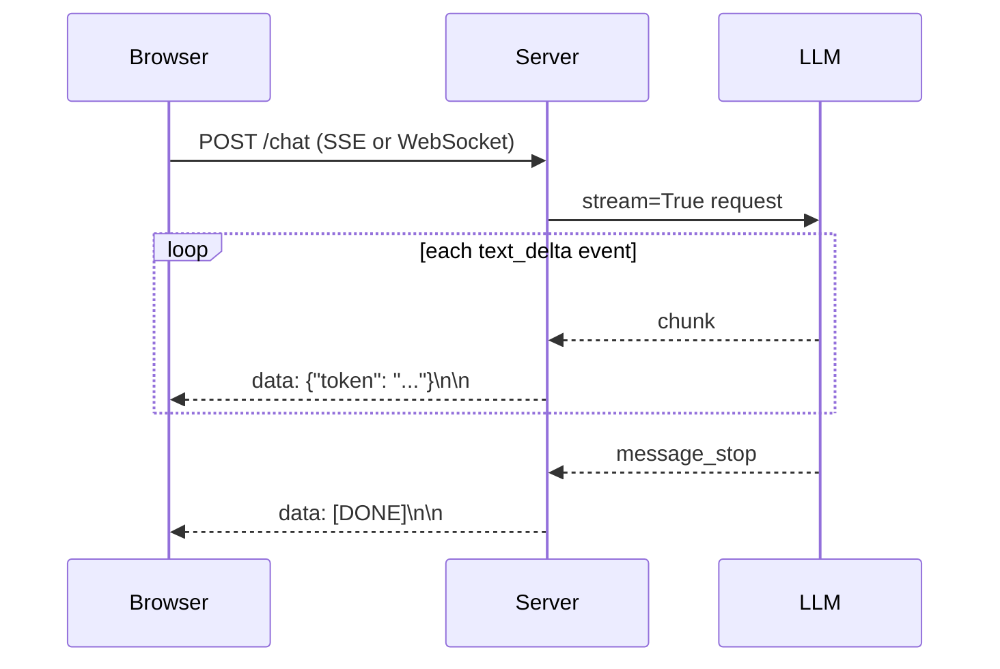

# Patterns: Streaming LLM Responses

## Pattern 1: Stream to Terminal

The simplest use — print tokens as they arrive. Good for CLI tools and scripts.

```python
import anthropic

client = anthropic.Anthropic()

def stream_to_terminal(prompt: str, system_prompt: str = None) -> None:
    """Print tokens to terminal as they stream in."""
    kwargs = {
        "model": "claude-3-haiku-20240307",
        "max_tokens": 1024,
        "messages": [{"role": "user", "content": prompt}],
    }
    if system_prompt:
        kwargs["system"] = system_prompt

    print("Response: ", end="", flush=True)
    with client.messages.stream(**kwargs) as stream:
        for text in stream.text_stream:
            print(text, end="", flush=True)
    print()  # newline at end


# Usage
stream_to_terminal("Explain what a neural network is in one paragraph.")
```

---

## Pattern 2: Stream with Accumulator

Stream tokens to the caller while also collecting the full response. Useful when you need both real-time output AND the complete text for logging or post-processing.

```python
import anthropic

client = anthropic.Anthropic()

def stream_and_collect(prompt: str) -> dict:
    """
    Stream response and return the full text + chunk count.
    Returns: {"full_text": str, "chunk_count": int}
    """
    chunks = []

    with client.messages.stream(
        model="claude-3-haiku-20240307",
        max_tokens=1024,
        messages=[{"role": "user", "content": prompt}],
    ) as stream:
        for text in stream.text_stream:
            chunks.append(text)
            print(text, end="", flush=True)  # real-time output

    print()  # newline

    return {
        "full_text": "".join(chunks),
        "chunk_count": len(chunks),
    }


result = stream_and_collect("List 3 programming languages.")
print(f"\nCollected {result['chunk_count']} chunks")
print(f"Total length: {len(result['full_text'])} chars")
```

---

## Pattern 3: Generator Function Wrapping Stream

Wrap the stream in a Python generator for composable, testable streaming. Generators can be piped, transformed, and mocked easily.

```python
import anthropic
from typing import Generator

client = anthropic.Anthropic()

def stream_response(prompt: str, system_prompt: str = None) -> Generator[str, None, None]:
    """
    Generator that yields text chunks from the Anthropic stream.
    Callers consume this with: for chunk in stream_response(prompt):
    """
    kwargs = {
        "model": "claude-3-haiku-20240307",
        "max_tokens": 1024,
        "messages": [{"role": "user", "content": prompt}],
    }
    if system_prompt:
        kwargs["system"] = system_prompt

    with client.messages.stream(**kwargs) as stream:
        for text in stream.text_stream:
            yield text


def stream_with_prefix(prompt: str, prefix: str) -> Generator[str, None, None]:
    """Example: compose generators — add a prefix before the stream."""
    yield prefix
    yield from stream_response(prompt)


# Usage
for chunk in stream_response("Tell me about Python 3.13 in one sentence."):
    print(chunk, end="", flush=True)
print()

# Composing generators
for chunk in stream_with_prefix("What is 2+2?", "Answer: "):
    print(chunk, end="", flush=True)
print()
```

---

## Pattern 4: FastAPI SSE Endpoint

Build a streaming HTTP endpoint. `StreamingResponse` with `text/event-stream` content type is the standard approach.

```python
from fastapi import FastAPI
from fastapi.responses import StreamingResponse
import anthropic
import json

app = FastAPI()
client = anthropic.Anthropic()


def generate_sse_events(prompt: str):
    """
    Generator that yields SSE-formatted events.
    Each event: "data: <json>\n\n"
    Final event: "data: [DONE]\n\n"
    """
    try:
        with client.messages.stream(
            model="claude-3-haiku-20240307",
            max_tokens=1024,
            messages=[{"role": "user", "content": prompt}],
        ) as stream:
            for text in stream.text_stream:
                event = json.dumps({"text": text})
                yield f"data: {event}\n\n"
    except Exception as e:
        error_event = json.dumps({"error": str(e)})
        yield f"data: {error_event}\n\n"
    finally:
        yield "data: [DONE]\n\n"


@app.post("/stream")
async def stream_endpoint(body: dict):
    prompt = body.get("prompt", "")
    if not prompt:
        return {"error": "prompt is required"}

    return StreamingResponse(
        generate_sse_events(prompt),
        media_type="text/event-stream",
        headers={
            "Cache-Control": "no-cache",
            "X-Accel-Buffering": "no",  # disable nginx buffering
        },
    )


# Client-side JavaScript (for reference):
# const es = new EventSource('/stream');  // For GET; for POST use fetch with ReadableStream
# es.onmessage = (e) => {
#   if (e.data === '[DONE]') { es.close(); return; }
#   const { text } = JSON.parse(e.data);
#   document.getElementById('output').textContent += text;
# };
```

---

## Anti-Patterns

| Anti-Pattern | What Goes Wrong | Fix |
|-------------|----------------|-----|
| **Not closing the stream** | HTTP connection stays open, server resources leak | Always use the `with` context manager: `with client.messages.stream(...) as stream:` |
| **Not handling `StreamingError`** | Partial stream fails silently, user sees truncated response | Wrap `with` block in try/except; send an error event to the client |
| **Buffering the full response before sending** | User waits the full generation time before seeing anything — defeats streaming | Forward chunks immediately; never `"".join(chunks)` before yielding |
| **Using `print` without `flush=True`** | Terminal output is buffered, appears in bursts not as a smooth stream | Always pass `flush=True` to `print` when streaming |

---

## Where This Fits in Production

Streaming is the standard delivery mechanism for any user-facing LLM response:



**Perceived latency vs. actual latency:**

| Metric | Without streaming | With streaming |
|--------|-----------------|----------------|
| Time-to-first-token (TTFT) | N/A (user waits) | 300–800 ms |
| Time-to-complete | 3–8 s | 3–8 s (unchanged) |
| Perceived wait | 3–8 s | 0.3–0.8 s |

Streaming doesn't make generation faster — it makes it *feel* faster. TTFT is the metric that matters for UX.

**Server-Sent Events (SSE) vs. WebSockets:**

| | SSE | WebSocket |
|---|-----|-----------|
| Direction | Server → client only | Bidirectional |
| Browser support | Native `EventSource` | Native `WebSocket` |
| Best for | Streaming LLM output | Chat apps with user interrupts |
| Reconnection | Built-in auto-reconnect | Manual |

**Error handling in streaming — the tricky part:** if the stream fails mid-response, the client has already rendered partial text. You need a structured error event:

```python
# Server-side: always send an error event on failure
try:
    with client.messages.stream(...) as stream:
        for text in stream.text_stream:
            yield f"data: {json.dumps({'token': text})}\n\n"
except anthropic.APIError as e:
    yield f"data: {json.dumps({'error': str(e)})}\n\n"
finally:
    yield "data: [DONE]\n\n"
```

**Where to go next:** Ch45 (Latency Optimization) covers reducing TTFT further; Ch22 lab wires this into a real FastAPI endpoint with SSE.
