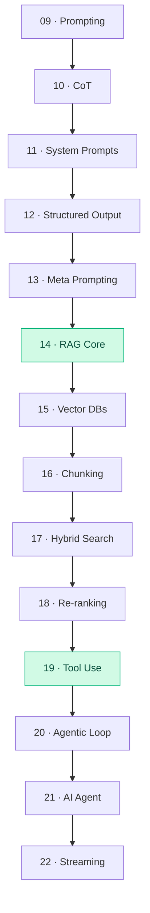

# 🔧 Tier 2 — Builder

**Pre-requisite:** Tier 1 complete. You can call an LLM API confidently.

**Goal:** By the end of Tier 2, you can build a working RAG pipeline, a tool-using agent, and stream responses to a UI.

---

## Concept Map

## Chapters

| # | Chapter | Time | Lab |
|---|---------|------|-----|
| 09 | Zero/Few-shot Prompting | 25 min | Classify text with 0 vs 5 shots |
| 10 | Chain-of-Thought | 25 min | Solve math problems with CoT |
| 11 | System Prompts | 20 min | Build a customer service bot |
| 12 | Structured Output | 20 min | Extract structured data from text |
| 13 | Role + Meta Prompting | 20 min | Auto-generate prompt variants |
| 14 | RAG — Core Concept | 45 min | Build a document Q&A |
| 15 | Vector Databases | 35 min | Index docs in Chroma |
| 16 | Chunking Strategies | 30 min | Compare retrieval quality |
| 17 | Hybrid Search | 30 min | Build hybrid search pipeline |
| 18 | Re-ranking | 25 min | Improve RAG precision |
| 19 | Tool Use / Function Calling | 40 min | Weather + calculator agent |
| 20 | Agentic Loop | 40 min | ReAct agent from scratch |
| 21 | AI Agent (full) | 45 min | Multi-tool agent |
| 22 | Streaming (SSE) | 30 min | Stream responses to browser |

**Total estimated time:** ~7 hours
