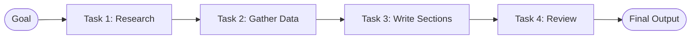
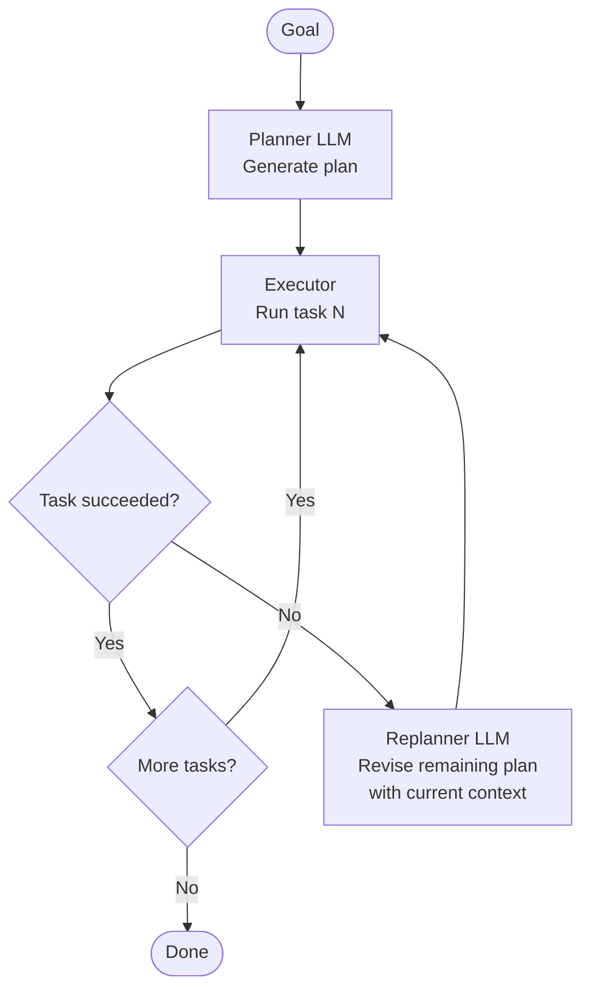

# Concepts: Planning & Task Decomposition

## The Problem

Consider this user request:

> "Write a market analysis report for electric vehicles in Europe."

A single LLM call can't do this well. The model doesn't know how to structure the research, what data to gather, or in what order to write the sections. If you hand it the full goal at once, you get a shallow, unfocused response.

The right approach is to break it down first:

1. Research top EV manufacturers in Europe
2. Gather market share data by country
3. Identify regulatory trends (subsidies, bans on ICE vehicles)
4. Write an executive summary
5. Write market analysis sections
6. Write conclusions and recommendations
7. Compile into final report

Each sub-task is concrete, bounded, and achievable with one LLM call (or one tool use). The whole becomes tractable.

---

## The Intuition: The AI Project Manager

Think of a project manager starting a new project. They don't just say "build the product" and walk away. They:

1. Break the project into milestones
2. Break milestones into tasks
3. Identify dependencies between tasks
4. Assign tasks to team members
5. Monitor progress and unblock when tasks fail

Your **planner LLM is the AI project manager**. It receives a high-level goal and outputs an ordered list of concrete sub-tasks. A separate executor (or the same agent in a loop) works through the tasks. If something breaks, the planner re-generates the remaining plan with the current state as context.

---

## How It Works

### 1. Planning Phase

The LLM receives the high-level goal and outputs a structured plan. The plan is typically a list of task objects, each with:
- A unique ID
- A human-readable description
- A list of tasks it depends on (`depends_on`)

```
Goal: "Write a market analysis report for EVs in Europe"

Plan:
[
  {"id": "task-1", "description": "Research top EV manufacturers in Europe", "depends_on": []},
  {"id": "task-2", "description": "Gather market share data by country", "depends_on": ["task-1"]},
  {"id": "task-3", "description": "Identify regulatory trends", "depends_on": []},
  {"id": "task-4", "description": "Write executive summary", "depends_on": ["task-2", "task-3"]},
  {"id": "task-5", "description": "Compile final report", "depends_on": ["task-4"]}
]
```

### 2. Execution Phase

The executor works through the plan in dependency order. For each task:

- Collect the outputs of all `depends_on` tasks as context
- Call the LLM (or a tool) to execute this task
- Store the result
- Mark the task complete

### 3. Replanning

If a task fails, you don't need to restart from scratch. You have:
- All completed task outputs so far
- The exact point of failure

Send those back to the planner LLM with the instruction: "The plan failed at task-3. Here are the completed results. Generate a revised plan for the remaining steps."

### 4. Sequential vs Parallel Execution

| Mode | When to use | Example |
|------|-------------|---------|
| **Sequential** | Tasks depend on each other | Research → Write → Review |
| **Parallel** | Tasks are independent | Gather data from 3 sources simultaneously |
| **Mixed** | Dependencies form a DAG | Some tasks parallel, then merge, then sequential |

For a lab, sequential is the right starting point. Parallel adds complexity (concurrency, shared state) covered in Chapter 24.

### 5. Plan Formats

| Format | Pros | Cons |
|--------|------|------|
| Numbered list | Simple, fast | No dependency info |
| JSON array | Machine-readable, supports `depends_on` | Requires parsing |
| DAG / adjacency list | Full dependency graph | Complex to generate reliably |

JSON with `depends_on` is the sweet spot for production planners — it's structured enough to execute algorithmically but not so complex that the LLM struggles to generate it reliably.

---

## Diagrams

### Sequential Task Flow



### Planning → Execution → Replan Loop



---

## Key Terms

| Term | Definition |
|------|-----------|
| **Task decomposition** | Breaking a complex goal into smaller, executable sub-tasks |
| **Plan** | An ordered list of sub-tasks that collectively achieve a goal |
| **Sub-task** | A single, bounded unit of work within a plan |
| **Replanning** | Re-generating the remaining plan after a failure, with current state as context |
| **DAG** | Directed Acyclic Graph — a plan where tasks are nodes and dependencies are edges |
| **Sequential execution** | Tasks run one after another; each depends on the previous |
| **Parallel execution** | Independent tasks run concurrently |

---

## Interview Angle

**"How would you handle a case where step 3 of a 10-step plan fails?"**

The key insight is that you have **partial context** — the outputs of steps 1 and 2 are valuable. You don't throw them away.

The right approach:
1. Catch the failure and record what went wrong (error message, partial output)
2. Feed the planner LLM: completed tasks + their outputs + the failure details
3. Ask it to generate a revised plan for steps 3-10 only, starting from the current state
4. Continue execution from the new step 3

This is much better than restarting from scratch. It preserves completed work, gives the planner context about what failed and why, and allows it to take a different approach.

---

## Common Mistakes

| Mistake | What Goes Wrong | Fix |
|---------|----------------|-----|
| Asking LLM for a plan but getting prose | Can't parse the plan programmatically | Use explicit JSON schema in the prompt with examples |
| No replanning on failure | One bad step kills the whole run | Catch `Exception` around each task, trigger replanning |
| Ignoring `depends_on` | Task runs before its dependencies, has no context | Topologically sort tasks before executing |
| Over-decomposing | 50 micro-tasks for a 5-minute job | Keep tasks at the "30-second to 5-minute" granularity |

---

Next: [Patterns — Planning & Task Decomposition](./patterns.mdx)
