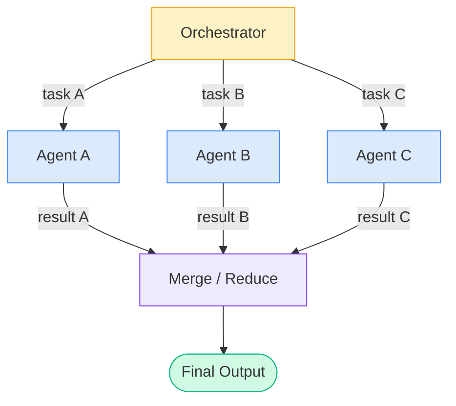
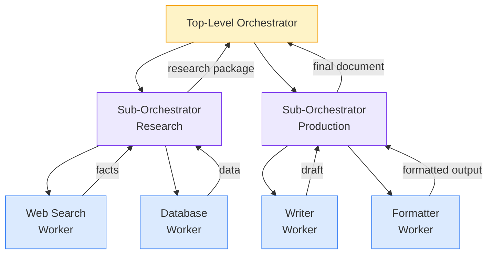

# Concepts: Multi-Agent Systems

## The Problem

A single agent trying to do everything becomes unwieldy. Consider building a research report:

- **Research** requires knowing how to gather, filter, and structure raw information
- **Writing** requires a different voice, tone, and focus on readability
- **Review** requires a critical eye and checklist-driven thinking

If you stuff all of this into one system prompt, the agent is torn between competing instructions. It tries to be a researcher, a writer, and a reviewer at the same time — and does each poorly.

**Specialization is the solution.** Separate agents with focused system prompts outperform a single generalist agent on complex, multi-phase tasks.

---

## The Intuition: The Product Team

Think of how a product team works:

| Role | Responsibility |
|------|---------------|
| PM (Orchestrator) | Breaks work into tasks, routes them, assembles results |
| Designer (Specialist) | Handles all design work — doesn't touch code |
| Engineer (Specialist) | Handles all implementation — doesn't design UI |
| QA (Specialist) | Reviews and tests — doesn't write features |

The PM doesn't do the work directly. They coordinate. Each specialist has a narrow, deep focus. The PM assembles their outputs into a coherent whole.

**Your orchestrator agent is the PM. Your specialist agents are the team.**

---

## Why Multi-Agent? The Specialization Argument

A single agent trying to research, write, code, and review simultaneously is like hiring one employee and asking them to be your accountant, graphic designer, software engineer, and legal counsel all at once. Even if they are generically capable, the constant context-switching degrades every output.

Specialised agents solve this in three concrete ways:

### 1. Smaller context = less confusion

Each agent's system prompt covers exactly one responsibility. A Research Agent's prompt says "you gather and synthesise factual information." A Writer Agent's prompt says "you turn research notes into clear prose." Neither agent has to parse instructions that don't apply to its current task.

Smaller, focused context windows mean:
- Fewer conflicting instructions
- Lower probability of the model ignoring a constraint buried deep in a long prompt
- Easier to debug (failures are isolated to one agent's domain)

### 2. Different models for different tasks

Not every sub-task needs the most expensive model. A multi-agent system lets you route by cost and capability:

| Task | Suitable model |
|------|---------------|
| Web search + summarise sources | `claude-3-haiku` (fast, cheap) |
| Synthesise and write a nuanced argument | `claude-3-5-sonnet` (balanced) |
| Complex legal or technical review | `claude-3-opus` (highest capability) |
| Classify sentiment on 10,000 rows | `claude-3-haiku` (cheapest) |

A single-agent design forces you to pay for the most capable model for every step, even the trivial ones.

### 3. Parallelism = dramatically faster end-to-end latency

Independent subtasks can run simultaneously. A research pipeline that fetches data from three sources sequentially takes 3× as long as one that fetches all three in parallel. With `ThreadPoolExecutor` or `asyncio`, this is straightforward:

```python
from concurrent.futures import ThreadPoolExecutor

# Sequential: total_time = t1 + t2 + t3
# Parallel:   total_time ≈ max(t1, t2, t3)

with ThreadPoolExecutor(max_workers=3) as pool:
    futures = [pool.submit(agent.run, task) for agent, task in agent_tasks]
    results = [f.result() for f in futures]
```

For five independent agents that each take 10 seconds, sequential execution takes 50 seconds. Parallel execution takes ~10 seconds — a 5× speedup.

---

## How It Works

### 1. Orchestrator-Worker Pattern

The most common multi-agent architecture:

- **Orchestrator**: receives the user request, breaks it into sub-tasks, routes each to the appropriate worker, assembles the final result
- **Workers**: specialized agents with narrow system prompts; they receive a task and return a result

The orchestrator never executes tasks directly — it delegates. Workers never communicate with the user directly — they only receive task inputs and return outputs.

### 2. Peer-to-Peer Communication

Agents communicate directly with each other, without a central orchestrator. More flexible, but harder to reason about. Useful for simulations and debate-style systems (e.g., two agents arguing different positions).

### 3. Shared State / Blackboard

All agents read from and write to a shared context dictionary. The orchestrator writes the task; workers write their results. Later agents read earlier agents' outputs.

```python
state = {
    "goal": "Research and write about EV adoption",
    "research": None,   # filled by ResearchAgent
    "draft": None,      # filled by WriterAgent
    "review": None,     # filled by ReviewAgent
}
```

### 4. Message Passing

Structured messages are passed between agents. Each message has a `from`, `to`, `type`, and `payload`. More explicit than shared state, easier to debug, but requires more boilerplate.

### 5. Parallelism

Independent agents can run concurrently with `ThreadPoolExecutor` or `asyncio`. For example, a research agent gathering data from three sources can run all three at once:

```python
from concurrent.futures import ThreadPoolExecutor

with ThreadPoolExecutor(max_workers=3) as pool:
    futures = [pool.submit(agent.run, task) for agent, task in agent_tasks]
    results = [f.result() for f in futures]
```

This reduces end-to-end latency significantly for I/O-bound tasks.

---

## Architecture Diagram


---

## Coordination Patterns

How agents are wired together determines latency, flexibility, and failure behaviour. Three fundamental patterns cover most real-world architectures.

### Pattern 1: Sequential (Pipeline)

Each agent's output becomes the next agent's input. The work flows in one direction through a fixed sequence of stages.


**When to use:** Tasks with strict dependencies — writing requires research to be complete; review requires a draft to exist.

**Trade-off:** Total latency = sum of all agent latencies. No parallelism possible between stages.

---

### Pattern 2: Parallel (Fan-out / Fan-in)

The orchestrator dispatches independent tasks to multiple agents simultaneously, then merges their results once all have finished.



**When to use:** Independent subtasks — fetching data from multiple sources, processing different document sections, running parallel evaluations.

**Trade-off:** Total latency ≈ slowest individual agent. Requires a merge step that can handle partial failures gracefully.

---

### Pattern 3: Hierarchical (Delegation)

A top-level orchestrator delegates to sub-orchestrators, each of which manages its own pool of workers. Suitable for very large or complex pipelines.



**When to use:** Enterprise pipelines with distinct domains (research, writing, compliance review), or when sub-orchestrators need to retry workers independently without exposing failure details to the top level.

**Trade-off:** Most flexible and scalable, but also the most complex to debug. Each orchestration layer adds latency and a potential coordination failure point.

---

## Shared State — The Core Engineering Challenge

Shared state is how agents communicate across turns. It is also the most common source of bugs in multi-agent systems.

### Why shared state is hard

**Race conditions.** Two agents running in parallel both try to write to `state["results"]` at the same time. One write silently overwrites the other. You lose data with no error message.

**Inconsistent reads.** Agent B reads `state["research"]` while Agent A is still writing it. Agent B proceeds with partial data and produces a subtly wrong output.

**Cascading failures.** Agent A writes malformed data to state. Agent B reads it and crashes. Agent C reads B's incomplete output and produces garbage. By the time you see the final output, the root cause is three hops back and difficult to trace.

### Three approaches to shared state

| Approach | Best for | Limitation |
|----------|---------|------------|
| **In-process dict + lock** | Single-machine, single-process systems | Does not work across multiple processes or machines |
| **Redis** | Distributed systems, multiple workers, horizontal scaling | Requires a Redis instance; adds operational complexity |
| **Message queue (e.g., RabbitMQ, SQS)** | Async, production-grade pipelines | Higher complexity; eventual consistency |

### Code: dict with a thread lock (simplest approach)

For single-process multi-agent systems running agents in threads, a standard `threading.Lock` prevents race conditions with minimal overhead:

```python
import threading
from typing import Any

class SharedState:
    """Thread-safe shared state for multi-agent pipelines."""

    def __init__(self):
        self._state: dict[str, Any] = {}
        self._lock = threading.Lock()

    def write(self, key: str, value: Any) -> None:
        with self._lock:
            self._state[key] = value

    def read(self, key: str, default: Any = None) -> Any:
        with self._lock:
            return self._state.get(key, default)

    def snapshot(self) -> dict:
        """Return a full copy of state — safe to read without holding the lock."""
        with self._lock:
            return dict(self._state)


# Usage
state = SharedState()

def research_agent(state: SharedState) -> None:
    notes = run_research()          # calls LLM, fetches sources, etc.
    state.write("research", notes)  # thread-safe write

def writer_agent(state: SharedState) -> None:
    notes = state.read("research")  # thread-safe read
    if notes is None:
        raise ValueError("Writer started before research completed")
    draft = run_writer(notes)
    state.write("draft", draft)
```

The lock ensures that only one thread modifies state at a time. Because reads and writes are both protected, a reader can never observe a half-written value.

For production systems with multiple machines or processes, replace `SharedState` with a Redis-backed equivalent — the interface (`read` / `write` / `snapshot`) stays the same; only the backend changes.

---

## Failure Isolation

In a distributed system, failure is not exceptional — it is expected. A network timeout, a rate limit, a malformed LLM response: these happen regularly at scale. The question is not *whether* an agent will fail, but *whether that failure propagates* to all other agents.

### The cascade problem

Without isolation, one failing agent corrupts the entire pipeline:

```
ResearchAgent fails → returns None
WriterAgent reads None → crashes
ReviewAgent never runs
User receives an unhandled exception
```

### The pattern: structured results

Every agent should return a structured result object that includes a status field. The orchestrator inspects the status before passing output downstream.

```python
from dataclasses import dataclass
from typing import Any, Optional

@dataclass
class AgentResult:
    agent_name: str
    success: bool
    output: Optional[Any] = None
    error: Optional[str] = None

def run_research_agent(task: str) -> AgentResult:
    try:
        result = research_agent.run(task)
        return AgentResult(agent_name="ResearchAgent", success=True, output=result)
    except Exception as e:
        return AgentResult(agent_name="ResearchAgent", success=False, error=str(e))

def orchestrate(goal: str) -> str:
    research_result = run_research_agent(goal)

    if not research_result.success:
        # Decision point: retry, skip, or abort
        print(f"Research failed: {research_result.error}")
        # Option A — abort
        raise RuntimeError("Cannot proceed without research data")
        # Option B — skip (use a fallback or cached result)
        # research_notes = load_cached_research(goal)
        # Option C — retry (up to N times with backoff)

    writer_result = run_writer_agent(research_result.output)

    if not writer_result.success:
        # Writer failure is less critical — return partial result
        return f"Research completed but writing failed: {writer_result.error}"

    return writer_result.output
```

### Decision taxonomy

When an agent returns `success=False`, the orchestrator has three choices:

| Decision | When to use |
|----------|------------|
| **Retry** | Transient failures (rate limits, timeouts). Use exponential backoff. Cap at 3 attempts. |
| **Skip** | The agent's output is optional or can be synthesized from other agents' outputs. |
| **Abort** | The agent's output is a hard dependency for all downstream work. Fail fast and surface a clear error. |

The key engineering discipline is making this decision **explicit in the orchestrator** — not buried inside an agent, and not left to an unhandled exception.

---

## Key Terms

| Term | Definition |
|------|-----------|
| **Orchestrator** | The agent that coordinates task routing and assembles final output |
| **Worker / Specialist** | An agent with a narrow, focused system prompt for a specific type of task |
| **Multi-agent system** | A system with two or more collaborating LLM agents |
| **Shared state** | A mutable context dict that all agents read from and write to |
| **Message passing** | Structured communication between agents with explicit sender, receiver, and payload |
| **Specialization** | Giving each agent a focused role so it performs that role better than a generalist |
| **Parallelism** | Running independent agents concurrently to reduce latency |
| **Failure isolation** | The design property that one agent's failure does not cascade to others |
| **Structured result** | A return type that carries both the output and a success/error status |

---

## When Multi-Agent Beats Single-Agent

| Use case | Why multi-agent wins |
|----------|---------------------|
| Research → Write → Review | Each phase needs a different "mode" of thinking |
| Data from multiple independent sources | Sources can be fetched in parallel |
| Long pipelines with more than ~5 steps | System prompt for a single agent becomes too complex |
| Quality assurance on LLM output | A second agent reviewing the first catches more errors |

## When Single-Agent Is Better

| Use case | Why single-agent wins |
|----------|----------------------|
| Simple one-phase tasks | Coordination overhead outweighs any benefit |
| Tight latency budget | Each agent hop adds latency |
| Strong dependencies between all steps | Parallel execution is not possible anyway |

---

## Interview Angle

**"When would you use a multi-agent system vs a single agent?"**

The key trade-off is **specialization vs coordination overhead**. Multi-agent wins when:
1. Different phases of the task require fundamentally different reasoning styles
2. Some tasks can run in parallel (reducing latency)
3. A second agent reviewing the first's output catches errors a self-review misses

Single-agent wins when the task is simple, the latency budget is tight, or all steps are tightly sequential with no parallelism opportunity.

In production, start with a single agent. Add specialists only when you observe clear quality degradation at a specific phase or when latency is unacceptable for I/O-bound work.

---

## Common Mistakes

| Mistake | What Goes Wrong | Fix |
|---------|----------------|-----|
| Agents with overlapping responsibilities | Two agents both try to write the final draft; outputs conflict | Define strict, non-overlapping role boundaries in each system prompt |
| No coordination mechanism | Agents produce independent outputs that don't compose | Use shared state or explicit message passing; the orchestrator assembles results |
| Shared mutable state without locks | Parallel agents race on the same dict key | Use thread-safe structures or immutable pass-by-value for concurrent agents |
| Orchestrator does the work itself | Defeats the purpose; a single agent would be simpler | Orchestrator only routes and assembles; workers execute |
| No failure isolation | One agent's exception brings down the whole pipeline | Wrap every agent call in a structured result; orchestrator decides retry/skip/abort |

---

Next: [Patterns — Multi-Agent Systems](./patterns.mdx)
